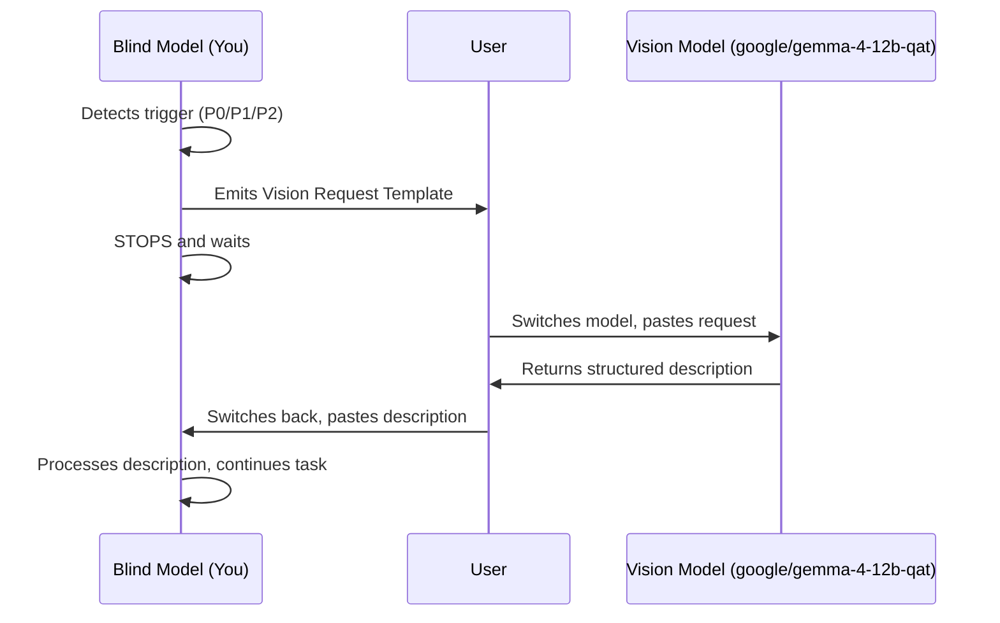

# Vision Bridge — Blind Model → Vision Model Handoff

## Purpose

You (the AI model) may lack vision capabilities — you cannot see screenshots, images, or attachments. When this happens, **do not guess, do not silently fail, do not ask the user to describe things themselves.** Instead, use this bridge to get a structured description from `google/gemma-4-12b-qat` — a local vision-capable model running on LM Studio (http://192.168.0.13:1234).

## 🔴 When to Trigger — Auto-Detection

You MUST invoke the vision bridge whenever ANY of these triggers fire:

| Priority | Trigger | What to look for |
|----------|---------|-----------------|
| **P0** | You say "Can't view screenshots" / "I can't see images" / "I don't have vision" | You just admitted blindness — bridge immediately |
| **P0** | `view_image` tool returns nothing or fails | The image exists but you can't process it |
| **P1** | User says "look at this screenshot" / "check this image" / "see this" | User explicitly wants visual analysis |
| **P1** | User attaches an image file to the conversation | Attachment detected, you can't see it |
| **P2** | `playwright-mcp` or `chrome-devtools` produced a screenshot | Tool output includes an image path but no text description |
| **P2** | `web-design-reviewer` is invoked | Design review requires visual inspection |
| **P2** | `read_page` snapshot shows visual artifacts (e.g., "garbage text leaking outside") | Visual rendering issue that needs screenshot confirmation |

### 🔴 CRITICAL: When P0 triggers, bridge IMMEDIATELY. Do not:

- Try to reason about what the image might contain
- Ask the user to describe it (they can, but the bridge is faster and more accurate)
- Continue the task without visual input
- Say "I'll proceed based on the DOM snapshot" if visual layout matters

## The Vision Request Template

When a trigger fires, emit this EXACT template (fill in the bracketed parts):

~~~
╔══════════════════════════════════════════════════════════╗
║  VISION BRIDGE — Request for Vision Model               ║
╠══════════════════════════════════════════════════════════╣
║                                                          ║
║  IMAGE PATH: [absolute path to the image file]           ║
║                                                          ║
║  CONTEXT: [1-2 sentences about what task I'm doing]      ║
║                                                          ║
║  QUESTIONS:                                              ║
║    1. [Specific question about what to look for]         ║
║    2. [Another question if needed]                       ║
║    3. [...more as needed]                                ║
║                                                          ║
║  EXPECTED OUTPUT:                                        ║
║    - Section 1: [e.g., "Layout description"]             ║
║    - Section 2: [e.g., "Visible elements list"]          ║
║    - Section 3: [e.g., "Errors or anomalies"]            ║
║                                                          ║
║  INSTRUCTIONS FOR USER:                                  ║
║    1. Copy everything between the ═══ lines              ║
║    2. Switch Copilot model to "google/gemma-4-12b-qat"   ║
║       (your local LM Studio vision model)                 ║
║    3. Paste and add: "Describe this image:"              ║
║    4. Copy the description and switch back to this model ║
║    5. Paste the description here                         ║
║                                                          ║
╚══════════════════════════════════════════════════════════╝
~~~

**After emitting the template, STOP and WAIT.** Do not proceed with the task until the user pastes back the vision model's description.

## Workflow



## Integration with Existing Tools

### playwright-mcp

When `playwright-mcp` takes a screenshot (`browser_take_screenshot`), the tool returns a file path. If you cannot view it:

1. Note the file path from the tool output
2. Trigger the vision bridge (P2 — screenshot produced)
3. In the QUESTIONS section, specify what to inspect:
   - Element layout and positioning
   - Text content visible on screen
   - Colors and styling
   - Any visual anomalies (overflow, overlap, artifacts)

### chrome-devtools

When `chrome-devtools` `screenshot_page` produces an image:

1. Note the page context (URL you were inspecting, what you clicked)
2. Trigger the vision bridge
3. Include performance-specific questions if relevant (e.g., "Is there a large layout shift visible?")

### web-design-reviewer

The web design reviewer skill **requires vision** for Steps 2 and 4 (Visual Inspection, Re-verification). When that skill is loaded:

1. Complete Step 1 (Information Gathering) using DOM snapshots and code search — these don't need vision
2. Before Step 2, trigger the vision bridge for each page/viewport that needs inspection
3. Use the returned descriptions to fill in the issue tables
4. After fixing (Step 3), trigger again for Step 4 (Re-verification)

### view_image tool

The `view_image` tool is designed for vision-capable models like `google/gemma-4-12b-qat`. If it returns nothing for you:

- **P0 trigger** — bridge immediately
- Include the exact file path in the template
- Note that the tool failed for your model

## Example Sessions

### Example 1: "Can't view screenshots" (P0 trigger)

```
User: Here's a screenshot of the broken layout [attaches screenshot.png]

Blind Model:
"I can't view screenshots. Let me bridge this to a vision model."

╔══════════════════════════════════════════════════════════╗
║  VISION BRIDGE — Request for Vision Model               ║
╠══════════════════════════════════════════════════════════╣
║  IMAGE PATH: /home/user/project/screenshot.png          ║
║  CONTEXT: User reports a broken layout on the checkout  ║
║           page. I need to identify visual problems.      ║
║  QUESTIONS:                                              ║
║    1. What layout issues are visible? (overflow,         ║
║       overlap, misalignment, text clipping)              ║
║    2. What elements are on the page? (forms, buttons,    ║
║       navigation, footer)                                ║
║    3. Are there any visual artifacts, glitches, or       ║
║       rendering errors?                                  ║
║    4. What colors and fonts are visible?                 ║
║  EXPECTED OUTPUT:                                        ║
║    - Layout: visible structure and positioning issues    ║
║    - Elements: list of visible components                ║
║    - Anomalies: any errors, glitches, or artifacts       ║
║    - Style: colors, fonts, general visual impression     ║
║  INSTRUCTIONS FOR USER:                                  ║
║    1. Copy everything between the ═══ lines              ║
║    2. Switch Copilot model to "google/gemma-4-12b-qat"   ║
║       (your local LM Studio vision model)                 ║
║    3. Paste and add: "Describe this image:"              ║
║    4. Copy the description and switch back to this model ║
║    5. Paste the description here                         ║
╚══════════════════════════════════════════════════════════╝

[STOPPED — waiting for vision model description]
```

### Example 2: web-design-reviewer integration (P2 trigger)

```
Blind Model (running web-design-reviewer Step 2):
"I've navigated to http://localhost:3000/checkout and captured a screenshot
at the desktop viewport (1280px). I need visual analysis to complete
Step 2 (Visual Inspection Phase) of the web-design-reviewer workflow."

╔══════════════════════════════════════════════════════════╗
║  VISION BRIDGE — Request for Vision Model               ║
╠══════════════════════════════════════════════════════════╣
║  IMAGE PATH: /tmp/playwright-screenshots/page-1.png     ║
║  CONTEXT: Web design review of checkout page at         ║
║           1280px viewport (desktop). Need to identify    ║
║           layout, responsive, and accessibility issues.  ║
║  QUESTIONS:                                              ║
║    1. Check for element overflow (content outside        ║
║       parent or viewport)                                ║
║    2. Check for element overlap (unintended z-index      ║
║       issues)                                            ║
║    3. Check alignment (grid/flex items misaligned)       ║
║    4. Check text clipping (long text not handled)        ║
║    5. Check spacing consistency (padding/margin gaps)    ║
║  EXPECTED OUTPUT:                                        ║
║    - Layout Issues: list each with severity (P1/P2/P3)   ║
║    - Elements Present: header, nav, main, forms, footer  ║
║    - Colors & Fonts: brand consistency check             ║
║  INSTRUCTIONS FOR USER:                                  ║
║    1. Copy everything between the ═══ lines              ║
║    2. Switch Copilot model to "google/gemma-4-12b-qat"   ║
║       (your local LM Studio vision model)                 ║
║    3. Paste and add: "Describe this image:"              ║
║    4. Copy the description and switch back to this model ║
║    5. Paste the description here                         ║
╚══════════════════════════════════════════════════════════╝

[STOPPED — waiting for vision model description]
```

### Example 3: Terminal rendering artifact (P2 trigger)

```
User: [screenshot of terminal with garbage text "555555..." leaking outside]

Blind Model (after read_page shows alert + garbage text):
"The snapshot shows an alert and garbage text '555555555...' leaking outside
the terminal. This looks like an xterm.js DOM rendering artifact. I need to
confirm visually before diagnosing."

╔══════════════════════════════════════════════════════════╗
║  VISION BRIDGE — Request for Vision Model               ║
╠══════════════════════════════════════════════════════════╣
║  IMAGE PATH: /tmp/terminal-artifact.png                 ║
║  CONTEXT: Terminal emulator showing xterm.js rendering   ║
║           artifact — garbage text outside container.     ║
║  QUESTIONS:                                              ║
║    1. Is "555555..." or similar garbage text visible     ║
║       OUTSIDE the terminal container boundary?           ║
║    2. Is there an alert/modal/dialog visible on screen?  ║
║    3. What is the general layout — terminal position,    ║
║       surrounding UI elements?                           ║
║    4. Are there scroll bars, overflow indicators, or     ║
║       other visual clues about the container size?       ║
║  EXPECTED OUTPUT:                                        ║
║    - Container boundaries: where the terminal ends       ║
║    - Artifact description: what garbage text, where       ║
║    - Other UI elements: alerts, panels, status bars       ║
║  INSTRUCTIONS FOR USER:                                  ║
║    1. Copy everything between the ═══ lines              ║
║    2. Switch Copilot model to "google/gemma-4-12b-qat"   ║
║       (your local LM Studio vision model)                 ║
║    3. Paste and add: "Describe this image:"              ║
║    4. Copy the description and switch back to this model ║
║    5. Paste the description here                         ║
╚══════════════════════════════════════════════════════════╝

[STOPPED — waiting for vision model description]
```

## Processing the Vision Model's Response

When the user pastes back the vision description:

1. **Read it carefully** — the vision model described what it saw
2. **Map to your task** — extract the answers to your specific questions
3. **Proceed with confidence** — you now have visual data you couldn't get yourself
4. **If unclear** — ask targeted follow-up questions in a new vision request (shorter this time)
5. **Do NOT re-trigger** the full template if the user pastes something that isn't a vision description — just process it normally

## States

| State | What's happening |
|-------|-----------------|
| **Monitoring** | No image needs detected, proceed normally |
| **Triggered** | P0/P1/P2 trigger fired, emit template |
| **Waiting** | Template emitted, waiting for user to paste description |
| **Processing** | Description received, extracting answers |
| **Complete** | Visual data processed, continuing original task |

## 🔴 HARD RULES

1. **Never guess image contents.** If you can't see it, bridge it.
2. **Never silently skip visual steps.** If a skill (like web-design-reviewer) requires vision, announce the bridge.
3. **Always STOP after emitting the template.** Do not speculate about what the image might show.
4. **Always fill in specific questions.** Generic "describe this" wastes the vision model's capabilities.
5. **Always include the absolute image path.** The vision model needs to read the file.
6. **When the user pastes back a description, accept it as ground truth for visual facts.** Do not second-guess the vision model.
