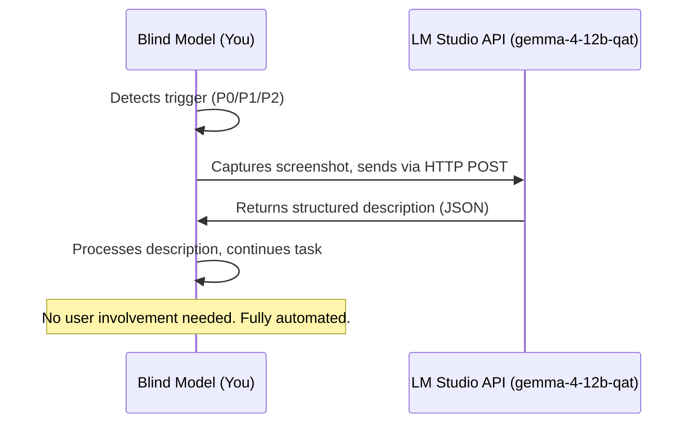

# Vision Bridge — Blind Model → Vision Model Handoff

## Purpose

You (the AI model) may lack vision capabilities — you cannot see screenshots, images, or attachments. When this happens, **do not guess, do not silently fail, do not ask the user to describe things themselves.** Instead, use this bridge to get a structured description from `google/gemma-4-12b-qat` — a local vision-capable model running on LM Studio (http://192.168.0.13:1234).

## 🔴 LM Studio Vision API — Automated Bridge

**You (the blind model) call the vision API directly.** No manual model switching needed.

| Property | Value |
|----------|-------|
| **API Endpoint** | `http://192.168.0.13:1234/v1/chat/completions` |
| **Model** | `google/gemma-4-12b-qat` |
| **Auth** | Bearer token from `.agents/.lm-studio-env` (sourced via `source .agents/.lm-studio-env`) |
| **Token env var** | `LM_STUDIO_API_KEY` |

## 🔴 API Key Not Found — Prompt the User

If `.agents/.lm-studio-env` does not exist (first run, new clone, or key rotation):

1. **Use `vscode_askQuestions`** to ask the user for their LM Studio API key.
   - Header: `"api-key"`
   - Question: `"Enter your LM Studio API key (e.g., sk-lm-...). It will be saved to .agents/.lm-studio-env for future use."`
   - Do NOT offer options — this is a freeform text input.
2. **Save the key** immediately after receiving it:
   ```bash
   mkdir -p /home/brajam/repos/gh-llm-bootstrap/.agents
   cat > /home/brajam/repos/gh-llm-bootstrap/.agents/.lm-studio-env << 'EOF'
LM_STUDIO_API_KEY=sk-lm-xxxxxxxxxxxxxxxxxxxxxxxxxxxx
EOF
   chmod 600 /home/brajam/repos/gh-llm-bootstrap/.agents/.lm-studio-env
   ```
   (Substitute the actual key the user provided.)
3. **Verify** the file was written correctly:
   ```bash
   source /home/brajam/repos/gh-llm-bootstrap/.agents/.lm-studio-env && echo "$LM_STUDIO_API_KEY" | head -c 10
   ```
4. **Proceed** with the normal API call flow below.

If `vscode_askQuestions` is not available or the user doesn't provide a key, fall back to asking the user to paste it into the terminal (using `run_in_terminal` with `read -s`).

## 🔴 When to Trigger — Auto-Detection

You MUST invoke the vision bridge whenever ANY of these triggers fire:

| Priority | Trigger | What to look for |
|----------|---------|-----------------|
| **P0** | You say "Can't view screenshots" / "I can't see images" / "I don't have vision" | You just admitted blindness — bridge immediately |
| **P0** | `view_image` tool returns nothing or fails | The image exists but you can't process it |
| **P1** | User says "look at this screenshot" / "check this image" / "see this" | User explicitly wants visual analysis |
| **P1** | User attaches an image file to the conversation | Attachment detected, you can't see it |
| **P2** | `playwright-mcp` or `chrome-devtools` produced a screenshot | Tool output includes an image path but no text description |
| **P2** | `web-design-reviewer` is invoked | Design review requires visual inspection |
| **P2** | `read_page` snapshot shows visual artifacts (e.g., "garbage text leaking outside") | Visual rendering issue that needs screenshot confirmation |

### 🔴 CRITICAL: When P0 triggers, bridge IMMEDIATELY. Do not:

- Try to reason about what the image might contain
- Ask the user to describe it (they can, but the bridge is faster and more accurate)
- Continue the task without visual input
- Say "I'll proceed based on the DOM snapshot" if visual layout matters

## Automated Vision API Call

When a trigger fires, call the vision API directly using the code block below. **Do NOT stop and wait. Do NOT ask the user to switch models.** The blind model stays in control — call the API in parallel.

### Method: Python (preferred — handles JSON serialization of large base64 payloads)

```python
import json, urllib.request, base64, os, sys

# Load API token
env_path = os.path.expanduser("~/repos/gh-llm-bootstrap/.agents/.lm-studio-env")
try:
    with open(env_path) as f:
        api_key = None
        for line in f:
            if line.startswith("LM_STUDIO_API_KEY"):
                api_key = line.split("=", 1)[1].strip()
        if not api_key:
            raise ValueError("API key not found in env file")
except (FileNotFoundError, ValueError):
    print("ERROR: API key not found. Prompt the user via vscode_askQuestions.")
    sys.exit(1)

# Read and encode screenshot
with open("/path/to/screenshot.png", "rb") as f:
    b64_data = base64.b64encode(f.read()).decode("utf-8")

# Build request
payload = {
    "model": "google/gemma-4-12b-qat",
    "messages": [{
        "role": "user",
        "content": [
            {"type": "text", "text": "Describe this screenshot in detail: layout, colors, text content, visible elements, and any interactive elements."},
            {"type": "image_url", "image_url": {"url": f"data:image/png;base64,{b64_data}"}}
        ]
    }],
    "max_tokens": 1000
}

req = urllib.request.Request(
    "http://192.168.0.13:1234/v1/chat/completions",
    data=json.dumps(payload).encode("utf-8"),
    headers={
        "Content-Type": "application/json",
        "Authorization": f"Bearer {api_key}"
    }
)

with urllib.request.urlopen(req, timeout=180) as resp:
    result = json.loads(resp.read())
    description = result["choices"][0]["message"]["content"]
    print(description)  # Use this in your response
```

### Method: Shell (for quick calls with small images)

```bash
source .agents/.lm-studio-env
B64=$(base64 -w0 /path/to/screenshot.png)
python3 -c "
import json, urllib.request
b64 = '''$B64'''
payload = {
    'model': 'google/gemma-4-12b-qat',
    'messages': [{'role': 'user', 'content': [
        {'type': 'text', 'text': 'Describe this screenshot in detail.'},
        {'type': 'image_url', 'image_url': {'url': f'data:image/png;base64,{b64}'}}
    ]}],
    'max_tokens': 1000
}
req = urllib.request.Request(
    'http://192.168.0.13:1234/v1/chat/completions',
    data=json.dumps(payload).encode(),
    headers={'Content-Type': 'application/json',
             'Authorization': f'Bearer \$(cat .agents/.lm-studio-env | grep LM_STUDIO_API_KEY | cut -d= -f2)'})
with urllib.request.urlopen(req, timeout=180) as resp:
    print(json.loads(resp.read())['choices'][0]['message']['content'])
"
```

### When Playwright page is available

If you have a Playwright page handle, capture and analyze in one step using the `run_playwright_code` tool combined with the Python API call.

## Workflow



## Integration with Existing Tools

### playwright-mcp

When `playwright-mcp` takes a screenshot (`browser_take_screenshot`), the tool returns a file path. If you cannot view it:

1. Note the file path from the tool output
2. Trigger the vision bridge (P2 — screenshot produced)
3. In the QUESTIONS section, specify what to inspect:
   - Element layout and positioning
   - Text content visible on screen
   - Colors and styling
   - Any visual anomalies (overflow, overlap, artifacts)

### chrome-devtools

When `chrome-devtools` `screenshot_page` produces an image:

1. Note the page context (URL you were inspecting, what you clicked)
2. Trigger the vision bridge
3. Include performance-specific questions if relevant (e.g., "Is there a large layout shift visible?")

### web-design-reviewer

The web design reviewer skill **requires vision** for Steps 2 and 4 (Visual Inspection, Re-verification). When that skill is loaded:

1. Complete Step 1 (Information Gathering) using DOM snapshots and code search — these don't need vision
2. Before Step 2, trigger the vision bridge for each page/viewport that needs inspection
3. Use the returned descriptions to fill in the issue tables
4. After fixing (Step 3), trigger again for Step 4 (Re-verification)

### view_image tool

The `view_image` tool is designed for vision-capable models like `google/gemma-4-12b-qat`. If it returns nothing for you:

- **P0 trigger** — bridge immediately via API
- Use `run_playwright_code` to extract base64 of the image, then pipe to the vision API

## Example Sessions

### Example 1: Screenshot from Playwright (P2 trigger → automated)

```
Blind Model:
"I can't view this screenshot. Let me call the vision API directly."

→ Uses run_playwright_code to capture page.screenshot()
→ Sends base64 to LM Studio vision API
→ Processes returned description
```

### Example 2: web-design-reviewer integration (P2 trigger)

```
Blind Model (running web-design-reviewer Step 2):
→ Navigates to target URL
→ Captures screenshot via Playwright
→ Calls LM Studio vision API with base64
→ Receives structured description: layout, elements, colors, issues
→ Continues web-design-reviewer workflow with vision data
```

### Example 3: Terminal rendering artifact (P2 trigger)

```
Blind Model (after read_page shows alert + garbage text):
"The snapshot shows an alert and garbage text '555555555...' leaking outside
the terminal. Let me confirm visually via the vision API."

→ Captures screenshot via Playwright
→ Sends to LM Studio vision API with targeted questions:
   - Is garbage text visible OUTSIDE the terminal boundary?
   - What is the terminal position and container layout?
   - Are there overflow indicators?
→ Processes returned description
→ Confirms xterm.js artifact, proceeds with diagnosis
```

## Processing the Vision Model's Response

When the API returns JSON, extract the `choices[0].message.content` field:

1. **Read it carefully** — the vision model described what it saw
2. **Map to your task** — extract the answers to your specific questions
3. **Proceed with confidence** — you now have visual data you couldn't get yourself
4. **If unclear** — make another API call with refined questions (shorter this time)
5. **Do NOT fall back to guessing** — if the API fails, retry with a simpler prompt

## States

| State | What's happening |
|-------|-----------------|
| **Monitoring** | No image needs detected, proceed normally |
| **Triggered** | P0/P1/P2 trigger fired |
| **Prompting for Key** | `.agents/.lm-studio-env` missing — asking user for API key via `vscode_askQuestions` |
| **Calling API** | Sending screenshot to LM Studio vision API |
| **Processing** | Description received from API, extracting answers |
| **Complete** | Visual data processed, continuing original task |

## 🔴 HARD RULES

1. **Never guess image contents.** If you can't see it, bridge it.
2. **Never silently skip visual steps.** If a skill (like web-design-reviewer) requires vision, announce the bridge.
3. **Never stop and wait for the user.** Call the vision API directly and continue.
4. **Always include specific questions.** Generic "describe this" wastes the vision model's capabilities.
5. **When the API returns a description, accept it as ground truth for visual facts.** Do not second-guess the vision model.
6. **If the API key file is missing** (`.agents/.lm-studio-env` not found or empty), use `vscode_askQuestions` to prompt the user for their key, save it, and proceed.
7. **If the API returns an error** (HTTP 400/401/500), note the error and explain to user that LM Studio may not be running.
