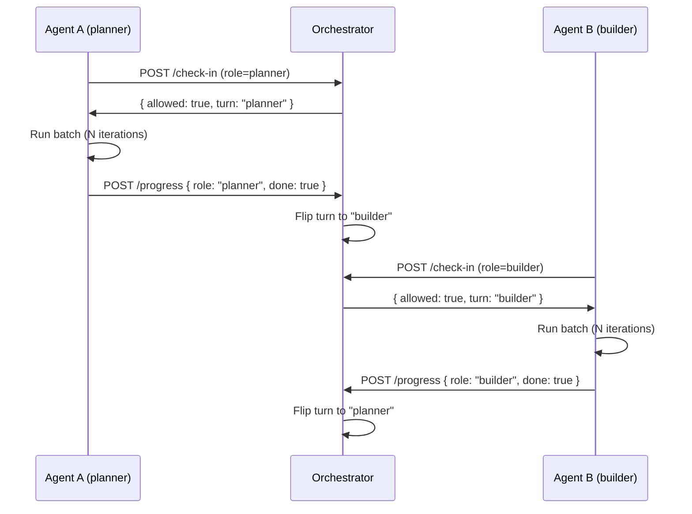

# Agent Pipelines

## When to Use

- Building a service that runs an autonomous AI agent in a loop
- Coordinating multiple agents that share a single LLM backend
- Designing a multi-phase pipeline (plan → build → test → deploy) driven by an agent
- Implementing crash recovery for long-running agent loops
- Containerizing agent-based services with state persistence
- Setting up turn-based resource coordination between competing services

---

## Agent Loop — State Checkpoints

Every autonomous agent follows a loop. Each iteration MUST checkpoint state so the agent survives crashes and resumes where it left off.

### The Checkpoint Pattern

```
check-in → do work → checkpoint → report → repeat
```

**Rules:**
- **Checkpoint BEFORE each phase transition.** If the agent crashes mid-phase, it resumes at the last checkpoint.
- **Checkpoint state is JSON on disk.** Simple, human-readable, no database required.
- **State file lives in the agent's own data directory.** No shared volumes. Each agent owns its state.
- **Minimum fields:** `phase`, `iteration`, `lastCompletedAt`, `batchId`.
- **On restart, read state first.** Skip completed phases, resume at the next uncompleted one.

```json
{
  "phase": "building",
  "iteration": 42,
  "lastCompletedAt": "2026-07-02T10:30:00Z",
  "batchId": "batch-7",
  "currentTask": "build-frontend",
  "completedTasks": ["plan-architecture", "setup-project", "install-deps"]
}
```

### Crash Recovery Flow

```
1. Agent starts → reads state file
2. If state.phase === "idle" → start from beginning
3. If state.phase === "building" → resume at state.currentTask
4. Skip all tasks in state.completedTasks
5. If state.phase === "complete" → start next iteration
```

**Rules:**
- Never re-execute completed work. The state file is authoritative.
- If state is corrupt or missing, start fresh and log a warning.
- State updates are atomic — write to `.tmp` then `mv` to avoid partial writes.

---

## Multi-Phase Pipelines

Agents that build software follow a predictable pipeline. Each phase is a discrete, testable step.

### Standard Build Pipeline

```
fetch → plan → build → test → upload → mark complete
```

| Phase | Input | Output | State Checkpoint |
|-------|-------|--------|------------------|
| **Fetch** | API or queue | Task payload (idea, issue, PR) | `phase: "fetching"` |
| **Plan** | Task payload | `plan.md` with checkboxes | `phase: "planning"` |
| **Build** | `plan.md` → one checkbox at a time | Working code in project dir | `phase: "building"`, `currentTask` per checkbox |
| **Test** | Built project | Test results (pass/fail) | `phase: "testing"` |
| **Upload** | Passing project | Archive (tar.gz) posted to API | `phase: "uploading"` |
| **Complete** | Upload confirmation | Updated database, incremented counter | `phase: "idle"` (reset for next iteration) |

**Rules:**
- **One phase at a time.** Never overlap — each phase must complete before the next starts.
- **plan.md uses checkboxes.** The build phase parses `- [ ] task` lines and executes one at a time via the agent.
- **Test with retries.** If tests fail, retry up to 3 times with agent-driven fixes before marking failed.
- **Failed tasks are marked, not retried.** Record the failure, move on. Don't block the pipeline on one bad task.

### Plan File Format

```markdown
# Plan: {Task Title}

## Architecture
- Stack: Node.js + Express + SQLite
- Structure: src/, tests/, config/

## Tasks
- [ ] Initialize project with package.json and tsconfig
- [ ] Set up Express server with health endpoint
- [ ] Add SQLite database with schema migration
- [ ] Implement POST /api/v1/items endpoint
- [ ] Write unit tests for items controller
- [ ] Add Dockerfile with multi-stage build
```

**Rules:**
- Plan is generated by the agent in the planning phase.
- Build phase reads checkboxes literally — no interpretation, no reordering.
- Completed tasks are marked `- [x]` in place.

---

## Turn-Based Orchestration

When multiple agents share a single LLM backend (local LM Studio, single API key), running them simultaneously degrades quality. Use an **orchestrator** to enforce alternating access.

### Orchestrator Pattern



### Orchestrator API

| Endpoint | Method | Purpose | Response |
|----------|--------|---------|----------|
| `/check-in` | POST | Agent requests permission to run | `{ allowed: boolean, turn: string, message: string }` |
| `/progress` | POST | Agent reports batch completion | `{ acknowledged: true, nextTurn: string }` |
| `/health` | GET | Health check | `{ status: "ok", currentTurn: string }` |

**Rules:**
- **Poll, don't push.** Agents call `/check-in` before each iteration. No webhooks, no events.
- **Exponential backoff on denial.** When `allowed: false`, sleep 5s → 10s → 20s → 30s (max 10 retries).
- **State persists to disk.** Orchestrator writes to JSON file — survives restarts.
- **BATCH_SIZE controls turn length.** After N iterations, agent calls `/progress` to flip the turn.
- **One agent type per turn.** If planner holds the turn, builder is blocked (and vice versa).

### Orchestrator State File

```json
{
  "currentTurn": "planner",
  "plannerIterations": 3,
  "builderIterations": 0,
  "batchSize": 6,
  "lastFlipAt": "2026-07-02T10:00:00Z"
}
```

---

## Containerized Agents

Each agent service runs in its own container. Docker Compose orchestrates the stack.

### Service Skeleton

```
agent-service/
├── AGENTS.md           # Agent instructions (read by Cline CLI / agent runtime)
├── Dockerfile           # Multi-stage: agent runtime + app deps
├── db.md                # Agent's local registry (tracks completed work)
├── scripts/
│   └── agent-runner.js  # Loop logic, checkpointing, API calls
├── config/
│   ├── .env             # LLM endpoint, API keys, batch size
│   └── settings.json    # Agent runtime settings (model, context window)
└── data/                # Mounted volume — generated artifacts, state files
```

**Rules:**
- **AGENTS.md is the agent's system prompt.** It defines role, workflow, constraints, and output format.
- **db.md is the agent's memory.** Tracks what's been processed — prevents duplicates.
- **agent-runner.js is the control loop.** Not the agent itself — it calls the agent CLI, checkpoints state, handles crashes.
- **data/ is a volume.** Survives container restarts. Contains state JSON, generated files, logs.
- **Multi-stage Dockerfile.** First stage installs agent CLI (Cline, etc.), second stage is the slim Node.js/Python runtime.

### Docker Compose Pattern

```yaml
services:
  agent-planner:
    build: ./agent-planner
    volumes:
      - planner-data:/app/data
    environment:
      - LLM_ENDPOINT=http://lm-studio:1234/v1
      - ORCHESTRATOR_URL=http://orchestrator:3444
    networks:
      - agent-net
    depends_on:
      orchestrator:
        condition: service_healthy

  agent-builder:
    build: ./agent-builder
    volumes:
      - builder-data:/app/data
    environment:
      - LLM_ENDPOINT=http://lm-studio:1234/v1
      - ORCHESTRATOR_URL=http://orchestrator:3444
    networks:
      - agent-net
    depends_on:
      orchestrator:
        condition: service_healthy

  orchestrator:
    build: ./orchestrator
    ports:
      - "3444:3444"
    volumes:
      - orchestrator-data:/app/data
    networks:
      - agent-net

networks:
  agent-net:
    driver: bridge

volumes:
  planner-data:
  builder-data:
  orchestrator-data:
```

**Rules:**
- **Bridge network for all agent services.** No `host` networking — services discover each other by container name.
- **Named volumes for agent data.** Not bind mounts — Docker manages lifecycle.
- **depends_on with healthcheck.** Agents wait for orchestrator to be healthy before starting.
- **LLM endpoint is an env var.** Never hardcoded. Allows swapping between local and cloud LLMs.

---

## API-First Inter-Service Communication

Agents communicate through a central REST API, not through shared state or direct calls.

### Pattern

```
Agent A (planner) → POST /api/v1/ideas → API (stores) → GET /api/v1/ideas/random → Agent B (builder)
Agent B (builder) → POST /api/v1/projects → API (stores)
```

**Rules:**
- **API is the single source of truth.** No service reads another service's data directly.
- **JWT or API key auth between services.** Each agent gets a token from the shared secret.
- **Self-signed TLS is fine for internal traffic.** Services on a bridge network don't need public CA certs.
- **Deduplication at the consumer.** Builder checks its own `db.md` before fetching — API doesn't track who consumed what.

---

## Anti-Patterns

| Pattern | Why it's wrong | Fix |
|---------|---------------|-----|
| **Two agents hitting one LLM simultaneously** | Token contention, quality degradation, timeouts | Use an orchestrator with turn-based access |
| **No state checkpoints** | Crash loses all progress, agent restarts from zero | Checkpoint JSON after every phase transition |
| **Shared volumes between agents** | Race conditions, corrupted state | Each agent has its own named volume |
| **Agent logic in Docker entrypoint** | Hard to test, impossible to resume | Entrypoint runs agent-runner.js; loop logic is in the script |
| **Hardcoded batch sizes** | Can't tune for different LLMs or workloads | BATCH_SIZE in env vars, configurable per deployment |
| **Agents calling each other directly** | Tight coupling, cascading failures | All communication through central API |
| **Retrying failed tasks indefinitely** | Blocks pipeline, wastes tokens | Max 3 retries, then mark failed and move on |

---

## Integration with Other Skills

- **`project-structure`** — Each agent is a service in `services/{name}/` with its own layers.
- **`containers`** — Multi-stage Dockerfiles, non-root users, HEALTHCHECK for orchestrator.
- **`api-design`** — Orchestrator and API endpoints follow REST conventions, proper status codes.
- **`generic-conventions`** — Error handling (crash-only, wrap with context), configuration (one config module), testing (every phase is testable).

---

## Testing & Verification

- **Agent loop logic is testable.** Extract the loop from the CLI calls — test state transitions, checkpoint writes, crash recovery in isolation.
- **Mock the LLM.** Tests call the agent-runner with a mock CLI that returns predictable outputs.
- **Orchestrator has deterministic state.** Test turn flipping, denial responses, and state persistence without real agents.
- **Docker Compose integration test.** Spin up the full stack, verify agents check in and receive correct turn assignments.
- **CI verifies:** no hardcoded endpoints, state files use atomic writes, retry limits are enforced.
