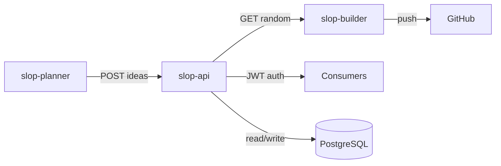
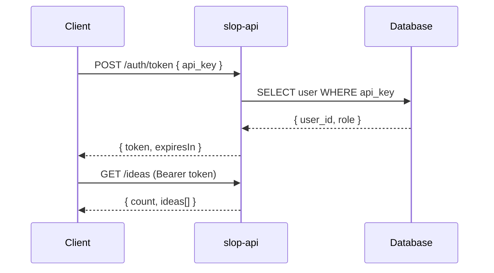
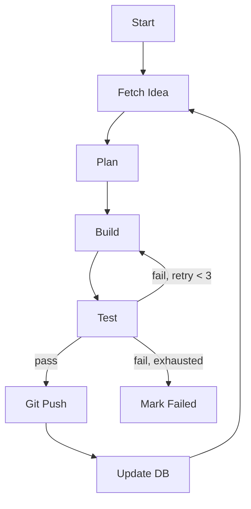
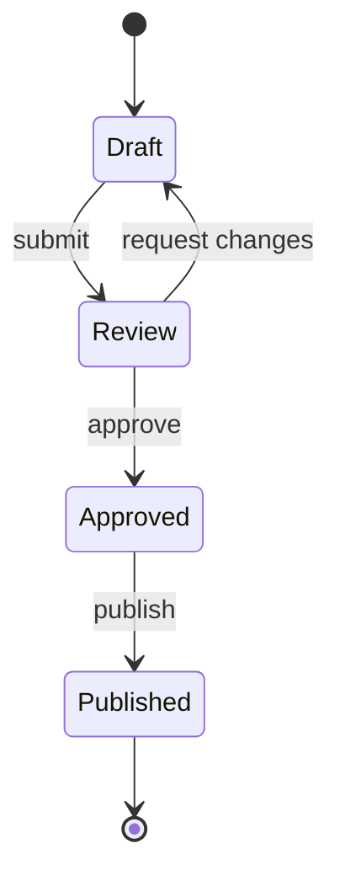

# Mermaid Diagrams — Mandatory

## When to Use

- Editing any file in `docs/` — ensure every concept has a diagram
- Writing or updating README.md, ARCHITECTURE.md, or CONVENTIONS.md
- Creating Architecture Decision Records (ADRs)
- Documenting a new service, feature, or process
- Refactoring documentation — migrate ASCII art to Mermaid
- Reviewing docs for completeness — flag missing diagrams
- Generating docs via `/generate-docs` or `write-docs`

## 🔴 HARD RULE — Every Concept Needs a Diagram

**If a documentation section describes relationships, flow, sequence, structure, or state — it MUST include a Mermaid diagram.** Text alone is insufficient. Diagrams make documentation scannable, debuggable, and LLM-consumable. A reader should understand the system's shape without reading every paragraph.

## When a Diagram is Required

| Documentation Contains | Diagram Type | Minimum Requirement |
|------------------------|-------------|---------------------|
| Service architecture / components | `graph` or `block-beta` | Show all services and connections |
| Data flow between systems | `flowchart` or `sequenceDiagram` | Show source, destination, and transformation |
| Authentication / request lifecycle | `sequenceDiagram` | Show every round-trip between parties |
| Multi-step agent/workflow loop | `flowchart` | Show each phase, decision points, and loops |
| Git branching strategy | `graph` or `gitGraph` | Show branch relationships and merge direction |
| Tech stack relationships | `graph` | Show which component depends on which |
| Test structure / categories | `graph` | Show hierarchy and relationships |
| State transitions | `stateDiagram-v2` | Show every state and valid transitions |
| Deployment topology | `graph` | Show containers, networks, volumes, ports |
| API endpoint relationships | `graph` | Show resource hierarchy and nesting |
| Error handling flow | `flowchart` | Show error paths and recovery strategies |

## Diagram Quality Standards

### ✅ DO

- Use ` ```mermaid ` fenced code blocks
- Keep diagrams focused — one concept per diagram, ~15 nodes max
- Label edges with the action, protocol, or data type (e.g., `-->|POST /api/v1/ideas|`)
- Use `graph LR` for horizontal flows (pipelines, left-to-right architectures)
- Use `graph TB` for top-down hierarchies (layer diagrams, dependency trees)
- Use `sequenceDiagram` for request/response interactions between named participants
- Use `flowchart TB` for decision trees and process loops with `{rhombus}` for decision nodes
- Use `stateDiagram-v2` for state machines and lifecycle states
- Place diagrams directly after the section heading they illustrate, not in an appendix
- Use meaningful participant names: `C` → `Client`, `DB` → `PostgreSQL`

### ❌ AVOID

- Placeholder diagrams with no content (`A --> B`)
- Diagrams that merely repeat a table in visual form — create new insight
- Overly complex diagrams (>15 nodes) — split into sub-diagrams linked by context
- ASCII art diagrams (`┌──┐`) when Mermaid is available — migrate on next edit
- Diagrams without edge labels when the relationship isn't obvious
- Using `graph` when `flowchart` is more appropriate (decision nodes, loops)
- Orphaned diagrams with no surrounding explanatory text
- Self-referencing or circular edges without explicit annotations

## Diagram Types Quick Reference

| Type | Syntax | Use for | Example |
|------|--------|---------|---------|
| **graph** | `graph TB/LR` | Static relationships, architecture, dependencies | Component maps, tech stacks |
| **flowchart** | `flowchart TB/LR` | Decision trees, process loops, workflows | CI pipelines, agent loops |
| **sequenceDiagram** | `sequenceDiagram` | Request/response, auth flows, API calls | Login flows, data pipelines |
| **stateDiagram-v2** | `stateDiagram-v2` | State machines, lifecycles | Order states, deployment states |
| **block-beta** | `block-beta` | Block/container layouts | Infrastructure topology |
| **gitGraph** | `gitGraph` | Branching strategies | Git workflows, release processes |
| **erDiagram** | `erDiagram` | Entity relationships | Database schemas, data models |

## Examples

### Architecture (graph)



### Auth Lifecycle (sequenceDiagram)



### Agent Loop (flowchart)



### State Transitions (stateDiagram-v2)



## Enforcement

- Every doc in `docs/` is checked for diagrams on review
- Architecture docs (`ARCHITECTURE.md`) without at least one system diagram are **rejected**
- New docs that describe any flow, relationship, or process without a diagram are **rejected**
- ASCII art diagrams must be migrated to Mermaid when the file is next edited
- The `audit-skills` skill verifies that mermaid diagrams in README match the actual skill list

## Integration with Other Skills

- **`write-docs`** — Load mermaid first when generating any documentation
- **`generate-docs`** — Use mermaid for every architecture/flow concept found during codebase scan
- **`audit-skills`** — Checks mermaid diagrams in README against the skill directory
- **`create-readme`** — READMEs must include at least one architecture diagram
- **`project-structure`** — Service topology diagrams for monorepo documentation
- **`agent-pipelines`** — Workflow loop diagrams for agent orchestration docs
- **`api-design`** — Sequence diagrams for auth flows and request lifecycles
