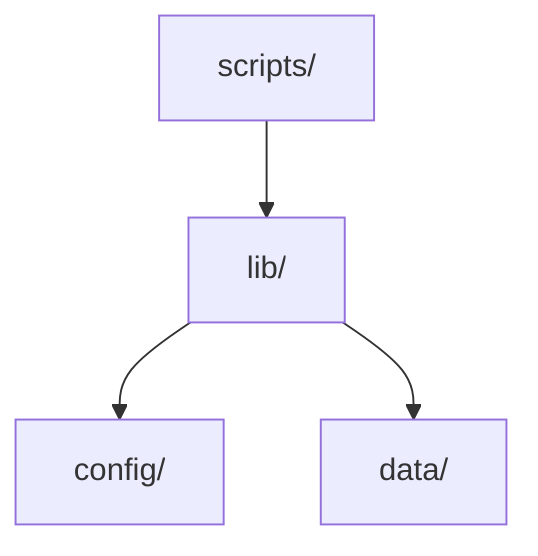

# Project Structure

## When to Use

- Creating a new project or service from scratch
- Adding a new service module to an existing monorepo
- Reorganizing a flat project into a maintainable structure
- Deciding where a new file belongs
- Reviewing PRs for structural consistency
- Evaluating whether to split a service

---

## The Monorepo Layout

Every project follows this top-level structure. Services are logical modules — one domain concern each.

```
project-root/
├── slop-api/                    # Service at root — one directory per service
│   ├── Dockerfile
│   ├── config/                  #   Service-specific configuration
│   ├── lib/                     #   Core logic / library code
│   ├── scripts/                 #   Entry points, server code, middleware
│   ├── data/                    #   Service data (apps, projects, etc.)
│   ├── package.json
│   └── vitest.config.js
├── slop-builder/
│   ├── Dockerfile
│   ├── config/
│   ├── lib/
│   ├── scripts/
│   ├── package.json
│   └── vitest.config.js
├── slop-orchestrator/
│   ├── Dockerfile
│   ├── config/
│   ├── lib/
│   ├── scripts/
│   └── package.json
├── slop-planner/
│   ├── Dockerfile
│   ├── config/
│   ├── lib/
│   ├── scripts/
│   └── package.json
├── docs/                        # Project-wide documentation
├── tests/                       # Root-level test suites, one subdirectory per service
│   ├── slop-api/
│   ├── slop-builder/
│   ├── slop-orchestrator/
│   └── slop-planner/
├── docker-compose.yml           # All services in one compose file
├── AGENTS.md
└── README.md
```

### Rules

- **One domain concern per service.** `slop-api` owns the API surface. `slop-builder` owns builds. Never overlap.
- **Services live at the project root.** One directory per service. No `services/` wrapper.
- **Each service is self-contained.** Own Dockerfile, own config, own dependencies, own scripts.
- **Tests live at root `tests/{service}/`.** Not inside service directories. Keeps test infra separate from runtime code.
- **Every service follows the same internal convention.** `config/`, `lib/`, `scripts/`, `Dockerfile`, `package.json`. No exceptions — predictability.
- **`docs/` at root for cross-cutting documentation.** Each service may also have its own `README.md` for service-specific docs.
- **One `docker-compose.yml` at root.** Defines all services. No per-service compose files.
- **`packages/` is for shared code only** (if needed). Never put business logic or service-specific code here.

---

## Service Internals — The Standard Layers

Each service follows consistent internal conventions. Dependencies flow inward: `scripts → lib → (config, data)`.



### `scripts/` — Entry Points

**What goes here:** Server entry points, CLI commands, middleware, parsers — the thin layer that receives input and returns output.

- **HTTP servers / API handlers** — parse request, call lib, format response
- **CLI command definitions** — parse args, call lib, print output
- **Middleware** — auth, logging, CORS, rate limiting
- **Parsers / serializers** — format conversion at the boundary

**What does NOT go here:** Business logic, data access, domain calculations. Those belong in `lib/`.

**Rules:**
- A script/handler is at most ~100 lines. If longer, extract into `lib/`.
- Scripts never import from other services' scripts.
- Scripts never call external services directly — always through `lib/`.

### `lib/` — Core Logic

**What goes here:** Core application logic, one concern per file. Orchestrates data and operations to fulfill a business function.

- `logger.js` — structured logging setup
- `storage.js` — data access / persistence
- `middleware.js` — shared middleware utilities
- Business logic functions — validate, transform, compute

**Rules:**
- One concern per file. If a file exceeds ~300 lines, split it.
- Lib files never import from `scripts/`.
- Lib files can import from `config/` for configuration values.
- Lib functions return typed results — never raw HTTP responses or unprocessed data.

### `config/` — Configuration

**What goes here:** Service-specific configuration, env parsing, feature flags, constants.

- **Environment variable parsing** — typed, validated at startup
- **Feature flags** — toggle behavior without code changes
- **Constants** — magic numbers, defaults, limits
- **Service configuration** — ports, timeouts, URLs

**Rules:**
- **Config is loaded once at startup** and referenced from `config/` — never `process.env` scattered across files.
- Validate at startup. Fail fast on missing/invalid config.
- Config files never import from `scripts/` or `lib/`.

### `data/` — Service Data

**What goes here:** Persistent or reference data that the service owns.

- **Seed data** — default records, templates, reference sets
- **Service-specific assets** — files, schemas, migrations
- **State files** — runtime state persisted between restarts (JSON, SQLite)

**Rules:**
- Data files are not code — they're content that code operates on.
- Data directories can be large. Ensure `.gitignore` patterns handle generated files.
- Each service owns its data namespace. No cross-service data access.

---

## The API-as-Authority Monorepo Pattern

For projects where a single API service owns all data access:

```
project-root/
├── packages/
│   └── core/                    # Library consumed by API ONLY
│       ├── lib/                 # DB, tools, schemas, seed
│       └── data/migrations/
├── services/
│   ├── api/                     # REST API — ⚡ SOLE DB AUTHORITY
│   │   ├── scripts/api-server.ts
│   │   ├── lib/routes/          # Calls core lib functions
│   │   └── lib/middleware/       # Auth, validation, rate limits
│   ├── server/                  # MCP transport — calls API over HTTP
│   │   ├── scripts/server.ts    # ZERO core imports
│   │   └── lib/client.ts        # Single HTTP client to API
│   └── dashboard/               # Frontend — calls API over HTTP
│       └── src/lib/api.ts       # Single HTTP client to API
```

**Rules**:
- **API owns the database.** No other service imports core or any DB library.
- **Server talks to API via HTTP.** Even on localhost. Centralizes all validation.
- **Dashboard talks to API via HTTP.** Same pattern, same URL, same client.
- **CI enforces**: `grep -r "db\\|sqlite" services/server/ services/dashboard/` must return zero results.

---

## When to Create a New Service

Start with one service. Split when:

| Signal | Action |
|--------|--------|
| **Different data ownership** | Two features modify the same tables through different paths → split owns the data? |
| **Different deploy cadence** | One part deploys weekly, another deploys daily → split |
| **Different scaling profiles** | Auth handles 10K rps, Reports handles 10 rps → split |
| **Different team ownership** | Team A owns user flows, Team B owns billing → split |
| **300+ line lib/** | A service with 15+ lib files likely does too much → evaluate split |

**Don't split prematurely.** A well-layered monolith with 3 services is better than 15 poorly-designed microservices.

---

## Naming Conventions

| What | Convention | Examples |
|------|-----------|----------|
| Service directories | kebab-case, `{domain}-{role}` | `slop-api`, `slop-builder`, `order-service` |
| Shared packages | kebab-case, descriptive | `shared`, `ui`, `config-schema` |
| Script files | kebab-case, `{noun}-{role}` | `api-server.js`, `middleware.js`, `parsers.js` |
| Lib files | kebab-case, `{concern}` | `logger.js`, `storage.js`, `middleware.js` |
| Config files | kebab-case | `database.js`, `app.js`, `index.js` |
| Test directories | Match service name | `tests/slop-api/`, `tests/slop-builder/` |

---

## Shared Packages

### `packages/shared/` — Cross-Cutting Code

**Goes here:** Types shared across services, validation schemas, configuration types, shared constants, error codes.

**Does NOT go here:** Business logic, service-specific types, infrastructure implementations.

**Rules:**
- Shared package has NO dependencies on any service.
- Services depend on shared — never the reverse.
- If two services need the same type, it goes in shared. If only one service uses it, keep it local.

### `packages/ui/` — Shared UI Components (Frontend Monorepos)

**Goes here:** Button, Modal, Table, Form primitives, theme tokens, layout components.

**Rules:**
- Pure presentational components only. No API calls, no business logic.
- If a component has `fetch()` or `useQuery()`, it belongs in a service's `lib/` not in `packages/ui/`.

---

## Cross-Cutting Concerns

| Concern | Where it lives |
|---------|---------------|
| Configuration | `config/` per service. Loaded at startup, validated, injected. |
| Authentication / Authorization | Middleware in `scripts/` or a shared `packages/auth/`. Auth decisions in `lib/`. |
| Logging | `lib/logger.{ext}` per service. Structured (JSON). Include trace ID, service name. |
| Error handling | `lib/errors.{ext}` for application errors. |
| Testing | Root-level `tests/{service}/` mirroring services, plus co-located `*.test.{ext}` next to source. |
| Database migrations | `data/migrations/` within each service that owns data. |
| API contracts | `docs/API.md` or `packages/shared/api/` for cross-service contracts. |

---

## Anti-Patterns

| Pattern | Why it's wrong | Fix |
|---------|---------------|-----|
| **Services importing from siblings** | Creates tight coupling and circular deps | Extract to `packages/shared/` or communicate via API/events |
| **Business logic in `scripts/`** | Un-testable, un-reusable | Move to `lib/` |
| **`lib/` importing `scripts/`** | Breaks dependency direction | Keep scripts/ as thin entry points. lib/ never calls scripts/. |
| **Flat single-directory service** | Zero discoverability | Layer into `config/`, `lib/`, `scripts/`, `data/` |
| **Shared package with business logic** | Becomes a dumping ground | Shared is types/utils only. Business logic stays in services. |
| **`utils/` or `helpers/` directories** | Meaningless grab-bags | Put functions where they belong — lib, config, or data |
| **Scattered `process.env`** | Untestable, insecure, invisible deps | Load config in `config/`, inject everywhere |
| **Premature microservices** | Deployment and debugging nightmare | Start with one well-layered service, split when signals are clear |

---

## Integration with Other Skills

- **`containers`** — Each service gets its own Dockerfile. One `docker-compose.yml` at root for local dev.
- **`api-design`** — Cross-service communication uses REST/HTTP with the API design conventions.
- **`sql-database`** — Database rules apply within each service's `data/` or `lib/` layer.
- **`generic-conventions`** — The "one concern per file" and "co-locate tests" rules apply at every layer.

---

## Quick Reference

```
# Adding a new feature to slop-api
slop-api/
├── scripts/
│   ├── api-server.js            # HTTP server entry point
│   └── middleware.js            # Auth, logging, CORS middleware
├── lib/
│   ├── storage.js               # Data access / persistence
│   └── logger.js                # Structured logging
├── config/
│   └── index.js                 # Env parsing, feature flags, constants
├── data/
│   └── apps/                    # Service-owned data (projects, apps, etc.)
├── Dockerfile
├── package.json
└── vitest.config.js
```

---

## Testing & Verification

- Integration and E2E tests live in `tests/{service}/` at the project root — keeps test infrastructure separate from runtime code
- Unit tests may be co-located: `logger.test.js` next to `logger.js`
- `lib/` tests are pure unit tests — no network, no filesystem, no mocks
- `scripts/` tests are integration tests — test the full request→response flow
- CI verifies: no `lib/` file imports from `scripts/`, no cross-service imports, no `process.env` outside `config/`
