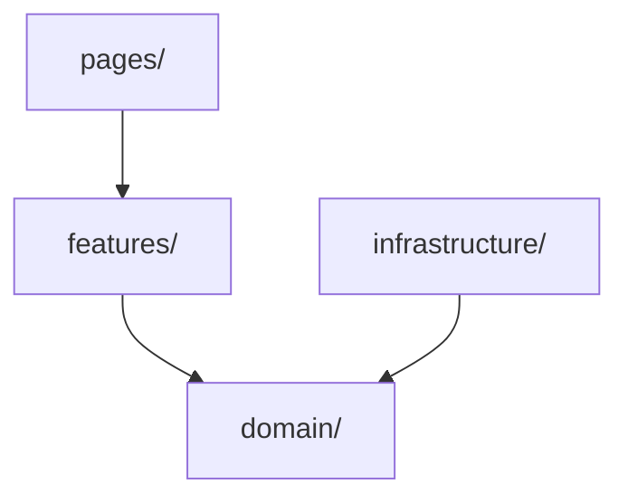

# Project Structure

## When to Use

- Creating a new project or service from scratch
- Adding a new service module to an existing monorepo
- Reorganizing a flat project into a maintainable structure
- Deciding where a new file belongs
- Reviewing PRs for structural consistency
- Evaluating whether to split a service

---

## The Monorepo Layout

Every project follows this top-level structure. Services are logical modules — one domain concern each.

```
project-root/
├── services/                    # One subdirectory per service
│   ├── gateway/                 #   API gateway / BFF
│   │   ├── pages/               #     Routes, handlers, controllers
│   │   ├── features/            #     Use-case orchestration
│   │   ├── domain/              #     Models, types, interfaces
│   │   ├── infrastructure/      #     DB, cache, external APIs, config
│   │   └── README.md
│   ├── user-service/
│   │   ├── pages/
│   │   ├── features/
│   │   ├── domain/
│   │   ├── infrastructure/
│   │   └── README.md
│   └── billing-service/
│       └── ...                  # Same layers, always
├── packages/                    # Shared code across services
│   ├── shared/                  #   Types, utilities, config schema
│   └── ui/                      #   Shared UI components (frontend)
├── docs/                        # Project-wide documentation
├── scripts/                     # Build, deploy, migration scripts
└── README.md
```

### Rules

- **One domain concern per service.** `user-service` owns users. `billing-service` owns payments. Never overlap.
- **Every service MUST have the same four layers.** `pages/`, `features/`, `domain/`, `infrastructure/`. No exceptions — predictability over cleverness.
- **No top-level `src/`.** Everything lives under `services/{name}/` or `packages/{name}/`.
- **`packages/` is for shared code only.** Never put business logic or service-specific code here.

---

## Service Internals — The Four Layers

Each service has exactly four directories. Dependencies flow one direction: `pages → features → domain ← infrastructure`.



### `pages/` — Entry Points

**What goes here:** Route handlers, controllers, page components, CLI commands — the thin layer that receives input and returns output.

- **HTTP handlers / controllers** — parse request, call a feature, format response
- **CLI command definitions** — parse args, call a feature, print output
- **Page components** (frontend) — compose UI, call hooks/features, render
- **Middleware / filters** that are specific to this service's transport

**What does NOT go here:** Business logic, database queries, validation rules, domain calculations. Those belong in `features/` and `domain/`.

**Rules:**
- A page/handler is at most ~50 lines. If longer, extract to a feature.
- Pages never import from other services' pages.
- Pages never talk to infrastructure directly — always through features.

### `features/` — Use-Case Orchestration

**What goes here:** One file per use case. Orchestrates domain objects and infrastructure to fulfill a business operation.

- `create-user.ts` — validates input, calls domain `User.create()`, saves via infrastructure, sends welcome email
- `process-payment.ts` — validates, checks balance, debits, records transaction
- `generate-report.ts` — gathers data from multiple domain objects, formats output

**Rules:**
- One file per use case. Name it `{verb}-{noun}.{ext}`.
- Features never import from other features.
- Features are the ONLY layer that coordinates domain + infrastructure.
- Features return domain objects or result types — never raw DB rows or HTTP responses.

### `domain/` — Models, Types, and Pure Logic

**What goes here:** The heart of the service. Pure, portable, zero dependencies on infrastructure.

- **Entities / models** — `User`, `Order`, `Invoice` with their invariants
- **Value objects** — `Email`, `Money`, `DateRange`
- **Domain events** — `UserRegistered`, `PaymentProcessed`
- **Repository interfaces** — `UserRepository` (the contract, NOT the implementation)
- **Domain services** — stateless operations that don't belong to one entity
- **Validation rules** — what makes a `User` valid

**Rules:**
- **Zero infrastructure imports.** No `pg`, `redis`, `fetch`, `express`, `react` in this layer.
- Domain objects enforce their own invariants. A `User` constructor validates the email.
- Repository interfaces are in domain. Implementations are in infrastructure.
- Pure functions where possible. No side effects.
- If you can't unit-test something without a database, it doesn't belong in `domain/`.

### `infrastructure/` — External Dependencies

**What goes here:** Everything that talks to the outside world.

- **Persistence** — database repositories (Postgres, MongoDB), cache (Redis), file storage (S3)
- **External APIs** — payment gateways, email services, third-party SDK clients
- **Configuration** — env parsing, config loading, feature flags
- **Logging & telemetry** — structured logger setup, metrics, tracing
- **Message queues** — Kafka/RabbitMQ producers and consumers

**Rules:**
- Implements interfaces defined in `domain/`.
- One file per external dependency. `postgres-user-repo.ts`, `redis-cache.ts`, `stripe-client.ts`.
- Config is loaded once at startup and injected — never `process.env` scattered across files.
- Infrastructure code can import from `packages/shared/`.

---

## When to Create a New Service

Start with one service. Split when:

| Signal | Action |
|--------|--------|
| **Different data ownership** | Two features modify the same tables through different paths → split owns the data? |
| **Different deploy cadence** | One part deploys weekly, another deploys daily → split |
| **Different scaling profiles** | Auth handles 10K rps, Reports handles 10 rps → split |
| **Different team ownership** | Team A owns user flows, Team B owns billing → split |
| **300+ line features/** | A service with 15+ feature files likely does too much → evaluate split |

**Don't split prematurely.** A well-layered monolith with 3 services is better than 15 poorly-designed microservices.

---

## Naming Conventions

| What | Convention | Examples |
|------|-----------|----------|
| Service directories | kebab-case, `{domain}-service` | `user-service`, `order-fulfillment-service` |
| Shared packages | kebab-case, descriptive | `shared`, `ui`, `config-schema` |
| Feature files | kebab-case, `{verb}-{noun}` | `create-user.ts`, `send-invoice.py`, `process-refund.go` |
| Domain files | PascalCase for classes, kebab-case for files | `User.ts`, `Money.py`, `order-item.rs` |
| Infrastructure files | kebab-case, `{tech}-{what}` | `postgres-user-repo.ts`, `redis-session-store.py` |

---

## Shared Packages

### `packages/shared/` — Cross-Cutting Code

**Goes here:** Types shared across services, validation schemas, configuration types, shared constants, error codes.

**Does NOT go here:** Business logic, service-specific types, infrastructure implementations.

**Rules:**
- Shared package has NO dependencies on any service.
- Services depend on shared — never the reverse.
- If two services need the same type, it goes in shared. If only one service uses it, keep it local.

### `packages/ui/` — Shared UI Components (Frontend Monorepos)

**Goes here:** Button, Modal, Table, Form primitives, theme tokens, layout components.

**Rules:**
- Pure presentational components only. No API calls, no business logic.
- If a component has `fetch()` or `useQuery()`, it belongs in a service's `features/` not in `packages/ui/`.

---

## Cross-Cutting Concerns

| Concern | Where it lives |
|---------|---------------|
| Configuration | `infrastructure/config.{ext}` per service. Loaded at startup, validated, injected. |
| Authentication / Authorization | Middleware in `pages/` or a shared `packages/auth/`. Auth decisions in `features/`. |
| Logging | `infrastructure/logger.{ext}` per service. Structured (JSON). Include trace ID, service name. |
| Error handling | `domain/errors.{ext}` for domain errors. `infrastructure/` wraps external errors into domain errors. |
| Testing | Co-located: `*.test.{ext}` next to source, or `__tests__/` within the service. |
| Database migrations | `infrastructure/migrations/` within each service that owns data. |
| API contracts | `domain/api/` or `packages/shared/api/` for cross-service contracts. |

---

## Anti-Patterns

| Pattern | Why it's wrong | Fix |
|---------|---------------|-----|
| **Services importing from siblings** | Creates tight coupling and circular deps | Extract to `packages/shared/` or communicate via API/events |
| **Business logic in `pages/`** | Un-testable, un-reusable | Move to `features/` and `domain/` |
| **`domain/` importing `infrastructure/`** | Breaks dependency inversion | Define interfaces in `domain/`, implement in `infrastructure/` |
| **Flat `src/` with 50 files** | Zero discoverability | Layer into `pages/`, `features/`, `domain/`, `infrastructure/` |
| **Shared package with business logic** | Becomes a dumping ground | Shared is types/utils only. Business logic stays in services. |
| **`utils/` or `helpers/` directories** | Meaningless grab-bags | Put functions where they belong — domain, infrastructure, or shared |
| **Scattered `process.env`** | Untestable, insecure, invisible deps | Load config in one place, inject it |
| **Premature microservices** | Deployment and debugging nightmare | Start with one well-layered service, split when signals are clear |

---

## Integration with Other Skills

- **`containers`** — Each independently-deployed service gets its own Dockerfile. Compose for local dev.
- **`api-design`** — Cross-service communication uses REST/HTTP with the API design conventions.
- **`sql-database`** — Database rules apply within each service's `infrastructure/` layer.
- **`generic-conventions`** — The "one concern per file" and "co-locate tests" rules apply at every layer.

---

## Quick Reference

```
# Adding a new feature to user-service
services/user-service/
├── pages/
│   └── user-routes.ts           # POST /users handler → calls create-user feature
├── features/
│   └── create-user.ts           # Orchestrates: validate → User.create() → save → email
├── domain/
│   ├── user.ts                  # User entity + invariants
│   ├── email.ts                 # Email value object
│   └── user-repository.ts       # Interface: save(), findById(), findByEmail()
├── infrastructure/
│   ├── postgres-user-repo.ts    # Implements UserRepository
│   └── email-service.ts         # Mailgun/SendGrid client
└── README.md
```

---

## Testing & Verification

- Every layer has co-located tests: `user.test.ts` next to `user.ts`
- Domain tests are pure unit tests — no DB, no network, no mocks
- Feature tests mock infrastructure interfaces — fast, isolated
- Page tests are integration tests — test the full request→response flow
- CI verifies: no `domain/` file imports from `infrastructure/`, no cross-service imports, no `process.env` outside `infrastructure/`
