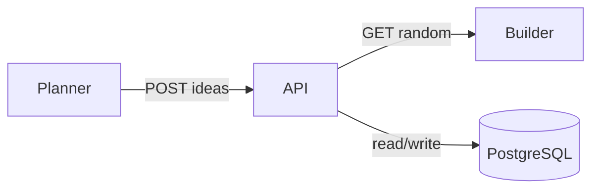
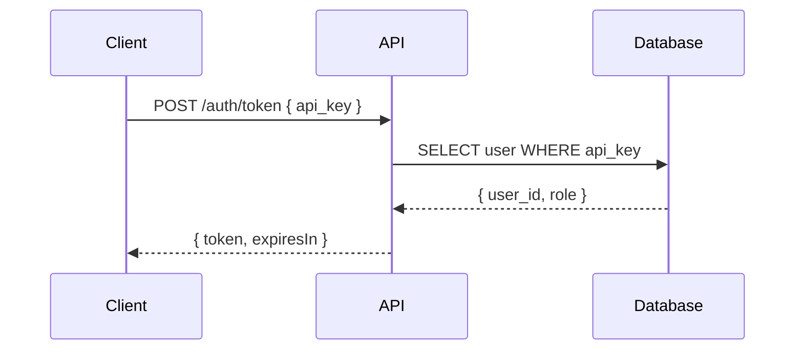

## Mermaid Diagrams — Mandatory Visual Documentation

### When a Diagram is Required

| Documentation Contains | Diagram Type | Minimum Requirement |
|------------------------|-------------|---------------------|
| Service architecture / components | `graph` or `block-beta` | Show all services and connections |
| Data flow between systems | `flowchart` or `sequenceDiagram` | Show source, destination, and transformation |
| Authentication / request lifecycle | `sequenceDiagram` | Show every round-trip between parties |
| Multi-step agent/workflow loop | `flowchart` | Show each phase, decision points, and loops |
| State transitions | `stateDiagram-v2` | Show every state and valid transitions |
| Deployment topology | `graph` | Show containers, networks, volumes, ports |

### Diagram Quality Standards

**DO:**
- Use ` ```mermaid ` fenced code blocks
- Keep diagrams focused — one concept per diagram, ~15 nodes max
- Label edges with the action, protocol, or data type
- Use `graph LR` for horizontal flows, `graph TB` for top-down hierarchies
- Use `sequenceDiagram` for request/response interactions
- Use `flowchart TB` for decision trees with `{rhombus}` for decision nodes
- Place diagrams directly after the section heading they illustrate

**AVOID:**
- Placeholder diagrams with no content (`A --> B`)
- Overly complex diagrams (>15 nodes) — split into sub-diagrams
- ASCII art diagrams (`┌──┐`) when Mermaid is available
- Orphaned diagrams with no surrounding explanatory text

### Diagram Types Quick Reference

| Type | Syntax | Use for |
|------|--------|---------|
| **graph** | `graph TB/LR` | Static relationships, architecture, dependencies |
| **flowchart** | `flowchart TB/LR` | Decision trees, process loops, workflows |
| **sequenceDiagram** | `sequenceDiagram` | Request/response, auth flows, API calls |
| **stateDiagram-v2** | `stateDiagram-v2` | State machines, lifecycles |
| **block-beta** | `block-beta` | Block/container layouts |
| **gitGraph** | `gitGraph` | Branching strategies |
| **erDiagram** | `erDiagram` | Entity relationships |

### Examples

**Architecture (graph):**


**Auth Lifecycle (sequenceDiagram):**

