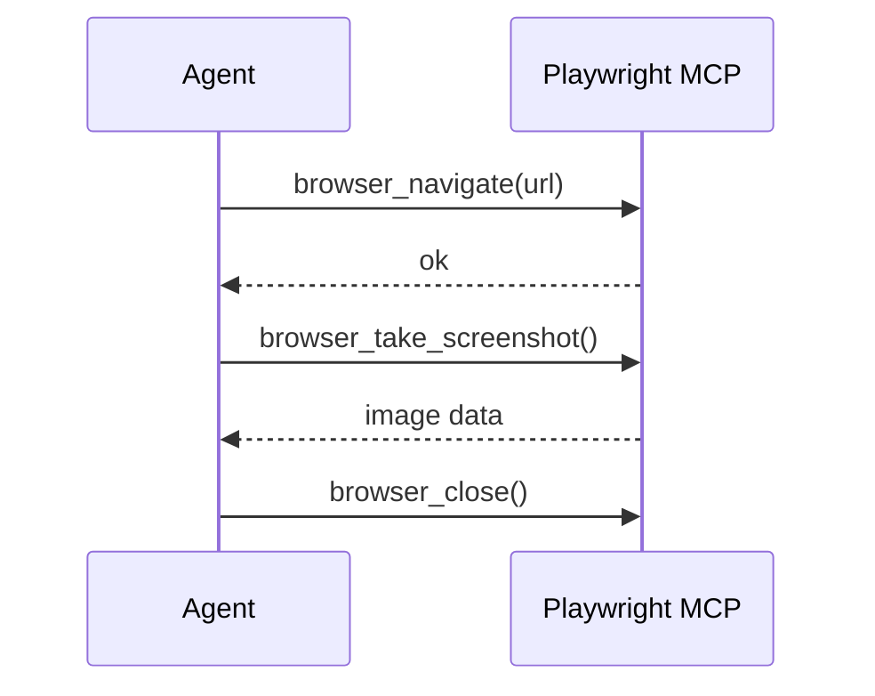

## Playwright MCP Patterns — Common Workflows

### 1. Full Page Screenshot Review

**Workflow:**
1. `browser_navigate({ url: "http://localhost:3000" })`
2. `browser_take_screenshot({})`
3. Analyze the screenshot visually
4. `browser_close({})`

### 2. Responsive Check (Multiple Viewports)

1. `browser_navigate({ url: "http://localhost:3000" })`
2. `browser_resize({ width: 375, height: 812 })` — mobile
3. `browser_take_screenshot({})` — save as `screenshot-mobile.png`
4. `browser_resize({ width: 768, height: 1024 })` — tablet
5. `browser_take_screenshot({})` — save as `screenshot-tablet.png`
6. `browser_resize({ width: 1280, height: 800 })` — desktop
7. `browser_take_screenshot({})` — save as `screenshot-desktop.png`
8. `browser_close({})`

### 3. Debug Console Errors

1. `browser_navigate({ url: "http://localhost:3000/login" })`
2. `browser_click({ selector: "[data-testid=login-button]" })`
3. `browser_console_messages({})` — check for JS errors
4. If errors exist, describe them to the user
5. `browser_close({})`

### 4. Check Element Visibility

1. `browser_navigate({ url: "http://localhost:3000" })`
2. `browser_snapshot({})` — inspect the DOM structure
3. Check if expected selectors exist in the snapshot output
4. `browser_close({})`

### 5. Capture Error State (Visual Bug Report)

1. `browser_navigate({ url: "http://localhost:3000" })`
2. Perform actions to trigger the error state
3. `browser_take_screenshot({})` — capture the broken state
4. `browser_snapshot({})` — capture the DOM for debugging
5. `browser_close({})`
6. Describe both the visual issue (from screenshot) and structural issue (from snapshot)
