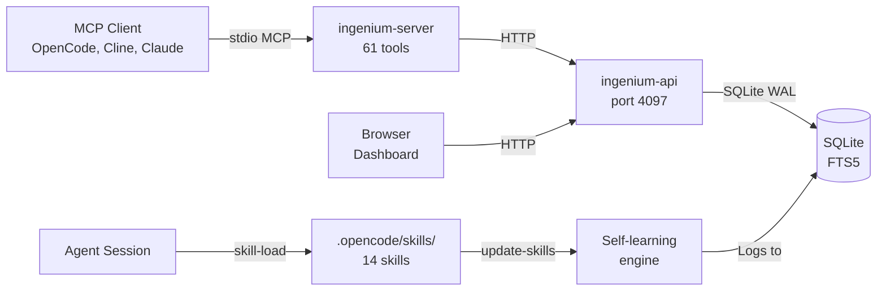

<div align="center">


# Ingenium

### All your AI agent development tools in one place. One MCP server, hundreds of tools.

<p>
  
  
  
</p>

---

</div>

**Ingenium** is a self-learning AI agent skill system and MCP server. It provides skills, learnings, tasks, context, plugins, servers, email client, and project management through a single MCP stdio transport, with a Next.js dashboard for visual management.

### OpenCode Web UI Embedded in Dashboard
The dashboard includes an embedded OpenCode service at `/opencode` — a second OpenCode instance on `:4098` without auth (for iframe use) that connects to the Ingenium MCP server via a direct iframe mount. The session persists across tab navigation with a hidden iframe toggle. Workspace is mounted at `~/repos` → `/workspace` in the container.

Connect any MCP-compatible client (OpenCode, Cline, Claude Desktop) to `ingenium-server` and instantly gain access to 61 tools spanning project management, skill management, task boards, full-text knowledge search, plugin lifecycle, agent management, server configuration, email client integration with Gmail/Outlook OAuth2 + IMAP/SMTP support, and settings. Every tool is backed by SQLite with WAL mode and FTS5 full-text search.

**The system learns from you.** Patterns you teach, conventions you establish, and decisions you make are stored in a searchable knowledge base. The `update-skills` agent autonomously detects new dependencies, repeated patterns, missing coverage, and stale content — creating, updating, or retiring skills as your codebase evolves. Every change is logged with before/after commit hashes for full auditability.

11 dashboard pages provide visual management for every feature. Each page is a standalone feature with its own documentation.

## Quick Start

```bash
# Prerequisites: Node.js 22+, npm

# Clone and install dependencies
git clone https://github.com/jtmb/ingenium.git
cd ingenium
npm install

# Start all services (API on :4097, dashboard on :3000, MCP server on stdio)
./run.sh dev

# Or use Docker (API :4097, dashboard :3000, opencode-server :4096 managed by supervisord)
docker compose up --build
```

**OpenCode global MCP config** — Add this entry to `~/.config/opencode/opencode.jsonc` to make Ingenium available across all your projects:

```jsonc
{
  "mcp": {
    "servers": {
      "ingenium": {
        "command": ["node", "/path/to/ingenium/services/ingenium-server/dist/scripts/mcp-server.js"],
        "disabled": false,
        "env": {
          "INGENIUM_API_URL": "http://localhost:4097/api/v1",
          "INGENIUM_API_TIMEOUT": "10000",
          "LOG_LEVEL": "info"
        }
      }
    }
  }
}
```

**Other MCP clients** — Point your client's `command` to `node /path/to/ingenium/services/ingenium-server/dist/scripts/mcp-server.js`. The server speaks stdio MCP with 61 tools. No HTTP port, no network config.

**Docker Deployment** — Single-container deployment via `docker compose up --build` manages three processes: API (`:4097`), Dashboard (`:3000`), and opencode-server (`:4096`) via supervisord. Build-time UID matching ensures write access to workspace. Docker volumes `opencode-config` and `opencode-data` persist OpenCode configuration across container rebuilds.

**Open the dashboard** — Navigate to `http://localhost:3000` in your browser. The Next.js dashboard provides visual management for all feature areas.

## Features

### 📁 Projects
Multi-project configuration with name→UUID resolution and per-project SQLite databases. Manage project identities with Active/Archived tab views, inline rename, archive/unarchive, and purge expired projects. Keep knowledge isolated per project. Dashboard provides a toggle between active and archived tabs.
→ [docs/HOW-TO/projects.md](docs/HOW-TO/projects.md)

### 📚 Skills
AI agent conventions engine — 17 skills covering debugging, testing, security, API design, containers, Kubernetes, SQL, TypeScript, Go, Rust, Python, Next.js, and more. Each skill is a self-contained split-skill format (SKILL.md + metadata.json + references/) stored at `.opencode/skills/`. Skills are loaded from the SQLite database via the MCP server and auto-invoked based on file type, framework detection, and slash commands. The `file_tree` column stores a JSON map of relative paths → content for complete data round-trips. The dashboard provides a split-pane skill viewer with collapsible file tree sidebar (FileTree component), inline editing per file, and syntax highlighting (highlight.js) in both Preview and Source views.
→ [docs/HOW-TO/skills.md](docs/HOW-TO/skills.md)

### 🧠 Self-Learning Pipeline
Self-improving knowledge base with observation collection, synthesis processing, and personality trait aggregation. Every decision, pattern discovery, and bug fix is automatically logged via `ingenium_observe`. An automated pipeline (Observer plugin at `.opencode/plugins/observer.ts`) processes observations into personality traits and skill updates. The system uses 10 observation types and creates 10 personality trait types for comprehensive agent learning.
→ [docs/HOW-TO/self-learning.md](docs/HOW-TO/self-learning.md)

> 🔴 **Note:** The old `ingenium_learning_log` is deprecated. Use `ingenium_observe` instead.

### 📋 Tasks
Kanban-style task board with `todo` → `in_progress` → `review` → `done` workflow, dependency tracking, priority scoring, and full audit history. Tasks can be created, assigned, moved, linked, and archived via the ingenium-server MCP tools or the dashboard.
→ [docs/HOW-TO/tasks.md](docs/HOW-TO/tasks.md)

### 🔌 Plugins
OpenCode plugin lifecycle management — enable, disable, configure plugins that extend the MCP server's capabilities. Plugin state is persisted across restarts with auto-config sync between DB and `opencode.json`.
→ [docs/HOW-TO/plugins.md](docs/HOW-TO/plugins.md)

### 📧 Mail
Full email client with inbox, compose, search, and AI auto-responses. Gmail/Outlook OAuth2 + IMAP/SMTP. 13 MCP tools for agents. Self-learning auto-draft from user patterns.

### 🖥️ Servers
MCP server configuration and proxy engine — start, stop, configure MCP servers from the dashboard. The server proxy routes client requests to the appropriate backend, handling lifecycle and configuration.
→ [docs/HOW-TO/servers.md](docs/HOW-TO/servers.md)

### 👤 Agents
Agent profile management — create, enable, disable, and configure AI agent profiles. Each agent has a model assignment, access permissions, category, and skill bindings. Manage agent profiles via the dashboard or `ingenium_agent_*` MCP tools.
→ [docs/agents.md](docs/agents.md)

### ⚙️ Settings
Application settings management — configure key-value settings at the project level. Settings control archive retention, API behavior, and other project-scoped preferences.
→ [docs/HOW-TO/settings.md](docs/HOW-TO/settings.md)

### 🗄️ Archive
Project archiving and lifecycle management — view archived projects, restore them to active status, or purge expired projects. Archive tab in the Projects page provides Active/Archived toggle with rename, archive, and restore actions.

## Architecture

```
ingenium/
├── packages/
│   ├── ingenium-core/        # Shared library: SQLite WAL + FTS5, 8 tool modules, Zod schemas
│   └── ingenium-email/       # IMAP/SMTP email client (imapflow, nodemailer, mailparser) with OAuth2 for Gmail/Outlook
├── services/
│   ├── ingenium-api/          # Express REST gateway on port 4097. Sole database authority.
│   ├── ingenium-server/       # MCP stdio server with 64 tools. Calls API via HTTP. Zero DB access.
│   └── ingenium-dashboard/    # Next.js 16 App Router frontend with 11 feature pages. Calls API via HTTP. Zero DB access.
├── seed/
│   ├── skills/                # 17 canonical skill sources in split-skill format (SKILL.md + metadata.json + references/)
│   └── plugins/               # 4 seed plugins (.ts files)
├── .opencode/
│   ├── skills/                # Skills written to disk from DB (split-skill format)
│   ├── plugins/               # Plugin .ts files synced from DB
│   ├── agents/                # Agent categories (primary, research, execution, security)
│   └── commands/              # OpenCode custom commands
├── docs/                      # Project documentation database
├── run.sh                     # Unified dev/test/build/check/seed runner
├── docker-compose.yml         # Single-container deployment (supervisord: API + dashboard + opencode-server)
└── Dockerfile                 # Multi-stage build for containerised deployment
```

**Data flow:** The MCP server (`ingenium-server`) accepts stdio MCP protocol and forwards requests as HTTP to the API (`ingenium-api`), which is the sole database authority. The dashboard (`ingenium-dashboard`) also calls the API via HTTP. This ensures consistent data access — the database is never accessed directly by the MCP server or frontend.



## Documentation

| Doc | Purpose |
|-----|---------|
| [docs/ARCHITECTURE.md](docs/ARCHITECTURE.md) | Project structure, data flow, key components, skill file_tree format |
| [docs/TECH-STACK.md](docs/TECH-STACK.md) | Dependencies, versions, why each was chosen |
| [docs/CONVENTIONS.md](docs/CONVENTIONS.md) | Naming, file organization, error handling, observation logging, plugin auto-config sync |
| [docs/VARIABLES.md](docs/VARIABLES.md) | All environment variables with defaults |
| [docs/agents.md](docs/agents.md) | Agent profiles and pipeline lifecycle |
| [docs/HOW-TO/projects.md](docs/HOW-TO/projects.md) | Project management feature guide |
| [docs/HOW-TO/skills.md](docs/HOW-TO/skills.md) | Skill system usage and file_tree format |
| [docs/HOW-TO/self-learning.md](docs/HOW-TO/self-learning.md) | Self-learning pipeline with observations and personality traits |
| [docs/HOW-TO/learnings.md](docs/HOW-TO/learnings.md) | Old learnings documentation (deprecated, kept for reference) |
| [docs/HOW-TO/tasks.md](docs/HOW-TO/tasks.md) | Kanban task board feature guide |
| [docs/HOW-TO/plugins.md](docs/HOW-TO/plugins.md) | Plugin lifecycle management guide |
| [docs/HOW-TO/servers.md](docs/HOW-TO/servers.md) | MCP server configuration guide |
| [docs/HOW-TO/settings.md](docs/HOW-TO/settings.md) | Settings management guide |
| [USAGE.md](./USAGE.md) | Dashboard user guide and API access reference |
| [AGENTS.md](./AGENTS.md) | Skill system protocol — agent entry point |
| [services/ingenium-dashboard/STYLING-GUIDE.md](./services/ingenium-dashboard/STYLING-GUIDE.md) | Dashboard styling conventions and component design |

## Docker Deployment

The project ships as a single Docker container via `Dockerfile` (multi-stage build, root) and `docker-compose.yml` (single service):

```yaml
services:
  ingenium:
    build: .
    ports:
      - "4097:4097"   # API
      - "3000:3000"   # Dashboard
      - "4096:4096"   # opencode-server (managed by supervisord)
    volumes:
      - ingenium_data:/app/.ingenium/data
```

Inside the container, **supervisord** manages three processes:
1. **API** (Express on :4097) — `express.json({ limit: "2mb" })` for large skill uploads
2. **Dashboard** (Next.js on :3000) — highlight.js syntax highlighting in Preview/Source modes
3. **opencode-server** (on :4096) — appuser home dirs pre-created for config persistence

Build-time UID matching ensures write access to workspace (`~/repos` → `/workspace`). Docker volumes `opencode-config` and `opencode-data` persist OpenCode configuration across container rebuilds.

Start with:
```bash
docker compose up --build
```

## Development

```bash
./run.sh dev         # Start all services in dev mode
./run.sh dev api     # Start only the API service
./run.sh dev server  # Start only the MCP server
./run.sh dev dashboard  # Start only the dashboard

./run.sh test        # Run all tests
./run.sh check       # Type-check and lint all packages
./run.sh build       # Build all packages for production
```
