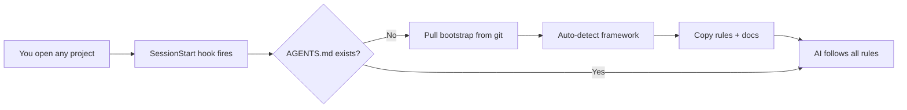
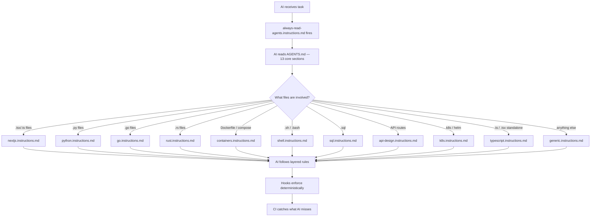

<div align="center">

<!--  -->

# Copilot AI Bootstrap
### Set Once — Auto-Bootstrap Every Project

<p>
  
  
  
  
  
</p>

---

</div>

**The problem:** Every time you start a new project (or open an existing one with VS Code Copilot), the AI doesn't know your conventions. It doesn't know to keep docs in sync, write comments, run tests before claiming done, or use your framework's idioms. You end up repeating the same instructions in every chat, or worse — the AI drifts from your standards and you spend time fixing its output.

**What this solves:** One hook. Every project. The AI arrives already knowing the rules — framework-specific build commands, language idioms, directory conventions, and universal quality standards. You focus on the work; the rules take care of themselves.

This repo is **consumed as a hook**. Configure it once in your VS Code Copilot settings, and every project you open gets auto-bootstrapped with the right AI rules — framework detection, layered instructions, docs templates, and enforcement guardrails. No cloning, no manual copying, no per-project setup.



## Quick Start — Set Up the Hook (do this once)

VS Code Copilot reads hooks from `~/.copilot/hooks/` (global, applies to every project). Create this file:

**`~/.copilot/hooks/trigger-bootstrap.json`**

```json
{
    "hooks": {
        "SessionStart": [
            {
                "type": "command",
                "command": "if [ ! -f AGENTS.md ]; then curl -fsSL https://raw.githubusercontent.com/jtmb/copilot-ai-bootstrap/main/.github/scripts/hook-bootstrap.sh | bash; fi"
            }
        ]
    }
}
```

That's it. Now:

1. Open any project in VS Code
2. Start a Copilot chat
3. The hook auto-detects the framework (Next.js, Python, Go, Rust, or generic) and bootstraps the project
4. The AI follows all rules automatically — doc sync, code comments, testing, DRY

**You never run the bootstrap scripts directly again.** The hook handles it.

> **Where hooks live:** `~/.copilot/hooks/*.json` — NOT in `settings.json`. This is VS Code Copilot's global hooks directory. Each `.json` file registers one or more lifecycle hooks (`SessionStart`, `UserPromptSubmit`, `PreToolUse`, `PostToolUse`).

> **What happens?** `.github/scripts/hook-bootstrap.sh` caches this repo in `~/.cache/gh-llm-bootstrap/`, auto-detects the framework from `package.json` / `pyproject.toml` / `go.mod` / `Cargo.toml`, and calls `.github/scripts/bootstrap.sh --auto --framework <detected> /path/to/your/project`.

## What Gets Bootstrapped

| Layer | File | Purpose |
|-------|------|---------|
| **Core** | `AGENTS.md` (172 lines, 13 sections) | Universal quality rules — docs, comments, tests, DRY, security, error handling |
| **Frameworks** | `.github/instructions/{fw}.instructions.md` (4 files) | Next.js, Python, Go, Rust — build commands, idioms, project layout |
| **Cross-cutting** | `.github/instructions/{domain}.instructions.md` (6 files) | Containers, Shell, SQL, API Design, Kubernetes, TypeScript — everything in between |
| **Docs** | `docs/` (4 files) | Templates the AI fills in as it works — architecture, tech stack, conventions |
| **Prompts** | `.github/prompts/` (3 files) | `/generate-docs`, `/repo-context`, `/write-docs` slash commands |
| **Hooks** | `.github/hooks/` (3 files) | PreToolUse guard, SessionStart bootstrap, PostToolUse lint |
| **CI** | `.github/workflows/ci.yml` | Matrix CI for lint/build/test |
| **Usage** | `USAGE.md` | Handbook for adding your own rules |

## Coverage — Every File Type Has Rules

### Framework Detection (auto-bootstrapped by hook)

| Framework | Detected by | `applyTo` |
|-----------|------------|-----------|
| Next.js / TypeScript | `"next"` in `package.json` | `**/*.{tsx,ts,jsx,js,css}` |
| Python | `pyproject.toml`, `setup.py`, `setup.cfg` | `**/*.py` |
| Go | `go.mod` | `**/*.go` |
| Rust | `Cargo.toml` | `**/*.rs` |
| Generic (fallback) | none of the above | `**` |

### Cross-Cutting Instructions (always included)

| Domain | `applyTo` | What It Covers |
|--------|-----------|-----------------|
| 🐳 Containers | `Dockerfile`, `docker-compose*`, `.dockerignore` | Multi-stage builds, non-root user, HEALTHCHECK, secrets |
| 🐚 Shell | `**/*.{sh,bash}` | `set -euo pipefail`, quoting, error handling, portability |
| 🗄️ SQL | `**/*.sql` | Parameterized queries, migrations, indexing, N+1 prevention |
| 🔌 API Design | `**/{routes,handlers,api}/**/*` | Status codes, error shapes, pagination, idempotency |
| ☸️ Kubernetes | `**/{k8s,helm,charts}/**/*.{yaml,yml}` | Security context, probes, resources, network policies |
| 📘 TypeScript | `**/*.{ts,tsx}` | Strict config, type safety, async patterns, Node.js |

## Architecture — Layered Rules



| Layer | Location | Trigger | Contains |
|-------|----------|---------|----------|
| **Core** | `AGENTS.md` | Every interaction | Docs sync, code comments, testing, DRY — framework-agnostic |
| **Framework** | `.github/instructions/{fw}.instructions.md` | `applyTo` file glob | Build commands, directory conventions, language idioms |
| **Project** | `.github/instructions/{project}.instructions.md` | `applyTo` file glob | Tool registration, domain knowledge, anti-patterns |
| **Tasks** | `.github/prompts/{name}.prompt.md` | On-demand via `/` | Code generation, doc generation, refactoring workflows |
| **Workflows** | `.github/skills/{name}/SKILL.md` | On-demand via `/` | Multi-step tasks with bundled scripts/templates |
| **Personas** | `.github/agents/{name}.agent.md` | Agent picker or subagent | Specialized agent with restricted tools |
| **Enforcement** | `.github/hooks/*.json` | Agent lifecycle events | Deterministic guardrails (block commands, auto-lint) |
| **Safety net** | `.github/workflows/ci.yml` | Push / PR | Lint, type-check, test, build |

## Key Rules (from AGENTS.md — 13 Sections)

| Section | Mandate |
|---------|---------|
| 📝 **Code Comments** | Every function & export explains **why** |
| 📚 **Docs Sync** | Every code change updates `docs/` same turn |
| 🧪 **Test Before Done** | Lint → build → test → smoke — all must pass |
| 🔁 **Don't Repeat Yourself** | Extract shared logic, one authoritative location |
| 🔒 **Secure Coding** | No secrets in code, validate input, least privilege, audit deps |
| 📁 **Project Structure** | Feature grouping, co-located tests, one concern per file |
| 🔀 **Git & Version Control** | Atomic commits, Conventional Commits, no generated files |
| 👁️ **Observability** | Structured logging, health checks, distributed tracing |
| ⚡ **Performance** | Measure first, N+1 is a bug, paginate, timeout everything |
| ❌ **Error Handling** | Never swallow, wrap with context, typed errors, crash-only |
| ⚙️ **Configuration** | One config module, validate at startup, 12-factor, secrets ≠ config |
| 🏷️ **Naming Conventions** | Descriptive, no abbreviations, language-consistent casing |
| 🔄 **Pre-read AGENTS.md** | The `always-read-agents` instruction forces re-read before every code change |

## Manual Bootstrap (optional)

If you can't use hooks, or want to bootstrap once:

```bash
git clone --depth 1 https://github.com/jtmb/copilot-ai-bootstrap.git
./copilot-ai-bootstrap/.github/scripts/bootstrap.sh --framework python /path/to/your-project
```

Or for non-interactive CI use:

```bash
./.github/scripts/bootstrap.sh --auto --framework nextjs /path/to/your-project
```

## Further Reading

- **[USAGE.md](./USAGE.md)** — How to add your own rules, create custom prompts, and maintain the system (decision tree, step-by-step guides)
- **[docs/](./docs/)** — Project documentation database built by the AI as it works
- **[AGENTS.md](./AGENTS.md)** — Core conventions (read first)
