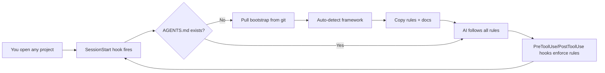
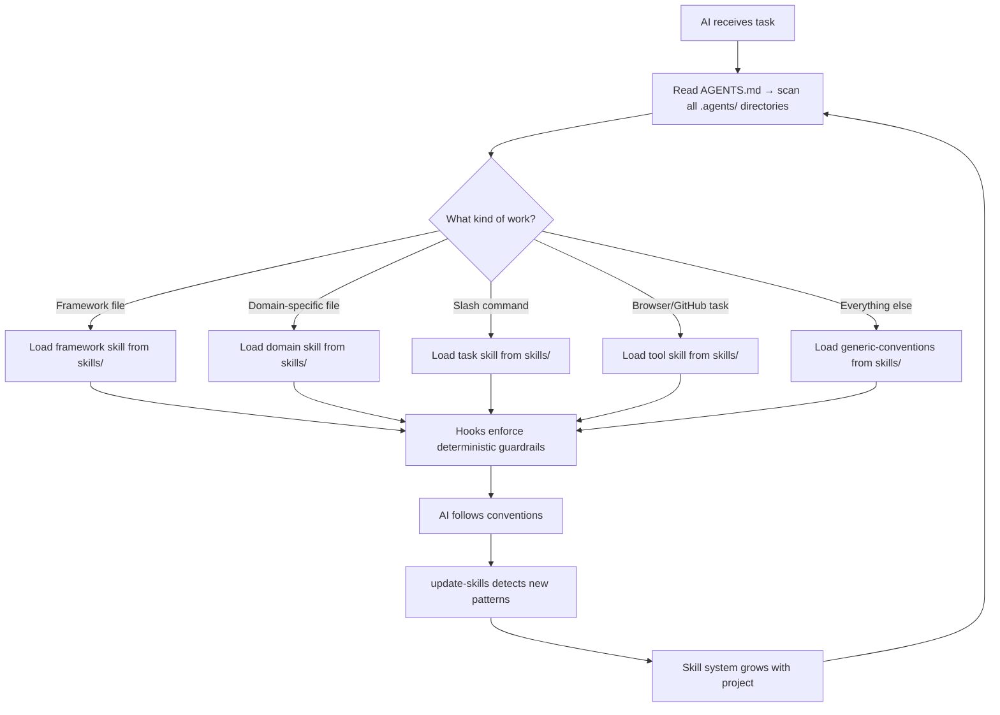

<div align="center">


# Ingenium
### Genius doesn't repeat itself. Neither should you.

<p>
  
  
  
</p>

---

</div>

**The problem:** Every time you start a new project with an AI coding assistant, the AI doesn't know your conventions. It doesn't know to keep docs in sync, write comments, run tests before claiming done, or use your framework's idioms. You repeat the same instructions in every chat — and the AI drifts from your standards.

**What this solves:** A **skill-based AI conventions system** — **skills that grow with you** 🌱 — that bootstraps into every project automatically. 43 items (all in \`.agents/skills/\`) covering frameworks, domains, and tasks — each invoked on-demand by any AI assistant that supports the `.agents/` convention. The AI arrives already knowing the rules. You focus on the work; the skill system handles the rest.

**But it goes further — the system learns from you.** When you add a new dependency, repeat a pattern across files, or write a new file type, the AI detects it. It doesn't just suggest a new skill — it **writes one**, creates the `SKILL.md`, commits it with a descriptive message, and logs the change to `.agents/skills/learnings.md`. Every entry includes before/after commit hashes, so you can `git checkout` any skill back to its previous state. When you remove a dependency, the corresponding skill retires automatically — no stale rules, no ghost conventions. The system grows and shrinks with your codebase, always reflecting reality.

**Four signals drive the learning:** new dependencies in your package manager → AI creates matching conventions. Three or more files following the same unwritten pattern → AI codifies it. A file type or directory with no applicable skill → AI flags the gap and writes one. Stale content referencing outdated versions → AI updates the skill. All autonomous. All logged. All reversible.

Configure it once as a hook in your editor. Every project you open gets auto-bootstrapped with the right skills — framework detection, layered conventions, docs templates, and enforcement guardrails. No cloning, no manual copying, no per-project setup.



## Table of Contents

- [Getting Started](#getting-started)
  - [Manual Install](#manual-install)
- [Self-Improving AI](#self-improving-ai-skills-that-grow-with-your-project)
- [What Gets Bootstrapped](#what-gets-bootstrapped)
- [Coverage — Every File Type Has Rules](#coverage-every-file-type-has-rules)
- [Architecture — Skill System](#architecture-skill-system)
- [Key Rules](#key-rules-from-generic-conventions-skill-13-sections)
- [Further Reading](#further-reading)

## Getting Started

There are several ways to add Ingenium to your project, depending on how much automation you want.

### Manual Install

Clone the repo and run the bootstrap script from the project root:

```bash
git clone --depth 1 https://github.com/jtmb/ingenium.git
./ingenium/bootstrap.sh /path/to/your-project
```

For non-interactive CI use with explicit framework selection:

```bash
./ingenium/.agents/scripts/bootstrap.sh --auto --framework nextjs /path/to/your-project
```

This runs the full bootstrap pipeline: deploys the skill system with framework-specific conventions and seeds docs templates.

## Self-Improving AI — Skills That Grow With Your Project

The four detection signals (see [intro](#ingenium)) fire automatically as you code. Every change is committed and logged to `.agents/skills/learnings.md` — a full audit trail with before/after hashes so any skill can be reverted:

```bash
git checkout <before-hash> -- .agents/skills/<skill-name>/
```

| Trigger | AI action | Result |
|---------|-----------|--------|
| You `npm install prisma` | Signal 1 fires | `prisma-conventions` skill created |
| You copy the same 3-file pattern 5 times | Signal 2 fires | `feature-structure` skill codifies it |
| You write your first `.graphql` file | Signal 3 fires | `graphql-conventions` skill created |
| You upgrade React from 18 to 19 | Signal 4 fires | `nextjs-conventions` skill updated |
| You remove the last Prisma dependency | Signal 4 fires | `prisma-conventions` skill retired |

No approvals. No stale rules. The system grows and shrinks with your codebase — always reflecting reality, never someone's outdated wiki.

## What Gets Bootstrapped

| Layer | File | Purpose |
|-------|------|---------|
| **Core rules** | `.agents/skills/generic-conventions/SKILL.md` | The definitive 13-section reference: comments, docs, testing, DRY, security, error handling, config, naming |
| **Project structure** | `.agents/skills/project-structure/SKILL.md` | Monorepo layout, service layering (pages/features/domain/infrastructure), naming, boundaries |
| **Frameworks** | `.agents/skills/{fw}-conventions/SKILL.md` (4 files) | Next.js, Python, Go, Rust — build commands, idioms, project layout |
| **Cross-cutting** | `.agents/skills/{domain}/SKILL.md` (19 files) | Containers, Shell, SQL, API Design, Kubernetes, TypeScript, Agent Pipelines, Useful Tests, Gitignore, PostgreSQL, Code Review, Refactoring, CLI Toolkit, Regex, Error Interpretation, Local Models |
| **Docs** | `docs/` (4 files) | Templates the AI fills in as it works — architecture, tech stack, conventions |
| **Instructions & Tools** | `.agents/skills/{name}/SKILL.md` (19 files) | All task skills, browser automation, and GitHub operations — invocable via `/` commands or on-demand by file type |
| **Hooks** | `.agents/hooks/` (3 files) | PreToolUse safety checks, SessionStart checklist + bootstrap, PostToolUse periodic reminders |
| **CI** | `.agents/workflows/ci.yml` (optional) | Matrix CI for lint/build/test — copied if present |
| **Usage** | `USAGE.md` | Handbook for adding your own skills |

## Coverage — Every File Type Has Rules

### Framework Detection (auto-bootstrapped by hook)

| Framework | Detected by | Skill |
|-----------|------------|-------|
| Next.js / TypeScript | `"next"` in `package.json` | `nextjs-conventions` |
| Python | `pyproject.toml`, `setup.py`, `setup.cfg` | `python-conventions` |
| Go | `go.mod` | `go-conventions` |
| Rust | `Cargo.toml` | `rust-conventions` |
| Generic (fallback) | none of the above | `generic-conventions` |

### Always-Included Skills

| Domain | Skill | What It Covers |
|--------|-------|-----------------|
| 🏗️ Structure | `project-structure` | Monorepo layout, 4-layer services, naming, service boundaries |
| 🐳 Containers | `containers` | Multi-stage builds, non-root user, HEALTHCHECK, secrets |
| 🤖 Agent Pipelines | `agent-pipelines` | Agent loops, turn-based orchestration, state checkpoints, crash recovery |
| 🧪 Useful Tests | `useful-tests` | Write tests that catch real bugs — unit, integration, E2E with Playwright, app lifecycle |
| 🐚 Shell | `shell-scripts` | `set -euo pipefail`, quoting, error handling, portability |
| 🗄️ SQL | `sql-database` | Parameterized queries, migrations, indexing, N+1 prevention |
| 🔌 API Design | `api-design` | Status codes, error shapes, pagination, idempotency |
| ☸️ Kubernetes | `kubernetes` | Security context, probes, resources, network policies |
| 📘 TypeScript | `typescript-standalone` | Strict config, type safety, async patterns, Node.js |
| 🗂️ Gitignore | `gitignore` | .gitignore conventions — patterns, structure, and rules per language |
| 🐘 PostgreSQL | `postgresql-optimization` | JSONB, arrays, custom types, full-text search, window functions, extensions |
| 🐛 Debugging | `debugging-patterns` | Systematic debugging — bisect, log-driven, stack-trace analysis, anti-patterns |
| ✅ Code Review | `code-review-checklist` | 5-lens review across security, correctness, perf, readability, testing |
| 🔧 Refactoring | `refactoring-recipes` | 10 named patterns with explicit before/after code examples |
| 🔄 Self-Correction | `self-correction-patterns` | AI mistake recognition, backtracking triggers, verification loops |
| 🛠️ CLI Toolkit | `cli-toolkit` | jq, curl, sed, awk, find, xargs, grep — flags, recipes, gotchas |
| 🔤 Regex | `regex-reference` | Common patterns, per-language escaping, catastrophic backtracking |
| ❌ Error Interpretation | `error-interpretation` | Error signature → root cause per language — cross-language patterns |
| 🧠 Local Models | `local-models` | Model profiles (Qwen, Gemma, DeepSeek), terminal safety rules, and LM Studio API reference |
### Task Skills (invoke via `/`)

All skills live in `.agents/skills/`:

| Skill | Trigger |
|-------|---------|
| `generate-docs` | `/generate-docs` — scan codebase, populate `docs/` templates |
| `write-docs` | `/write-docs` — write READMEs, API docs, ADRs |
| `repo-context` | `/repo-context` — get project identity, tech stack, conventions overview |
| `update-skills` | `/update-skills` — detect missing/outdated skills, create/update/retire (autonomous) |
| `audit-skills` | `/audit-skills` — cross-reference skills against README, mermaid, bootstrap.sh for consistency |
| `help` | `/help` or "help" — display all skills, their commands, and invocation patterns |
| `update-skill-index` | `/update-skill-index` — regenerate SKILL-INDEX.md from all skill files (auto-invoked after skill changes) |
| `skill-load` | `/skill-load` — session bootstrap protocol (auto-invoked at session start) |
| `debugging-patterns` | `/debugging-patterns` — systematic debugging workflow |
| `self-correction-patterns` | `/self-correction-patterns` — AI recovery from mistakes |
| `local-models` | `/local-models` — model profiles, terminal safety, LM Studio API |
| `thread-auto-context` | `/thread-auto-context` — automatic persistent memory via Thread MCP **(source only)** |
| `chrome-devtools` | `/chrome-devtools` — browser automation, screenshots, network analysis, performance profiling |
| `playwright-mcp` | `/playwright-mcp` — browser automation via Playwright MCP |
| `gh-cli` | `/gh-cli` — GitHub CLI integration for repos, PRs, issues, releases |
| `web-design-reviewer` | `/web-design-reviewer` — inspect websites for responsive, accessibility, and layout issues |
| `onboard-existing-repo` | `/onboard-existing-repo` — onboard an existing repo to the skill system |
| `create-readme` | `/create-readme` — create a README.md file for the project |

## Architecture — Skill System



**Agent pipeline** — 11 custom OpenCode agents (2 primary, 9 subagents) with **planner-is-read-only** architecture. The planner (`@ingenium-planner`) ONLY spawns research agents (explore, scout, security-auditor) and populates the kaban board. The orchestrator (`@ingenium-orchestrator`) executes plans via **kaban board integration** — tasks flow from `todo` → `in-progress` → `review` → `done` with kaban MCP tools. All agents have explicit permissions with `"*": "deny"` on task blocks. See [`docs/agents.md`](docs/agents.md) for the full agent architecture.

**Multi-model software engineer** — Three tiers: `-fast` (V4 Flash, medium reasoning), default (V4 Flash, high), `-premium` (V4 Pro, xhigh). Model assignments centralized in `.agents/models.yaml`.

| Layer | Location | Trigger | Contains |
|-------|----------|---------|----------|
| **Core** | `.agents/skills/generic-conventions/SKILL.md` | File-type match | Docs sync, code comments, testing, DRY — framework-agnostic |
| **Structure** | `.agents/skills/project-structure/SKILL.md` | File-type match | Monorepo layout, service layering, boundaries, anti-patterns |
| **Framework** | `.agents/skills/{fw}-conventions/SKILL.md` | File-type match | Build commands, directory conventions, language idioms |
| **Domain** | `.agents/skills/{domain}/SKILL.md` | File-type match | Containers, SQL, API design, Kubernetes, shell, TypeScript |
| **Instructions & Tools** | `.agents/skills/{name}/SKILL.md` | `/` slash command or file-type match | Task skills, browser automation, GitHub ops, debugging, persistent memory |
| **Enforcement** | `.agents/hooks/*.json` | Agent lifecycle events | Deterministic guardrails (block commands, auto-lint) |
| **Safety net** | `.agents/workflows/ci.yml` | Push / PR | Lint, type-check, test, build |

## Key Rules (from `generic-conventions` skill — 13 Sections)

| Section | Mandate |
|---------|---------|
| 📝 **Code Comments** | Every function & export explains **why** |
| 📚 **Docs Sync** | Every code change updates `docs/` same turn |
| 🧪 **Test Before Done** | Lint → build → test → smoke — all must pass |
| 🔁 **Don't Repeat Yourself** | Extract shared logic, one authoritative location |
| 🔒 **Secure Coding** | No secrets in code, validate input, least privilege, audit deps |
| 📁 **Project Structure** | Feature grouping, co-located tests, one concern per file — see `project-structure` skill for monorepo layout |
| 🔀 **Git & Version Control** | Atomic commits, Conventional Commits, no generated files |
| 👁️ **Observability** | Structured logging, health checks, distributed tracing |
| ⚡ **Performance** | Measure first, N+1 is a bug, paginate, timeout everything |
| ❌ **Error Handling** | Never swallow, wrap with context, typed errors, crash-only |
| ⚙️ **Configuration** | One config module, validate at startup, 12-factor, secrets ≠ config |
| 🏷️ **Naming Conventions** | Descriptive, no abbreviations, language-consistent casing |
| 🔄 **Skill System** | AGENTS.md directs AI to `.agents/skills/` for every code change. `update-skills` grows them as your project evolves. |


## Further Reading

- **[USAGE.md](./USAGE.md)** — How to add your own skills, create custom workflows, and maintain the system (decision tree, step-by-step guides)
- **[docs/](./docs/)** — Project documentation database built by the AI as it works
- **[AGENTS.md](./AGENTS.md)** — Skill system index (start here)
