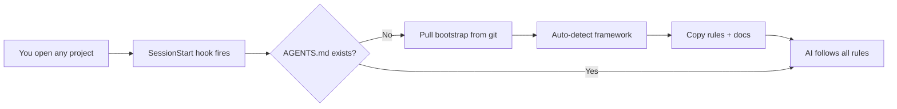
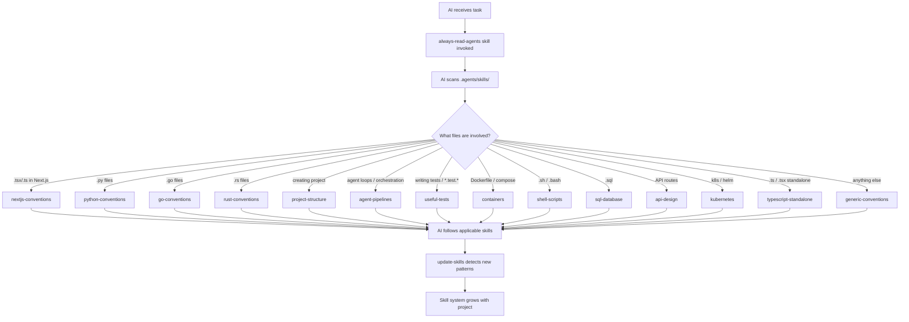

<div align="center">

<!--  -->

# Copilot AI Bootstrap
### Set Once — Auto-Bootstrap Every Project

<p>
  
  
  
</p>

---

</div>

**The problem:** Every time you start a new project with VS Code Copilot, the AI doesn't know your conventions. It doesn't know to keep docs in sync, write comments, run tests before claiming done, or use your framework's idioms. You repeat the same instructions in every chat — and the AI drifts from your standards.

**What this solves:** A **skill-based AI conventions system** that bootstraps into every project automatically. 23 skills covering frameworks, domains, and tasks — each invoked on-demand by VS Code Copilot. The AI arrives already knowing the rules. You focus on the work; the skill system handles the rest.

Configure it once as a hook. Every project you open gets auto-bootstrapped with the right skills — framework detection, layered conventions, docs templates, and enforcement guardrails. No cloning, no manual copying, no per-project setup.



## Self-Improving AI — Skills That Grow With Your Project

The system doesn't just enforce rules — it **evolves them**. The `update-skills` skill gives the AI four detection signals to identify when your project needs new or updated conventions:

| Signal | What the AI detects | Example |
|--------|-------------------|---------|
| **New dependency** | A framework or library added to `package.json` / `pyproject.toml` / `go.mod` / `Cargo.toml` with no matching skill | Adding `prisma` → AI proposes an ORM skill |
| **Repeated patterns** | 3+ files following the same unwritten convention | Every feature folder has `index.ts` + `hooks.ts` + `types.ts` → AI proposes codifying it |
| **Missing coverage** | File types or directories with no applicable skill | `**/*.graphql` files exist but no GraphQL skill → AI flags the gap |
| **Stale content** | A skill references outdated versions, dead paths, or wrong commands | Skill says "React 18" but `package.json` has React 19 → AI proposes update |

When the AI detects a pattern, it **creates** a new skill or updates an existing one — automatically. No approval needed. The skill system grows with your codebase. No more stale conventions docs.

## Quick Start — Set Up the Hook (do this once)

VS Code Copilot reads hooks from `~/.copilot/hooks/` (global, applies to every project). Create this file:

**`~/.copilot/hooks/trigger-bootstrap.json`**

```json
{
    "hooks": {
        "SessionStart": [
            {
                "type": "command",
                "command": "if [ ! -f AGENTS.md ]; then curl -fsSL https://raw.githubusercontent.com/jtmb/copilot-ai-bootstrap/main/.agents/scripts/hook-bootstrap.sh | bash; fi"
            }
        ]
    }
}
```

That's it. Now:

1. Open any project in VS Code
2. Start a Copilot chat
3. The hook auto-detects the framework (Next.js, Python, Go, Rust, or generic) and bootstraps the project
4. The AI follows all rules automatically — doc sync, code comments, testing, DRY

**You never run the bootstrap scripts directly again.** The hook handles it.

> **Where hooks live:** `~/.copilot/hooks/*.json` — NOT in `settings.json`. This is VS Code Copilot's global hooks directory. Each `.json` file registers one or more lifecycle hooks (`SessionStart`, `UserPromptSubmit`, `PreToolUse`, `PostToolUse`).

> **What happens?** `.agents/scripts/hook-bootstrap.sh` caches this repo in `~/.cache/gh-llm-bootstrap/`, auto-detects the framework from `package.json` / `pyproject.toml` / `go.mod` / `Cargo.toml`, and calls `.agents/scripts/bootstrap.sh --auto --framework <detected> /path/to/your/project`.

## What Gets Bootstrapped

| Layer | File | Purpose |
|-------|------|---------|
| **Core rules** | `.agents/skills/generic-conventions/SKILL.md` | The definitive 13-section reference: comments, docs, testing, DRY, security, error handling, config, naming |
| **Skill loader** | `.agents/skills/always-read-agents/SKILL.md` | Forces AI to scan the skill system before any code work |
| **Project structure** | `.agents/skills/project-structure/SKILL.md` | Monorepo layout, service layering (pages/features/domain/infrastructure), naming, boundaries |
| **Frameworks** | `.agents/skills/{fw}-conventions/SKILL.md` (4 files) | Next.js, Python, Go, Rust — build commands, idioms, project layout |
| **Cross-cutting** | `.agents/skills/{domain}/SKILL.md` (9 files) | Containers, Shell, SQL, API Design, Kubernetes, TypeScript, Agent Pipelines, Useful Tests — everything in between |
| **Docs** | `docs/` (4 files) | Templates the AI fills in as it works — architecture, tech stack, conventions |
| **Tasks** | `.agents/skills/{name}/SKILL.md` (8 files) | `generate-docs`, `repo-context`, `write-docs`, `update-skills`, `audit-skills` — invocable via `/` slash commands |
| **Hooks** | `.agents/hooks/` (3 files) | PreToolUse guard, SessionStart bootstrap, PostToolUse lint |
| **CI** | `.agents/workflows/ci.yml` | Matrix CI for lint/build/test |
| **Usage** | `USAGE.md` | Handbook for adding your own skills |

## Coverage — Every File Type Has Rules

### Framework Detection (auto-bootstrapped by hook)

| Framework | Detected by | Skill |
|-----------|------------|-------|
| Next.js / TypeScript | `"next"` in `package.json` | `nextjs-conventions` |
| Python | `pyproject.toml`, `setup.py`, `setup.cfg` | `python-conventions` |
| Go | `go.mod` | `go-conventions` |
| Rust | `Cargo.toml` | `rust-conventions` |
| Generic (fallback) | none of the above | `generic-conventions` |

### Always-Included Skills

| Domain | Skill | What It Covers |
|--------|-------|-----------------|
| 🏗️ Structure | `project-structure` | Monorepo layout, 4-layer services, naming, service boundaries |
| 🐳 Containers | `containers` | Multi-stage builds, non-root user, HEALTHCHECK, secrets |
| 🤖 Agent Pipelines | `agent-pipelines` | Agent loops, turn-based orchestration, state checkpoints, crash recovery |
| 🧪 Useful Tests | `useful-tests` | Write tests that catch real bugs — unit, integration, E2E with Playwright, app lifecycle |
| 🐚 Shell | `shell-scripts` | `set -euo pipefail`, quoting, error handling, portability |
| 🗄️ SQL | `sql-database` | Parameterized queries, migrations, indexing, N+1 prevention |
| 🔌 API Design | `api-design` | Status codes, error shapes, pagination, idempotency |
| ☸️ Kubernetes | `kubernetes` | Security context, probes, resources, network policies |
| 📘 TypeScript | `typescript-standalone` | Strict config, type safety, async patterns, Node.js |

### Task Skills (invoke via `/`)

| Skill | Trigger |
|-------|---------|
| `generate-docs` | `/generate-docs` — scan codebase, populate `docs/` templates |
| `write-docs` | `/write-docs` — write READMEs, API docs, ADRs |
| `repo-context` | `/repo-context` — get project identity, tech stack, conventions overview |
| `update-skills` | `/update-skills` — detect missing/outdated skills, create/update/retire (autonomous) |
| `audit-skills` | `/audit-skills` — cross-reference skills against README, mermaid, bootstrap.sh for consistency |

## Architecture — Skill System



| Layer | Location | Trigger | Contains |
|-------|----------|---------|----------|
| **Core** | `.agents/skills/generic-conventions/SKILL.md` | On-demand via `/` | Docs sync, code comments, testing, DRY — framework-agnostic |
| **Structure** | `.agents/skills/project-structure/SKILL.md` | On-demand via `/` | Monorepo layout, service layering, boundaries, anti-patterns |
| **Framework** | `.agents/skills/{fw}-conventions/SKILL.md` | On-demand via `/` | Build commands, directory conventions, language idioms |
| **Domain** | `.agents/skills/{domain}/SKILL.md` | On-demand via `/` | Containers, SQL, API design, Kubernetes, shell, TypeScript |
| **Tasks** | `.agents/skills/{name}/SKILL.md` | `/` slash commands | Doc generation, repo context, write docs, **update skills** |
| **Enforcement** | `.agents/hooks/*.json` | Agent lifecycle events | Deterministic guardrails (block commands, auto-lint) |
| **Safety net** | `.agents/workflows/ci.yml` | Push / PR | Lint, type-check, test, build |

## Key Rules (from `generic-conventions` skill — 13 Sections)

| Section | Mandate |
|---------|---------|
| 📝 **Code Comments** | Every function & export explains **why** |
| 📚 **Docs Sync** | Every code change updates `docs/` same turn |
| 🧪 **Test Before Done** | Lint → build → test → smoke — all must pass |
| 🔁 **Don't Repeat Yourself** | Extract shared logic, one authoritative location |
| 🔒 **Secure Coding** | No secrets in code, validate input, least privilege, audit deps |
| 📁 **Project Structure** | Feature grouping, co-located tests, one concern per file — see `project-structure` skill for monorepo layout |
| 🔀 **Git & Version Control** | Atomic commits, Conventional Commits, no generated files |
| 👁️ **Observability** | Structured logging, health checks, distributed tracing |
| ⚡ **Performance** | Measure first, N+1 is a bug, paginate, timeout everything |
| ❌ **Error Handling** | Never swallow, wrap with context, typed errors, crash-only |
| ⚙️ **Configuration** | One config module, validate at startup, 12-factor, secrets ≠ config |
| 🏷️ **Naming Conventions** | Descriptive, no abbreviations, language-consistent casing |
| 🔄 **Skill System** | `always-read-agents` loads all conventions before every code change. `update-skills` grows them as your project evolves. |

## Manual Bootstrap (optional)

If you can't use hooks, or want to bootstrap once:

```bash
git clone --depth 1 https://github.com/jtmb/copilot-ai-bootstrap.git
./copilot-ai-bootstrap/.agents/scripts/bootstrap.sh --framework python /path/to/your-project
```

Or for non-interactive CI use:

```bash
./.agents/scripts/bootstrap.sh --auto --framework nextjs /path/to/your-project
```

## Further Reading

- **[USAGE.md](./USAGE.md)** — How to add your own skills, create custom workflows, and maintain the system (decision tree, step-by-step guides)
- **[docs/](./docs/)** — Project documentation database built by the AI as it works
- **[AGENTS.md](./AGENTS.md)** — Skill system index (start here)
