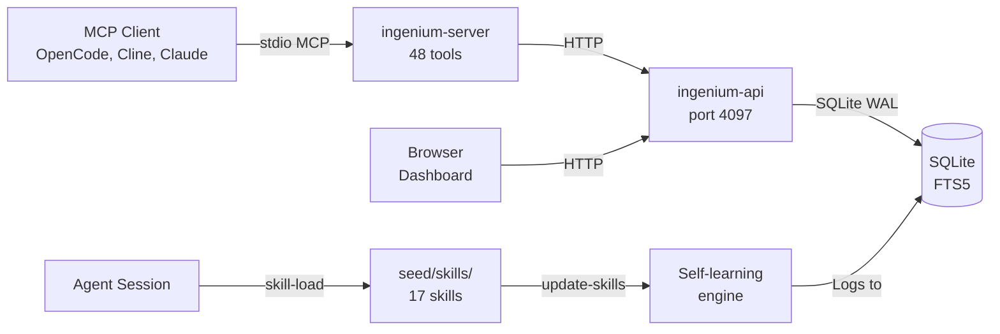

<div align="center">


# Ingenium

### All your AI agent development tools in one place. One MCP server, hundreds of tools.

<p>
  
  
  
</p>

---

</div>

**Ingenium** is a self-learning AI agent skill system and MCP server. It provides skills, learnings, tasks, context, plugins, and server management through a single MCP stdio transport, with a Next.js dashboard for visual management.

Connect any MCP-compatible client (OpenCode, Cline, Claude Desktop) to `ingenium-server` and instantly gain access to 48 tools spanning project management, skill management, task boards, full-text knowledge search, plugin lifecycle, agent management, server configuration, and settings. Every tool is backed by SQLite with WAL mode and FTS5 full-text search.

**The system learns from you.** Patterns you teach, conventions you establish, and decisions you make are stored in a searchable knowledge base. The `update-skills` agent autonomously detects new dependencies, repeated patterns, missing coverage, and stale content — creating, updating, or retiring skills as your codebase evolves. Every change is logged with before/after commit hashes for full auditability.

Six dashboard pages provide visual management for every feature. Each page is a standalone feature with its own documentation.

## Quick Start

```bash
# Prerequisites: Node.js 22+, npm

# Clone and install dependencies
git clone https://github.com/jtmb/ingenium.git
cd ingenium
npm install

# Start all services (API on :4097, dashboard on :3000, MCP server on stdio)
./run.sh dev

# Or use Docker
docker compose up --build
```

**OpenCode global MCP config** — Add this entry to `~/.config/opencode/opencode.jsonc` to make Ingenium available across all your projects:

```jsonc
{
  "mcp": {
    "servers": {
      "ingenium": {
        "command": ["node", "/path/to/ingenium/services/ingenium-server/dist/scripts/mcp-server.js"],
        "disabled": false,
        "env": {
          "INGENIUM_API_URL": "http://localhost:4097/api/v1",
          "INGENIUM_API_TIMEOUT": "10000",
          "LOG_LEVEL": "info"
        }
      }
    }
  }
}
```

**Other MCP clients** — Point your client's `command` to `node /path/to/ingenium/services/ingenium-server/dist/scripts/mcp-server.js`. The server speaks stdio MCP with 48 tools. No HTTP port, no network config.

**Open the dashboard** — Navigate to `http://localhost:3000` in your browser. The Next.js dashboard provides visual management for all six feature areas.

## Features

### 📁 Projects
Multi-project configuration with name→UUID resolution and per-project SQLite databases. Manage project identities, switch between active projects, and keep knowledge isolated per project.
→ [docs/HOW-TO/projects.md](docs/HOW-TO/projects.md)

### 📚 Skills
AI agent conventions engine — 17 skills covering debugging, testing, security, API design, containers, Kubernetes, SQL, TypeScript, Go, Rust, Python, Next.js, and more. Each skill is a self-contained split-skill format (SKILL.md + metadata.json + references/) stored at `seed/skills/` (canonical source) and `.opencode/skills/` (written to disk from DB). Skills are loaded from the SQLite database via the MCP server and auto-invoked based on file type, framework detection, and slash commands. The `file_tree` column stores a JSON map of relative paths → content for complete data round-trips.
→ [docs/HOW-TO/skills.md](docs/HOW-TO/skills.md)

### 🧠 Learnings
Self-improving knowledge base with FTS5 full-text search, type/tag categorization, and before/after commit hashes. Every decision, pattern discovery, and bug fix is automatically logged. An automated pipeline (OpenCode plugin at `.opencode/plugins/learnings.ts`) reads pending learnings from the API, classifies them (add-pattern/update-rule/noop), and edits skill files. Learnings are DB-only with a file fallback at `.opencode/skills/learnings.md`.
→ [docs/HOW-TO/learnings.md](docs/HOW-TO/learnings.md)

### 📋 Tasks
Kanban-style task board with `todo` → `in_progress` → `review` → `done` workflow, dependency tracking, priority scoring, and full audit history. Tasks can be created, assigned, moved, linked, and archived. The kaban MCP server provides 20+ tools for task management directly from your AI agent.
→ [docs/HOW-TO/tasks.md](docs/HOW-TO/tasks.md)

### 🔌 Plugins
OpenCode plugin lifecycle management — enable, disable, configure plugins that extend the MCP server's capabilities. Plugin state is persisted across restarts with auto-config sync between DB and `opencode.json`.
→ [docs/HOW-TO/plugins.md](docs/HOW-TO/plugins.md)

### 🖥️ Servers
MCP server configuration and proxy engine — start, stop, configure MCP servers from the dashboard. The server proxy routes client requests to the appropriate backend, handling lifecycle and configuration.
→ [docs/HOW-TO/servers.md](docs/HOW-TO/servers.md)

## Architecture

```
ingenium/
├── packages/
│   └── ingenium-core/        # Shared library: SQLite WAL + FTS5, 8 tool modules, Zod schemas
├── services/
│   ├── ingenium-api/          # Express REST gateway on port 4097. Sole database authority.
│   ├── ingenium-server/       # MCP stdio server with 48 tools. Calls API via HTTP. Zero DB access.
│   └── ingenium-dashboard/    # Next.js 16 App Router frontend with 10 feature pages. Calls API via HTTP.
├── seed/
│   ├── skills/                # 17 canonical skill sources in split-skill format (SKILL.md + metadata.json + references/)
│   └── plugins/               # 4 seed plugins (.ts files)
├── .opencode/
│   ├── skills/                # Skills written to disk from DB (split-skill format)
│   ├── plugins/               # Plugin .ts files synced from DB
│   └── agents/                # Agent .md files synced from DB
├── docs/                      # Project documentation database
├── run.sh                     # Unified dev/test/build/check/seed runner
├── docker-compose.yml         # Single-container deployment (supervisord: API + dashboard + opencode-server)
└── Dockerfile                 # Multi-stage build for containerised deployment
```

**Data flow:** The MCP server (`ingenium-server`) accepts stdio MCP protocol and forwards requests as HTTP to the API (`ingenium-api`), which is the sole database authority. The dashboard (`ingenium-dashboard`) also calls the API via HTTP. This ensures consistent data access — the database is never accessed directly by the MCP server or frontend.



## Documentation

| Doc | Purpose |
|-----|---------|
| [docs/ARCHITECTURE.md](docs/ARCHITECTURE.md) | Project structure, data flow, key components |
| [docs/TECH-STACK.md](docs/TECH-STACK.md) | Dependencies, versions, why each was chosen |
| [docs/CONVENTIONS.md](docs/CONVENTIONS.md) | Naming, file organization, error handling |
| [docs/VARIABLES.md](docs/VARIABLES.md) | All environment variables with defaults |
| [docs/agents.md](docs/agents.md) | Agent profiles and pipeline lifecycle |
| [docs/HOW-TO/projects.md](docs/HOW-TO/projects.md) | Project management feature guide |
| [docs/HOW-TO/skills.md](docs/HOW-TO/skills.md) | Skill system usage and file_tree format |
| [docs/HOW-TO/learnings.md](docs/HOW-TO/learnings.md) | Knowledge base and self-learning pipeline |
| [docs/HOW-TO/tasks.md](docs/HOW-TO/tasks.md) | Kanban task board feature guide |
| [docs/HOW-TO/plugins.md](docs/HOW-TO/plugins.md) | Plugin lifecycle management guide |
| [docs/HOW-TO/servers.md](docs/HOW-TO/servers.md) | MCP server configuration guide |
| [docs/HOW-TO/settings.md](docs/HOW-TO/settings.md) | Settings management guide |
| [USAGE.md](./USAGE.md) | Dashboard user guide and API access reference |
| [AGENTS.md](./AGENTS.md) | Skill system protocol — agent entry point |
| [services/ingenium-dashboard/STYLING-GUIDE.md](./services/ingenium-dashboard/STYLING-GUIDE.md) | Dashboard styling conventions and component design |

## Development

```bash
./run.sh dev         # Start all services in dev mode
./run.sh dev api     # Start only the API service
./run.sh dev server  # Start only the MCP server
./run.sh dev dashboard  # Start only the dashboard

./run.sh test        # Run all tests
./run.sh check       # Type-check and lint all packages
./run.sh build       # Build all packages for production
```
