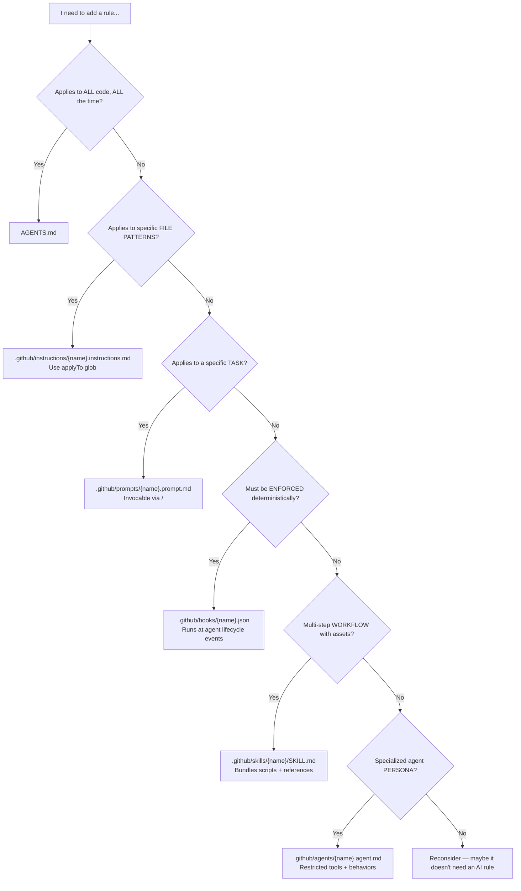

# USAGE.md — How to Apply and Maintain AI Rules

This is your handbook for working with the layered agent instruction system. When you think *"I need to add a rule, where does it go?"* — start here.

---

## Quick-Start: Set Up the Hook (do this once)

This repo is consumed as a hook. Configure it once in your VS Code Copilot user settings, and every project auto-bootstraps.

Add this to your VS Code Copilot user settings (`github.copilot.chat.agent.hooks`):

```json
{
  "SessionStart": [
    {
      "command": "if [ ! -f AGENTS.md ]; then bash <(curl -fsSL https://raw.githubusercontent.com/jtmb/copilot-ai-bootstrap/main/.github/scripts/hook-bootstrap.sh); fi",
      "timeout": 30
    }
  ]
}
```

Now open any project, start a Copilot chat, and the hook auto-boostraps it.

**What you get (in every project):**
- `AGENTS.md` — core conventions (13 sections: docs, comments, tests, DRY, security, error handling, config, more)
- `.github/instructions/always-read-agents.instructions.md` — forces AI to read AGENTS.md before every code change
- `.github/instructions/{framework}.instructions.md` — framework-specific rules (auto-detected from 5 supported frameworks)
- `.github/instructions/containers.instructions.md` — Docker/Compose conventions (multi-stage, non-root, HEALTHCHECK)
- `.github/instructions/shell.instructions.md` — Shell script safety & portability (`set -euo pipefail`, quoting, traps)
- `.github/instructions/sql.instructions.md` — SQL & migration best practices (parameterized queries, indexing, N+1)
- `.github/instructions/api-design.instructions.md` — REST API design conventions (status codes, pagination, idempotency)
- `.github/instructions/k8s.instructions.md` — Kubernetes/Helm conventions (security context, probes, resources)
- `.github/instructions/typescript.instructions.md` — Standalone TypeScript rules (strict config, type safety, async patterns)
- `.github/instructions/generic.instructions.md` — fallback for any file not covered
- `.github/prompts/` — 3 slash commands (`/generate-docs`, `/repo-context`, `/write-docs`)
- `docs/` — pre-seeded documentation templates (ARCHITECTURE.md, TECH-STACK.md, CONVENTIONS.md)
- `USAGE.md` — this file

---

## Quick-Start: Manual Bootstrap (no hooks)

If you can't use hooks, bootstrap manually:

```bash
# One-liner — clone and bootstrap in one go
git clone --depth 1 https://github.com/jtmb/copilot-ai-bootstrap.git && \
  ./copilot-ai-bootstrap/.github/scripts/bootstrap.sh --framework python --project-name my-backend /path/to/project

# Or interactive mode
./copilot-ai-bootstrap/.github/scripts/bootstrap.sh /path/to/project
```

For an existing project with code already:

```bash
# Auto-detect framework and bootstrap non-interactively
copilot-ai-bootstrap/.github/scripts/bootstrap.sh --auto --framework python /path/to/existing-project
```

Pro tip: `.github/scripts/hook-bootstrap.sh` handles the auto-detection for you even in manual mode:

```bash
bash copilot-ai-bootstrap/.github/scripts/hook-bootstrap.sh --framework nextjs
```

---

## Decision Tree: Where Do I Put This Rule?

Use this flowchart to determine which file type a new rule belongs in.



### Quick Reference Table

| Intent | File Type | Location | Has Frontmatter? |
|--------|-----------|----------|------------------|
| "All code must have comments" | Core rule | `AGENTS.md` | No |
| "Python files must use type hints" | Framework instruction | `.github/instructions/python.instructions.md` | Yes (`applyTo`) |
| "Generate test cases for this file" | Prompt | `.github/prompts/gen-tests.prompt.md` | Yes (`description`) |
| "Block `rm -rf` without approval" | Hook | `.github/hooks/pre-tool-use.json` | N/A (JSON) |
| "Full database migration workflow" | Skill | `.github/skills/db-migrate/SKILL.md` | Yes (`name`, `description`) |
| "Code review specialist" | Agent | `.github/agents/code-reviewer.agent.md` | Yes (`description`, `tools`) |

---

## Directory Structure Reference

```
your-project/
├── AGENTS.md                                    ← Core conventions (framework-agnostic, always loaded)
├── USAGE.md                                     ← This file — how to use and maintain rules
├── README.md                                    ← Project overview (hand-written)
├── docs/                                        ← Pre-seeded documentation database
│   ├── README.md                                ←   Index of all docs (AI-discoverable)
│   ├── ARCHITECTURE.md                          ←   Project structure & data flow
│   ├── TECH-STACK.md                            ←   Dependencies & version decisions
│   └── CONVENTIONS.md                           ←   Naming, patterns, file organization
├── .github/
│   ├── instructions/                            ← File-scoped rules (applyTo globs)
│   │   ├── always-read-agents.instructions.md   ←   Forces AGENTS.md re-read before every change
│   │   ├── nextjs.instructions.md               ←   Next.js/TypeScript conventions
│   │   ├── python.instructions.md               ←   Python conventions
│   │   ├── go.instructions.md                   ←   Go conventions
│   │   ├── rust.instructions.md                 ←   Rust conventions
│   │   ├── containers.instructions.md           ←   Docker/Compose conventions
│   │   ├── shell.instructions.md                ←   Shell script conventions
│   │   ├── sql.instructions.md                  ←   SQL & migration conventions
│   │   ├── api-design.instructions.md           ←   REST API design conventions
│   │   ├── k8s.instructions.md                  ←   Kubernetes/Helm conventions
│   │   ├── typescript.instructions.md           ←   Standalone TypeScript conventions
│   │   ├── generic.instructions.md              ←   Fallback for any file type
│   │   └── {project-name}.instructions.md       ←   Your project-specific rules
│   ├── prompts/                                 ← Task templates (invocable via /)
│   │   ├── repo-context.prompt.md               ←   System identity & docs map
│   │   ├── generate-docs.prompt.md              ←   Fill docs/ from codebase scan
│   │   └── write-docs.prompt.md                 ←   Write READMEs, API docs, ADRs
│   ├── hooks/                                   ← Deterministic enforcement (JSON)
│   │   ├── session-start.json                   ←   Auto-bootstrap on Copilot session start
│   │   ├── pre-tool-use.json                    ←   Validate before tool calls
│   │   └── post-tool-use.json                   ←   Auto-lint after file edits
│   ├── skills/                                  ← Multi-step workflows with assets
│   │   └── {skill-name}/
│   │       └── SKILL.md                         ←   Skill body + reference links
│   ├── agents/                                  ← Custom agent personas
│   │   └── {agent-name}.agent.md                ←   Agent with restricted tools
│   └── workflows/                               ← CI enforcement
│       └── ci.yml                               ←   Lint, test, build on push/PR
```

---

## Step-by-Step Guides

### Add a New Framework Overlay

Adding support for a new language or framework (e.g., Ruby, Elixir, Zig):

1. **Create the instruction file** at `.github/instructions/{framework}.instructions.md`:
   ```yaml
   ---
   description: "Use when working with {Framework} files. Covers conventions, build commands, and testing."
   applyTo: "**/*.{extensions}"
   ---
   # {Framework} Conventions
   ...
   ```

2. **Add the framework** to the table in this `USAGE.md` (Framework Support Table section at bottom).

3. **Update `bootstrap.sh`** — add the framework to the `--framework` flag's accepted values.

4. **Update `docs/TECH-STACK.md`** if relevant.

5. **Test**: `./bootstrap.sh --dry-run --framework {name} /tmp/test` — verify the correct files are selected.

### Add a Project-Specific Rule

When your project has a rule that isn't framework-generic (e.g., "never import X in Y layer"):

1. **Identify the right primitive** using the decision tree above.

2. **Create the file** in the correct `.github/` subdirectory with proper frontmatter:
   - Instructions: `description` + `applyTo` (scope tightly!)
   - Prompts: `description` (keyword-rich for discovery)
   - Skills: `name` (must match folder) + `description`
   - Agents: `description` + `tools`
   - Hooks: valid JSON with `type: "command"`

3. **Scope `applyTo` tightly** — prefer `"src/api/**/*.ts"` over `"**"`. Broad globs burn context and may conflict with other rules.

4. **Add to the docs map** — if the rule is significant, add an entry in `docs/ARCHITECTURE.md` or `docs/CONVENTIONS.md`.

5. **Validate frontmatter** — YAML between `---` markers, no unescaped colons, tabs instead of spaces. Silent failures happen with bad frontmatter.

### Modify Core Rules

When you need to change a rule in `AGENTS.md`:

1. **Read `AGENTS.md`** — understand the current rule set.

2. **Check all framework overlays** for conflicts. A change to the "test before done" core rule should not contradict a framework overlay's test command.

3. **Make the change** to `AGENTS.md`.

4. **Update any affected framework overlays** — if you changed a generalized concept, ensure each overlay still makes sense.

5. **Update `docs/CONVENTIONS.md`** if the change affects project conventions.

6. **Run verification**: check that the new rule doesn't create impossible requirements when combined with an overlay.

### Add a New Prompt or Skill

1. **Prompt** (single task, no assets):
   ```markdown
   ---
   description: "Generate X from Y. Use when..."
   ---
   # Task Name
   Instructions for the AI...
   ```
   Place in `.github/prompts/{name}.prompt.md`. Test by typing `/` in VS Code chat.

2. **Skill** (multi-step, has scripts/templates):
   ```
   .github/skills/{skill-name}/
   ├── SKILL.md           ← name must match folder
   ├── scripts/           ← executable code
   └── references/        ← docs loaded as needed
   ```
   The `SKILL.md` `name` field MUST match the folder name. Test by typing `/` in chat.

---

## Common Pitfalls

| Pitfall | Why It Happens | Fix |
|---------|---------------|-----|
| **`applyTo: "**"` on narrow rules** | Defaulting to "all files" out of caution | Use specific globs: `**/*.py`, `src/api/**` |
| **YAML frontmatter silent failure** | Unescaped colons, tabs, missing `---` fences | Always quote descriptions with colons; use spaces not tabs |
| **Mixing concerns in one file** | "I'll just add this here..." | One concern per file — separate testing rules from styling rules |
| **Contradictory rules** | Core says "run tests", overlay says "skip tests in CI" | Check all layers when adding any rule |
| **Forgetting `description`** | Instructions load by `applyTo` so description seems optional | Description is the discovery surface for on-demand loading — always include it |
| **`name` mismatch in SKILL.md** | Renamed folder but not `name` field | `name` must match folder exactly; mismatch = skill won't load |
| **Duplicating docs in instructions** | Copying README content into instruction files | Link to docs instead: `See docs/TESTING.md for conventions` |
| **Too many tools on agents** | "Just in case" tool assignment | Only assign tools the agent's role actually needs — excess dilutes focus |

---

## Monorepo Setup

For repositories with multiple languages/frameworks (e.g., Next.js frontend + Python backend):

```
monorepo/
├── AGENTS.md                                    ← Generic core rules only
├── frontend/
│   └── AGENTS.md                                ← (optional) frontend-specific additions
├── backend/
│   └── AGENTS.md                                ← (optional) backend-specific additions
├── .github/
│   └── instructions/
│       ├── always-read-agents.instructions.md   ← applyTo: "**" (whole repo)
│       ├── nextjs.instructions.md               ← applyTo: "frontend/**/*.{tsx,ts}"
│       ├── python.instructions.md               ← applyTo: "backend/**/*.py"
│       └── generic.instructions.md              ← applyTo: "**" (fallback)
```

Key: tighten `applyTo` paths to the relevant directory so Python rules don't fire on the frontend and Next.js rules don't fire on the backend.

---

## User-Level vs Project-Level Rules

| Scope | Location | Use For |
|-------|----------|---------|
| **Project** (team-shared) | `.github/` in the repo | Rules everyone on the team should follow |
| **User** (personal) | `{{VSCODE_USER_PROMPTS_FOLDER}}/` | Personal preferences that roam across all your projects |

User-level examples: "I prefer single quotes", "Always use async/await over .then()", "Never suggest class components in React". These belong in your user profile, not in every project's `.github/`.

---

## Framework Support Table

| Framework | File | `applyTo` | Sections Covered |
|-----------|------|-----------|------------------|
| Next.js | `nextjs.instructions.md` | `**/*.{tsx,ts,jsx,js,css}` | Build/Test, Component Architecture, Global CSS, App Router, Secure Coding, Testing & QA, Naming |
| Python | `python.instructions.md` | `**/*.py` | Build/Test, Type Hints, Docstrings, Project Structure, Testing, Code Quality, Imports, Secure Coding, Naming |
| Go | `go.instructions.md` | `**/*.go` | Build/Test, Comments, Error Handling, Project Layout, Testing, Concurrency, General Practices, Secure Coding, Naming |
| Rust | `rust.instructions.md` | `**/*.rs` | Build/Test, Documentation, Error Handling, Project Layout, Ownership, Testing, Clippy, General Practices, Secure Coding, Naming |
| Containers | `containers.instructions.md` | `**/{Dockerfile,Containerfile,docker-compose*,.dockerignore}` | Multi-stage builds, Non-root user, Layer caching, .dockerignore, Digest pinning, HEALTHCHECK, Signal handling, Secrets hygiene, Image size, Compose conventions |
| Shell | `shell.instructions.md` | `**/*.{sh,bash}` | set -euo pipefail, Quoting, Error handling, Temp files, Portability, Secrets, Organization |
| SQL | `sql.instructions.md` | `**/*.sql` | Parameterized queries, Migration safety, Indexing, Connection pooling, Transactions, N+1 prevention, Query performance, Schema design |
| API Design | `api-design.instructions.md` | `**/{routes,handlers,api,controllers,endpoints}/**/*.{ts,js,py,go,rs,java,rb}` | Status codes, Error shape, Versioning, Auth, Pagination, Rate limiting, Idempotency, HTTP methods |
| Kubernetes | `k8s.instructions.md` | `**/{k8s,kubernetes,helm,charts,templates}/**/*.{yaml,yml}` | Security context, Resource limits, Probes, Network policies, Labels, Deployments, Services, Ingress, ConfigMaps, Helm |
| TypeScript | `typescript.instructions.md` | `**/*.{ts,tsx}` | Strict config, Type safety, Error handling, Async patterns, Module system, Node.js conventions, Testing, Styling |
| Generic | `generic.instructions.md` | `**` | Enforces AGENTS.md core rules (docs, comments, testing, DRY, secure coding, project structure, naming) |

To contribute a new framework, see "Add a New Framework Overlay" above.
