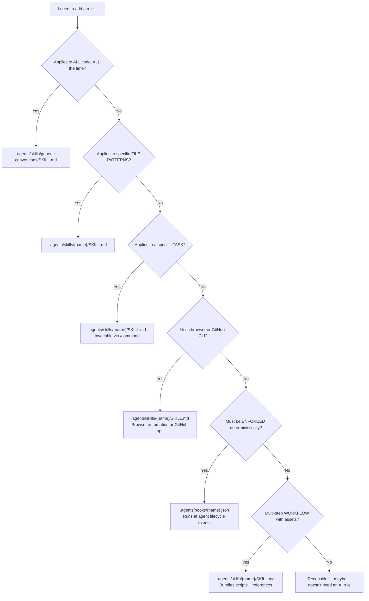

# USAGE.md — How to Apply and Maintain AI Rules

This is your handbook for working with the layered agent instruction system. When you think *"I need to add a rule, where does it go?"* — start here.

---

## Quick Start

See **[Getting Started](./README.md#getting-started)** in the README for installation options:

- **Quick Install (one-liner)** — curl/tar from GitHub
- **Auto-Bootstrap (set up the hook)** — one-time hook, auto-bootstraps every project you open
- **Manual Install** — clone and copy `deploy/`
- **Manual Bootstrap (with framework detection)** — smart setup with `bootstrap.sh`

**What you get in every project:** the full `.agents/skills/` (45 items total), `AGENTS.md`, `SKILL-INDEX.md`, `docs/` templates, and hooks — all auto-detected to match your framework.

---

## Decision Tree: Where Do I Put This Rule?

Use this flowchart to determine which file type a new rule belongs in.



### Quick Reference Table

| Intent | File Type | Location | Has Frontmatter? |
|--------|-----------|----------|------------------|
| "All code must have comments" | Core rule | `.agents/skills/generic-conventions/SKILL.md` | Yes (`name`, `description`) |
| "Python files must use type hints" | Framework skill | `.agents/skills/python-conventions/SKILL.md` | Yes (`name`, `description`) |
| "Generate test cases for this file" | Task instruction | `.agents/skills/gen-tests/SKILL.md` | Yes (`name`, `description`) |
| "Use Playwright to test the UI" | Browser tool | `.agents/skills/playwright-mcp/SKILL.md` | Yes (`name`, `description`) |
| "Block `rm -rf` without approval" | Hook | `.agents/hooks/pre-tool-use.json` | N/A (JSON) |
| "Full database migration workflow" | Domain skill | `.agents/skills/sql-database/SKILL.md` | Yes (`name`, `description`) |

---

## Directory Structure Reference

```
your-project/
├── USAGE.md                                     ← This file — how to use and maintain rules
├── README.md                                    ← Project overview (hand-written)
├── docs/                                        ← Pre-seeded documentation database
│   ├── README.md                                ←   Index of all docs (AI-discoverable)
│   ├── ARCHITECTURE.md                          ←   Project structure & data flow
│   ├── TECH-STACK.md                            ←   Dependencies & version decisions
│   └── CONVENTIONS.md                           ←   Naming, patterns, file organization
├── .agents/
│   ├── skills/                                  ← ALL conventions (45 items)
│   │   ├── generic-conventions/
│   │   │   └── SKILL.md                         ←   Fallback for any file type
│   │   ├── nextjs-conventions/
│   │   │   └── SKILL.md                         ←   Next.js/TypeScript conventions
│   │   ├── python-conventions/
│   │   │   └── SKILL.md                         ←   Python conventions
│   │   ├── go-conventions/
│   │   │   └── SKILL.md                         ←   Go conventions
│   │   ├── rust-conventions/
│   │   │   └── SKILL.md                         ←   Rust conventions
│   │   ├── containers/
│   │   │   └── SKILL.md                         ←   Docker/Compose conventions
│   │   ├── shell-scripts/
│   │   │   └── SKILL.md                         ←   Shell script conventions
│   │   ├── sql-database/
│   │   │   └── SKILL.md                         ←   SQL & migration conventions
│   │   ├── api-design/
│   │   │   └── SKILL.md                         ←   REST API design conventions
│   │   ├── kubernetes/
│   │   │   └── SKILL.md                         ←   Kubernetes/Helm conventions
│   │   ├── typescript-standalone/
│   │   │   └── SKILL.md                         ←   Standalone TypeScript conventions
│   │   ├── skill-load/
│   │   │   └── SKILL.md                         ←   Session bootstrap protocol
│   │   ├── repo-context/
│   │   │   └── SKILL.md                         ←   Project context overview
│   │   ├── update-skills/
│   │   │   └── SKILL.md                         ←   Self-improvement pipeline
│   │   ├── audit-skills/
│   │   │   └── SKILL.md                         ←   Consistency audit
│   │   ├── debugging-patterns/
│   │   │   └── SKILL.md                         ←   Systematic debugging
│   │   ├── local-model-commands/
│   │   │   └── SKILL.md                         ←   Terminal safety for local LLMs
│   │   ├── self-correction-patterns/
│   │   │   └── SKILL.md                         ←   AI recovery patterns
│   │   ├── generate-docs/
│   │   │   └── SKILL.md                         ←   Populate docs/ from codebase
│   │   ├── write-docs/
│   │   │   └── SKILL.md                         ←   Write READMEs, API docs, ADRs
│   │   ├── update-skill-index/
│   │   │   └── SKILL.md                         ←   Regenerate SKILL-INDEX.md
│   │   ├── thread-auto-context/
│   │   │   └── SKILL.md                         ←   Persistent memory
│   │   ├── chrome-devtools/
│   │   │   └── SKILL.md                         ←   Browser debugging/screenshots
│   │   ├── playwright-mcp/
│   │   │   └── SKILL.md                         ←   Playwright automation
│   │   ├── gh-cli/
│   │   │   └── SKILL.md                         ←   GitHub CLI operations
│   │   ├── github-issues/
│   │   │   └── SKILL.md                         ←   GitHub issue management
│   │   ├── web-design-reviewer/
│   │   │   └── SKILL.md                         ←   UI/UX inspection
│   │   ├── vision-bridge/
│   │   │   └── SKILL.md                         ←   Vision model bridge
│   │   ├── onboard-existing-repo/
│   │   │   └── SKILL.md                         ←   Repo onboarding
│   │   └── ... (45 total)
│   ├── hooks/                                   ← Deterministic enforcement (JSON)
│   │   ├── session-start.json                   ←   Auto-bootstrap on Copilot session start
│   │   ├── pre-tool-use.json                    ←   Validate before tool calls
│   │   └── post-tool-use.json                   ←   Auto-lint after file edits
│   └── scripts/                                 ← Bootstrap engine
│       └── bootstrap.sh                         ←   Scaffold projects with selected skills
```

---

## Step-by-Step Guides

### Add a New Framework Skill

Adding support for a new language or framework (e.g., Ruby, Elixir, Zig):

1. **Create the skill directory** at `.agents/skills/{framework}-conventions/`:
   ```yaml
   ---
   name: {framework}-conventions
   description: "Use when working with {Framework} files. Covers conventions, build commands, and testing."
   ---
   # {Framework} Conventions
   ...
   ```

2. **Add the framework** to the table in this `USAGE.md`.

3. **Update `bootstrap.sh`** — add the skill to the framework-specific overlay section.

4. **Update `docs/TECH-STACK.md`** if relevant.

5. **Test**: `./bootstrap.sh --dry-run --framework {name} /tmp/test` — verify the correct files are selected.

### Add a New Task Instruction or Tool

For task skills (like update-skills, generate-docs) or tools (like chrome-devtools, gh-cli):

1. **Create the directory** at `.agents/skills/{name}/SKILL.md`.

2. **Use proper frontmatter** (same format as skills):
   ```yaml
   ---
   name: {name}
   description: "What this skill does and when to use it"
   ---
   ```

3. **For tools**, ensure any MCP or tool references are documented in the SKILL.md.

4. **Update `bootstrap.sh`** if the new item should be deployable.

5. **Update the relevant tables** in `USAGE.md` and `SKILL-INDEX.md`.

### Add a Project-Specific Rule

When your project has a rule that isn't framework-generic (e.g., "never import X in Y layer"):

1. **Identify the right primitive** using the decision tree above.

2. **Create the skill** in `.agents/skills/{name}/SKILL.md` with proper frontmatter:
   - `name` (must match folder name)
   - `description` (keyword-rich for discovery)

3. **For hooks**: valid JSON with `type: "command"`.

4. **Add to the docs map** — if the rule is significant, add an entry in `docs/ARCHITECTURE.md` or `docs/CONVENTIONS.md`.

6. **Validate frontmatter** — YAML between `---` markers, no unescaped colons, spaces (not tabs). Silent failures happen with bad frontmatter.

### Modify Core Rules

When you need to change a core rule in `.agents/skills/generic-conventions/SKILL.md`:

1. **Read `generic-conventions`** — understand the current rule set.

2. **Check all framework skills** for conflicts. A change to the "test before done" core rule should not contradict a framework skill's test command.

3. **Make the change** to `generic-conventions/SKILL.md`.

4. **Update any affected framework skills** — if you changed a generalized concept, ensure each skill still makes sense.

5. **Update `docs/CONVENTIONS.md`** if the change affects project conventions.

6. **Run verification**: check that the new rule doesn't create impossible requirements when combined with a skill.

### Add a New Skill

Skills are the primary mechanism for adding conventions and tasks. Choose the right directory:

| Category | Location | Example |
|----------|----------|---------|
| Framework/domain convention | `.agents/skills/{name}/` | `.agents/skills/ruby-conventions/SKILL.md` |
| Task skill (invocable via command) | `.agents/skills/{name}/` | `.agents/skills/db-migrate/SKILL.md` |
| Browser/GitHub tool | `.agents/skills/{name}/` | `.agents/skills/my-browser-tool/SKILL.md` |

1. **Create the directory** with a `SKILL.md` file:

   ```yaml
   ---
   name: {skill-name}
   description: "What this skill does and when to use it"
   ---
   # Skill Title
   Instructions for the AI...
   ```

2. **For complex skills** (multi-step, has scripts/templates):
   ```
   .agents/skills/{skill-name}/
   ├── SKILL.md           ← name must match folder
   ├── scripts/           ← executable code
   └── references/        ← docs loaded as needed
   ```
   The `SKILL.md` `name` field MUST match the folder name. Test by typing `/` in chat.

---

## Common Pitfalls

| Pitfall | Why It Happens | Fix |
|---------|---------------|-----|
| **Missing `description` in SKILL.md** | Forgot to add frontmatter | Always include `name` and `description` frontmatter |
| **YAML frontmatter silent failure** | Unescaped colons, tabs, missing `---` fences | Always quote descriptions with colons; use spaces not tabs |
| **Mixing concerns in one file** | "I'll just add this here..." | One concern per skill — separate testing rules from styling rules |
| **Contradictory rules** | Core says "run tests", overlay says "skip tests in CI" | Check all skills when adding any rule |
| **`name` mismatch in SKILL.md** | Renamed folder but not `name` field | `name` must match folder exactly; mismatch = skill won't load |
| **Duplicating docs in skills** | Copying README content into skill files | Link to docs instead: `See docs/TESTING.md for conventions` |

---

## Monorepo Setup

For repositories with multiple languages/frameworks (e.g., Next.js frontend + Python backend):

```
monorepo/
├── .agents/
│   └── skills/
│       ├── nextjs-conventions/
│       │   └── SKILL.md
│       ├── python-conventions/
│       │   └── SKILL.md
│       └── generic-conventions/
│           └── SKILL.md
```

Key: the `generic-conventions` skill covers the whole repo. Framework skills are invoked when editing matching files.

---

## User-Level vs Project-Level Rules

| Scope | Location | Use For |
|-------|----------|---------|
| **Project** (team-shared) | `.agents/` in the repo | Rules everyone on the team should follow |
| **User** (personal) | `{{VSCODE_USER_PROMPTS_FOLDER}}/` | Personal preferences that roam across all your projects |

User-level examples: "I prefer single quotes", "Always use async/await over .then()", "Never suggest class components in React". These belong in your user profile, not in every project's `.agents/`.

---

## Framework Skills

| Framework | Skill | Sections Covered |
|-----------|-------|------------------|
| Next.js | `nextjs-conventions` | Build/Test, Component Architecture, Global CSS, App Router, Secure Coding, Testing & QA, Naming |
| Python | `python-conventions` | Build/Test, Type Hints, Docstrings, Project Structure, Testing, Code Quality, Imports, Secure Coding, Naming |
| Go | `go-conventions` | Build/Test, Comments, Error Handling, Project Layout, Testing, Concurrency, General Practices, Secure Coding, Naming |
| Rust | `rust-conventions` | Build/Test, Documentation, Error Handling, Project Layout, Ownership, Testing, Clippy, General Practices, Secure Coding, Naming |

## Domain Skills

| Domain | Skill | Sections Covered |
|--------|-------|------------------|
| Containers | `containers` | Multi-stage builds, Non-root user, Layer caching, .dockerignore, Digest pinning, HEALTHCHECK, Signal handling, Secrets hygiene, Image size, Compose conventions |
| Shell | `shell-scripts` | `set -euo pipefail`, Quoting, Error handling, Temp files, Portability, Secrets, Organization |
| SQL | `sql-database` | Parameterized queries, Migration safety, Indexing, Connection pooling, Transactions, N+1 prevention, Query performance, Schema design |
| API Design | `api-design` | Status codes, Error shape, Versioning, Auth, Pagination, Rate limiting, Idempotency, HTTP methods |
| Kubernetes | `kubernetes` | Security context, Resource limits, Probes, Network policies, Labels, Deployments, Services, Ingress, ConfigMaps, Helm |
| TypeScript | `typescript-standalone` | Strict config, Type safety, Error handling, Async patterns, Module system, Node.js conventions, Testing, Styling |

The `generic-conventions` skill covers all other file types with 13 sections — docs, comments, testing, DRY, secure coding, error handling, configuration, naming, and more. For the full skill catalog, see [`SKILL-INDEX.md`](SKILL-INDEX.md).
