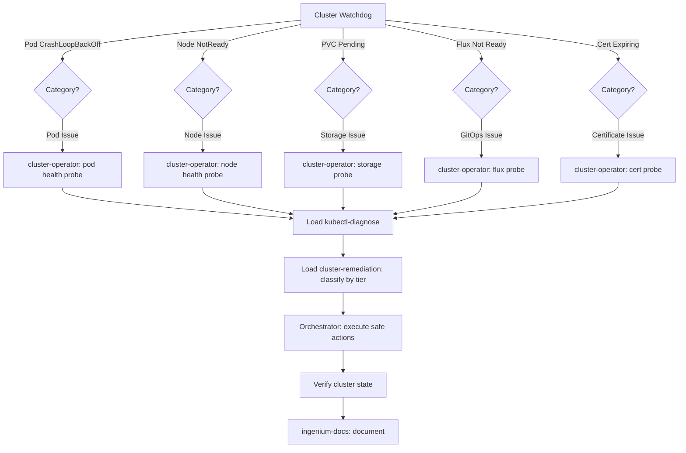
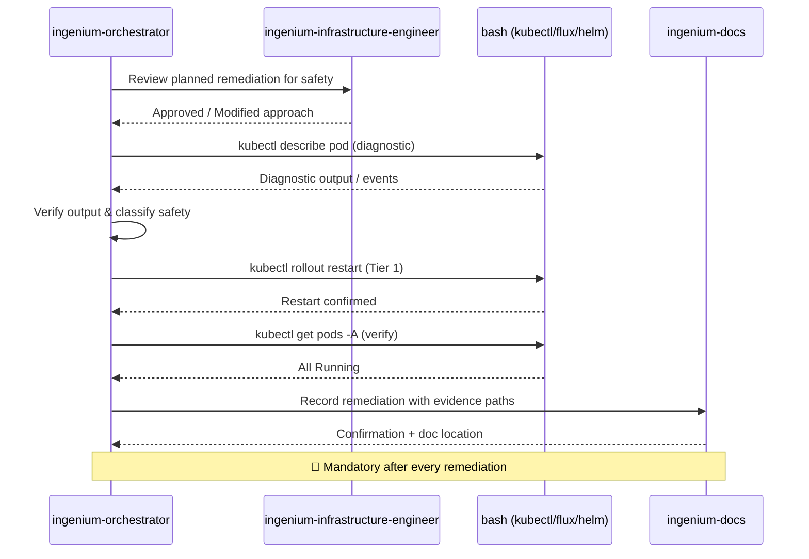
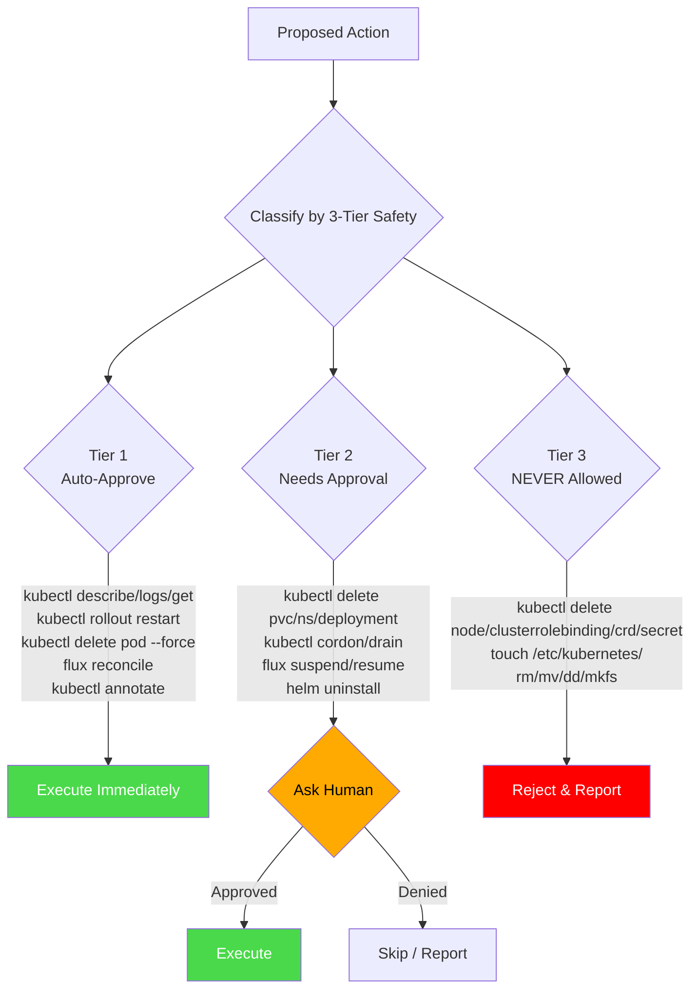

# Architecture

## Overview

**dev-ops** is an AI-driven Kubernetes cluster operations agent system built on the Ingenium skill framework. It provides a structured, safety-tiered methodology for autonomous cluster monitoring, diagnosis, and remediation — from health probe ingestion through verification and documentation. The system uses a team of specialized AI agents (8 total: 2 primary + 6 subagents) that coordinate through the OpenCode platform, backed by 46 skills (42 universal + 4 cluster-ops domain) that govern tool usage, safety classification, diagnostics, and operational conventions.

Key properties:
- **No runtime dependencies beyond kubectl/flux/helm/jq** — pure Markdown + YAML + shell scripts for the agent system
- **3-tier safety model** — strict classification of every action into auto-approve, needs-approval, or never-allowed
- **Discover-before-assume** — cluster state is discovered at runtime, never hardcoded
- **Evidence-driven** — every command output is captured and cited
- **Self-improving** — an `update-skills` detection pipeline identifies gaps and auto-creates skills

## Directory Map

```mermaid
graph TB
    ROOT[dev-ops/] --> AGENTS[AGENTS.md — Project rules]
    ROOT --> OCONFIG[opencode.json — OpenCode config]
    ROOT --> OA[.opencode/agents/ — 8 agent definitions]
    ROOT --> OP[.opencode/plugins/ — 3 lifecycle plugins]
    ROOT --> AS[.agents/ — Skill system core]
    ROOT --> VS[.vscode/ — Editor config]
    ROOT --> GH[.github/ — Deprecated]
    ROOT --> D[docs/ — Project documentation]

    OA --> PR[primary/]
    OA --> RS[research/]
    OA --> EX[execution/]
    OA --> SE[security/]

    PR --> PL[ingenium-planner.md — Mastermind, read-only]
    PR --> OR[ingenium-orchestrator.md — Executor, full R/W]

    RS --> EXP[ingenium-explore.md — Codebase search]
    RS --> SCT[ingenium-scout.md — Thread context]

    EX --> IE[ingenium-infrastructure-engineer.md — Infrastructure review]
    EX --> QA[ingenium-qa.md — Test authoring]
    EX --> DOC[ingenium-docs.md — Documentation & reports]

    SE --> SA[ingenium-security-auditor.md — Project security audit]

    AS --> SK[skills/ — 46 skills]
    AS --> HK[hooks/ — 3 lifecycle hooks]
    AS --> SCR[scripts/ — hook-bootstrap.sh]

    SK --> CORE[generic-conventions/ — Core rules]
    SK --> CO[cluster-operator/ — K8s monitoring & remediation]
    SK --> CR[cluster-remediation/ — 3-tier safety model]
    SK --> KD[kubectl-diagnose/ — Diagnostic commands]
    SK --> CLO[cluster-operations/ — Safety & discovery]
    SK --> K8S[kubernetes/ — K8s manifest conventions]
    SK --> REST[Other standard skills — 37 universal skills]

    D --> DA[docs/agents.md — Agent architecture]
    D --> DA2[docs/ARCHITECTURE.md — System architecture]
    D --> DTC[docs/TECH-STACK.md — Tools & dependencies]
    D --> DC[docs/CONVENTIONS.md — Safety & conventions]
    D --> DR[docs/README.md — Docs index]
```



## Key Components

### Skill System (`.agents/skills/`)

The core of the project. Every skill is a directory containing a single `SKILL.md` file with YAML frontmatter (`name`, `description`) and Markdown body. All 46 skills live under `.agents/skills/`:

| Tier | Pattern | Count | Examples |
|------|---------|-------|----------|
| **Core** | `generic-conventions` | 1 | Universal rules — docs, security, error handling, DRY |
| **Framework** | `*-conventions` | 5 | nextjs, python, go, rust, typescript-standalone |
| **Domain (universal)** | named by topic | ~28 | kubernetes, containers, api-design, sql-database, shell-scripts, useful-tests, etc. |
| **Cluster Ops Domain** | named by topic | 4 | cluster-operator, cluster-remediation, kubectl-diagnose, cluster-operations |
| **Task** | invocable via `/command` | ~14 | update-skills, audit-skills, generate-docs, write-docs, help, etc. |
| **Tool** | automation interfaces | ~5 | chrome-devtools, playwright-mcp, gh-cli, github-issues, web-design-reviewer |

All 46 skills are cross-referenced in `README.md` tables, `SKILL-INDEX.md`, and the mermaid diagram. The `audit-skills` skill validates consistency across all integration points.

### Agent Pipeline (`.opencode/agents/`)

8 custom agents defined for OpenCode: 2 primary (planner + orchestrator) and 6 subagents (explore, scout, infrastructure-engineer, qa, docs, security-auditor). See `docs/agents.md` for full architecture and workflow.

### Plugin System (`.opencode/plugins/`)

3 TypeScript plugins hook into OpenCode's lifecycle for deterministic enforcement:

| Plugin | Hook | Purpose |
|--------|------|---------|
| `session-start.ts` | `session.created` | Injects skill-loading checklist at session start |
| `pre-tool-use.ts` | `tool.execute.before` | Warns when bash commands target build/cache directories or deprecated paths |
| `post-tool-use.ts` | `tool.execute.after` | Tracks tool call count, reminds about documentation logging every 10 calls |

### Hooks System (`.agents/hooks/`)

3 lifecycle hooks provide deterministic enforcement and remediation tracking:

| Hook | When it fires | Purpose |
|------|--------------|---------|
| `session-start.json` | Session start | Inject abbreviated checklist, match skills, load them, note 🔴 HARD RULEs |
| `pre-tool-use.json` | Before every tool call | Validate terminal command safety, check safety tier, block Tier 3 actions |
| `post-tool-use.json` | After every ~10 tool calls | Periodic reminder to log findings, run `/update-skills`, check for skill gaps |

## Data Flow

### Rememdiation Lifecycle

```mermaid
flowchart LR
    HP[Health Probe Data] --> PL[ingenium-planner]
    PL --> PLAN[Remediation Plan]
    PLAN --> PH1{Phase 1: Diagnosis}
    PH1 -->|Pass| DIAG[Cluster Diagnosis]
    DIAG --> EVID1[Evidence: Pod Status / Node Conditions / Events]

    EVID1 --> PH2{Phase 2: Planning}
    PH2 -->|Pass| PLAN2[Detailed Remediation Plan]
    PLAN2 --> EVID2[Evidence: Safety Tiers / Topology Constraints]

    EVID2 --> PH3{Phase 3: Remediation}
    PH3 -->|Pass| REMEDIATE[Remediation Execution]
    REMEDIATE --> EVID3[Evidence: Actions Taken / Command Output]

    EVID3 --> PH4{Phase 4: Verification}
    PH4 -->|Pass| VERIFY[Cluster State Verification]
    VERIFY --> EVID4[Evidence: Post-Remediation Health / Events]

    EVID4 --> PH5{Phase 5: Reporting}
    PH5 -->|Pass| REPORT[Remediation Report / Docs Updated]
    REPORT --> FINDINGS[Learnings / Skill Updates]

    subgraph Orchestrator[ingenium-orchestrator]
        direction LR
        TOOLS[kubectl / flux / helm] --> OUTPUT[Command Output]
        OUTPUT --> VERIFY2[Safety Verification]
        VERIFY2 --> CAPTURE[Evidence Capture]
    end

    DIAG --> Orchestrator
    PLAN2 --> Orchestrator
    REMEDIATE --> Orchestrator
    VERIFY --> Orchestrator
```



### Health Probe Lifecycle



### Agent-to-Tool Flow



## Communication Patterns

The project operates entirely at edit time with no runtime communication between components:
- **AI reads skills** — The AI assistant scans `.agents/skills/` on startup and when tool types change
- **AI executes commands** — The orchestrator runs kubectl/flux/helm via bash and validates output
- **AI writes evidence** — `ingenium-docs` saves remediation reports; `update-skills` creates new skill files
- **Bootstrap copies** — `hook-bootstrap.sh` copies the skill system to new targets
- **Tests validate** — `test-self-improving.sh` runs as a bash script, not part of the AI loop

## 3-Tier Safety Architecture

The safety model is enforced at multiple levels:

| Level | Enforcement | Details |
|-------|-------------|---------|
| 1. Agent Instructions | Agent prompt rules | Each agent's `.md` file defines what it can/cannot do |
| 2. Skill System | `.agents/skills/` rules | `cluster-remediation/SKILL.md` defines the tier taxonomy |
| 3. VS Code Config | `.vscode/settings.json` | Auto-approves kubectl/flux/helm/jq at the tool permission level |
| 4. OpenCode Permissions | `opencode.json` | Read=allow, Edit=ask, Bash=allow — human must approve edits |

### Safety Tier Enforcement Flow



## External Dependencies

### Essential Runtime Tools
- **kubectl** — Primary Kubernetes interaction (describe, logs, get, delete, rollout)
- **flux** — GitOps reconciliation (get, reconcile, suspend, resume, trace)
- **helm** — Package management (list, history, uninstall)
- **jq** — JSON output parsing and filtering

### Agent System
- **OpenCode** — Agent orchestration platform
- **Thread MCP** — Persistent memory (cross-session context)
- **Bash 5.x** — Command execution and scripting

### Discovered at Runtime
- **Kubernetes cluster** (v1.25+) — Target environment
- **FluxCD v2.x** — GitOps operator
- **cert-manager** — TLS certificate management
- **Longhorn** — Distributed block storage (if installed)
- **CNI plugin** — Calico, Cilium, or Flannel (auto-detected)
- **Ingress controller** — Traefik, NGINX, or other (auto-detected)

## Deployment

The project is deployed by **bootstrapping** — running `hook-bootstrap.sh` against a target project or by copying the `deploy/` directory:

```bash
# Bootstrap a new cluster operations project
./.agents/scripts/hook-bootstrap.sh --auto /path/to/cluster-ops
```

The system structure is self-contained — the `.agents/` directory is the entire deployable unit:
- `.agents/skills/` — All 46 skills (copied)
- `.agents/hooks/` — 3 lifecycle hooks (copied)
- `AGENTS.md` — Project rules (copied)
- `opencode.json` — Configuration with `<PLACEHOLDER>` tokens (never real secrets)

**No external services required.** The system works fully offline with local tools and local LLMs.