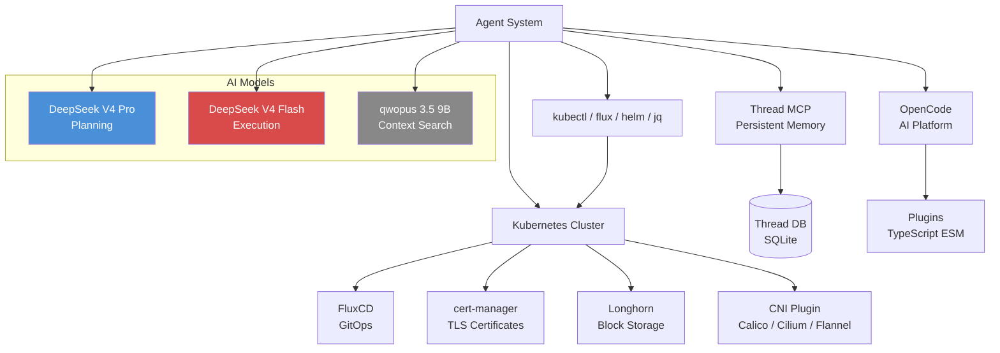

# Tech Stack

## Environment

| Component | Version / Spec | Notes |
|-----------|---------------|-------|
| **Target Cluster** | Kubernetes v1.25+ | Any distribution (kubeadm, EKS, AKS, GKE, K3s) |
| **Shell** | Bash 5.x | Default shell for all command execution |
| **OpenCode** | Latest | Agent orchestration platform (replaces GitHub Copilot as primary agent interface) |

## Core CLI Tools

| Tool | Installation | Purpose | Domain Skill |
|------|-------------|---------|-------------|
| `kubectl` | `apt install kubectl` or cloud CLI | Primary K8s interaction — describe, logs, get, delete, rollout | `kubectl-diagnose`, `cluster-operations` |
| `flux` | `curl -s https://fluxcd.io/install.sh \| bash` | GitOps reconciliation — get, reconcile, suspend, resume, trace | `cluster-operations` |
| `helm` | `apt install helm` | Package management — list, history, uninstall, upgrade | `cluster-operations` |
| `jq` | `apt install jq` | JSON output parsing and filtering from kubectl commands | `kubectl-diagnose` |

### Tool Auto-Approval Configuration

```json
{
    "chat.tools.terminal.autoApprove": {
        "kubectl": true,
        "flux": true,
        "helm": true,
        "jq": true
    }
}
```

These tools are auto-approved in `.vscode/settings.json` to enable rapid diagnosis without blocking on every command. Safety is enforced at the agent instruction level via the 3-tier safety model.

## Cluster Integrations

| Integration | Purpose | Discovery Method | Domain Skill |
|------------|---------|-----------------|-------------|
| **Kubernetes** | Target cluster environment | Runtime via kubectl (auto-discovered) | `cluster-operator` |
| **FluxCD v2.x** | GitOps reconciliation | `flux get sources git -A` (auto-discovered) | `cluster-operations` |
| **cert-manager** | TLS certificate management | `kubectl get certificates -A` (auto-discovered) | `cluster-operator` |
| **Longhorn** | Distributed block storage | `kubectl get volumes -n longhorn-system` (auto-discovered) | `cluster-operator` |
| **CNI Plugin** | Cluster networking (Calico/Cilium/Flannel) | `kubectl get pods -n kube-system \| grep -E 'calico\|flannel\|cilium'` | `cluster-operations` |
| **Ingress Controller** | HTTP routing (Traefik/NGINX) | `kubectl get ingressclasses` | `cluster-operations` |

## Agent Models

| Role | Model | Provider | Purpose |
|------|-------|----------|---------|
| **ingenium-planner** | DeepSeek V4 Pro (`deepseek/deepseek-v4-pro`) | DeepSeek API | Remediation planning, cluster analysis, multi-step reasoning |
| **ingenium-orchestrator** | DeepSeek V4 Flash (`deepseek/deepseek-v4-flash`) | DeepSeek API | Command execution, evidence collection, coordination |
| **ingenium-explore** | DeepSeek V4 Flash (`deepseek/deepseek-v4-flash`) | DeepSeek API | Fast manifest discovery and config research |
| **ingenium-scout** | qwopus 3.5 9B Coder (`lmstudio/qwopus3.5-9b-coder`) | LM Studio | Persistent memory via Thread MCP (local, free) |
| **ingenium-infrastructure-engineer** | DeepSeek V4 Flash (`opencode/deepseek-v4-flash-free`) | OpenCode Zen | Infrastructure design review, safety assessment (free tier) |
| **ingenium-qa** | DeepSeek V4 Flash (`opencode/deepseek-v4-flash-free`) | OpenCode Zen | Script testing and code review (free tier) |
| **ingenium-docs** | DeepSeek V4 Flash (`opencode/deepseek-v4-flash-free`) | OpenCode Zen | Documentation and report generation (free tier) |
| **ingenium-security-auditor** | DeepSeek V4 Flash (`deepseek/deepseek-v4-flash`) | DeepSeek API | Project security audits and git-history scanning |

## Framework

| Component | Technology | Purpose |
|-----------|-----------|---------|
| **Skill system** | Ingenium (self-hosted) | Agent behavior governance, safety tier enforcement, methodology |
| **Agent orchestration** | OpenCode | Primary agent platform (8 agents defined) |
| **Persistent memory** | Thread MCP | Cross-session context, past remediations, cluster knowledge |
| **Editor** | VS Code (or compatible) | Development environment |

## Domain Skills (4)

| Skill | Location | Purpose |
|-------|----------|---------|
| `cluster-operator` | `.agents/skills/cluster-operator/SKILL.md` | Autonomous K8s monitoring and remediation workflows by resource type |
| `cluster-remediation` | `.agents/skills/cluster-remediation/SKILL.md` | 3-tier safety model — defines auto-approve, needs-approval, never-allowed actions |
| `kubectl-diagnose` | `.agents/skills/kubectl-diagnose/SKILL.md` | kubectl diagnostic command reference organized by resource type (pod, node, PVC, Flux, cert) |
| `cluster-operations` | `.agents/skills/cluster-operations/SKILL.md` | K8s operations patterns — discover-before-assume, output capture rules, safety conventions |

## Key Integrations Diagram



## Infrastructure

- **No servers, databases, or containers required** — the system is entirely file-based
- **No cloud dependencies** for core operation — all cluster tools run against the target cluster
- **Thread MCP** can be local or remote depending on configuration
- **Target clusters** are discovered at runtime — no preconfiguration needed

## Version Policy

- **CLI tools (kubectl/flux/helm/jq)**: Use the version installed on the system or in the cluster environment
- **Agent models**: Cloud-hosted (DeepSeek API) and local (LM Studio) — no version management needed
- **Skill system**: Versioned via git — each remediation on its own branch or tag
- **Plugins**: TypeScript ESM modules managed via package.json

## Tool Installation Quick Reference

```bash
# Essential CLI tools
sudo apt update
sudo apt install -y kubectl helm jq

# Flux CLI
curl -s https://fluxcd.io/install.sh | sudo bash

# Verify installations
kubectl version --client
flux version
helm version
jq --version

## Bootstrap Key Integrations

The Ingenium bootstrap system integrates with the following services:

| Integration | Purpose | Configured by |
|-------------|---------|---------------|
| **Thread MCP** | Persistent memory via local MCP server | `.vscode/mcp.json` or `opencode.json` `mcp.thread` |
| **LM Studio** | Local model inference for `ingenium-scout` (qwopus) | `~/.config/opencode/opencode.jsonc` provider config |
| **OpenCode Zen** | Free-tier model pool for execution subagents | `opencode.json` model assignments |
| **DeepSeek API** | Paid model pool for planner + orchestrator + explore + security-auditor | `opencode.json` model assignments |

## Deploy Variants

The deploy/ directory has 3 independent target variants, each with its own skills, agents, and docs:

| Variant | Domain | Skills | Key Agents |
|---------|--------|--------|------------|
| `software-dev/` | General software engineering | 46 universal + 1 primer (47 total) | planner, orchestrator, software-engineer, qa, docs, explore, scout, security-auditor |
| `dev-ops/` | Kubernetes cluster operations | 42 universal + 4 K8s + 1 primer (47 total) | planner, orchestrator, infrastructure-engineer, qa, docs, explore, scout, security-auditor |
| `sec-ops/` | Security penetration testing | 43 universal + 10 pentest + 1 primer (54 total) | planner, orchestrator, security-engineer, qa, docs, explore, scout, security-auditor |