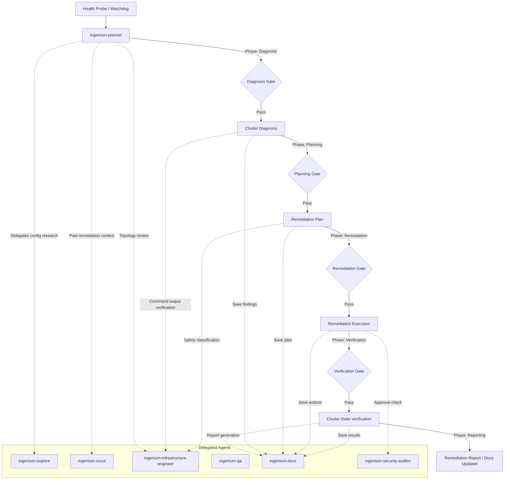

# Agent Architecture

## Overview

Eight agents total: 2 primary, 6 subagents. The **planner** analyzes cluster health reports and produces remediation plans (read-only). The **orchestrator** executes remediation with full tool access, running kubectl/flux/helm and collecting diagnostic evidence. Subagents handle specialized tasks — codebase exploration, context retrieval, infrastructure engineering review, QA, documentation, and security auditing.

## Agent Table

| Agent | Type | Model | Provider | Access | Purpose |
|-------|------|-------|----------|--------|---------|
| **ingenium-planner** | Primary | `deepseek/deepseek-v4-pro` | DeepSeek API | Read-only | Mastermind — analyzes cluster health, researches issues, produces remediation plan |
| **ingenium-orchestrator** | Primary | `deepseek/deepseek-v4-flash` | DeepSeek API | Full R/W | Executor — runs kubectl/flux/helm, drives remediation, enforces 3-tier safety |
| **ingenium-explore** | Subagent | `deepseek/deepseek-v4-flash` | DeepSeek API | Read-only | Cluster config discovery, manifest search, pattern analysis (paid Flash, max reasoning) |
| **ingenium-scout** | Subagent | `lmstudio/qwopus3.5-9b-coder` | LM Studio | Read-only | Thread/RAG persistent memory for past remediations and cluster knowledge |
| **ingenium-infrastructure-engineer** | Subagent | `opencode/deepseek-v4-flash-free` | OpenCode Zen | Read-only | Infrastructure design review, remediation plan safety checks, topology constraint analysis |
| **ingenium-qa** | Subagent | `opencode/deepseek-v4-flash-free` | OpenCode Zen | Write tests | Code review + test authoring for operator scripts |
| **ingenium-docs** | Subagent | `opencode/deepseek-v4-flash-free` | OpenCode Zen | Write docs | Remediation reports, skill documentation, learning capture |
| **ingenium-security-auditor** | Subagent | `deepseek/deepseek-v4-flash` | DeepSeek API | Bash + read-only | Security audit of the project itself + git-history leak scanning |

## Workflow

The remediation lifecycle follows a strict diagnose → plan → remediate → verify process:



## Compute Split

| Resource | Agents | Count |
|----------|--------|-------|
| DeepSeek V4 Pro (API) | `ingenium-planner` | 1 |
| DeepSeek V4 Flash (API) | `ingenium-orchestrator`, `ingenium-explore`, `ingenium-security-auditor` | 3 |
| DeepSeek V4 Flash (OpenCode Zen free) | `ingenium-infrastructure-engineer`, `ingenium-qa`, `ingenium-docs` | 3 |
| qwopus 3.5 9B Coder (LM Studio) | `ingenium-scout` | 1 |

## Subagent Invocation

Primary agents invoke subagents via the Task tool automatically. Note: `ingenium-infrastructure-engineer`, `ingenium-qa`, and `ingenium-docs` are write-capable (within their scope) — the planner cannot spawn them directly, only the orchestrator can.

| Subagent | `@` mention | Access | Read-only | Invokable by |
|----------|-------------|--------|-----------|--------------|
| ingenium-explore | `@ingenium-explore` | Read-only | ✅ | planner + orchestrator |
| ingenium-scout | `@ingenium-scout` | Read-only | ✅ | planner + orchestrator |
| ingenium-security-auditor | `@ingenium-security-auditor` | Bash + read-only | ✅ | planner + orchestrator |
| ingenium-infrastructure-engineer | `@ingenium-infrastructure-engineer` | Read-only | ✅ | orchestrator only |
| ingenium-qa | `@ingenium-qa` | Write tests | ❌ | orchestrator only |
| ingenium-docs | `@ingenium-docs` | Write docs | ❌ | orchestrator only |

## How to Use the Pipeline

### Switching Primary Agents

You have **two primary agents** — switch between them with the **Tab** key:

| Primary | Tab to | Use when you want to... |
|---------|--------|------------------------|
| **ingenium-planner** | Tab | Analyze a health report, research issues, produce a remediation plan. Read-only — no accidental cluster modifications. |
| **ingenium-orchestrator** | Tab | Execute the remediation plan. Full tool access, runs kubectl/flux/helm, drives the remediation lifecycle with safety enforcement. |

### Typical Remediation Workflow

```
1. Tab → ingenium-planner
   You: "Cluster health report: pod web-app-7x9k2 in production is CrashLoopBackOff"
   Planner: auto-invokes @ingenium-explore, @ingenium-scout for research
            returns a structured remediation plan:
              Issue: web-app-7x9k2 CrashLoopBackOff in production
              Diagnosis: container exits with OOMKilled — memory limit exceeded
              Diagnostics: kubectl logs, kubectl describe pod
              Remediation:
                Tier 1: kubectl rollout restart deployment/web-app -n production
                Tier 2: kubectl edit deployment/web-app -n production (update limits)

2. Tab → ingenium-orchestrator  
   You: "Execute the remediation plan for web-app CrashLoopBackOff"
   Orchestrator: auto-invokes subagents as needed:
      • @ingenium-explore      — finds deployment manifest and resource definitions
      • @ingenium-infrastructure-engineer — reviews topology and safety
      • @ingenium-docs         — documents remediation after execution
      • @ingenium-scout        — saves remediation to Thread
   Runs commands, captures output, verifies cluster state, reports results
```

### Manual Subagent Invocation

At any time, you can `@`-mention a subagent directly:

```
@ingenium-explore find all Deployment manifests with resource limits in the production namespace
@ingenium-scout search Thread for past CrashLoopBackOff remediations
@ingenium-infrastructure-engineer review this PVC deletion plan for safety
@ingenium-security-auditor audit the cluster role bindings for security concerns
```

This opens a child session. Navigate with:
- **Right** → cycle to next child session
- **Left** → cycle to previous child session
- **Up** → return to parent session

### Automatic Delegation

Both primary agents will automatically decide when to invoke subagents. You don't need to prompt for it — just describe the task. The Task tool delegates to the right subagent based on the agent's description.

**Examples:**

| You say... | Planner auto-delegates | Orchestrator auto-delegates |
|------------|----------------------|---------------------------|
| "Pod production-web is CrashLoopBackOff" | explore (find manifests), scout (past CrashLoopBackOff), infra-engineer (topology) | explore, infra-engineer (safety), docs (save findings), scout (save) |
| "Node worker-2 is NotReady" | explore (find node config), scout (past node issues), infra-engineer (drain plan) | explore, infra-engineer (review drain safety), docs, scout (save) |
| "Flux Kustomization infra-config is not ready" | explore (find flux config), scout (past flux issues) | explore, infra-engineer (review flux chain), docs, scout (save) |