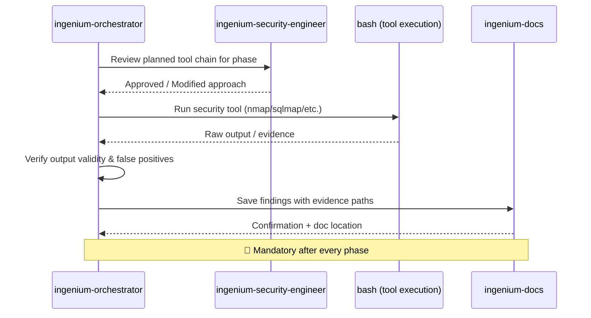

# Architecture

## Overview

**sec-ops** is an AI-driven security penetration testing agent system built on the Ingenium skill framework. It provides a structured, phase-gated methodology for conducting authorized security assessments — from initial reconnaissance through exploitation to final reporting. The system uses a team of specialized AI agents (8 total: 2 primary + 6 subagents) that coordinate through the OpenCode platform, backed by 54 skills (44 universal + 10 pentest-domain) that govern tool usage, methodology, evidence handling, and ethical boundaries.

Key properties:
- **No runtime dependencies beyond pentesting tools** — pure Markdown + YAML + shell scripts for the agent system
- **Phase-gated methodology** — strict ordering of recon → enumeration → assessment → exploitation → reporting
- **Evidence-driven** — every phase produces documented findings
- **Ethical by design** — built-in safety boundaries and scope validation
- **Self-improving** — an `update-skills` detection pipeline identifies gaps and auto-creates skills

## Directory Map

```mermaid
graph TB
    ROOT[sec-ops/] --> AGENTS[AGENTS.md — Project rules]
    ROOT --> OCONFIG[opencode.json — OpenCode config]
    ROOT --> OA[.opencode/agents/ — 8 agent definitions]
    ROOT --> OP[.opencode/plugins/ — 4 lifecycle plugins]
    ROOT --> AS[.agents/ — Skill system core]
    ROOT --> VS[.vscode/ — Editor config]
    ROOT --> D[docs/ — Project documentation]
    ROOT --> VENV[.venv/ — Deprecated]

    OA --> PR[primary/]
    OA --> RS[research/]
    OA --> EX[execution/]
    OA --> SE[security/]

    PR --> PL[ingenium-planner.md — Mastermind, read-only]
    PR --> OR[ingenium-orchestrator.md — Executor, full R/W]

    RS --> EXP[ingenium-explore.md — Target discovery]
    RS --> SCT[ingenium-scout.md — Thread context]

    EX --> SE1[ingenium-security-engineer.md — Pentest design review]
    EX --> QA[ingenium-qa.md — PoC test authoring]
    EX --> DOC[ingenium-docs.md — Documentation & reports]

    SE --> SA[ingenium-security-auditor.md — Project security audit]

    AS --> SK[skills/ — 54 skills]
    AS --> HK[hooks/ — 3 lifecycle hooks]
    AS --> SCR[scripts/ — hook-bootstrap.sh]

    SK --> CORE[generic-conventions/ — Core rules]
    SK --> PM[pentest-methodology/ — Phase gating, ethical bounds]
    SK --> RN[recon/ — DNS, OSINT, subdomain discovery]
    SK --> NP[network-pentest/ — nmap, masscan, Metasploit]
    SK --> WA[web-app-scan/ — sqlmap, ffuf, gobuster]
    SK --> EV[exploit-validation/ — PoC safety, target confinement]
    SK --> PA[password-audit/ — hashcat, john, hydra]
    SK --> CA[crypto-audit/ — testssl.sh, sslscan]
    SK --> WLA[wireless-audit/ — aircrack-ng, airodump-ng]
    SK --> WP[wordpress-pentest/ — wpscan]
    SK --> RG[report-gen/ — Findings format, severity taxonomy]
    SK --> REST[Other standard skills — 33 universal skills]

    D --> DA[docs/agents.md — Agent architecture]
    D --> DA2[docs/ARCHITECTURE.md — System architecture]
    D --> DTC[docs/TECH-STACK.md — Tools & dependencies]
    D --> DC[docs/CONVENTIONS.md — Conventions & ethics]
    D --> DR[docs/README.md — Docs index]
```



## Key Components

### Skill System (`.agents/skills/`)

The core of the project. Every skill is a directory containing a single `SKILL.md` file with YAML frontmatter (`name`, `description`) and Markdown body. All 54 skills live under `.agents/skills/`:

| Tier | Pattern | Count | Examples |
|------|---------|-------|----------|
| **Core** | `generic-conventions` | 1 | Universal rules — docs, security, error handling, DRY |
| **Framework** | `*-conventions` | 5 | nextjs, python, go, rust, typescript-standalone |
| **Domain (universal)** | named by topic | ~28 | containers, kubernetes, api-design, sql-database, shell-scripts, useful-tests, etc. |
| **Pentest Domain** | named by topic | 10 | recon, network-pentest, web-app-scan, exploit-validation, password-audit, crypto-audit, wireless-audit, wordpress-pentest, pentest-methodology, report-gen |
| **Task** | invocable via `/command` | ~14 | update-skills, audit-skills, generate-docs, write-docs, help, etc. |
| **Tool** | automation interfaces | ~5 | chrome-devtools, playwright-mcp, gh-cli, github-issues, web-design-reviewer |

All 54 skills are cross-referenced in `README.md` tables, `SKILL-INDEX.md`, and the mermaid diagram. The `audit-skills` skill validates consistency across all integration points.

### Agent Pipeline (`.opencode/agents/`)

8 custom agents defined for OpenCode in role-nested directories: `primary/` (planner, orchestrator), `execution/` (security-engineer, qa, docs), `research/` (explore, scout), `security/` (security-auditor). The orchestrator NEVER writes code directly — it delegates all implementation to @ingenium-security-engineer. See `docs/agents.md` for full architecture and workflow.

### Plugin System (`.opencode/plugins/`)

4 TypeScript plugins hook into OpenCode's lifecycle for deterministic enforcement:

| Plugin | Hook | Purpose |
|--------|------|---------|
| `session-start.ts` | `session.created` | Injects skill-loading checklist at session start |
| `pre-tool-use.ts` | `tool.execute.before` | Warns when bash commands target `.venv`, `.git`, or deprecated directories |
| `post-tool-use.ts` | `tool.execute.after` | Tracks tool call count, reminds about evidence logging every 5 calls; verifies delegation patterns |

### Hooks System (`.agents/hooks/`)

3 lifecycle hooks provide deterministic enforcement and engagement tracking:

| Hook | When it fires | Purpose |
|------|--------------|---------|
| `session-start.json` | Session start | Inject abbreviated checklist, match skills, load them, note 🔴 HARD RULEs |
| `pre-tool-use.json` | Before every tool call | Validate terminal command safety, check scope boundaries, block dangerous patterns |
| `post-tool-use.json` | After every 5 tool calls | Periodic reminder to log findings, run `/update-skills`, check for skill gaps, verify delegation patterns |

## Data Flow

### Engagement Lifecycle

```mermaid
flowchart LR
    REQ[Security Assessment Request] --> PL[ingenium-planner]
    PL --> PLAN[Engagement Plan]
    PLAN --> PH1{Phase 1: Reconnaissance}
    PH1 -->|Pass| RECON[Reconnaissance]
    RECON --> EVID1[Evidence: Network Map / Services / OSINT]

    EVID1 --> PH2{Phase 2: Enumeration}
    PH2 -->|Pass| ENUM[Enumeration]
    ENUM --> EVID2[Evidence: Service Details / Versions / Configs]

    EVID2 --> PH3{Phase 3: Vulnerability Assessment}
    PH3 -->|Pass| ASSESS[Vulnerability Assessment]
    ASSESS --> EVID3[Evidence: CVEs / Weak Configs / Vulnerabilities]

    EVID3 --> PH4{Phase 4: Exploitation}
    PH4 -->|Pass| EXPLOIT[Exploitation]
    EXPLOIT --> EVID4[Evidence: Access / Data / Timeline]

    EVID4 --> PH5{Phase 5: Reporting}
    PH5 -->|Pass| REPORT[Reporting]
    REPORT --> FINDINGS[Findings Report / Remediation Plan]

    subgraph Orchestrator[ingenium-orchestrator]
        direction LR
        TOOLS[Security Tools] --> OUTPUT[Tool Output]
        OUTPUT --> VERIFY[Output Verification]
        VERIFY --> EVIDENCE[Evidence Storage]
    end

    RECON --> Orchestrator
    ENUM --> Orchestrator
    ASSESS --> Orchestrator
    EXPLOIT --> Orchestrator
    REPORT --> Orchestrator
```



### Agent-to-Tool Flow



## Communication Patterns

The project operates entirely at edit time with no runtime communication between components:
- **AI reads skills** — The AI assistant scans `.agents/skills/` on startup and when tool types change
- **AI executes tools** — The orchestrator runs security tools via bash and validates output
- **AI writes evidence** — `ingenium-docs` saves findings; `update-skills` creates new skill files
- **Bootstrap copies** — `hook-bootstrap.sh` copies the skill system to new targets
- **Tests validate** — `test-self-improving.sh` runs as a bash script, not part of the AI loop

## External Dependencies

### Essential Runtime Tools
- **nmap / masscan** — Port scanning and service discovery
- **dnsrecon / dig** — DNS enumeration
- **whatweb / wappalyzer** — Technology fingerprinting
- **ffuf / gobuster** — Directory and file discovery
- **sqlmap** — SQL injection detection and exploitation
- **hashcat / john** — Password cracking
- **hydra / medusa** — Authentication brute-forcing
- **testssl.sh / sslscan** — TLS/SSL assessment
- **wpscan** — WordPress security scanning
- **aircrack-ng / airodump-ng** — Wireless assessment
- **metasploit-framework** — Exploitation framework (msfconsole)

### Agent System
- **OpenCode** — Agent orchestration platform
- **Thread MCP** — Persistent memory (cross-session context)
- **Bash 5.x** — Tool execution and scripting

### Development
- **Python 3 + pipx** — PoC scripts and tool management
- **requests / beautifulsoup4** — HTTP client utilities for PoC development

## Deployment

The project is deployed by **bootstrapping** — running `hook-bootstrap.sh` against a target project or by copying the `deploy/` directory:

```bash
# Bootstrap a new security assessment project
./.agents/scripts/hook-bootstrap.sh --auto /path/to/engagement
```

The system structure is self-contained — the `.agents/` directory is the entire deployable unit:
- `.agents/skills/` — All 54 skills (copied)
- `.agents/hooks/` — 3 lifecycle hooks (copied)
- `AGENTS.md` — Project rules (copied)
- `opencode.json` — Configuration with `<PLACEHOLDER>` tokens (never real secrets)

**No external services required.** The system works fully offline with local tools and local LLMs.