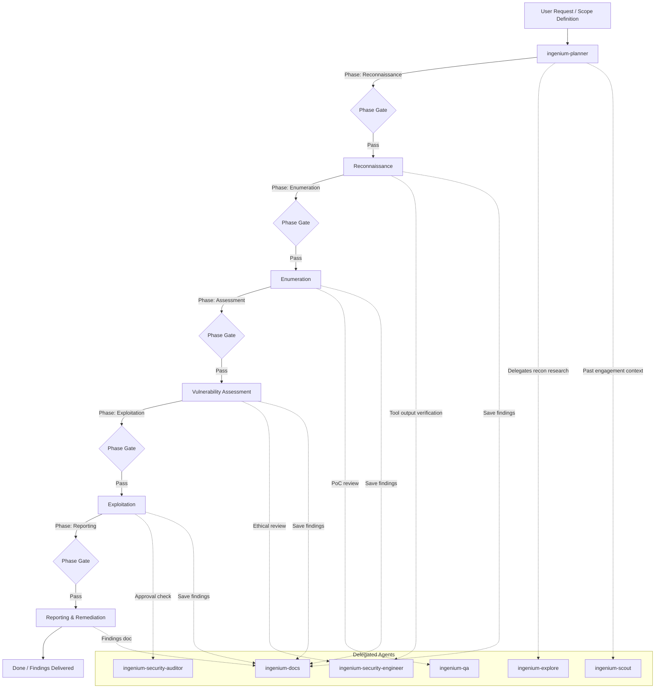

# Agent Architecture

## Overview

Eight agents total: 2 primary, 6 subagents. The **planner** analyzes security assessment requests and produces engagement plans (read-only). The **orchestrator** executes engagements with full tool access, running security tools and collecting evidence. Subagents handle specialized tasks — reconnaissance, context retrieval, security engineering review, QA, documentation, and security auditing.

## Agent Table

| Agent | Type | Model | Provider | Access | Purpose |
|-------|------|-------|----------|--------|---------|
| **ingenium-planner** | Primary | `deepseek/deepseek-v4-pro` | DeepSeek API | Read-only | Mastermind — analyzes target scope, delegates recon, produces engagement plan |
| **ingenium-orchestrator** | Primary | `deepseek/deepseek-v4-flash` | DeepSeek API | Full R/W | Executor — runs security tools, writes PoCs, collects evidence, coordinates phases |
| **ingenium-explore** | Subagent | `deepseek/deepseek-v4-flash` | DeepSeek API | Read-only | Target discovery, OSINT, tool research (paid Flash, max reasoning) |
| **ingenium-scout** | Subagent | `lmstudio/qwopus3.5-9b-coder` | LM Studio | Read-only | Thread/RAG persistent memory for past engagements and findings |
| **ingenium-security-engineer** | Subagent | `opencode/deepseek-v4-flash-free` | OpenCode Zen | Read-only | Pentest design review, tool chain suggestions, ethical boundary checks |
| **ingenium-qa** | Subagent | `opencode/deepseek-v4-flash-free` | OpenCode Zen | Write tests | Code review + test authoring for PoC scripts |
| **ingenium-docs** | Subagent | `opencode/deepseek-v4-flash-free` | OpenCode Zen | Write docs | Evidence management, findings documentation, report generation |
| **ingenium-security-auditor** | Subagent | `deepseek/deepseek-v4-flash` | DeepSeek API | Bash + read-only | Security audit of the project itself + git-history leak scanning |

## Workflow

The engagement lifecycle follows a strict phase-gated process:



## Compute Split

| Resource | Agents | Count |
|----------|--------|-------|
| DeepSeek V4 Pro (API) | `ingenium-planner` | 1 |
| DeepSeek V4 Flash (API) | `ingenium-orchestrator`, `ingenium-explore`, `ingenium-security-auditor` | 3 |
| DeepSeek V4 Flash (OpenCode Zen free) | `ingenium-security-engineer`, `ingenium-qa`, `ingenium-docs` | 3 |
| qwopus 3.5 9B Coder (LM Studio) | `ingenium-scout` | 1 |

## Subagent Invocation

Primary agents invoke subagents via the Task tool automatically. Note: `ingenium-security-engineer`, `ingenium-qa`, and `ingenium-docs` are write-capable (within their scope) — the planner cannot spawn them directly, only the orchestrator can.

| Subagent | `@` mention | Access | Read-only | Invokable by |
|----------|-------------|--------|-----------|--------------|
| ingenium-explore | `@ingenium-explore` | Read-only | ✅ | planner + orchestrator |
| ingenium-scout | `@ingenium-scout` | Read-only | ✅ | planner + orchestrator |
| ingenium-security-auditor | `@ingenium-security-auditor` | Bash + read-only | ✅ | planner + orchestrator |
| ingenium-security-engineer | `@ingenium-security-engineer` | Read-only | ✅ | orchestrator only |
| ingenium-qa | `@ingenium-qa` | Write tests | ❌ | orchestrator only |
| ingenium-docs | `@ingenium-docs` | Write docs | ❌ | orchestrator only |

## How to Use the Pipeline

### Switching Primary Agents

You have **two primary agents** — switch between them with the **Tab** key:

| Primary | Tab to | Use when you want to... |
|---------|--------|------------------------|
| **ingenium-planner** | Tab | Analyze a security assessment request, research targets, produce an engagement plan. Read-only — no accidental tool execution. |
| **ingenium-orchestrator** | Tab | Execute the engagement plan. Full tool access, runs scans, collects evidence, drives the engagement lifecycle. |

### Typical Engagement Workflow

```
1. Tab → ingenium-planner
   You: "I need a penetration test for example.com"
   Planner: auto-invokes @ingenium-explore, @ingenium-scout for research
            returns a phased engagement plan:
              Phase 1: Reconnaissance — nmap, dnsrecon, whatweb
              Phase 2: Enumeration — ffuf, gobuster, nikto
              Phase 3: Assessment — testssl.sh, sqlmap detection
              Phase 4: Exploitation — PoC review + controlled exploit
              Phase 5: Reporting — findings doc

2. Tab → ingenium-orchestrator  
   You: "Execute phase 1 of the engagement plan"
   Orchestrator: auto-invokes subagents as needed:
     • @ingenium-explore      — finds wordlists and tool paths
     • @ingenium-security-engineer — validates planned tool chain
     • @ingenium-docs         — documents findings after each phase
     • @ingenium-qa           — reviews PoC scripts
     • @ingenium-scout        — saves findings to Thread
   Runs tools, collects evidence, verifies output
```

### Manual Subagent Invocation

At any time, you can `@`-mention a subagent directly:

```
@ingenium-explore find all wordlist directories and tool configuration files
@ingenium-scout search Thread for past findings about SQL injection
@ingenium-security-engineer review this sqlmap command chain for safety
@ingenium-security-auditor audit the scope boundaries for ethical concerns
```

This opens a child session. Navigate with:
- **Right** → cycle to next child session
- **Left** → cycle to previous child session
- **Up** → return to parent session

### Automatic Delegation

Both primary agents will automatically decide when to invoke subagents. You don't need to prompt for it — just describe the task. The Task tool delegates to the right subagent based on the agent's description.

**Examples:**

| You say... | Planner auto-delegates | Orchestrator auto-delegates |
|------------|----------------------|---------------------------|
| "Scan the target for open ports" | explore (find tool paths), scout (past scan configs) | explore, security-engineer (validate flags), docs (save findings), scout (save) |
| "Test for SQL injection on login page" | explore (find wordlists), scout (past SQLi findings) | explore, security-engineer (review approach), qa (review PoC), docs, scout (save) |
| "Audit the project for leaked secrets" | security-auditor, explore | security-auditor, explore, scout (save) |