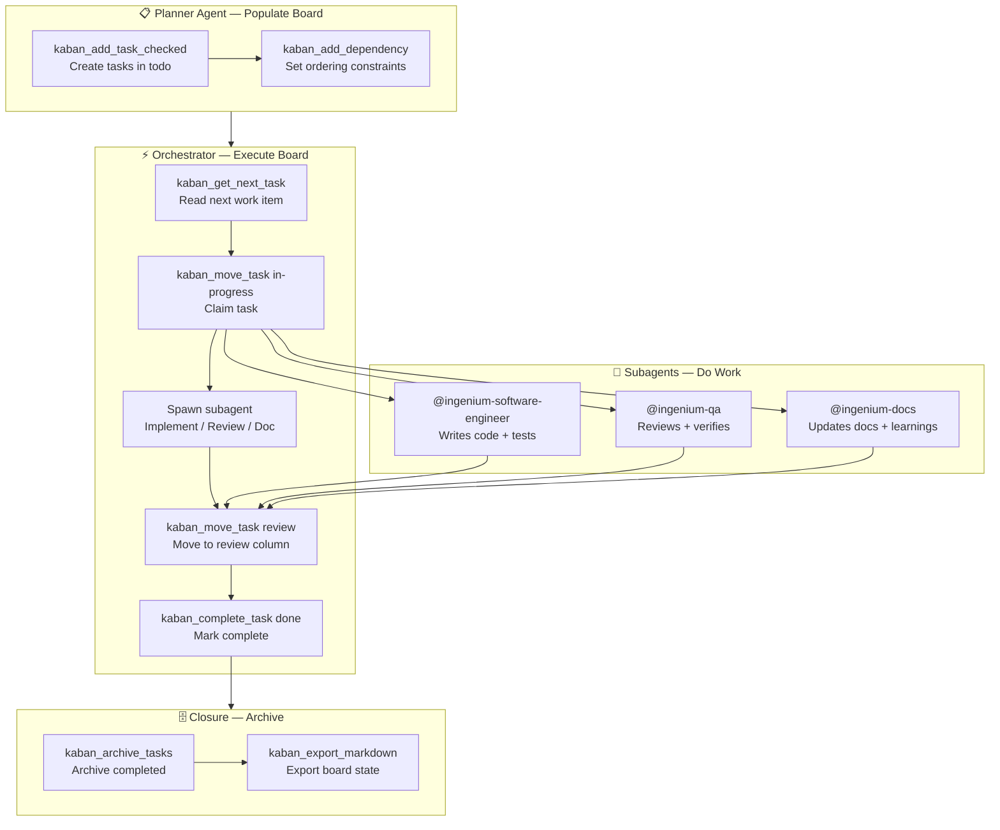
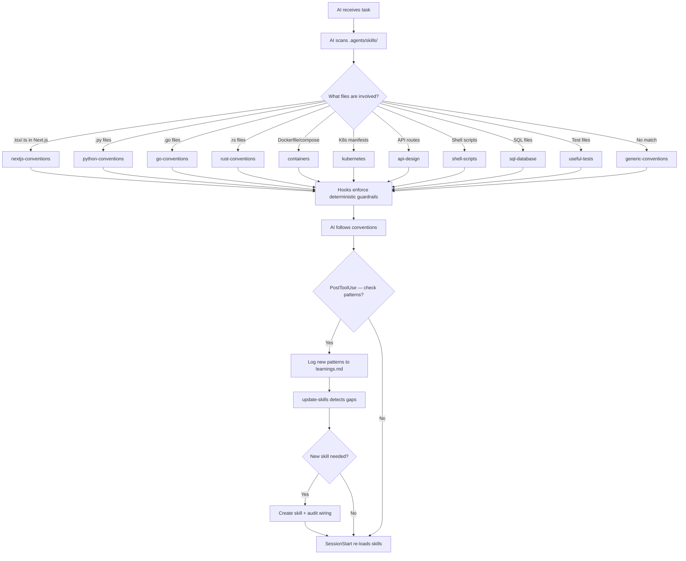

# Architecture

## Overview

**Ingenium** is a self-improving AI conventions system packaged as a bootstrap toolkit. It provides a skill-based framework that tells AI coding agents (OpenCode AI agents) how to follow project conventions, enforce rules, and grow new skills as the codebase evolves. The project is self-hosting: its own skill system governs its own development.

Key properties:
- **Zero runtime dependencies** — pure Markdown + YAML + shell scripts
- **Self-improving** — an `update-skills` detection pipeline identifies gaps and auto-creates skills

## Directory Map

```
ingenium/
├── .agents/                    ← AI conventions system (the "product")
│   ├── skills/                 ← 45 skills — framework, domain, task, and tool conventions
│   │   ├── generic-conventions/  ← Core rules: docs, security, error handling, DRY
│   │   ├── {framework}-conventions/ ← nextjs, python, go, rust, typescript-standalone
│   │   ├── {domain}-skills/       ← containers, kubernetes, api-design, sql-database, etc.
│   │   ├── orchestrator-primer/  ← Always-visible delegation rules (loaded via opencode.json)
│   │   └── learnings.md           ← Changelog of all skill system changes: skills, agents, hooks, plugins, deploy, config, architecture decisions, bugs, and patterns discovered
│   ├── SKILL-CATALOG.md        ← Full catalog (lazy-loaded by AI)
│   ├── scripts/                ← Bootstrap engine
│   │   ├── bootstrap.sh        ← Main entry point — scaffolds projects with selected skills
│   │   └── hook-bootstrap.sh   ← Auto-detection + interactive mode
│   └── tests/ → moved to tests/
├── tests/                      ← Test suite (at project root, alongside docs/)
│   └── test-self-improving.sh  ← Validates update-skills detection pipeline (7 test functions, 20 checks)
├── deploy/                     ← Bootstrap payload
├── docs/                       ← Project documentation (this directory)
│   ├── agents.md               ← Agent architecture reference
│   ├── ARCHITECTURE.md         ← This file — project structure and data flow
│   ├── TECH-STACK.md           ← Languages, tools, and dependencies
│   └── CONVENTIONS.md          ← Naming, file organization, and patterns
├── assets/                     ← Mermaid diagrams for docs
├── .opencode/agents/           ← OpenCode custom agent definitions (8 agents)
│   ├── primary/                ← planner, orchestrator
│   ├── execution/              ← software-engineer, qa, docs
│   ├── research/               ← explore, scout
│   └── security/               ← security-auditor
├── .opencode/plugins/          ← TypeScript plugins with lifecycle hooks (session-start, pre-tool-use, post-tool-use)
│   ├── tsconfig.json           ← Strict TypeScript config with 10+ strict flags
│   ├── session-start.ts        ← Injects skill-loading checklist at session start
│   ├── pre-tool-use.ts         ← Warns before commands that target build/cache dirs
│   └── post-tool-use.ts        ← Tracks tool calls, reminds about learnings.md
├── AGENTS.md                   ← Project rules — skill loading, agent pipeline, testing
├── README.md                   ← Project overview, architecture diagram, skill catalog
├── USAGE.md                    ← How to use and maintain the skill system
└── package.json                ← Minimal — only for dependency gap detection testing
```

## Key Components

### Skill System (`.agents/skills/`)

The core of the project. Every skill is a directory containing a single `SKILL.md` file with YAML frontmatter (`name`, `description`) and Markdown body. All 45 skills live in a single hierarchy under `.agents/skills/`:

| Tier | Pattern | Count | Examples |
|------|---------|-------|----------|
| **Core** | `generic-conventions` | 1 | Universal rules — docs, security, error handling, DRY |
| **Framework** | `*-conventions` | 5 | nextjs, python, go, rust, typescript-standalone |
| **Domain** | named by topic | ~20 | containers, kubernetes, api-design, sql-database, shell-scripts, useful-tests, etc. |
| **Task** | invocable via `/command` | ~14 | update-skills, audit-skills, generate-docs, write-docs, help, etc. |
| **Tool** | automation interfaces | ~5 | chrome-devtools, playwright-mcp, gh-cli, web-design-reviewer |

All 45 skills are cross-referenced in `README.md` tables, `SKILL-INDEX.md`, bootstrap.sh, and the mermaid diagram. The `audit-skills` skill validates consistency across all integration points.

### Bootstrap Engine (`.agents/scripts/`)

Two bash scripts that scaffold new projects with the skill system:

- **`bootstrap.sh`** — Main entry point. Deploys the skill system from repo root to the target project. Supports `--framework` selection, `--dry-run`, and `--auto` detection. Uses `BOOTSTRAP_DIR` to point to repo root.
- **`hook-bootstrap.sh`** — Non-interactive bootstrap for hooks/CI. Auto-detects framework, clones from git cache.

### Plugin System (`.opencode/plugins/`)

TypeScript plugins that hook into OpenCode's lifecycle to provide deterministic enforcement beyond what skill files can express:

| Plugin | Hook | Purpose |
|--------|------|---------|
| `session-start.ts` | `session.created` | Injects skill-loading checklist at session start |
| `pre-tool-use.ts` | `tool.execute.before` | Warns when bash commands target `node_modules`, `.git`, `dist`, or build directories |
| `post-tool-use.ts` | `tool.execute.after` | Tracks tool call count, reminds about `learnings.md` and `/update-skills` every 5 calls; reminds about delegation patterns and learnings.md |

Each plugin is a TypeScript module that imports the `Plugin` type from `@opencode-ai/plugin` and exports a default typed plugin object with named hooks. A strict `tsconfig.json` (`strict: true`, plus `noUncheckedIndexedAccess`, `noImplicitReturns`, `noFallthroughCasesInSwitch`, `noUnusedLocals`, `noUnusedParameters`, etc.) enforces type safety across all plugin files.

Plugins bridge the gap between skills (AI-interpreted) and deterministic guardrails. They run regardless of AI state and provide immediate feedback for dangerous patterns.

### Agent Pipeline (`.opencode/agents/`)

8 custom agents defined for OpenCode in role-nested directories: `primary/` (planner, orchestrator), `execution/` (software-engineer, qa, docs), `research/` (explore, scout), `security/` (security-auditor). The orchestrator NEVER writes code directly — it delegates all implementation to @ingenium-software-engineer (now with read/write permissions). The orchestrator uses a kaban board for structured work tracking: tasks flow from `todo` → `in-progress` → `review` → `done` via kaban MCP tools. See `docs/agents.md` for full architecture.

### Kaban Board in the Agent Pipeline

The kaban board is the central work tracking hub connecting the planner, orchestrator, and subagents. Tasks flow through a structured lifecycle:



**Data Flow:**

1. **Planner Agent** — After producing a plan, calls `kaban_add_task_checked` for each work unit, assigning `assignedTo` to the appropriate subagent (explore, software-engineer, qa, docs, security-auditor). Calls `kaban_add_dependency` to enforce ordering constraints (e.g., implementation before review). All tasks land in the `todo` column.
2. **Orchestrator** — Reads the next task via `kaban_get_next_task`, which returns the highest-priority task with resolved dependencies. Also marks the task as `in_progress` in `todowrite` for in-session OpenCode visibility. Moves the task to `in-progress` via `kaban_move_task <id> in-progress`, then spawns the assigned subagent.
3. **Subagent** — Completes the assigned work (implementation, review, documentation). Returns results to the orchestrator.
4. **Orchestrator (cont.)** — Moves the task to `review` via `kaban_move_task <id> review` and marks it as `pending` (for QA review) in `todowrite`. Spawns @ingenium-qa for verification. After QA approves, calls `kaban_complete_task <id>` and marks `completed` in `todowrite`.
5. **Session End** — Orchestrator calls `kaban_archive_tasks` to archive all completed tasks and `kaban_export_markdown` to produce a board summary for the learnings log. The `todowrite` state is ephemeral — kaban is the authoritative permanent record.

**Tool Access:**

| Agent | Kaban Tools | Todowrite |
|-------|-------------|-----------|
| `ingenium-planner` | `kaban_add_task_checked`, `kaban_add_dependency`, `kaban_status`, `kaban_init` | — |
| `ingenium-orchestrator` | `kaban_get_next_task`, `kaban_move_task`, `kaban_complete_task`, `kaban_archive_tasks`, `kaban_export_markdown`, `kaban_status`, `kaban_list_tasks` | `todo: allow` (mirror at each transition) |

The board is the authoritative state. `todowrite` is a secondary mirror for in-session OpenCode visibility — the orchestrator updates it at each kaban transition (`get-next-task`, `move-to-in-progress`, `move-to-review`, `complete`). The anti-patterns table includes "forgot to update todowrite" to ensure both are kept in sync. See `docs/agents.md` for the full agent lifecycle and `kaban-board/SKILL.md` for the complete MCP tool reference.

### Self-Improving Pipeline (`update-skills` + tests)

The project detects its own gaps using four signals:
1. **Dependency gaps** — `package.json` has a dep with no matching skill
2. **Missing coverage** — file types (`.vue`, `.svelte`) not covered by any skill
3. **Repeated conventions** — patterns used 3+ times without a skill
4. **Stale content** — skill references wrong versions or deleted paths

The `test-self-improving.sh` suite (7 test functions, 20 checks) validates all four signals, deploy integrity, frontmatter validity, and file drift.

### Model Configuration (`.agents/models.yaml`)

Model assignments for all agents are centralized in `.agents/models.yaml`, the human-editable source of truth. This file defines:

| Section | Content | Example |
|---------|---------|---------|
| **Model aliases** | Short names mapping to full provider/model strings | `fast: deepseek/deepseek-v4-flash` |
| **Agent assignments** | Per-agent model selection using aliases | `ingenium-planner: premium` |
| **Reasoning effort** | Per-agent `reasoningEffort` override | `ingenium-planner: xhigh` |

The model hierarchy uses three tiers:

| Tier | Alias | Model | Active Params | Use case |
|------|-------|-------|---------------|----------|
| Budget | `fast` | `deepseek/deepseek-v4-flash` | 13B | Code search, documentation, simple fixes |
| Standard | `capable` | `deepseek/deepseek-v4-flash` | 13B | Default implementation, QA review, orchestration |
| Premium | `premium` | `deepseek/deepseek-v4-pro` | 49B | Deep reasoning, complex refactoring, architecture |

The multi-model software engineer variants (`-fast`, default, `-premium`) are defined here with their respective aliases and reasoning efforts. All three share the same agent definition file skill sets — the differentiation is purely in model capability and reasoning budget.

**Convention**: Changes must be made to `.agents/models.yaml` first, then propagated to each agent's `.md` frontmatter `model:` field. The model configuration is NOT auto-read by OpenCode — it is a human coordination artifact.

### Thread Persistent Memory

The `thread-auto-context` skill provides automatic persistent memory across AI sessions via a Thread MCP server. It auto-bootstraps the bridge on first use, saves decisions/preferences/bugs during sessions, and performs a **mandatory full export pipeline at session end**:

1. **Full transcript upload** — Writes entire conversation to `/tmp/opencode/` and uploads to Thread (🔴 HARD RULE)
2. **Session summary** — Key changes, decisions, outcomes
3. **Decisions log** — All design decisions and architecture choices
4. **Git state** — Recent commits and staged/unstaged changes

This ensures every session is fully recoverable even if the platform's chat history is lost. The export uses the Thread byte-offset tracking system for incremental deduplication.

### Hooks System (`.agents/hooks/`)

Three lifecycle hooks provide deterministic enforcement and self-improvement triggers:

| Hook | When it fires | Purpose |
|------|--------------|---------|
| `session-start.json` | Session start | Inject abbreviated checklist, match skills, load them, note 🔴 HARD RULEs |
| `pre-tool-use.json` | Before every tool call | Validate terminal command safety, check file-scope rules, block dangerous patterns |
| `post-tool-use.json` | After every 5 tool calls | Periodic reminder to log new patterns, run `/update-skills`, check for skill gaps, verify delegation patterns |

Hooks live in `.agents/hooks/`. They bridge the gap between skills (which are read/interpreted by the AI) and deterministic enforcement (which runs regardless of AI state).

## Data Flow



## Communication Patterns

The project has no runtime communication — it operates entirely at edit time:
- **AI reads skills** — The AI assistant scans `.agents/skills/` on startup and when file types change
- **AI writes skills** — `update-skills` creates new skill files; `audit-skills` fixes consistency
- **Bootstrap deploys** — `bootstrap.sh` deploys the skill system from repo root to target projects
- **Tests validate** — `test-self-improving.sh` runs as a bash script, not part of the AI loop

## External Dependencies

None at runtime. The project is pure files — Markdown, YAML, Bash, JSON.

For development/testing:
- **bash** (5.x+) — Test suite and bootstrap scripts
- **git** — Version control and commit-based learning log
- **TypeScript** (via `tsc`) — Compiles `.opencode/plugins/` TypeScript source to JavaScript
- **Node.js / npm** — Package management and build tooling for OpenCode plugins
- **`@opencode-ai/plugin`** — SDK for OpenCode plugin development (typed `Plugin` interface, lifecycle hook signatures)
- **package.json** (root) — Exists only to provide a dependency list for gap detection testing (actual packages are never installed)

## Deployment

The project is deployed by **bootstrapping** — running `bootstrap.sh` against a target project:

```bash
# Bootstrap a new Next.js project with skill conventions
./ingenium/.agents/scripts/bootstrap.sh --framework nextjs /path/to/new-project
```

This deploys `.agents/` + `AGENTS.md` from the repo root into the target, giving it the full skill system. The bootstrap supports:
- **Framework selection** — `--framework nextjs|python|go|rust` selects the right skills
- **Auto-detection** — `--auto` scans existing code to detect frameworks
- **Dry runs** — `--dry-run` previews what would be copied
- **Non-interactive mode** — `hook-bootstrap.sh` for CI/hook environments
