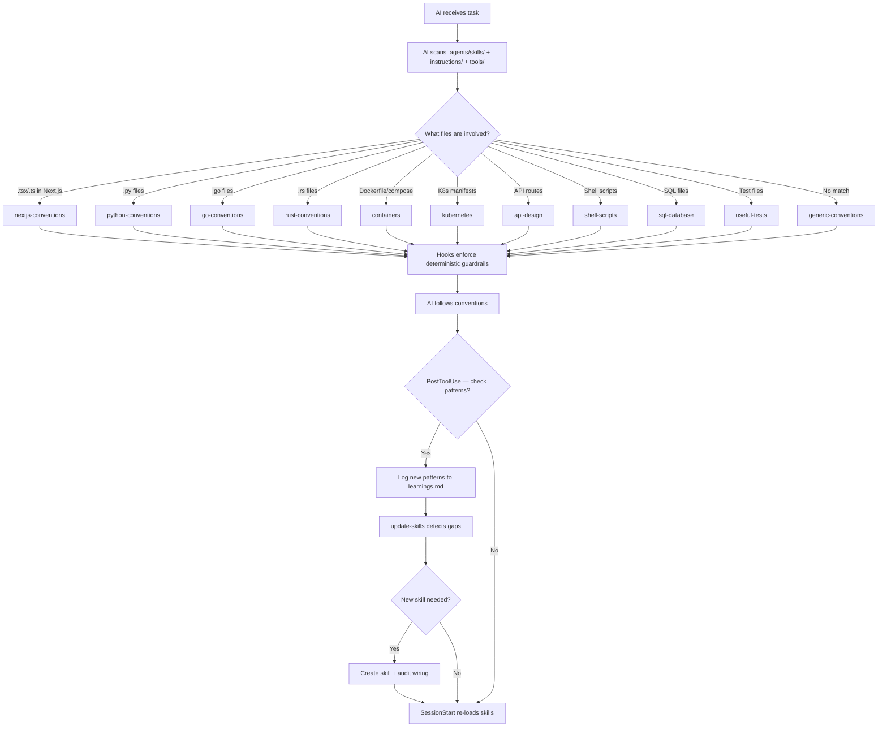

# Architecture

## Overview

**Ingenium** is a self-improving AI conventions system packaged as a bootstrap toolkit. It provides a skill-based framework that tells AI coding agents (GitHub Copilot, Cline, etc.) how to follow project conventions, enforce rules, and grow new skills as the codebase evolves. The project is self-hosting: its own skill system governs its own development.

Key properties:
- **Zero runtime dependencies** — pure Markdown + YAML + shell scripts
- **Self-improving** — an `update-skills` detection pipeline identifies gaps and auto-creates skills
- **Deployable** — a `deploy/` mirror strips source-only files for clean project bootstrapping

## Directory Map

```
ingenium/
├── .agents/                    ← AI conventions system (the "product")
│   ├── skills/                 ← 26 skills — framework & domain conventions
│   │   ├── generic-conventions/  ← Core rules: docs, security, error handling, DRY
│   │   ├── {framework}-conventions/ ← nextjs, python, go, rust, typescript-standalone
│   │   ├── {domain}-skills/       ← containers, kubernetes, api-design, sql-database, shell-scripts
│   │   └── learnings.md           ← Changelog of all skill additions/retirements
│   ├── instructions/           ← 12 instructions — task/invocation skills
│   │   ├── update-skills/        ← Self-improvement pipeline
│   │   ├── audit-skills/         ← Consistency audit
│   │   ├── help/                 ← Skill overview
│   │   ├── skill-load/           ← Session bootstrap
│   │   ├── repo-context/         ← Project identity
│   │   ├── {other-instructions}/  ← debugging, docs, recovery, etc.
│   │   └── thread-auto-context/  ← Persistent memory (source-only)
│   ├── tools/                  ← 5 tools — browser automation & GitHub operations
│   │   ├── chrome-devtools/       ← Browser debugging
│   │   ├── playwright-mcp/        ← Playwright browser automation
│   │   ├── gh-cli/               ← GitHub CLI operations
│   │   ├── github-issues/        ← GitHub issue management
│   │   └── web-design-reviewer/  ← UI/UX inspection
│   ├── scripts/                ← Bootstrap engine
│   │   ├── bootstrap.sh        ← Main entry point — scaffolds projects with selected skills
│   │   └── hook-bootstrap.sh   ← Auto-detection + interactive mode
│   └── tests/ → moved to tests/
├── tests/                      ← Test suite (at project root, alongside docs/)
│   └── test-self-improving.sh  ← Validates update-skills detection pipeline (7 test functions, 20 checks)
├── deploy/                     ← Clean mirror for bootstrapping other projects
│   ├── AGENTS.md               ← Minimal redirect (same as root)
│   ├── .agents/skills/         ← 41 deployable skills — no scripts, docs, or tests
│   └── .agents/hooks/          ← 3 lifecycle hooks for deterministic enforcement
├── docs/                       ← Project documentation (this directory)
│   ├── README.md               ← Docs index / map
│   ├── ARCHITECTURE.md         ← This file — project structure and data flow
│   ├── TECH-STACK.md           ← Languages, tools, and dependencies
│   └── CONVENTIONS.md          ← Naming, file organization, and patterns
├── assets/                     ← Mermaid diagrams for docs
├── AGENTS.md                   ← Minimal 6-line redirect — tells AI to scan .agents/skills/
├── README.md                   ← Project overview, architecture diagram, skill catalog
├── USAGE.md                    ← How to use and maintain the skill system
└── package.json                ← Minimal — only for dependency gap detection testing
```

## Key Components

### Skill System (`.agents/skills/`, `.agents/instructions/`, `.agents/tools/`)

The core of the project. Each skill/instruction/tool is a directory containing a single `SKILL.md` file with YAML frontmatter (`name`, `description`) and Markdown body. Items are categorized into three tiers across three directories:

| Directory | Count | Purpose |
|-----------|-------|---------|
| `.agents/skills/` | 26 | Framework & domain conventions (file-triggered) |
| `.agents/instructions/` | 12 | Task skills slash-commands, session init, recovery |
| `.agents/tools/` | 5 | Browser automation & GitHub operations |

**Skills** (`.agents/skills/`) are categorized into sub-tiers:

| Tier | Pattern | Examples | What they do |
|------|---------|----------|-------------|
| **Core** | `generic-conventions` | 1 skill | Universal rules — docs, security, error handling, DRY |
| **Framework** | `*-conventions` | nextjs, python, go, rust, typescript-standalone | Language/framework-specific conventions, build commands, testing |
| **Domain** | named by topic | containers, kubernetes, api-design, sql-database, shell-scripts, project-structure, useful-tests | Cross-cutting technical domains |

**Instructions** (`.agents/instructions/`) and **Tools** (`.agents/tools/`) contain invocable task skills and automation interfaces — see the skill index or run `/help` for the full catalog.

### Bootstrap Engine (`.agents/scripts/`)

Two bash scripts that scaffold new projects with the skill system:

- **`bootstrap.sh`** — Main entry point. Copies deployable skills from `deploy/` to the target project. Supports `--framework` selection, `--dry-run`, and `--auto` detection. Uses `BOOTSTRAP_DIR` to point to `deploy/`.
- **`hook-bootstrap.sh`** — Interactive mode with framework auto-detection. Handles `session-start`, `pre-tool-use`, and `post-tool-use` hook generation.

### Deploy Separation (`deploy/`)

A clean mirror containing only what gets deployed to target projects:
- `deploy/.agents/skills/` — 25 deployable skills (excludes source-only `create-readme`)
- `deploy/.agents/instructions/` — 11 deployable instructions (excludes source-only `thread-auto-context`)
- `deploy/.agents/tools/` — 5 deployable tools (all deployed)
- `deploy/.agents/hooks/` — All 3 lifecycle hooks (session-start, pre-tool-use, post-tool-use)
- `deploy/AGENTS.md` — Minimal redirect
- `deploy/SKILL-INDEX.md` — Full skill index for target projects
- No scripts, docs, or tests — those are source-only

The `test-self-improving.sh` suite validates that deploy stays in sync with source (`TEST 5`) and that no source-only files leak in (`TEST 4`).

### Self-Improving Pipeline (`update-skills` + tests)

The project detects its own gaps using four signals:
1. **Dependency gaps** — `package.json` has a dep with no matching skill
2. **Missing coverage** — file types (`.vue`, `.svelte`) not covered by any skill
3. **Repeated conventions** — patterns used 3+ times without a skill
4. **Stale content** — skill references wrong versions or deleted paths

The `test-self-improving.sh` suite (7 test functions, 20 checks) validates all four signals, deploy integrity, frontmatter validity, and file drift.

### Hooks System (`.agents/hooks/`)

Three lifecycle hooks provide deterministic enforcement and self-improvement triggers:

| Hook | When it fires | Purpose |
|------|--------------|---------|
| `session-start.json` | Session start | Inject abbreviated checklist, match skills, load them, note 🔴 HARD RULEs |
| `pre-tool-use.json` | Before every tool call | Validate terminal command safety, check file-scope rules, block dangerous patterns |
| `post-tool-use.json` | After every ~10 tool calls | Periodic reminder to log new patterns, run `/update-skills`, check for skill gaps |

Hooks live in both source (`.agents/hooks/`) and deploy (`deploy/.agents/hooks/`). They bridge the gap between skills (which are read/interpreted by the AI) and deterministic enforcement (which runs regardless of AI state). The `post-tool-use` hook is the primary driver of the self-improving pipeline — it periodically reminds the AI to detect and create new skills.

## Data Flow



## Communication Patterns

The project has no runtime communication — it operates entirely at edit time:
- **AI reads skills/instructions/tools** — The AI assistant scans `.agents/skills/`, `.agents/instructions/`, and `.agents/tools/` on startup and when file types change
- **AI writes skills** — `update-skills` creates new skill files; `audit-skills` fixes consistency
- **Bootstrap copies** — `bootstrap.sh` copies `deploy/` contents to target projects
- **Tests validate** — `test-self-improving.sh` runs as a bash script, not part of the AI loop

## External Dependencies

None at runtime. The project is pure files — Markdown, YAML, Bash, JSON.

For development/testing:
- **bash** (5.x+) — Test suite and bootstrap scripts
- **git** — Version control and commit-based learning log
- **package.json** — Exists only to provide a dependency list for gap detection testing (actual packages are never installed)

## Deployment

The project is deployed by **bootstrapping** — running `bootstrap.sh` against a target project:

```bash
# Bootstrap a new Next.js project with skill conventions
./ingenium/.agents/scripts/bootstrap.sh --framework nextjs /path/to/new-project
```

This copies `deploy/.agents/` + `deploy/AGENTS.md` into the target, giving it the full skill system. The bootstrap supports:
- **Framework selection** — `--framework nextjs|python|go|rust` selects the right skills
- **Auto-detection** — `--auto` scans existing code to detect frameworks
- **Dry runs** — `--dry-run` previews what would be copied
- **Interactive mode** — `hook-bootstrap.sh` guides the user through setup
