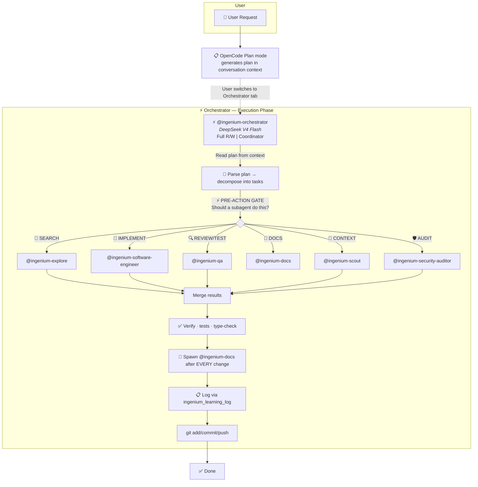
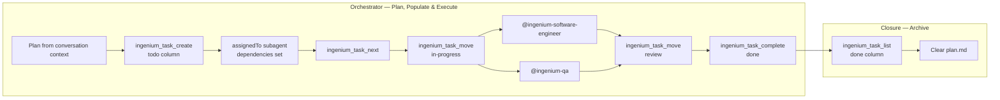
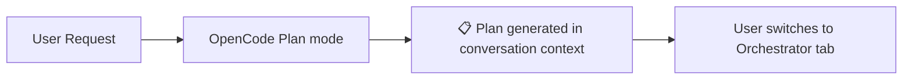
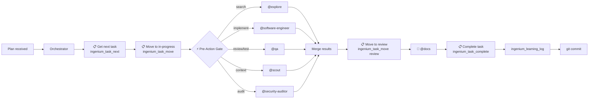

# Agent Architecture

## Overview

Eleven agents total: 1 primary, 10 subagents. The **orchestrator** (`@ingenium-orchestrator`) coordinates execution — it NEVER writes code directly, always delegating to subagents. Planning is done via OpenCode's built-in Plan mode (not a custom agent), which generates the plan as conversation text. The orchestrator reads that plan from the conversation context and decomposes it into parallel subagent tasks. Ten specialized subagents handle search, context, prompt engineering, implementation (3 tiers), review, documentation, plan management, and security.



## Agent Table

| Agent | Type | Model | Provider | Access | Purpose |
|-------|------|-------|----------|--------|---------|
| **ingenium-orchestrator** | Primary | `lmstudio/qwen/qwen3.5-9b` | LM Studio | Full R/W | Coordinator — reads plans from OpenCode's Plan mode, delegates ALL work to subagents, never writes code directly |
| **ingenium-prompt-engineer** | Subagent | `lmstudio/qwen/qwen3.5-9b` | LM Studio | Read-only | Prompt Engineer — analyzes and improves prompts using a structured evaluation framework |
| **ingenium-plan-file** | Subagent | `lmstudio/qwen/qwen3.5-9b` | LM Studio | Read/Write (plan.md only) | Single-purpose — manages `plan.md` at project root. Created/updated/deleted by orchestrator instruction |
| **ingenium-explore** | Subagent | `lmstudio/qwen/qwen3.5-9b` | LM Studio | Read-only | Codebase search — grep, glob, file discovery, pattern analysis |
| **ingenium-scout** | Subagent | `lmstudio/qwen/qwen3.5-9b` | LM Studio | Read-only | Thread/RAG persistent memory — past decisions, preferences |
| **ingenium-software-engineer** | Subagent | `lmstudio/qwen/qwen3.5-9b` | LM Studio | Read/Write (`edit: allow, write: allow`) | **Writes all code** — implementation, refactoring, bug fixes. Also: design review, technical analysis |
| **ingenium-software-engineer-fast** | Subagent | `lmstudio/qwen/qwen3.5-9b` | LM Studio | Read/Write (`edit: allow, write: allow`) | Standard bug fixes, simple refactors, test authoring, straightforward tasks |
| **ingenium-software-engineer-premium** | Subagent | `deepseek/deepseek-v4-pro` | DeepSeek API | Read/Write (`edit: allow, write: allow`) | Complex multi-file refactoring, architectural changes, performance-critical code |
| **ingenium-qa** | Subagent | `lmstudio/qwen/qwen3.5-9b` | LM Studio | Edit (`edit: allow`) | Code review + test verification. Reviews tests written by @ingenium-software-engineer. Does NOT write production code |
| **ingenium-docs** | Subagent | `lmstudio/qwen/qwen3.5-9b` | LM Studio | Edit + Write (`edit: allow, write: allow, bash: deny`) | Documentation + skill updates + `ingenium_learning_log` entries |
| **ingenium-security-auditor** | Subagent | `deepseek/deepseek-v4-flash` | DeepSeek API | Bash + read-only (`write: deny`) | Security audit + git-history leak scanning |

---

## Lifecycle: What Triggers What

| # | Phase | Trigger | Agent | Action |
|-------|-------|---------|-------|--------|
| 1 | **Plan** | User enters Plan mode | OpenCode Plan mode | Generates plan as conversation text — research, scope, and task decomposition |
| 2 | **Handoff** | Plan complete | User | Switches to orchestrator tab |
| 3 | **Read plan** | Tab switch | Orchestrator | Reads plan from conversation context, decomposes into subagent tasks |
| 4 | **Pre-Action Gate** | EVERY tool use | Orchestrator | ⚡ Checks: "Should a subagent do this?" before any tool call |
| 5 | **Code writing** | Implementation needed | Orchestrator → **Software-Engineer** | Implements code, self-verifies (tests/type-check), returns results |
| 6 | **Review + test** | Code written | Orchestrator → **QA** | Reviews quality, writes tests, returns findings |
| 7 | **Security audit** | Sensitive changes | Orchestrator → **Security-Auditor** | Scans for secrets, auth issues, CI vulnerabilities |
| 8 | **Documentation** | After EVERY change | Orchestrator → **Docs** | Updates docs/, logs via `ingenium_learning_log` — mandatory, never skipped |
| 9 | **Commit** | All subagents done | Orchestrator (bash) | `git add/commit/push` — the ONLY bash the orchestrator runs |
| 10 | **Learnings** | After commit | Orchestrator → **Docs** | Captures hash, logs via `ingenium_learning_log` |

---

## Task Board Integration

The task board (via `ingenium_task_*` MCP tools) is the authoritative work tracking system for the agent pipeline. Tasks flow through a structured lifecycle managed by the orchestrator. The tools map as follows: `kaban_add_task_checked` → `ingenium_task_create`, `kaban_get_next_task` → `ingenium_task_next`, `kaban_move_task` → `ingenium_task_move`, `kaban_complete_task` → `ingenium_task_complete`.



### Lifecycle Steps

| Step | Agent | Action | MCP Tool | Todowrite Mirror |
|------|-------|--------|----------|-----------------|
| 1 | Orchestrator | Decomposes plan from conversation context, creates tasks with subagent assignments and dependencies | `ingenium_task_create`, `ingenium_task_move` | — |
| 2 | Orchestrator | Reads next high-priority work item from todo column | `ingenium_task_next` | Mark `in_progress` |
| 3 | Orchestrator | Claims task, marks as active, spawns subagent | `ingenium_task_move <id> in-progress` | Mark `in_progress` |
| 4 | Subagent | Implements, reviews, or documents the work | — | — |
| 5 | Orchestrator | Moves task to review column after subagent completes | `ingenium_task_move <id> review` | Mark `pending` (for QA) |
| 6 | Orchestrator | Marks task complete after QA approval | `ingenium_task_complete <id>` | Mark `completed` |
| 7 | Orchestrator | Lists completed tasks and clears plan | `ingenium_task_list <done>` | — |

### Column Mapping

| Column | State | Who moves | Description |
|--------|-------|-----------|-------------|
| \`todo\` | Pending | Orchestrator (create) | Work not yet started, ordered by priority |
| `in-progress` | Active | Orchestrator | Subagent is actively working on this task |
| `review` | Under review | Orchestrator | QA review or peer verification needed |
| `done` | Complete | Orchestrator | Finished, verified, ready for archive |

### Rules

- **Orchestrator creates all tasks** during planning, derived from the plan in conversation context — subagents never create tasks
- **Orchestrator reads** `ingenium_task_next` before starting each work unit — never picks work from memory
- **Tasks flow through** `todo → in-progress → review → done` — no skipping columns
- **The board is authoritative** — All task state lives in the task management system; `todowrite` is a secondary mirror for in-session OpenCode visibility
- **Todowrite mirror** — At every task transition (get-next-task, move-to-in-progress, move-to-review, complete), the orchestrator also updates `todowrite` to reflect the same state. This ensures dual visibility: MCP tools for persistence, todowrite for the OpenCode native todo UI
- **Dependencies** are managed via task description and column ordering

---

## Per-Agent Profiles

### @ingenium-orchestrator — Coordinator

| Property | Value |
|----------|-------|
| **Model** | DeepSeek V4 Flash |
| **Access** | Full R/W |
| **Invoked by** | User (Tab key) |
| **Triggers** | User: "Execute", "Go ahead", "Implement", or provides a plan |
| **Can spawn** | ALL 10 subagents (ingenium-prompt-engineer, explore, scout, security-auditor, software-engineer, software-engineer-fast, software-engineer-premium, qa, docs, plan-file) plus the Multi-Model software engineer variants (fast, premium) |
| **Direct bash** | ONLY: `git add/commit/push`, `git rev-parse`, test/build verification |

| Phase | Action | Delegates to |
|-------|--------|-------------|
| 1. Detect plan + board | Scan messages for the plan + check \`plan.md\` + call \`ingenium_task_next\` | explore (reads plan.md) |
| 2. Split + create tasks | Identify subagents needed, parallelize, call `ingenium_task_create` for each work unit | — |
| 3. Delegate | Spawn subagents for ALL work, call `ingenium_task_move <id> in-progress` for each | explore, software-engineer, qa, docs, security-auditor, scout |
| 4. Merge + review | Collect findings, resolve conflicts, call `ingenium_task_move <id> review`, spawn QA | qa |
| 5. QA gate | QA passes → call `ingenium_task_complete <id>`; QA fails → re-delegate | qa |
| 6. Verify | Run tests and type-checks via bash | — |
| 7. Document | 🔴 Mandatory: spawn docs after every change | docs |
| 8. Learnings | Log via `ingenium_learning_log` with commit hash | docs |
| 9. Board closure | List remaining tasks, clear `plan.md` | plan-file |
| 10. Commit | git add/commit/push | — |

**Orchestrator Controls (6-layer enforcement):**

| Layer | Mechanism | Frequency |
|-------|-----------|-----------|
| 1. Always-visible primer | `opencode.json` → `orchestrator-primer/SKILL.md` injected into system prompt | Every turn |
| 2. ⚡ Pre-Action Gate | "Should a subagent do this?" check before ANY tool use | Every tool call |
| 3. 🔴 Anti-Patterns table | 7 common violations with before/after examples | Read at session start |
| 4. 🔴 Periodic Self-Audit | "Am I following delegation rules?" — includes task board check | Every 5 tool calls |
| 5. Post-tool-use hook | "📋 Call `ingenium_learning_log`" reminder | Every 5 calls |
| 6. 🔴 Task Board | Board-based work tracking — `ingenium_task_next` → `ingenium_task_move` → `ingenium_task_complete` | Every work unit |

### @ingenium-explore — Codebase Search

| Property | Value |
|----------|-------|
| **Model** | qwen3.5-9b (LM Studio) |
| **Access** | Read-only |
| **Invoked by** | Orchestrator or user \`@\` mention |
| **Triggers** | "Find files X", "Search for pattern Y", "Explore codebase Z" |

| Capability | Tools | Output |
|-----------|-------|--------|
| File discovery | `glob` | File path list |
| Content search | `grep` | Matching lines with file paths |
| Pattern analysis | Both + `read` | Categorized findings |
| Structure mapping | Multiple globs | Directory trees, dependency maps |

### @ingenium-scout — Thread Context

| Property | Value |
|----------|-------|
| **Model** | qwen3.5-9b (LM Studio) |
| **Access** | Read-only |
| **Invoked by** | Orchestrator or user \`@\` mention |
| **Triggers** | "Check past decisions", "What did we do before?", "Search Thread for X" |

| Capability | Tools | Output |
|-----------|-------|--------|
| Session search | `thread_search` | Ranked results with highlights |
| Entry retrieval | `thread_read_entries` | Full entry content |
| Decision tracking | All Thread tools | Past decisions, preferences, constraints |
| Context upload | `thread_create_entry` | Save new findings to Thread |

### @ingenium-software-engineer — Code Implementation

| Property | Value |
|----------|-------|
| **Model** | qwen3.5-9b (LM Studio) |
| **Access** | Read/Write (`edit: allow`, `write: allow`) |
| **Invoked by** | Orchestrator only |
| **Triggers** | "Write code X", "Implement feature Y", "Fix bug Z", "Refactor W" |

| Phase | Action | Tools |
|-------|--------|-------|
| 1. Understand | Read task context, review relevant files | `read`, `glob` |
| 2. Research | For complex tasks, delegate to scout/explore for patterns | `task` (spawns scout/explore) |
| 3. Implement | Write production code AND tests | `write`, `edit` |
| 4. Self-verify | Run type-checks, lints, tests | `bash` |
| 5. Return | Structured output: summary, files changed, verification results | — |

**Responsibilities:**
- ✅ Write production code (features, fixes, refactors)
- ✅ Write tests alongside production code (unit, integration, E2E)
- ✅ Design review and technical analysis
- ✅ Self-verify (tests, type-check, lint)
- ❌ Does NOT do code review (→ QA)
- ❌ Does NOT update docs (→ Docs)

### Multi-Model Software Engineer Variants

The orchestrator can choose between three software engineer agents depending on task complexity and cost:

| Variant | Model | Reasoning | Use for |
|---------|-------|-----------|---------|
| `@ingenium-software-engineer-fast` | `lmstudio/qwen/qwen3.5-9b` | Medium | Standard bug fixes, simple refactors, doc code blocks, test authoring, straightforward tasks |
| `@ingenium-software-engineer` (default) | `lmstudio/qwen/qwen3.5-9b` | High | General-purpose implementation — use when unsure which variant |
| `@ingenium-software-engineer-premium` | `deepseek/deepseek-v4-pro` | xhigh | Complex multi-file refactoring, architectural changes, performance-critical code, security-sensitive work |

All three variants share the same permissions (`edit: allow`, `write: allow`) and skill set. The differentiation is purely in model capability and reasoning effort. The orchestrator's delegation table provides tier guidance: fast for standard work, premium for complex/risky, default when unsure.

Model assignments are defined per-agent in their `.md` agent profile file (stored in `.opencode/agents/` and the DB `agents` table).

### @ingenium-qa — Review & Testing

| Property | Value |
|----------|-------|
| **Model** | qwen3.5-9b (LM Studio) |
| **Access** | Edit (`edit: allow`) |
| **Invoked by** | Orchestrator only |
| **Triggers** | "Review code X", "Verify tests for Y", "QA check on Z" |

| Phase | Action | Tools |
|-------|--------|-------|
| 1. Review | 5-lens code review (security, correctness, performance, readability, testing) | `read`, `grep` |
| 2. Verify tests | Review unit/integration/E2E tests written by SE | `read`, `grep` |
| 3. Report | Return findings with severity levels | — |

**Responsibilities:**
- ✅ Code review (5-lens)
- ✅ Test verification (review tests written by Software-Engineer for coverage, quality, edge cases)
- ✅ Quality assurance feedback
- ❌ Does NOT author tests (→ Software-Engineer)
- ❌ Does NOT write production code (→ Software-Engineer)
- ❌ Does NOT update docs (→ Docs)

### @ingenium-docs — Documentation & Learning System

| Property | Value |
|----------|-------|
| **Model** | qwen3.5-9b (LM Studio) |
| **Access** | Edit + Write (`edit: allow, write: allow, bash: deny`) |
| **Invoked by** | Orchestrator only |
| **Triggers** | 🔴 After EVERY code change (mandatory, never skipped) |

| Phase | Action | Tools |
|-------|--------|-------|
| 1. Receive context | Parse changed files, what changed, which docs need updating | — |
| 2. Map changes | Use trigger table from generic-conventions to determine affected docs | `read` |
| 3. Update docs | Targeted updates — never regenerate entire docs | `write`, `edit` |
| 4. Run skill workflows | `update-skills`, `update-skill-index`, `audit-skills` | `read` + `write` |
| 5. Write learnings | Log via `ingenium_learning_log` MCP tool with commit hash | `ingenium_learning_log` |
| 6. Report | Tell orchestrator what was updated | — |

**Trigger Table:**

| Changed files | Update these docs |
|--------------|------------------|
| `seed/skills/*/SKILL.md` or `.opencode/skills/*/SKILL.md` | `SKILL-INDEX.md`, `docs/ARCHITECTURE.md`, `docs/CONVENTIONS.md`, `README.md` |
| `.opencode/plugins/*.ts` | `docs/ARCHITECTURE.md`, `docs/CONVENTIONS.md` |
| `tests/` (test infra) | `docs/TECH-STACK.md` |
| `README.md`, `USAGE.md`, `AGENTS.md` | `docs/README.md` |
| `.opencode/agents/*.md` | `docs/agents.md`, `docs/ARCHITECTURE.md` |
| `.opencode/skills/*/` | `SKILL-INDEX.md`, `AGENTS.md` skill table |
| Any significant change | Log via `ingenium_learning_log` MCP tool |

### @ingenium-security-auditor — Security Audit

| Property | Value |
|----------|-------|
| **Model** | qwen3.5-9b (LM Studio) |
| **Access** | Bash + read-only (`write: deny`) |
| **Invoked by** | Orchestrator or user \`@\` mention |
| **Triggers** | "Audit X", "Check for secrets", "Security review of Y" |

| Phase | Action | Tools |
|-------|--------|-------|
| 1. Audit | Review code for vulnerabilities, secrets, insecure patterns | `read`, `grep`, `glob` |
| 2. Git history scan | `git log -p -S "<secret>"` for leaked secrets in history | `bash` |
| 3. Report | Findings with severity, commit hashes, remediation | `write` |

---

## Workflow

### Phase 1: Plan Mode (Conversation → Plan)



### Phase 2: Orchestrator (Execute → Commit)



---

## Compute Split

| Resource | Agents | Count | Cost |
|----------|--------|-------|------|
| DeepSeek V4 Pro (API) | \`ingenium-software-engineer-premium\` | 1 | Paid |
| qwen3.5-9b (LM Studio) | `ingenium-orchestrator`, `ingenium-explore`, `ingenium-security-auditor`, `ingenium-prompt-engineer`, `ingenium-scout`, `ingenium-software-engineer`, `ingenium-software-engineer-fast`, `ingenium-qa`, `ingenium-docs`, `ingenium-plan-file` | 10 | Local |

**Model configuration**: Model assignments are defined per-agent in their `.md` agent profile files (stored in `.opencode/agents/` and the DB `agents` table). Each agent's frontmatter includes a `model:` field. Agent definitions can be managed via the Ingenium Dashboard at `/agents` or via the `ingenium_agent_*` MCP tools.

## Subagent Invocation

Primary agents invoke subagents via the Task tool automatically. All subagents can also be invoked directly via `@` mention.

| Subagent | `@` mention | Access | Invokable by |
|----------|-------------|--------|--------------|
| ingenium-explore | \`@ingenium-explore\` | Read-only | orchestrator + user |
| ingenium-scout | \`@ingenium-scout\` | Read-only | orchestrator + user |
| ingenium-prompt-engineer | \`@ingenium-prompt-engineer\` | Read-only | orchestrator + user |
| ingenium-security-auditor | \`@ingenium-security-auditor\` | Bash + read-only | orchestrator + user |
| ingenium-software-engineer | `@ingenium-software-engineer` | Read/Write | orchestrator only |
| ingenium-software-engineer-fast | `@ingenium-software-engineer-fast` | Read/Write | orchestrator only |
| ingenium-software-engineer-premium | `@ingenium-software-engineer-premium` | Read/Write | orchestrator only |
| ingenium-qa | `@ingenium-qa` | Edit (`edit: allow`) | orchestrator only |
| ingenium-docs | `@ingenium-docs` | Edit + Write (`edit: allow, write: allow, bash: deny`) | orchestrator only |
| ingenium-plan-file | \`@ingenium-plan-file\` | Read/Write (plan.md only) | orchestrator only |

## How to Use the Pipeline

### Switching Primary Agents

Use **Plan mode** (OpenCode built-in) to generate a plan, then **Tab** to the orchestrator to execute it:

| Mode | How to use | When to use |
|------|-----------|-------------|
| **Plan mode** | OpenCode built-in | Sprint planning, research, produce a plan in conversation context. |
| **ingenium-orchestrator** | Tab to orchestrator | Execute the plan. Coordinates subagents — never writes code directly. |

### Typical Workflow

```
1. OpenCode Plan mode
   You: "Plan the addition of OAuth to the API"
    Plan mode: generates a step-by-step plan with files, subagent assignments, testing strategy

2. Tab → ingenium-orchestrator  
   You: "Execute that plan"
   Orchestrator: reads the plan from conversation context
                 creates tasks via `ingenium_task_create`
                 runs ⚡ Pre-Action Gate for every step:
     • @ingenium-explore           — finds relevant files
     • @ingenium-software-engineer — writes production code
     • @ingenium-qa                — reviews code + writes tests
     • @ingenium-security-auditor  — audits for secrets/vulnerabilities
     • @ingenium-docs              — updates docs + logs via `ingenium_learning_log` (mandatory after every change)
     • git commit                  — the ONLY bash the orchestrator runs directly
```

### Manual Subagent Invocation

At any time, you can `@`-mention a subagent directly:

```
@ingenium-explore find all API route definitions
@ingenium-scout search Thread for past decisions about rate limiting
@ingenium-security-auditor audit the auth flow for vulnerabilities
```

This opens a child session. Navigate with:
- **Right** → next child session
- **Left** → previous child session  
- **Up** → return to parent session

### Orchestrator Delegation Examples

| You say... | Orchestrator auto-delegates |
|------------|---------------------------|
| "Execute that plan" | explore, software-engineer, qa, docs, security-auditor, scout |
| "Add rate limiting to auth routes" | explore, software-engineer (implement), qa (review+test), docs, scout |
| "Audit the repo for security issues" | security-auditor, explore, scout |
| "Plan the addition of OAuth" | (use Plan mode first, then orchestrator reads the plan) |
