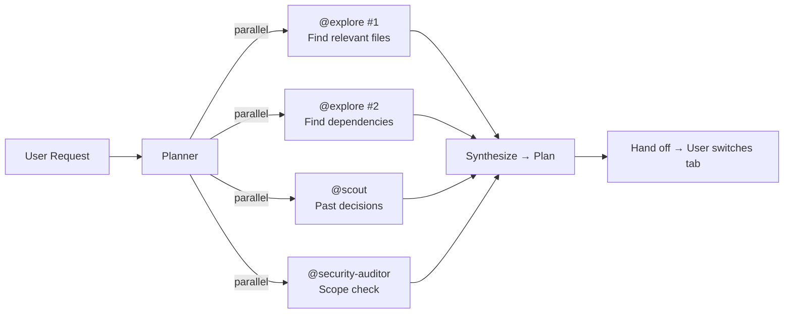
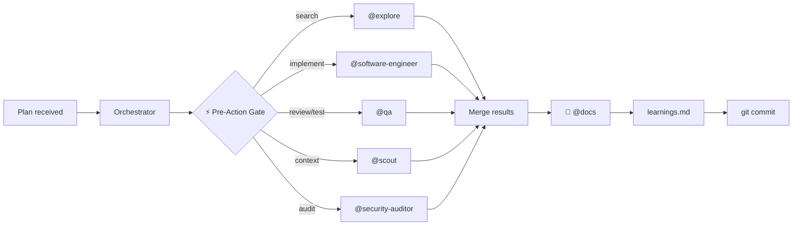

# Agent Architecture

## Overview

Nine agents total: 2 primary, 7 subagents. The **planner** researches and produces plans (read-only). The **orchestrator** coordinates execution — it NEVER writes code directly, always delegating to subagents. Six specialized subagents handle search, context, implementation, review, documentation, and security.


## Agent Table

| Agent | Type | Model | Provider | Access | Purpose |
|-------|------|-------|----------|--------|---------|
| **ingenium-planner** | Primary | `deepseek/deepseek-v4-pro` | DeepSeek API | Read-only | Mastermind — analyzes, delegates research, produces execution plan |
| **ingenium-orchestrator** | Primary | `deepseek/deepseek-v4-flash` | DeepSeek API | Full R/W | Coordinator — delegates ALL work to subagents, never writes code directly |
| **ingenium-plan-file** | Subagent | `deepseek/deepseek-v4-flash` | DeepSeek API | Read/Write (plan.md only) | Single-purpose — manages `plan.md` at project root. Created/updated/deleted only by planner instruction |
| **ingenium-explore** | Subagent | `deepseek/deepseek-v4-flash` | DeepSeek API | Read-only | Codebase search — grep, glob, file discovery, pattern analysis |
| **ingenium-scout** | Subagent | `lmstudio/qwopus3.5-9b-coder` | LM Studio | Read-only | Thread/RAG persistent memory — past decisions, preferences |
| **ingenium-software-engineer** | Subagent | `opencode/deepseek-v4-flash-free` | OpenCode Zen | Read/Write | **Writes all code** — implementation, refactoring, bug fixes. Also: design review, technical analysis |
| **ingenium-qa** | Subagent | `opencode/deepseek-v4-flash-free` | OpenCode Zen | Write tests | Code review + test authoring. Does NOT write production code |
| **ingenium-docs** | Subagent | `opencode/deepseek-v4-flash-free` | OpenCode Zen | Write docs | Documentation + skill updates + learnings.md entries |
| **ingenium-security-auditor** | Subagent | `deepseek/deepseek-v4-flash` | DeepSeek API | Bash + read-only | Security audit + git-history leak scanning |

---

## Lifecycle: What Triggers What

| # | Phase | Trigger | Agent | Action |
|---|-------|---------|-------|--------|
| 1 | **Research** | User request | Planner | Spawns explore(2x) + scout + security-auditor in parallel → synthesizes plan |
| 2 | **Handoff** | Plan complete | User | Tabs to orchestrator |
| 3 | **Pre-Action Gate** | EVERY tool use | Orchestrator | ⚡ Checks: "Should a subagent do this?" before any tool call |
| 4 | **Code writing** | Implementation needed | Orchestrator → **Software-Engineer** | Implements code, self-verifies (tests/type-check), returns results |
| 5 | **Review + test** | Code written | Orchestrator → **QA** | Reviews quality, writes tests, returns findings |
| 6 | **Security audit** | Sensitive changes | Orchestrator → **Security-Auditor** | Scans for secrets, auth issues, CI vulnerabilities |
| 7 | **Documentation** | After EVERY change | Orchestrator → **Docs** | Updates docs/, logs to learnings.md — mandatory, never skipped |
| 8 | **Commit** | All subagents done | Orchestrator (bash) | `git add/commit/push` — the ONLY bash the orchestrator runs |
| 9 | **Learnings** | After commit | Orchestrator → **Docs** | Captures hash, appends to learnings.md, syncs deploy |

---

## Per-Agent Profiles

### @ingenium-planner — Mastermind

| Property | Value |
|----------|-------|
| **Model** | DeepSeek V4 Pro |
| **Access** | Read-only |
| **Invoked by** | User (Tab key) |
| **Triggers** | User request: "Plan X", "Analyze Y", "Research Z" |
| **Can spawn** | `@ingenium-explore`, `@ingenium-scout`, `@ingenium-security-auditor`, `@ingenium-docs`, `@ingenium-plan-file` |

| Phase | Action | Delegates to |
|-------|--------|-------------|
| 0. Resume check | Check for `plan.md` at project root — may be resuming interrupted plan | explore |
| 1. Understand | Parse user request, identify scope and constraints | — |
| 2. Delegate | Spawn 2-4 subagents in parallel | explore ×2, scout, security-auditor |
| 3. Analyze | Read files subagents identified, synthesize findings | — |
| 4. Plan | Produce step-by-step plan (files, subagents, order, tests, docs) | — |
| 5. Persist & hand off | Save plan to `plan.md`, hand off to orchestrator | plan-file |

**Planner HARD RULEs:**
- 🔴 Never search code, grep, or glob directly — always delegate to explore
- 🔴 Never access general subagent or circumvent read-only restrictions
- 🔴 Produce the full plan in the handoff message for the orchestrator to read
- 🔴 Persist the plan to `plan.md` via @ingenium-plan-file after every plan

### @ingenium-orchestrator — Coordinator

| Property | Value |
|----------|-------|
| **Model** | DeepSeek V4 Flash |
| **Access** | Full R/W |
| **Invoked by** | User (Tab key) |
| **Triggers** | User: "Execute", "Go ahead", "Implement", or provides a plan |
| **Can spawn** | ALL 7 subagents |
| **Direct bash** | ONLY: `git add/commit/push`, `git rev-parse`, test/build verification |

| Phase | Action | Delegates to |
|-------|--------|-------------|
| 1. Detect plan | Scan messages for planner's plan + check `plan.md` at project root | explore (reads plan.md) |
| 2. Split work | Identify subagents needed, parallelize | — |
| 3. Delegate | Spawn subagents for ALL work | explore, software-engineer, qa, docs, security-auditor, scout |
| 4. Merge | Collect findings, resolve conflicts | — |
| 5. Verify | Run tests and type-checks via bash | — |
| 6. Document | 🔴 Mandatory: spawn docs after every change | docs |
| 7. Learnings | Log to learnings.md with commit hash | docs |
| 8. Clear plan | Clear `plan.md` after completion | plan-file |
| 9. Commit | git add/commit/push | — |

**Orchestrator Controls (5-layer enforcement):**

| Layer | Mechanism | Frequency |
|-------|-----------|-----------|
| 1. Always-visible primer | `opencode.json` → `orchestrator-primer/SKILL.md` injected into system prompt | Every turn |
| 2. ⚡ Pre-Action Gate | "Should a subagent do this?" check before ANY tool use | Every tool call |
| 3. 🔴 Anti-Patterns table | 7 common violations with before/after examples | Read at session start |
| 4. 🔴 Periodic Self-Audit | "Am I following delegation rules?" | Every 5 tool calls |
| 5. Post-tool-use hook | "📋 Log to learnings.md" reminder | Every 5 calls |

### @ingenium-explore — Codebase Search

| Property | Value |
|----------|-------|
| **Model** | DeepSeek V4 Flash |
| **Access** | Read-only |
| **Invoked by** | Planner, Orchestrator, or user `@` mention |
| **Triggers** | "Find files X", "Search for pattern Y", "Explore codebase Z" |

| Capability | Tools | Output |
|-----------|-------|--------|
| File discovery | `glob` | File path list |
| Content search | `grep` | Matching lines with file paths |
| Pattern analysis | Both + `read` | Categorized findings |
| Structure mapping | Multiple globs | Directory trees, dependency maps |

### @ingenium-scout — Thread Context

| Property | Value |
|----------|-------|
| **Model** | qwopus 3.5 9B Coder (LM Studio) |
| **Access** | Read-only |
| **Invoked by** | Planner, Orchestrator, or user `@` mention |
| **Triggers** | "Check past decisions", "What did we do before?", "Search Thread for X" |

| Capability | Tools | Output |
|-----------|-------|--------|
| Session search | `thread_search` | Ranked results with highlights |
| Entry retrieval | `thread_read_entries` | Full entry content |
| Decision tracking | All Thread tools | Past decisions, preferences, constraints |
| Context upload | `thread_create_entry` | Save new findings to Thread |

### @ingenium-software-engineer — Code Implementation

| Property | Value |
|----------|-------|
| **Model** | DeepSeek V4 Flash (OpenCode Zen free) |
| **Access** | Read/Write (`edit: allow`, `write: allow`) |
| **Invoked by** | Orchestrator only |
| **Triggers** | "Write code X", "Implement feature Y", "Fix bug Z", "Refactor W" |

| Phase | Action | Tools |
|-------|--------|-------|
| 1. Understand | Read task context, review relevant files | `read`, `glob` |
| 2. Research | For complex tasks, delegate to scout/explore for patterns | `task` (spawns scout/explore) |
| 3. Implement | Write production code | `write`, `edit` |
| 4. Self-verify | Run type-checks, lints, tests | `bash` |
| 5. Return | Structured output: summary, files changed, verification results | — |

**Responsibilities:**
- ✅ Write production code (features, fixes, refactors)
- ✅ Design review and technical analysis
- ✅ Self-verify (tests, type-check, lint)
- ❌ Does NOT write tests (→ QA)
- ❌ Does NOT do code review (→ QA)
- ❌ Does NOT update docs (→ Docs)

### @ingenium-qa — Review & Testing

| Property | Value |
|----------|-------|
| **Model** | DeepSeek V4 Flash (OpenCode Zen free) |
| **Access** | Write tests (`edit: allow`) |
| **Invoked by** | Orchestrator only |
| **Triggers** | "Review code X", "Write tests for Y", "QA check on Z" |

| Phase | Action | Tools |
|-------|--------|-------|
| 1. Review | 5-lens code review (security, correctness, performance, readability, testing) | `read`, `grep` |
| 2. Test | Write unit/integration/E2E tests | `write`, `edit` |
| 3. Verify | Run tests to confirm they pass | `bash` |
| 4. Report | Return findings with severity levels | — |

**Responsibilities:**
- ✅ Code review (5-lens)
- ✅ Test authoring (unit, integration, E2E)
- ✅ Quality assurance feedback
- ❌ Does NOT write production code (→ Software-Engineer)
- ❌ Does NOT update docs (→ Docs)

### @ingenium-docs — Documentation & Learning System

| Property | Value |
|----------|-------|
| **Model** | DeepSeek V4 Flash (OpenCode Zen free) |
| **Access** | Write docs (`edit: allow`) |
| **Invoked by** | Orchestrator only |
| **Triggers** | 🔴 After EVERY code change (mandatory, never skipped) |

| Phase | Action | Tools |
|-------|--------|-------|
| 1. Receive context | Parse changed files, what changed, which docs need updating | — |
| 2. Map changes | Use trigger table from generic-conventions to determine affected docs | `read` |
| 3. Update docs | Targeted updates — never regenerate entire docs | `write`, `edit` |
| 4. Run skill workflows | `update-skills`, `update-skill-index`, `audit-skills` | `read` + `write` |
| 5. Write learnings | Append to `.agents/skills/learnings.md` with commit hash | `edit` |
| 6. Report | Tell orchestrator what was updated | — |

**Trigger Table:**

| Changed files | Update these docs |
|--------------|------------------|
| `.agents/skills/*/SKILL.md` | `docs/ARCHITECTURE.md`, `docs/CONVENTIONS.md`, `docs/README.md` |
| `.agents/scripts/` | `docs/ARCHITECTURE.md` |
| `deploy/` (structure/files) | `docs/ARCHITECTURE.md` |
| `tests/` (test infra) | `docs/TECH-STACK.md` |
| `README.md`, `USAGE.md`, `AGENTS.md` | `docs/README.md` |
| `.opencode/agents/*.md` | `docs/agents.md`, `docs/ARCHITECTURE.md` |
| `.agents/hooks/*.json` | `docs/ARCHITECTURE.md` |
| Any significant change | `.agents/skills/learnings.md` |

### @ingenium-security-auditor — Security Audit

| Property | Value |
|----------|-------|
| **Model** | DeepSeek V4 Flash |
| **Access** | Bash + read-only |
| **Invoked by** | Planner, Orchestrator, or user `@` mention |
| **Triggers** | "Audit X", "Check for secrets", "Security review of Y" |

| Phase | Action | Tools |
|-------|--------|-------|
| 1. Audit | Review code for vulnerabilities, secrets, insecure patterns | `read`, `grep`, `glob` |
| 2. Git history scan | `git log -p -S "<secret>"` for leaked secrets in history | `bash` |
| 3. GitHub scan | `gh api` for GitHub secret scanning results | `bash` |
| 4. Report | Findings with severity, commit hashes, remediation | `write` |

---

## Workflow

### Phase 1: Planner (Research → Plan)



### Phase 2: Orchestrator (Execute → Commit)



---

## Compute Split

| Resource | Agents | Count | Cost |
|----------|--------|-------|------|
| DeepSeek V4 Pro (API) | `ingenium-planner` | 1 | Paid |
| DeepSeek V4 Flash (API) | `ingenium-orchestrator`, `ingenium-explore`, `ingenium-security-auditor` | 3 | Paid |
| DeepSeek V4 Flash (OpenCode Zen free) | `ingenium-software-engineer`, `ingenium-qa`, `ingenium-docs`, `ingenium-plan-file` | 4 | Free |
| qwopus 3.5 9B Coder (LM Studio) | `ingenium-scout` | 1 | Local |

## Subagent Invocation

Primary agents invoke subagents via the Task tool automatically. All subagents can also be invoked directly via `@` mention.

| Subagent | `@` mention | Access | Invokable by |
|----------|-------------|--------|--------------|
| ingenium-explore | `@ingenium-explore` | Read-only | planner + orchestrator + user |
| ingenium-scout | `@ingenium-scout` | Read-only | planner + orchestrator + user |
| ingenium-security-auditor | `@ingenium-security-auditor` | Bash + read-only | planner + orchestrator + user |
| ingenium-software-engineer | `@ingenium-software-engineer` | Read/Write | orchestrator only |
| ingenium-qa | `@ingenium-qa` | Write tests | orchestrator only |
| ingenium-docs | `@ingenium-docs` | Write docs | orchestrator only |
| ingenium-plan-file | `@ingenium-plan-file` | Read/Write (plan.md only) | planner only |

## How to Use the Pipeline

### Switching Primary Agents

You have **two primary agents** — switch between them with the **Tab** key:

| Primary | Tab to | Use when you want to... |
|---------|--------|------------------------|
| **ingenium-planner** | Tab | Analyze, research, produce a plan. Read-only — no accidental edits. |
| **ingenium-orchestrator** | Tab | Execute the plan. Coordinates subagents — never writes code directly. |

### Typical Workflow

```
1. Tab → ingenium-planner
   You: "Plan the addition of OAuth to the API"
   Planner: auto-invokes @ingenium-explore (×2), @ingenium-scout, @ingenium-security-auditor
            returns a step-by-step plan with files, subagent assignments, testing strategy

2. Tab → ingenium-orchestrator  
   You: "Execute that plan"
   Orchestrator: runs ⚡ Pre-Action Gate for every step:
     • @ingenium-explore           — finds relevant files
     • @ingenium-software-engineer — writes production code
     • @ingenium-qa                — reviews code + writes tests
     • @ingenium-security-auditor   — audits for secrets/vulnerabilities
     • @ingenium-docs               — updates docs + learnings.md (mandatory after every change)
     • git commit                   — the ONLY bash the orchestrator runs directly
```

### Manual Subagent Invocation

At any time, you can `@`-mention a subagent directly:

```
@ingenium-explore find all API route definitions
@ingenium-scout search Thread for past decisions about rate limiting
@ingenium-security-auditor audit the auth flow for vulnerabilities
```

This opens a child session. Navigate with:
- **Right** → next child session
- **Left** → previous child session  
- **Up** → return to parent session

### Automatic Delegation Examples

| You say... | Planner auto-delegates | Orchestrator auto-delegates |
|------------|----------------------|---------------------------|
| "Plan the addition of OAuth" | explore (×2), scout, security-auditor | — |
| "Execute that plan" | — | explore, software-engineer, qa, docs, security-auditor, scout |
| "Add rate limiting to auth routes" | explore (find routes), scout (past context) | explore, software-engineer (implement), qa (review+test), docs, scout |
| "Audit the repo for security issues" | security-auditor, explore | security-auditor, explore, scout |
