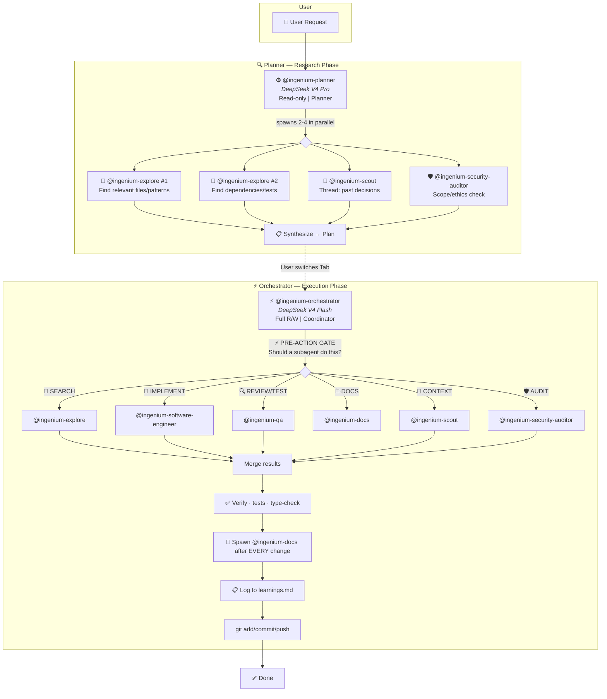
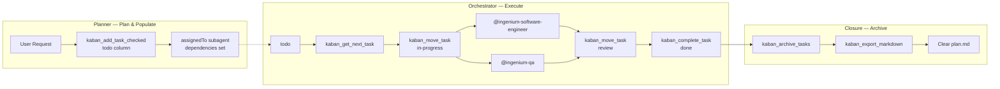
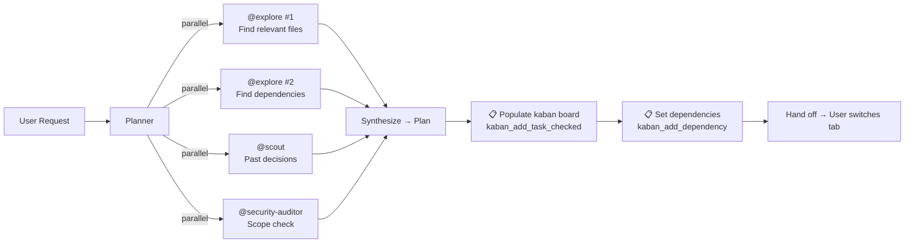
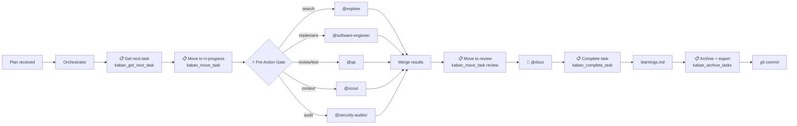

# Agent Architecture

## Overview

Twelve agents total: 2 primary, 10 subagents. The **planner** researches and produces plans (read-only), populating the kaban board with tasks. The planner ONLY spawns research subagents (explore, scout, security-auditor) — it never executes work directly. The **orchestrator** coordinates execution — it NEVER writes code directly, always delegating to subagents. Ten specialized subagents handle search, context, prompt engineering, implementation (3 tiers), review, documentation, plan management, and security.



## Agent Table

| Agent | Type | Model | Provider | Access | Purpose |
|-------|------|-------|----------|--------|---------|
| **ingenium-planner** | Primary | `deepseek/deepseek-v4-pro` | DeepSeek API | Read-only | Planner — plans sprints, decomposes feature requests, populates kaban board |
| **ingenium-orchestrator** | Primary | `deepseek/deepseek-v4-flash` | DeepSeek API | Full R/W | Coordinator — delegates ALL work to subagents, never writes code directly |
| **ingenium-prompt-engineer** | Subagent | `deepseek/deepseek-v4-flash` | DeepSeek API | Read-only | Prompt Engineer — analyzes and improves prompts using a structured evaluation framework |
| **ingenium-plan-file** | Subagent | `deepseek/deepseek-v4-flash` | DeepSeek API | Read/Write (plan.md only) | Single-purpose — manages `plan.md` at project root. Created/updated/deleted only by planner instruction |
| **ingenium-explore** | Subagent | `deepseek/deepseek-v4-flash` | DeepSeek API | Read-only | Codebase search — grep, glob, file discovery, pattern analysis |
| **ingenium-scout** | Subagent | `lmstudio/qwopus3.5-9b-coder` | LM Studio | Read-only | Thread/RAG persistent memory — past decisions, preferences |
| **ingenium-software-engineer** | Subagent | `opencode/deepseek-v4-flash-free` | OpenCode Zen | Read/Write (`edit: allow, write: allow`) | **Writes all code** — implementation, refactoring, bug fixes. Also: design review, technical analysis |
| **ingenium-software-engineer-fast** | Subagent | `opencode/deepseek-v4-flash-free` | OpenCode Zen | Read/Write (`edit: allow, write: allow`) | Standard bug fixes, simple refactors, test authoring, straightforward tasks |
| **ingenium-software-engineer-premium** | Subagent | `deepseek/deepseek-v4-pro` | DeepSeek API | Read/Write (`edit: allow, write: allow`) | Complex multi-file refactoring, architectural changes, performance-critical code |
| **ingenium-qa** | Subagent | `opencode/deepseek-v4-flash-free` | OpenCode Zen | Edit (`edit: allow`) | Code review + test verification. Reviews tests written by @ingenium-software-engineer. Does NOT write production code |
| **ingenium-docs** | Subagent | `opencode/deepseek-v4-flash-free` | OpenCode Zen | Edit + Write (`edit: allow, write: allow, bash: deny`) | Documentation + skill updates + learnings.md entries |
| **ingenium-security-auditor** | Subagent | `deepseek/deepseek-v4-flash` | DeepSeek API | Bash + read-only (`write: deny`) | Security audit + git-history leak scanning |

---

## Lifecycle: What Triggers What

| # | Phase | Trigger | Agent | Action |
|---|-------|---------|-------|--------|
| 1 | **Research** | User request | Planner | Spawns explore(2x) + scout + security-auditor in parallel → synthesizes plan, populates kaban board |
| 2 | **Handoff** | Plan complete | User | Tabs to orchestrator |
| 3 | **Pre-Action Gate** | EVERY tool use | Orchestrator | ⚡ Checks: "Should a subagent do this?" before any tool call |
| 4 | **Code writing** | Implementation needed | Orchestrator → **Software-Engineer** | Implements code, self-verifies (tests/type-check), returns results |
| 5 | **Review + test** | Code written | Orchestrator → **QA** | Reviews quality, writes tests, returns findings |
| 6 | **Security audit** | Sensitive changes | Orchestrator → **Security-Auditor** | Scans for secrets, auth issues, CI vulnerabilities |
| 7 | **Documentation** | After EVERY change | Orchestrator → **Docs** | Updates docs/, logs to learnings.md — mandatory, never skipped |
| 8 | **Commit** | All subagents done | Orchestrator (bash) | `git add/commit/push` — the ONLY bash the orchestrator runs |
| 9 | **Learnings** | After commit | Orchestrator → **Docs** | Captures hash, appends to learnings.md |

---

## Kaban Board Integration

The kaban board is the authoritative work tracking system for the agent pipeline. Tasks flow through a structured lifecycle managed by the planner and orchestrator:



### Lifecycle Steps

| Step | Agent | Action | Kaban Tool | Todowrite Mirror |
|------|-------|--------|-----------|-----------------|
| 1 | Planner | Creates tasks with subagent assignments and dependencies | `kaban_add_task_checked`, `kaban_add_dependency` | — |
| 2 | Orchestrator | Reads next high-priority work item from todo column | `kaban_get_next_task` | Mark `in_progress` |
| 3 | Orchestrator | Claims task, marks as active, spawns subagent | `kaban_move_task <id> in-progress` | Mark `in_progress` |
| 4 | Subagent | Implements, reviews, or documents the work | — | — |
| 5 | Orchestrator | Moves task to review column after subagent completes | `kaban_move_task <id> review` | Mark `pending` (for QA) |
| 6 | Orchestrator | Marks task complete after QA approval | `kaban_complete_task <id>` | Mark `completed` |
| 7 | Orchestrator | Archives finished tasks and exports board state | `kaban_archive_tasks`, `kaban_export_markdown` | — |

### Column Mapping

| Column | State | Who moves | Description |
|--------|-------|-----------|-------------|
| `todo` | Pending | Planner (create) | Work not yet started, ordered by priority |
| `in-progress` | Active | Orchestrator | Subagent is actively working on this task |
| `review` | Under review | Orchestrator | QA review or peer verification needed |
| `done` | Complete | Orchestrator | Finished, verified, ready for archive |

### Rules

- **Planner creates all tasks** during planning — orchestrator never creates tasks, only reads and moves them
- **Orchestrator reads** `kaban_get_next_task` before starting each work unit — never picks work from memory
- **Tasks flow through** `todo → in-progress → review → done` — no skipping columns
- **`kaban_archive_tasks`** runs at session end after all tasks are complete
- **The board is authoritative** — All task state lives in kaban; `todowrite` is a secondary mirror for in-session OpenCode visibility
- **Todowrite mirror** — At every kaban transition (get-next-task, move-to-in-progress, move-to-review, complete), the orchestrator also updates `todowrite` to reflect the same state. This ensures dual visibility: kaban for persistence, todowrite for the OpenCode native todo UI
- **Dependencies** are set via `kaban_add_dependency` to enforce ordering (e.g., QA must wait for implementation)

---

## Per-Agent Profiles

### @ingenium-planner — Planner

| Property | Value |
|----------|-------|
| **Model** | DeepSeek V4 Pro |
| **Access** | Read-only |
| **Invoked by** | User (Tab key) |
| **Triggers** | User request: "Plan X", "Analyze Y", "Research Z" |
| **Can spawn** | `@ingenium-explore`, `@ingenium-scout`, `@ingenium-security-auditor`, `@ingenium-prompt-engineer` (read-only agents only) |

| Phase | Action | Delegates to |
|-------|--------|-------------|
| 0. Resume check | Check for `plan.md` at project root — may be resuming interrupted plan | explore |
| 1. Understand | Parse user request, identify scope and constraints | — |
| 1.5. Probe | Ask clarifying questions before research; restate understanding, list assumptions, define scope boundaries | — |
| 2. Delegate | Spawn 2-4 subagents in parallel | explore ×2, scout, security-auditor |
| 3. Analyze | Read files subagents identified, synthesize findings | — |
| 4. Plan | Produce step-by-step plan (files, subagents, order, tests, docs) | — |
| 5. Persist & hand off | Save plan to `plan.md`, hand off to orchestrator | plan-file |

**Probing workflow (§1.5):** Before spawning ANY research subagents, the planner must validate its understanding with the user. This prevents wasted research on misunderstood requirements. The probe step requires at least 3 of 9 clarifying questions (priority, constraints, success criteria, stakeholders, deadlines, risks, out-of-scope, testing preferences, sprint split). It also runs three validation checks:
1. **Restatement** — "Here's what I understand you want. Is that correct?"
2. **Assumptions** — "I am assuming X, Y, Z. Are these safe?"
3. **Scope** — "I will NOT work on A, B. Confirm?"

The `question` tool is used for structured choice questions; freeform text for open-ended ones. The agent waits for user responses before proceeding — no research happens before probe completion.

**Planner HARD RULEs:**
- 🔴 **You Are a Planner, NOT an Executor** — You ONLY spawn READ-ONLY agents (explore, scout, security-auditor, ingenium-prompt-engineer). You NEVER write code, edit files, or run implementation agents.
- 🔴 Never search code, grep, or glob directly — always delegate to explore
- 🔴 Never access general subagent or circumvent read-only restrictions
- 🔴 **Ask Before You Plan** — Never spawn research subagents without first asking clarifying questions. Ambiguous requests must be resolved before delegation
- 🔴 Produce the full plan in the handoff message for the orchestrator to read
- 🔴 Persist the plan to `plan.md` via @ingenium-plan-file after every plan
- 🔴 Populate the kaban board with tasks after every plan
- 🔴 Every plan must include a **Risks** section with likelihood/impact/mitigation for each identified risk

### @ingenium-orchestrator — Coordinator

| Property | Value |
|----------|-------|
| **Model** | DeepSeek V4 Flash |
| **Access** | Full R/W |
| **Invoked by** | User (Tab key) |
| **Triggers** | User: "Execute", "Go ahead", "Implement", or provides a plan |
| **Can spawn** | ALL 10 subagents (ingenium-prompt-engineer, explore, scout, security-auditor, software-engineer, software-engineer-fast, software-engineer-premium, qa, docs, plan-file) plus the Multi-Model software engineer variants (fast, premium) |
| **Direct bash** | ONLY: `git add/commit/push`, `git rev-parse`, test/build verification |

| Phase | Action | Delegates to |
|-------|--------|-------------|
| 1. Detect plan + board | Scan messages for planner's plan + check `plan.md` + call `kaban_get_next_task` | explore (reads plan.md) |
| 2. Split + create tasks | Identify subagents needed, parallelize, call `kaban_add_task_checked` for each work unit | — |
| 3. Delegate | Spawn subagents for ALL work, call `kaban_move_task <id> in-progress` for each | explore, software-engineer, qa, docs, security-auditor, scout |
| 4. Merge + review | Collect findings, resolve conflicts, call `kaban_move_task <id> review`, spawn QA | qa |
| 5. QA gate | QA passes → call `kaban_complete_task <id>`; QA fails → re-delegate | qa |
| 6. Verify | Run tests and type-checks via bash | — |
| 7. Document | 🔴 Mandatory: spawn docs after every change | docs |
| 8. Learnings | Log to learnings.md with commit hash | docs |
| 9. Board closure | Call `kaban_archive_tasks` + `kaban_export_markdown`, clear `plan.md` | plan-file |
| 10. Commit | git add/commit/push | — |

**Orchestrator Controls (6-layer enforcement):**

| Layer | Mechanism | Frequency |
|-------|-----------|-----------|
| 1. Always-visible primer | `opencode.json` → `orchestrator-primer/SKILL.md` injected into system prompt | Every turn |
| 2. ⚡ Pre-Action Gate | "Should a subagent do this?" check before ANY tool use | Every tool call |
| 3. 🔴 Anti-Patterns table | 7 common violations with before/after examples | Read at session start |
| 4. 🔴 Periodic Self-Audit | "Am I following delegation rules?" — now includes kaban board check | Every 5 tool calls |
| 5. Post-tool-use hook | "📋 Log to learnings.md" reminder | Every 5 calls |
| 6. 🔴 Kaban Board | Board-based work tracking — `kaban_get_next_task` → move through columns → `kaban_complete_task` | Every work unit |

### @ingenium-explore — Codebase Search

| Property | Value |
|----------|-------|
| **Model** | DeepSeek V4 Flash |
| **Access** | Read-only |
| **Invoked by** | Planner, Orchestrator, or user `@` mention |
| **Triggers** | "Find files X", "Search for pattern Y", "Explore codebase Z" |

| Capability | Tools | Output |
|-----------|-------|--------|
| File discovery | `glob` | File path list |
| Content search | `grep` | Matching lines with file paths |
| Pattern analysis | Both + `read` | Categorized findings |
| Structure mapping | Multiple globs | Directory trees, dependency maps |

### @ingenium-scout — Thread Context

| Property | Value |
|----------|-------|
| **Model** | qwopus 3.5 9B Coder (LM Studio) |
| **Access** | Read-only |
| **Invoked by** | Planner, Orchestrator, or user `@` mention |
| **Triggers** | "Check past decisions", "What did we do before?", "Search Thread for X" |

| Capability | Tools | Output |
|-----------|-------|--------|
| Session search | `thread_search` | Ranked results with highlights |
| Entry retrieval | `thread_read_entries` | Full entry content |
| Decision tracking | All Thread tools | Past decisions, preferences, constraints |
| Context upload | `thread_create_entry` | Save new findings to Thread |

### @ingenium-software-engineer — Code Implementation

| Property | Value |
|----------|-------|
| **Model** | DeepSeek V4 Flash (OpenCode Zen free) |
| **Access** | Read/Write (`edit: allow`, `write: allow`) |
| **Invoked by** | Orchestrator only |
| **Triggers** | "Write code X", "Implement feature Y", "Fix bug Z", "Refactor W" |

| Phase | Action | Tools |
|-------|--------|-------|
| 1. Understand | Read task context, review relevant files | `read`, `glob` |
| 2. Research | For complex tasks, delegate to scout/explore for patterns | `task` (spawns scout/explore) |
| 3. Implement | Write production code AND tests | `write`, `edit` |
| 4. Self-verify | Run type-checks, lints, tests | `bash` |
| 5. Return | Structured output: summary, files changed, verification results | — |

**Responsibilities:**
- ✅ Write production code (features, fixes, refactors)
- ✅ Write tests alongside production code (unit, integration, E2E)
- ✅ Design review and technical analysis
- ✅ Self-verify (tests, type-check, lint)
- ❌ Does NOT do code review (→ QA)
- ❌ Does NOT update docs (→ Docs)

### Multi-Model Software Engineer Variants

The orchestrator can choose between three software engineer agents depending on task complexity and cost:

| Variant | Model | Reasoning | Use for |
|---------|-------|-----------|---------|
| `@ingenium-software-engineer-fast` | `deepseek/deepseek-v4-flash` | Medium | Standard bug fixes, simple refactors, doc code blocks, test authoring, straightforward tasks |
| `@ingenium-software-engineer` (default) | `deepseek/deepseek-v4-flash` | High | General-purpose implementation — use when unsure which variant |
| `@ingenium-software-engineer-premium` | `deepseek/deepseek-v4-pro` | xhigh | Complex multi-file refactoring, architectural changes, performance-critical code, security-sensitive work |

All three variants share the same permissions (`edit: allow`, `write: allow`) and skill set. The differentiation is purely in model capability and reasoning effort. The orchestrator's delegation table provides tier guidance: fast for standard work, premium for complex/risky, default when unsure.

Model assignments are centralized in `.agents/models.yaml` — the human-editable source of truth for all agent model configurations. See `docs/ARCHITECTURE.md` for the full model configuration convention.

### @ingenium-qa — Review & Testing

| Property | Value |
|----------|-------|
| **Model** | DeepSeek V4 Flash (OpenCode Zen free) |
| **Access** | Edit (`edit: allow`) |
| **Invoked by** | Orchestrator only |
| **Triggers** | "Review code X", "Verify tests for Y", "QA check on Z" |

| Phase | Action | Tools |
|-------|--------|-------|
| 1. Review | 5-lens code review (security, correctness, performance, readability, testing) | `read`, `grep` |
| 2. Verify tests | Review unit/integration/E2E tests written by SE | `read`, `grep` |
| 3. Report | Return findings with severity levels | — |

**Responsibilities:**
- ✅ Code review (5-lens)
- ✅ Test verification (review tests written by Software-Engineer for coverage, quality, edge cases)
- ✅ Quality assurance feedback
- ❌ Does NOT author tests (→ Software-Engineer)
- ❌ Does NOT write production code (→ Software-Engineer)
- ❌ Does NOT update docs (→ Docs)

### @ingenium-docs — Documentation & Learning System

| Property | Value |
|----------|-------|
| **Model** | DeepSeek V4 Flash (OpenCode Zen free) |
| **Access** | Edit + Write (`edit: allow, write: allow, bash: deny`) |
| **Invoked by** | Orchestrator only |
| **Triggers** | 🔴 After EVERY code change (mandatory, never skipped) |

| Phase | Action | Tools |
|-------|--------|-------|
| 1. Receive context | Parse changed files, what changed, which docs need updating | — |
| 2. Map changes | Use trigger table from generic-conventions to determine affected docs | `read` |
| 3. Update docs | Targeted updates — never regenerate entire docs | `write`, `edit` |
| 4. Run skill workflows | `update-skills`, `update-skill-index`, `audit-skills` | `read` + `write` |
| 5. Write learnings | Append to `.agents/skills/learnings.md` with commit hash | `edit` |
| 6. Report | Tell orchestrator what was updated | — |

**Trigger Table:**

| Changed files | Update these docs |
|--------------|------------------|
| `.agents/skills/*/SKILL.md` | `docs/ARCHITECTURE.md`, `docs/CONVENTIONS.md`, `docs/README.md` |
| `.agents/scripts/` | `docs/ARCHITECTURE.md` |
| `tests/` (test infra) | `docs/TECH-STACK.md` |
| `README.md`, `USAGE.md`, `AGENTS.md` | `docs/README.md` |
| `.opencode/agents/*.md` | `docs/agents.md`, `docs/ARCHITECTURE.md` |
| `.agents/hooks/*.json` | `docs/ARCHITECTURE.md` |
| Any significant change | `.agents/skills/learnings.md` |

### @ingenium-security-auditor — Security Audit

| Property | Value |
|----------|-------|
| **Model** | DeepSeek V4 Flash |
| **Access** | Bash + read-only (`write: deny`) |
| **Invoked by** | Planner, Orchestrator, or user `@` mention |
| **Triggers** | "Audit X", "Check for secrets", "Security review of Y" |

| Phase | Action | Tools |
|-------|--------|-------|
| 1. Audit | Review code for vulnerabilities, secrets, insecure patterns | `read`, `grep`, `glob` |
| 2. Git history scan | `git log -p -S "<secret>"` for leaked secrets in history | `bash` |
| 3. Report | Findings with severity, commit hashes, remediation | `write` |

---

## Workflow

### Phase 1: Planner (Research → Plan → Kaban Board)



### Phase 2: Orchestrator (Execute → Commit)



---

## Compute Split

| Resource | Agents | Count | Cost |
|----------|--------|-------|------|
| DeepSeek V4 Pro (API) | `ingenium-planner`, `ingenium-software-engineer-premium` | 2 | Paid |
| DeepSeek V4 Flash (API) | `ingenium-orchestrator`, `ingenium-explore`, `ingenium-security-auditor`, `ingenium-prompt-engineer` | 4 | Paid |
| DeepSeek V4 Flash (OpenCode Zen free) | `ingenium-software-engineer`, `ingenium-software-engineer-fast`, `ingenium-qa`, `ingenium-docs`, `ingenium-plan-file` | 5 | Free |
| qwopus 3.5 9B Coder (LM Studio) | `ingenium-scout` | 1 | Local |

**Model configuration source of truth**: All model assignments are centralized in `.agents/models.yaml`. This file defines model aliases (`fast`, `capable`, `premium`, `local`, `budget`), agent-to-model mappings, and reasoning effort overrides per agent. Changes should be made here first, then propagated to each agent's `.md` frontmatter `model:` field. See `docs/ARCHITECTURE.md` for the full model configuration convention.

## Subagent Invocation

Primary agents invoke subagents via the Task tool automatically. All subagents can also be invoked directly via `@` mention.

| Subagent | `@` mention | Access | Invokable by |
|----------|-------------|--------|--------------|
| ingenium-explore | `@ingenium-explore` | Read-only | planner + orchestrator + user |
| ingenium-scout | `@ingenium-scout` | Read-only | planner + orchestrator + user |
| ingenium-prompt-engineer | `@ingenium-prompt-engineer` | Read-only | planner + user |
| ingenium-security-auditor | `@ingenium-security-auditor` | Bash + read-only | planner + orchestrator + user |
| ingenium-software-engineer | `@ingenium-software-engineer` | Read/Write | orchestrator only |
| ingenium-software-engineer-fast | `@ingenium-software-engineer-fast` | Read/Write | orchestrator only |
| ingenium-software-engineer-premium | `@ingenium-software-engineer-premium` | Read/Write | orchestrator only |
| ingenium-qa | `@ingenium-qa` | Edit (`edit: allow`) | orchestrator only |
| ingenium-docs | `@ingenium-docs` | Edit + Write (`edit: allow, write: allow, bash: deny`) | orchestrator only |
| ingenium-plan-file | `@ingenium-plan-file` | Read/Write (plan.md only) | planner only |

## How to Use the Pipeline

### Switching Primary Agents

You have **two primary agents** — switch between them with the **Tab** key:

| Primary | Tab to | Use when you want to... |
|---------|--------|------------------------|
| **ingenium-planner** | Tab | Sprint planning, research, produce plan, populate kaban board. Read-only — no accidental edits. |
| **ingenium-orchestrator** | Tab | Execute the plan. Coordinates subagents — never writes code directly. |

### Typical Workflow

```
1. Tab → ingenium-planner
   You: "Plan the addition of OAuth to the API"
   Planner: auto-invokes @ingenium-explore (×2), @ingenium-scout, @ingenium-security-auditor
            returns a step-by-step plan with files, subagent assignments, testing strategy

2. Tab → ingenium-orchestrator  
   You: "Execute that plan"
   Orchestrator: runs ⚡ Pre-Action Gate for every step:
     • @ingenium-explore           — finds relevant files
     • @ingenium-software-engineer — writes production code
     • @ingenium-qa                — reviews code + writes tests
     • @ingenium-security-auditor   — audits for secrets/vulnerabilities
     • @ingenium-docs               — updates docs + learnings.md (mandatory after every change)
     • git commit                   — the ONLY bash the orchestrator runs directly
```

### Manual Subagent Invocation

At any time, you can `@`-mention a subagent directly:

```
@ingenium-explore find all API route definitions
@ingenium-scout search Thread for past decisions about rate limiting
@ingenium-security-auditor audit the auth flow for vulnerabilities
```

This opens a child session. Navigate with:
- **Right** → next child session
- **Left** → previous child session  
- **Up** → return to parent session

### Automatic Delegation Examples

| You say... | Planner auto-delegates | Orchestrator auto-delegates |
|------------|----------------------|---------------------------|
| "Plan the addition of OAuth" | explore (×2), scout, security-auditor, kaban board population | — |
| "Execute that plan" | — | explore, software-engineer, qa, docs, security-auditor, scout |
| "Add rate limiting to auth routes" | explore (find routes), scout (past context) | explore, software-engineer (implement), qa (review+test), docs, scout |
| "Audit the repo for security issues" | security-auditor, explore | security-auditor, explore, scout |
