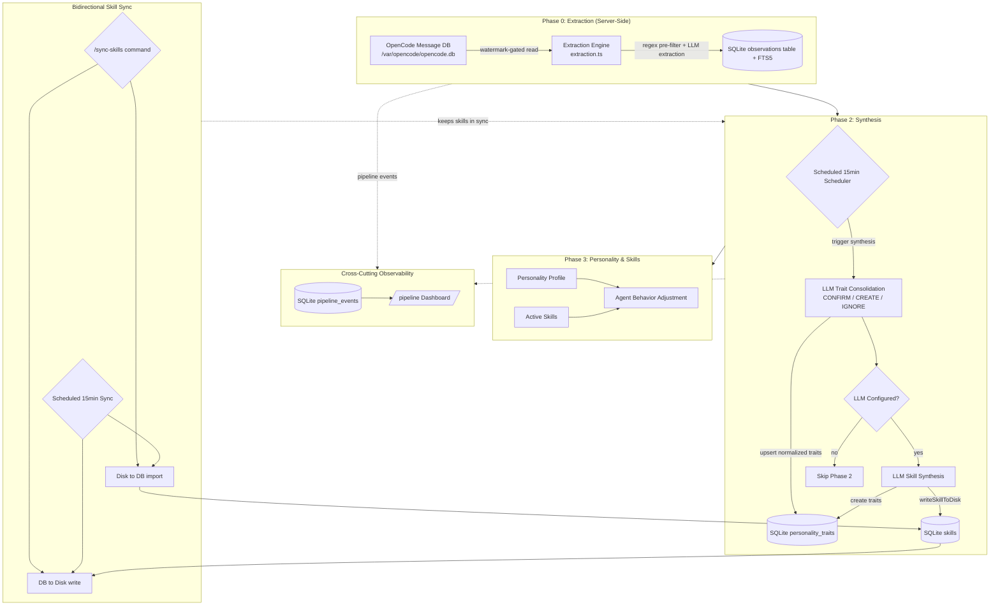

> **Note:** This document was relocated from `docs/self-learning-pipeline.md`. Please update your bookmarks.

# Self-Learning Pipeline Reference

A comprehensive guide to the Ingenium self-learning pipeline that replaced the old agent self-reporting system.

---

## 1. Overview

The **self-learning pipeline** is a three-phase architecture that enables agents to learn from user interactions and adapt their behavior over time. It replaced the deprecated `ingenium_learning_log` system with a more sophisticated observation-based approach.

### Why It Exists

- **Problem**: The old agent self-reporting system was inconsistent, lacked confidence tracking, and didn't distinguish between different types of user feedback
- **Solution**: A structured pipeline that captures observations via LLM-based extraction from OpenCode messages, consolidates them into personality traits, and maintains confidence scores over time



### Three-Phase Architecture

```
┌─────────────────────────────────────────────────────────────┐
│  PHASE 0: EXTRACTION (Server-Side)                          │
│  - Extraction engine reads OpenCode messages via API        │
│  - Watermark-gated, full-text content-hash dedup            │
│  - Regex pre-filter selects candidates, LLM extracts rules  │
│  - No-LLM = no observations (zero regex fallback garbage)   │
└─────────────────────────────────────────────────────────────┘
                           ↓
┌─────────────────────────────────────────────────────────────┐
│  PHASE 1: CONSOLIDATION                                     │
│  - LLM consolidation: CONFIRM / CREATE / IGNORE             │
│  - Traits become NORMALIZED statements (not raw snippets)   │
│  - Semantic merge prevents near-duplicate traits            │
│  - If LLM unavailable, observations stay PENDING            │
└─────────────────────────────────────────────────────────────┘
                           ↓
┌─────────────────────────────────────────────────────────────┐
│  PHASE 2: SKILL SYNTHESIS + PERSONALITY                     │
│  - Groups 3+ related observations → LLM creates skills     │
│  - Skills written to disk via writeSkillToDisk()            │
│  - LLM-suggested personality_traits actually created        │
│  - Confidence: 0.10–0.15 start, +0.15/confirmation,        │
│    cap 0.95, display gate ≥0.30, 7-day decay -0.05         │
│  - Cross-project: skills in 2+ projects promoted to global  │
└─────────────────────────────────────────────────────────────┘
```

---

## 2. Architecture Diagram

```
User interacts with OpenCode (:4098)
  │
  ├─ Agent uses ingenium_observe() during workflow (manual, for exceptional cases)
  │   → POST /api/v1/observations → stored in DB (status: pending)
  │
  ├─ Server-Side Extraction Engine (extraction.ts, runs in API scheduler)
  │   → reads OpenCode DB at /var/opencode/opencode.db via GET /api/v1/opencode/messages
  │   → watermark-gated read + full-text content-hash dedup prevents re-processing
  │     (hashes the entire message, not a 200-char slice)
  │   → cheap regex pre-filter selects candidate messages (NOT final extraction)
  │   → batches of 15 sent to synthesis LLM for durable behavior rule extraction
  │   → only LLM output becomes observations — raw snippets NEVER enter DB
  │   → max_tokens: 4096 (increased for reasoning models like Qwen — reasoning
  │     consumes half the token budget)
  │   → reasoning_content fallback: reads from msg.reasoning_content when
  │     msg.content is empty (common with reasoning model responses)
  │   → 🔴 Failure-aware watermark: watermark does NOT advance if ANY batch
  │     fails LLM extraction, preventing gaps from transient errors
  │   → pipeline event: extraction_completed
  │
  ├─ Auto-Observer Plugin (auto-observer.ts, thin trigger only)
  │   → on session.idle, POSTs /api/v1/extraction/run (no detection logic)
  │   → if plugin fails to load, scheduler covers extraction anyway
  │   → auto_observe_now tool for manual trigger
  │
  ├─ Observer Plugin (observer.ts, session.created / session.idle)
  │   → imports local file fallbacks if API was down
  │   → triggers POST /api/v1/synthesis/run
  │   → fires pipeline events for dashboard observability
  │
  ├─ Skill Sync Plugin (skill-sync.ts, session.created / session.idle)
  │   → fetches skills from API
  │   → writes missing skills to .opencode/skills/<name>/ (SKILL.md + metadata.json + references/)
  │
  ├─ Scheduled Scheduler (every 15 min in API server)
  │   → runs extraction BEFORE synthesis for ALL active projects
  │   → then synthesis (consolidation → skill synthesis)
  │   → then POST /api/v1/skills/sync-all (bidirectional disk↔DB)
  │
  └─ Synthesis Pipeline (consolidateTraits + runSynthesis)
      Phase 1: LLM Trait Consolidation
      → sends each pending observation to LLM
      → LLM decides: CONFIRM existing trait / CREATE new normalized trait / IGNORE noise
      → semantic merge prevents near-duplicate traits
      → if LLM unavailable, observations stay PENDING (no garbage heuristic)
      
      Phase 2 (if LLM configured): LLM Skill Synthesis
      → groups 3+ related observations from batch
      → sends to LLM with existing skills + traits as context
      → creates/updates skills with writeSkillToDisk() + llm-synthesized prefix
      → LLM-suggested personality_traits actually created (previously dropped)
      → logs errors but doesn't block Phase 1 results

      Cross-Project (manual/scheduled): Cross-Project Synthesis
      → evaluates skills across all non-global, non-archived projects
      → promotes skills present in 2+ projects to global-default
      → logs cross-project skill events to pipeline timeline
```

### Key Components

| Component | Responsibility |
|-----------|----------------|
| **Agent** | Calls `ingenium_observe()` during workflow to record user interactions (manual, for exceptional cases — extraction engine handles most detection) |
| **Extraction Engine** (extraction.ts) | **Server-side**: Reads OpenCode messages via API, watermark-gated + content-hash dedup, regex pre-filter selects candidates, LLM batch extraction creates durable behavior rule observations. Runs in the scheduler. |
| **Observer Plugin** (observer.ts) | Monitors session events, imports file fallbacks, triggers synthesis |
| **Auto-Observer Plugin** (auto-observer.ts) | **Thin trigger only**: On session.idle, POSTs `/api/v1/extraction/run`. Zero detection logic — all extraction is server-side. If plugin fails to load, scheduler covers extraction. |
| **Skill Sync Plugin** (skill-sync.ts) | Fetches skills from API on session events, writes missing skills to `.opencode/skills/<name>/` |
| **Synthesis Pipeline** | Processes observations via LLM consolidation (CONFIRM/CREATE/IGNORE), generates normalized personality traits (Phase 1), optionally runs LLM skill synthesis (Phase 2 with backup provider fallback), and cross-project skill promotion |
| **API Layer** | REST endpoints for all operations (sole DB authority). New: `POST /api/v1/extraction/run`, DELETE observations/personality endpoints |
| **MCP Server** | Tool handlers that forward to API layer |
| **Dashboard** | UI for viewing and managing observations/personality/pipeline events |
| **Database** | SQLite with three core tables (`observations` with FTS5, `personality_traits` with confidence tracking, `pipeline_events` with parent-child nesting) plus `personality_profile` aggregated view |
| **LLM Provider** | (Optional) OpenAI-compatible API for extraction (Phase 0), trait consolidation (Phase 1), and skill synthesis (Phase 2), configured via Settings → Synthesis LLM with model dropdown, API key, endpoint URL, and backup provider |

---

## 2.5 Extraction Engine (Server-Side)

Observation detection runs **server-side in the API** — the client-side auto-observer plugin is now only a thin trigger. The extraction engine (`packages/ingenium-core/lib/tools/extraction.ts`, `runExtraction(projectId, projectName)`) reads OpenCode messages via the existing `GET /api/v1/opencode/messages` endpoint.

### Architecture

```
Extraction Engine (extraction.ts)
  │
  ├─ Scheduler: runs before synthesis every 15 min (or triggered manually)
  │   → reads OpenCode DB mounted at /var/opencode/opencode.db
  │
  ├─ Watermark + Dedup gate
  │   → Per-project setting: extraction_watermark (last-processed message ID)
  │   → Per-project setting: extraction_seen_hashes (full-text content-hash set for dedup — hashes the entire message, not a 200-char slice, preventing hash collisions and missed dedup)
  │   → Only new messages since last run are considered
  │   → 🔴 Failure-aware: watermark does NOT advance if ANY LLM batch failed.
  │     This prevents gaps caused by transient API errors.
  │
  ├─ Regex Pre-Filter (candidate selection only — NOT final extraction)
  │   → Identifies messages that MAY contain user behavior
  │   → Cheap, fast filtering — no observations created at this stage
  │
  ├─ LLM Batch Extraction
  │   → Candidate messages batched (up to 15 per batch)
  │   → Each batch sent to synthesis LLM with structured prompt
  │   → LLM extracts DURABLE USER BEHAVIOR RULES as JSON
  │   → Only LLM output becomes observations — raw snippets NEVER enter DB
  │   → max_tokens: 4096 (increased for reasoning models like Qwen)
  │   → reasoning_content fallback: if the LLM returns empty content but
  │     populated reasoning_content (common with reasoning models), it is
  │     used as the extraction source instead
  │
  └─ No-LLM = No Observations
      → If no synthesis LLM configured, extraction creates 0 observations
      → Zero regex fallback to garbage
      → Pipeline event: extraction_failed (or extraction_completed with 0 observations)
```

### When It Runs

| Trigger | Mechanism |
|---------|-----------|
| **Scheduler** (every 15 min) | `services/ingenium-api/lib/scheduler.ts` runs extraction before synthesis for all active projects |
| **Auto-Observer Plugin** | On `session.idle`, POSTs `POST /api/v1/extraction/run` (thin trigger) |
| **MCP Tool** | `ingenium_extraction_run` — manual trigger |
| **API Endpoint** | `POST /api/v1/extraction/run` — direct API call |

### How the Auto-Observer Plugin Works Now

The **Auto-Observer** (`packages/ingenium-extension/auto-observer.ts`) is now a ~62-line thin trigger:

```
Auto-Observer Plugin (auto-observer.ts)
  │
  ├─ Hook: session.idle
  │   → POSTs /api/v1/extraction/run
  │   → No detection logic — all extraction runs server-side
  │
  └─ MCP Tool: auto_observe_now
      → Manual trigger for immediate server-side extraction
      → Returns JSON with { detected, created, observations }
```

If the plugin fails to load in OpenCode, the scheduler covers extraction anyway — plugin loading is no longer a dependency. The plugin requires no `better-sqlite3` dependency since it only makes HTTP calls.

---

## 3. Database Tables

### `observations` Table

Stores individual user interactions and feedback.

```sql
CREATE TABLE observations (
    id INTEGER PRIMARY KEY AUTOINCREMENT,
    project_id TEXT NOT NULL,
    observation_type TEXT NOT NULL,  -- One of 10 types
    content TEXT NOT NULL,            -- Human-readable description
    importance INTEGER DEFAULT 5,     -- 1-10 scale
    source TEXT DEFAULT 'agent',      -- Where observation came from
    embedding BLOB,                   -- Placeholder for future vector search
    context JSON,                     -- Additional metadata as JSON
    status TEXT DEFAULT 'pending',    -- pending/processed/skipped/failed
    created_at DATETIME DEFAULT CURRENT_TIMESTAMP,
    updated_at DATETIME DEFAULT CURRENT_TIMESTAMP,
    
    FOREIGN KEY (project_id) REFERENCES projects(id),
    UNIQUE(project_id, id)
);

CREATE INDEX idx_observations_project_status ON observations(project_id, status);
CREATE INDEX idx_observations_type ON observations(observation_type);
CREATE INDEX idx_observations_importance ON observations(importance DESC);
```

**FTS5 Virtual Table:**
```sql
CREATE VIRTUAL TABLE observations_fts USING fts5(
    content,
    observation_type,
    source,
    context_json,
    content='observations',
    rowid
);
```

### `personality_traits` Table

Stores synthesized personality traits with confidence scores.

```sql
CREATE TABLE personality_traits (
    id INTEGER PRIMARY KEY AUTOINCREMENT,
    project_id TEXT NOT NULL,
    trait_type TEXT NOT NULL,         -- One of 10 types
    trait_value TEXT NOT NULL,        -- The actual trait value
    display_label TEXT,               -- Human-readable label
    confidence REAL DEFAULT 0.0,      -- 0.0-1.0 confidence score
    exemplar_observation_id INTEGER,  -- ID of observation that created this trait
    exemplar_text TEXT,               -- Text from exemplar observation
    is_active INTEGER DEFAULT 1,       -- 1 = active, 0 = disabled
    metadata JSON,                    -- Additional metadata as JSON
    created_at DATETIME DEFAULT CURRENT_TIMESTAMP,
    updated_at DATETIME DEFAULT CURRENT_TIMESTAMP,
    
    FOREIGN KEY (project_id) REFERENCES projects(id),
    FOREIGN KEY (exemplar_observation_id) REFERENCES observations(id),
    UNIQUE(project_id, trait_type, is_active)
);
```

### `personality_profile` View

```sql
CREATE VIEW personality_profile AS
SELECT 
    project_id,
    trait_type,
    trait_value,
    display_label,
    MAX(confidence) as max_confidence,
    AVG(confidence) as avg_confidence,
    COUNT(*) as observation_count,
    MIN(created_at) as first_seen,
    MAX(updated_at) as last_updated,
    GROUP_CONCAT(exemplar_text, '; ') as exemplars
FROM personality_traits
WHERE is_active = 1
GROUP BY project_id, trait_type;
```

---

*Full documentation continues with observation types, personality trait system, confidence model, MCP tools reference, API endpoints, pipeline observability, LLM skill synthesis, troubleshooting, and version history. This document was relocated from `docs/self-learning-pipeline.md`.*

---

**v4.2.0 (2026-07-16) — Scheduler/resource-sync boundary:** API scheduled maintenance runs extraction → synthesis under the skills lease. Bidirectional resource sync is no longer an API scheduler step; the extension runs it on `session.created` and throttled `session.idle` events.

*Last updated: July 16, 2026 (v4.2.0 — scheduler/resource-sync boundary)*
