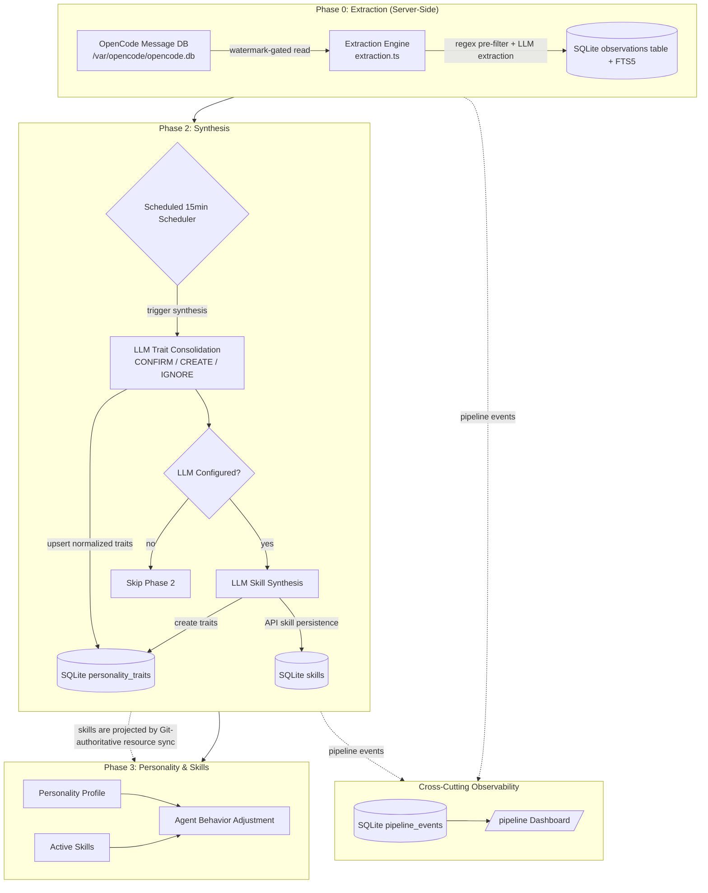

> **Canonical document:** This file is the self-learning pipeline reference.

# Self-Learning Pipeline Reference

A comprehensive guide to the Ingenium self-learning pipeline that replaced the old agent self-reporting system.

---

## 1. Overview

The **self-learning pipeline** is a three-phase architecture that enables agents to learn from user interactions and adapt their behavior over time. It replaced the deprecated `ingenium_learning_log` system with a more sophisticated observation-based approach.

### Why It Exists

- **Problem**: The old agent self-reporting system was inconsistent, lacked confidence tracking, and didn't distinguish between different types of user feedback
- **Solution**: A structured pipeline that captures observations via LLM-based extraction from OpenCode messages, consolidates them into personality traits, and maintains confidence scores over time


```mermaid
flowchart TB
    subgraph Phase0["Phase 0: Extraction (Server-Side)"]
        A0[OpenCode Message DB<br>/var/opencode/opencode.db]
        A1[Extraction Engine<br>extraction.ts]
        A2[(SQLite observations table + FTS5)]
        A0 -->|watermark-gated read| A1
        A1 -->|regex pre-filter + LLM extraction| A2
    end

    subgraph Phase2["Phase 2: Synthesis"]
        direction TB
        B1{Scheduled 15min Scheduler}
        B2[LLM Trait Consolidation<br>CONFIRM / CREATE / IGNORE]
        B3{LLM Configured?}
        B4[LLM Skill Synthesis]
        B5[(SQLite personality_traits)]
        B6[(SQLite skills)]
        
        B1 -->|trigger synthesis| B2
        B2 -->|upsert normalized traits| B5
        B2 --> B3
        B3 -->|yes| B4
        B3 -->|no| B7[Skip Phase 2]
        B4 -->|API skill persistence| B6
        B4 -->|create traits| B5
    end

    subgraph Phase3["Phase 3: Personality & Skills"]
        C1[Personality Profile]
        C2[Active Skills]
        C3[Agent Behavior Adjustment]
        C1 --> C3
        C2 --> C3
    end

    subgraph Observability["Cross-Cutting Observability"]
        D1[(SQLite pipeline_events)]
        D2[/pipeline Dashboard/]
        D1 --> D2
    end

    Phase0 --> Phase2
    Phase2 --> Phase3
    Phase0 -.->|pipeline events| Observability
    Phase2 -.->|pipeline events| Observability
    Phase2 -.->|skills are projected by Git-authoritative resource sync| Phase3
```

### Three-Phase Architecture

```
┌─────────────────────────────────────────────────────────────┐
│  PHASE 0: EXTRACTION (Server-Side)                          │
│  - Extraction engine reads OpenCode messages via API        │
│  - Watermark-gated, full-text content-hash dedup            │
│  - Regex pre-filter selects candidates, LLM extracts rules  │
│  - No-LLM = no observations (zero regex fallback garbage)   │
└─────────────────────────────────────────────────────────────┘
                           ↓
┌─────────────────────────────────────────────────────────────┐
│  PHASE 1: CONSOLIDATION                                     │
│  - LLM consolidation: CONFIRM / CREATE / IGNORE             │
│  - Traits become NORMALIZED statements (not raw snippets)   │
│  - Semantic merge prevents near-duplicate traits            │
│  - If LLM unavailable, observations stay PENDING            │
└─────────────────────────────────────────────────────────────┘
                           ↓
┌─────────────────────────────────────────────────────────────┐
│  PHASE 2: SKILL SYNTHESIS + PERSONALITY                     │
│  - Groups 3+ related observations → LLM creates proposals  │
│  - Approved proposals persist skills; worktree projection is separate │
│  - LLM-suggested personality_traits actually created        │
│  - Confidence: 0.10–0.15 start, +0.15/confirmation,        │
│    cap 0.95, display gate ≥0.30, 7-day decay -0.05         │
│  - Cross-project: skills in 2+ projects propose global changes │
└─────────────────────────────────────────────────────────────┘
```

---

## 2. Architecture Diagram

```
User interacts with OpenCode (:4098)
  │
  ├─ Agent uses ingenium_observe() during workflow (manual, for exceptional cases)
  │   → POST /api/v1/observations → stored in DB (status: pending)
  │
  ├─ Server-Side Extraction Engine (extraction.ts, runs in API scheduler)
  │   → reads OpenCode DB through the API-owned authenticated
  │     GET /api/v1/opencode/messages client
  │   → watermark-gated read + full-text content-hash dedup prevents re-processing
  │     (hashes the entire message, not a 200-char slice)
  │   → cheap regex pre-filter selects candidate messages (NOT final extraction)
  │   → batches of 15 sent to synthesis LLM for durable behavior rule extraction
  │   → only LLM output becomes observations — raw snippets NEVER enter DB
   │   → max_tokens: 8192
   │   → empty response content produces no rules; reasoning traces are never used
  │   → 🔴 Failure-aware watermark: watermark does NOT advance if ANY batch
  │     fails LLM extraction, preventing gaps from transient errors
  │   → pipeline event: extraction_completed
  │
   ├─ Auto-Observer Plugin (auto-observer.ts, thin trigger only)
   │   → on session.idle, calls Ingenium MCP (no detection logic)
   │   → MCP invokes the authenticated extraction API route
  │   → if plugin fails to load, scheduler covers extraction anyway
  │   → auto_observe_now tool for manual trigger
  │
   ├─ Observer Plugin (observer.ts, session.created / session.idle)
   │   → imports local file fallbacks if API was down
   │   → calls Ingenium MCP; MCP invokes the authenticated synthesis API route
  │   → fires pipeline events for dashboard observability
  │   → 🔴 non-fatal: dropped pipeline events (API unavailable) are
  │     logged to stderr instead of silently swallowed; the
  │     scheduled 15min maintenance cycle provides coverage
  │
    ├─ Resource Sync Plugin (resource-sync.ts, session.created / throttled session.idle)
    │   → projects Git worktree resources through MCP stdio to the authenticated API
    │   → uses a SHA-256 manifest; admin CRUD/sync tools are repair/import only
   │   → preserves unresolved conflicts and writes a broker only after full canonical-template validation
  │
   ├─ Scheduled Scheduler (every 15 min in API server)
   │   → runs extraction BEFORE synthesis for ALL active projects
   │   → then synthesis (consolidation → skill synthesis)
   │   → resource sync is handled separately by the extension on session events
  │
  └─ Synthesis Pipeline (consolidateTraits + runSynthesis)
      Phase 1: LLM Trait Consolidation
      → sends each pending observation to LLM
      → LLM decides: CONFIRM existing trait / CREATE new normalized trait / IGNORE noise
      → semantic merge prevents near-duplicate traits
      → if LLM unavailable, observations stay PENDING (no garbage heuristic)
      
      Phase 2 (if LLM configured): LLM Skill Synthesis
      → groups 3+ related observations from batch
      → sends to LLM with existing skills + traits as context
       → creates and submits governed create/update proposals with LLM evidence
       → approved proposals apply the skill change and trigger disk projection
      → LLM-suggested personality_traits actually created (previously dropped)
      → logs errors but doesn't block Phase 1 results

      Cross-Project (manual/scheduled): Cross-Project Synthesis
      → evaluates skills across all non-global, non-archived projects
       → creates and submits proposals for skills present in 2+ projects to global-default
      → logs cross-project skill events to pipeline timeline
```

### Key Components

| Component | Responsibility |
|-----------|----------------|
| **Agent** | Calls `ingenium_observe()` during workflow to record user interactions (manual, for exceptional cases — extraction engine handles most detection) |
| **Extraction Engine** (extraction.ts) | **Server-side**: Reads OpenCode messages via API, watermark-gated + content-hash dedup, regex pre-filter selects candidates, LLM batch extraction creates durable behavior rule observations. Runs in the scheduler. |
| **Observer Plugin** (observer.ts) | Monitors session events, imports file fallbacks, triggers synthesis |
| **Auto-Observer Plugin** (auto-observer.ts) | **Thin trigger only**: On session.idle, calls Ingenium MCP, which invokes the authenticated extraction API route. Zero detection logic — all extraction is server-side. If plugin fails to load, scheduler covers extraction. |
| **Resource Sync Plugin** (resource-sync.ts) | Reconciles skills, agents, plugins, commands, and config on session events using a SHA-256 manifest; preserves unresolved conflicts and writes the reserved broker only after full canonical-template validation |
| **Synthesis Pipeline** | Processes observations via LLM consolidation (CONFIRM/CREATE/IGNORE), generates normalized personality traits (Phase 1), optionally runs LLM skill synthesis (Phase 2 with backup provider fallback), and cross-project skill promotion |
| **API Layer** | REST endpoints for all operations (sole DB authority). New: `POST /api/v1/extraction/run`, DELETE observations/personality endpoints |
| **MCP Server** | Tool handlers that forward to API layer |
| **Dashboard** | UI for viewing and managing observations/personality/pipeline events |
| **Database** | SQLite with three core tables (`observations` with FTS5, `personality_traits` with confidence tracking, `pipeline_events` with parent-child nesting) plus `personality_profile` aggregated view |
| **LLM Provider** | (Optional) OpenCode-compatible provider blocks for extraction (Phase 0), trait consolidation (Phase 1), and skill synthesis (Phase 2), configured via Settings → Providers. One block can be primary and one backup; additional blocks remain available in OpenCode. **API keys are never exposed** in responses or OpenCode config files — the API returns only `apiKeySet: boolean`. API keys are stored in the encrypted vault (`vault_items`, AES-256-GCM), never in plaintext settings. Legacy `synthesis_api_key` / `synthesis_backup_api_key` / `llm_provider_api_keys` settings are auto-migrated into the vault on first read. |

### Project Ownership

Observations, personality traits, extraction watermarks, and synthesis batches are
owned by the project named in the request. Extension plugins resolve and provision
their external worktree project before calling the extraction or synthesis routes;
they never fall back to `global-default`. Detail and mutation operations verify that
the target observation or trait belongs to that same project and report it as not
found otherwise. The only intentional promotion into `global-default` is the
separate cross-project synthesis flow after a pattern appears in multiple projects.

### Durable synthesis batches and resumption

Synthesis claims one durable batch of up to **50 pending observations** and
advances it through these persisted stages:

1. `created` — consolidate traits and apply the trait stage.
2. `traits_applied` — persist the proposal plan, then create and submit skill
   proposals and apply any LLM-suggested traits.
3. `proposals_applied` — acknowledge the batch.
4. `complete` — mark every batch observation as `processed`.

Observations remain pending until the trait and proposal stages have completed
and the final acknowledgment succeeds. A failed LLM call, stage write, or
acknowledgment leaves the incomplete batch resumable; its persisted proposal plan
is reused rather than regenerated. A subsequent synthesis run can reclaim an
expired batch lease and continue from its recorded stage.

Batch ownership leases last **5 minutes** and are renewed before stage work;
workers that lose ownership stop advancing that batch. Durable failure metadata
is bounded to a 64-byte error code, a 1,024-byte error message, and at most 100
recorded errors per batch. These bounds keep retry diagnostics discoverable
without allowing an unbounded synthesis payload.

### Explicit current-learning RAG snapshots

CTX-003 does not automatically export raw observations into RAG. A caller can
explicitly request `POST /api/v1/context/learning/ingest` for its project to
snapshot the bounded current observations and active traits into a provenance-tagged
RAG source. The response includes current input/trait timestamps and returns an
explainable `NO_CURRENT_LEARNING` no-op when there is nothing to snapshot. The
resulting source is project-local; context RAG retrieval does not include
`global-default` sources. This preserves the extraction rule that raw OpenCode
messages are not persisted as observations while still allowing explicit,
source-attributed retrieval of durable learning output.

---

## 2.5 Extraction Engine (Server-Side)

Observation detection runs **server-side in the API** — the client-side auto-observer plugin is now only a thin trigger. Configured extension plugins call Ingenium MCP, and MCP invokes authenticated API routes. The extraction engine (`packages/ingenium-core/lib/tools/extraction.ts`, `runExtraction(projectId, projectName)`) may read OpenCode messages through API-owned internals.

### Architecture

```
Extraction Engine (extraction.ts)
  │
  ├─ Scheduler: runs before synthesis every 15 min (or triggered manually)
  │   → reads OpenCode DB mounted at /var/opencode/opencode.db
  │
  ├─ Watermark + Dedup gate
  │   → Per-project setting: extraction_watermark (last-processed message ID)
  │   → Per-project setting: extraction_seen_hashes (full-text content-hash set for dedup — hashes the entire message, not a 200-char slice, preventing hash collisions and missed dedup)
  │   → Only new messages since last run are considered
  │   → 🔴 Failure-aware: watermark does NOT advance if ANY LLM batch failed.
  │     This prevents gaps caused by transient API errors.
  │
  ├─ Regex Pre-Filter (candidate selection only — NOT final extraction)
  │   → Identifies messages that MAY contain user behavior
  │   → Cheap, fast filtering — no observations created at this stage
  │
  ├─ LLM Batch Extraction
  │   → Candidate messages batched (up to 15 per batch)
  │   → Each batch sent to synthesis LLM with structured prompt
  │   → LLM extracts DURABLE USER BEHAVIOR RULES as JSON
  │   → Only LLM output becomes observations — raw snippets NEVER enter DB
   │   → max_tokens: 8192
   │   → empty content produces no extracted rules; reasoning traces are not used
  │
  └─ No authorized executor = No Background LLM Work
      → If no synthesis LLM or authorized runtime is available, extraction creates 0 observations
      → Zero regex or global/user-runtime fallback
      → Pipeline event: extraction_failed (or extraction_completed with 0 observations)
```

### LLM Dispatch Modes

The system uses two LLM dispatch modes depending on the feature:

| Mode | Mechanism | Timeout | Used By | Configuration Source |
|------|-----------|---------|---------|---------------------|
| **Direct** | `callSynthesisLLM()` / `safeLlmFetch()` — calls an LLM endpoint directly via HTTP | 60s | Explicit direct callers such as email suggestions/summaries | `resolveLLMConfig()` for the direct caller |
| **Broker** | `executeSynthesisBroker()` — creates an ephemeral OpenCode session, routes through OpenCode's provider infrastructure | **30s interactive default cap**; Docs AI permits 60s; background extraction/synthesis preserves a 60s request budget and may explicitly request up to a finite 180s | Docs AI, RAG Ask, Job Suggestions, and per-project background extraction/synthesis | Docs AI uses the server-owned validated global Chat selection or server-derived default; RAG Ask and Job Suggestions use their server-owned chain; background work uses an authorized runtime executor |

Per-project background extraction and synthesis are invoked through the API-owned
executor, which requires exactly one ready or idle runtime with a valid capability,
active service principal, and project execute grant. Missing authorization returns
an unavailable result without provider probing; there is no global- or user-runtime
fallback. The executor targets only that runtime's backend and deletes each
ephemeral broker session on success, failure, and timeout. Interactive broker
consumers retain a 30-second cap, except Docs AI's server-owned 60-second policy.

| Trigger | Mechanism |
|---------|-----------|
| **Scheduler** (every 15 min) | `services/ingenium-api/lib/scheduler.ts` runs extraction before synthesis for all active projects |
| **Auto-Observer Plugin** | On `session.idle`, calls Ingenium MCP (thin trigger); MCP invokes the authenticated extraction API route |
| **MCP Tool** | `ingenium_extraction_run` — manual trigger |
| **API Endpoint** | `POST /api/v1/extraction/run` — direct API call |

### How the Auto-Observer Plugin Works Now

The **Auto-Observer** (`packages/ingenium-extension/auto-observer.ts`) is now a ~62-line thin trigger:

```
Auto-Observer Plugin (auto-observer.ts)
  │
  ├─ Hook: session.idle
  │   → Calls Ingenium MCP
  │   → MCP invokes the authenticated extraction API route
  │   → No detection logic — all extraction runs server-side
  │
  └─ MCP Tool: auto_observe_now
      → Manual trigger for immediate server-side extraction
      → Returns only a started/scheduled acknowledgment; results are asynchronous
```

If the plugin fails to load in OpenCode, the scheduler covers extraction anyway — plugin loading is no longer a dependency. The plugin requires no `better-sqlite3` dependency since it only makes HTTP calls.

The extraction trigger does not report observations created at request time.
Check pipeline status after the asynchronous work completes. When a session
lifecycle event triggers synthesis, the current OpenCode session ID is forwarded
through the MCP `sessionId` argument to the API `session_id` query parameter so
the durable synthesis run retains session provenance.

---

## 3. Database Tables

### `observations` Table

Stores individual user interactions and feedback.

```sql
CREATE TABLE observations (
    id INTEGER PRIMARY KEY AUTOINCREMENT,
    project_id TEXT NOT NULL,
    observation_type TEXT NOT NULL,  -- One of 10 types
    content TEXT NOT NULL,            -- Human-readable description
    importance INTEGER DEFAULT 5,     -- 1-10 scale
    source TEXT DEFAULT 'agent',      -- Where observation came from
    embedding BLOB,                   -- Placeholder for future vector search
    context JSON,                     -- Additional metadata as JSON
    status TEXT DEFAULT 'pending',    -- pending/processed/skipped/failed
    created_at DATETIME DEFAULT CURRENT_TIMESTAMP,
    updated_at DATETIME DEFAULT CURRENT_TIMESTAMP,
    
    FOREIGN KEY (project_id) REFERENCES projects(id),
    UNIQUE(project_id, id)
);

CREATE INDEX idx_observations_project_status ON observations(project_id, status);
CREATE INDEX idx_observations_type ON observations(observation_type);
CREATE INDEX idx_observations_importance ON observations(importance DESC);
```

**FTS5 Virtual Table:**
```sql
CREATE VIRTUAL TABLE observations_fts USING fts5(
    content,
    observation_type,
    source,
    context_json,
    content='observations',
    rowid
);
```

### `personality_traits` Table

Stores synthesized personality traits with confidence scores.

```sql
CREATE TABLE personality_traits (
    id INTEGER PRIMARY KEY AUTOINCREMENT,
    project_id TEXT NOT NULL,
    trait_type TEXT NOT NULL,         -- One of 10 types
    trait_value TEXT NOT NULL,        -- The actual trait value
    display_label TEXT,               -- Human-readable label
    confidence REAL DEFAULT 0.0,      -- 0.0-1.0 confidence score
    exemplar_observation_id INTEGER,  -- ID of observation that created this trait
    exemplar_text TEXT,               -- Text from exemplar observation
    is_active INTEGER DEFAULT 1,       -- 1 = active, 0 = disabled
    metadata JSON,                    -- Additional metadata as JSON
    created_at DATETIME DEFAULT CURRENT_TIMESTAMP,
    updated_at DATETIME DEFAULT CURRENT_TIMESTAMP,
    
    FOREIGN KEY (project_id) REFERENCES projects(id),
    FOREIGN KEY (exemplar_observation_id) REFERENCES observations(id),
    UNIQUE(project_id, trait_type, is_active)
);
```

### `personality_profile` View

```sql
CREATE VIEW personality_profile AS
SELECT 
    project_id,
    trait_type,
    trait_value,
    display_label,
    MAX(confidence) as max_confidence,
    AVG(confidence) as avg_confidence,
    COUNT(*) as observation_count,
    MIN(created_at) as first_seen,
    MAX(updated_at) as last_updated,
    GROUP_CONCAT(exemplar_text, '; ') as exemplars
FROM personality_traits
WHERE is_active = 1
GROUP BY project_id, trait_type;
```

---

*Full documentation continues with observation types, personality trait system, confidence model, MCP tools reference, API endpoints, pipeline observability, LLM skill synthesis, troubleshooting, and version history. This file is the canonical self-learning pipeline document.*

---

**v4.2.0 (2026-07-16) — Scheduler/resource-sync boundary:** API scheduled maintenance runs extraction → synthesis under the skills lease. Bidirectional resource sync is no longer an API scheduler step; the extension runs it on `session.created` and throttled `session.idle` events.

*Last updated: July 16, 2026 (v4.2.0 — scheduler/resource-sync boundary)*
