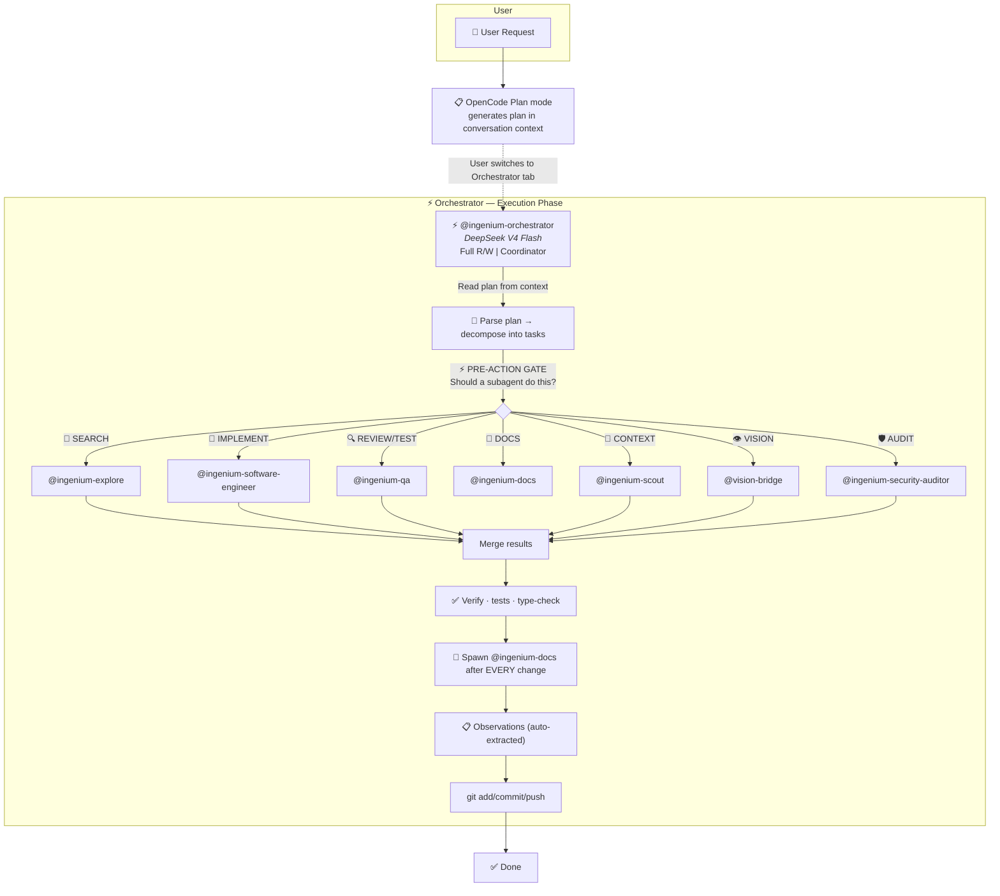
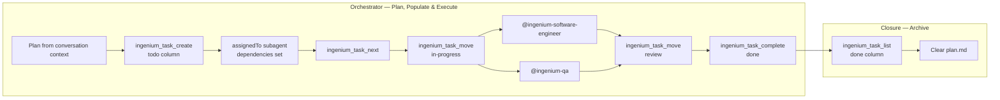

# Agent Architecture

## Overview

Ten agents total: 1 primary, 9 subagents. The **orchestrator** (`@ingenium-orchestrator`) coordinates execution — it NEVER writes code directly, always delegating to subagents. Planning is done via OpenCode's built-in Plan mode (not a custom agent), which generates the plan as conversation text. The orchestrator reads that plan from the conversation context and decomposes it into parallel subagent tasks. Nine specialized subagents handle search, context, prompt engineering, implementation (3 tiers), review, documentation, security, and vision analysis.

## Agent Table

| Agent | Type | Model | Provider | Access | Purpose |
|-------|------|-------|----------|--------|---------|
| **ingenium-orchestrator** | Primary | `deepseek/deepseek-v4-pro` | DeepSeek API | Full R/W (`edit: deny, write: deny`) | Coordinator — reads plans from OpenCode's Plan mode, delegates ALL work to subagents, never writes code directly |
| **ingenium-prompt-engineer** | Subagent | `lmstudio/qwen/qwen3.5-9b` | LM Studio | Read-only | Prompt Engineer — analyzes and improves prompts using a structured evaluation framework |
| **ingenium-explore** | Subagent | `lmstudio/qwen/qwen3.5-9b` | LM Studio | Read-only | Codebase search — grep, glob, file discovery, pattern analysis |
| **ingenium-scout** | Subagent | `lmstudio/qwen/qwen3.5-9b` | LM Studio | Read-only | Thread/RAG persistent memory — past decisions, preferences |
| **ingenium-software-engineer** | Subagent | `lmstudio/qwen/qwen3.5-9b` | LM Studio | Read/Write (`edit: allow, write: allow`) | **Writes all code** — implementation, refactoring, bug fixes. Also: design review, technical analysis |
| **vision-bridge** | Subagent | `lmstudio/qwen/qwen3.5-9b` | LM Studio | Read-only (`read: allow`) | Vision analysis — reads screenshot files and produces structured technical descriptions for non-vision models |
| **ingenium-software-engineer-fast** | Subagent | `lmstudio/qwen/qwen3.5-9b` | LM Studio | Read/Write (`edit: allow, write: allow`) | Standard bug fixes, simple refactors, test authoring, straightforward tasks |
| **ingenium-software-engineer-premium** | Subagent | `deepseek/deepseek-v4-pro` | DeepSeek API | Read/Write (`edit: allow, write: allow`) | Complex multi-file refactoring, architectural changes, performance-critical code |
| **ingenium-qa** | Subagent | `lmstudio/qwen/qwen3.5-9b` | LM Studio | Read-only | Code review + test verification. Reviews tests written by @ingenium-software-engineer. Does NOT write production code or author tests |
| **ingenium-docs** | Subagent | `lmstudio/qwen/qwen3.5-9b` | LM Studio | Edit + Write (`edit: allow, write: allow, bash: deny`) | Documentation + skill updates — observations are auto-extracted by the server-side engine |
| **ingenium-security-auditor** | Subagent | `deepseek/deepseek-v4-flash` | DeepSeek API | Bash + read-only (`write: deny`) | Security audit + git-history leak scanning |

---

## Email MCP Tools

The 13 email MCP tools (`ingenium_email_list` through `ingenium_email_watch_status`) provide full email client capabilities including inbox triage, AI-powered response suggestions, and IMAP IDLE monitoring.

---

## Lifecycle: What Triggers What

| # | Phase | Trigger | Agent | Action |
|-------|-------|---------|-------|--------|
| 1 | **Plan** | User enters Plan mode | OpenCode Plan mode | Generates plan as conversation text — research, scope, and task decomposition |
| 2 | **Handoff** | Plan complete | User | Switches to orchestrator tab |
| 3 | **Read plan** | Tab switch | Orchestrator | Reads plan from conversation context, decomposes into subagent tasks |
| 4 | **Pre-Action Gate** | EVERY tool use | Orchestrator | ⚡ Checks: "Should a subagent do this?" before any tool call |
| 5 | **Code writing** | Implementation needed | Orchestrator → **Software-Engineer** | Implements code, self-verifies (tests/type-check), returns results |
| 6 | **Review + test** | Code written | Orchestrator → **QA** | Reviews quality, writes tests, returns findings |
| 7 | **Security audit** | Sensitive changes | Orchestrator → **Security-Auditor** | Scans for secrets, auth issues, CI vulnerabilities |
| 8 | **Documentation** | After EVERY change | Orchestrator → **Docs** | Updates docs/ — observations automatically captured by server-side extraction engine |
| 9 | **Commit** | All subagents done | Orchestrator (bash) | `git add/commit/push` — the ONLY bash the orchestrator runs |
| 10 | **Observations** | After commit | Extraction engine | Observations automatically captured by server-side extraction engine scanning OpenCode messages |

---

## Task Board Integration

The task board (via `ingenium_task_*` MCP tools) is the authoritative work tracking system for the agent pipeline. Tasks flow through a structured lifecycle managed by the orchestrator. The tools map as follows: `kaban_add_task_checked` → `ingenium_task_create`, `kaban_get_next_task` → `ingenium_task_next`, `kaban_move_task` → `ingenium_task_move`, `kaban_complete_task` → `ingenium_task_complete`.

### Lifecycle Steps

| Step | Agent | Action | MCP Tool | Todowrite Mirror |
|------|-------|--------|----------|-----------------|
| 1 | Orchestrator | Decomposes plan from conversation context, creates tasks with subagent assignments and dependencies | `ingenium_task_create`, `ingenium_task_move` | — |
| 2 | Orchestrator | Reads next high-priority work item from todo column | `ingenium_task_next` | Mark `in_progress` |
| 3 | Orchestrator | Claims task, marks as active, spawns subagent | `ingenium_task_move <id> in-progress` | Mark `in_progress` |
| 4 | Subagent | Implements, reviews, or documents the work | — | — |
| 5 | Orchestrator | Moves task to review column after subagent completes | `ingenium_task_move <id> review` | Mark `pending` (for QA) |
| 6 | Orchestrator | Marks task complete after QA approval | `ingenium_task_complete <id>` | Mark `completed` |
| 7 | Orchestrator | Lists completed tasks and clears plan | `ingenium_task_list <done>` | — |

---

## Per-Agent Profiles

Full details for each agent are available in the agent definition files at `.opencode/agents/`. See also the [IGENIUM orchestrator agent](../.opencode/agents/primary/ingenium-orchestrator.md) for orchestrator-specific controls and the full pipeline flow.

### Compute Split

| Resource | Agents | Count | Cost |
|----------|--------|-------|------|
| DeepSeek V4 Pro (API) | `ingenium-software-engineer-premium`, `ingenium-orchestrator` | 2 | Paid |
| DeepSeek V4 Flash (API) | `ingenium-security-auditor` | 1 | Paid |
| qwen3.5-9b (LM Studio) | `ingenium-explore`, `ingenium-prompt-engineer`, `ingenium-scout`, `vision-bridge`, `ingenium-software-engineer`, `ingenium-software-engineer-fast`, `ingenium-qa`, `ingenium-docs` | 8 | Local |

**Model configuration**: Model assignments are defined per-agent in their `.md` agent profile files (stored in `.opencode/agents/` and the DB `agents` table).

---

### Subagent Invocation

Primary agents invoke subagents via the Task tool automatically. All subagents can also be invoked directly via `@` mention.

| Subagent | `@` mention | Access | Invokable by |
|----------|-------------|--------|--------------|
| ingenium-explore | `@ingenium-explore` | Read-only | orchestrator + user |
| ingenium-scout | `@ingenium-scout` | Read-only | orchestrator + user |
| ingenium-prompt-engineer | `@ingenium-prompt-engineer` | Read-only | orchestrator + user |
| ingenium-security-auditor | `@ingenium-security-auditor` | Bash + read-only | orchestrator + user |
| vision-bridge | `@vision-bridge` | Read-only | orchestrator + user |
| ingenium-software-engineer | `@ingenium-software-engineer` | Read/Write | orchestrator only |
| ingenium-software-engineer-fast | `@ingenium-software-engineer-fast` | Read/Write | orchestrator only |
| ingenium-software-engineer-premium | `@ingenium-software-engineer-premium` | Read/Write | orchestrator only |
| ingenium-qa | `@ingenium-qa` | Read-only | orchestrator only |
| ingenium-docs | `@ingenium-docs` | Edit + Write (`edit: allow, write: allow, bash: deny`) | orchestrator only |
