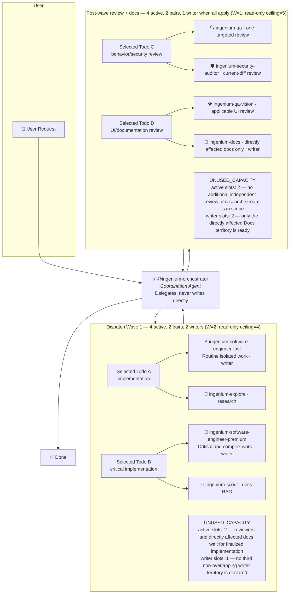
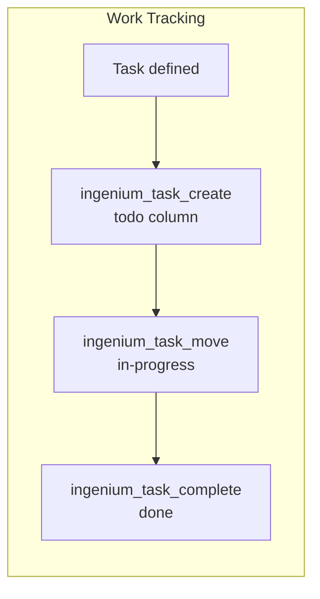

# Agent Architecture

## Overview

**12 agents total: 2 primary + 10 subagents (2 hidden).** The orchestrator (`@ingenium-orchestrator`) is the primary coordination agent — it declares finite task contracts, delegates bounded work, and returns terminal outcomes. It never writes code directly. A dedicated **chat agent** (`ingenium-chat`, hidden) handles conversational interactions with read-only access. Ten subagents handle exploration, QA, documentation, engineering, security, web automation, and the system-internal LLM broker. Every user-facing active agent, including built-in Plan, can load all repository skills and their `references/` material; this is separate from tool grants. The hidden `ingenium-llm-broker` is reserved for system use (never invoked directly) and is excluded from that loading surface.

Orchestration executes declared scoped tests, standard verification, in-scope source fixes, and any declared deployment autonomously. It never asks the user for permission to test, diagnose, fix, retry, package, scan, configure, run, or deploy work that is already within the declared user scope. A compile, test, package, scanner, configuration, or runtime defect with a concrete reproducible root cause is remediated and reverified automatically; a failed check alone never escalates. OpenCode interactive `question` access is denied globally and in every custom agent permission profile. The built-in Plan mode is the deliberate analysis exception: root `opencode.json` grants it `read`, `glob`, `grep`, `question`, and the read-only `ingenium_coordination_status` tool, while `edit`, `write`, `bash`, and coordination mutation tools remain denied. Plan also has the universal skill-loading surface. Custom agents may not use interactive questions. Orchestration never invokes the `question` tool. These profile/configuration changes affect current sessions only after they restart; this documentation does not imply that already-running sessions are fixed. It returns `ESCALATE_USER` in its normal response only for unavailable required external credential/access after the configured path was attempted, unauthorized destructive/irreversible work, a mutually exclusive product decision, a genuinely ambiguous user requirement, or no reproducible root cause after bounded diagnosis.

### Verification scope

Ordinary writer work uses only the affected workspace typecheck/lint when
relevant and directly affected test file(s), optionally narrowed by test name.
Focused Playwright work targets the affected file and may use `--grep`; a
fixture-backed run is followed by `npx tsx tests/suite-containment-audit.ts --strict`.
Root `npm test`, entire Playwright configs, and Docker/provider/mail/
route-parity/manual suites require an explicitly declared `FULL_ACCEPTANCE`,
release, or cross-cutting acceptance gate. `FULL_ACCEPTANCE` means the declared
acceptance checks, not automatically every repository test.

### Git and GitHub workflow

Manual and user-created commits are valid and never block continued agent work.
Before committing, inspect `git status`, `git diff`, and recent `git log`, then
stage only the intended paths. Use ordinary non-interactive Git for local commits
and `gh` for GitHub pushes, pull requests, and checks. Never commit unrelated
changes, rewrite published history, or force-push without explicit authorization.

Before source edits, both software-engineer writers read
`.opencode/skills/development-conventions/references/useful-comments/guidelines.md`.
They keep code self-explanatory and add comments only for non-obvious
why/constraints, not to narrate what, record history, decorate sections, or
preserve commented-out code. QA inspects changed comments only within its
already-declared changed-file review; it does not add a broad comment pass.

### Documentation authority

Repository Markdown under `docs/**/*.md` is the normal documentation authority, and
repository sync projects it into the Docs Workspace. Agents update repository docs
for normal documentation work. Direct Docs Workspace mutation is allowed only when
the user explicitly requests a Workspace mutation or the documented repository-sync
process. Automatic page writes, post-change context saves, and session exports are
not agent requirements.

### Orchestrator Agent Model

The primary agents (`ingenium-orchestrator`, `ingenium-chat`) and all subagents have model mappings defined centrally in `opencode.json` under the `"agent"` key:

- **Model** — Defined in `opencode.json` (not the Markdown profile). The orchestrator routes writer tasks to Fast and Premium tiers based on task complexity and risk, with Premium handling critical/high-risk work.
- **`hidden: true`** — Prevents agents from appearing in non-Chat selectors where appropriate.
- **Provider from Settings** — Providers and models come from Settings → Providers (via `GET /api/v1/opencode/chat-config`), not from the full OpenCode provider catalog.

Agent frontmatter metadata is persisted with the agent record. A root mapping such
as `prompt: "{file:.opencode/agents/...}"` loads the Markdown prompt body; its YAML
frontmatter is not imported as a second `agent.<name>` mapping and cannot override
the root model, variant, or effective tool grants. The internal
`ingenium-llm-broker` is an API-owned, reserved profile: disk-only copies are
never imported, and sync accepts an API row only when it matches the complete
static canonical template before rewriting the one canonical disk profile.
Migration 058 backfills historical records and installs non-recursive `BEFORE
INSERT`/`BEFORE UPDATE` guards, so raw `INSERT OR REPLACE` and `UPDATE OR
REPLACE` cannot replace or mutate a broker even with `PRAGMA
recursive_triggers=0`. Only the dedicated internal core bootstrap can create
the canonical row; public core/API lifecycle functions reject broker create,
enable, disable, update, and delete operations. The normal project lifecycle
remains child-safe: it refuses projects with child rows, and broker protection
neither introduces nor bypasses FK cascade semantics.

### Exact runtime mappings

Root `opencode.json` is authoritative for these case-sensitive model, variant,
and profile-path mappings. The built-in `explore` entry is a separate OpenCode
mapping (`openai/gpt-5.6-luna`, `max`) and is not `ingenium-explore`. The
protected `ingenium-llm-broker` intentionally has no root mapping.

| Agent | Model | Variant | Canonical profile |
|---|---|---|---|
| `browser-agent` | `openai/gpt-5.6-luna` | `max` | `.opencode/agents/execution/browser-agent.md` |
| `ingenium-docs` | `openai/gpt-5.6-luna` | `max` | `.opencode/agents/execution/ingenium-docs.md` |
| `ingenium-qa` | `openai/gpt-5.6-luna` | `max` | `.opencode/agents/execution/ingenium-qa.md` |
| `ingenium-qa-vision` | `openai/gpt-5.6-luna` | `max` | `.opencode/agents/execution/ingenium-qa-vision.md` |
| `ingenium-software-engineer-fast` | `openai/gpt-5.6-luna` | `max` | `.opencode/agents/execution/ingenium-software-engineer-fast.md` |
| `ingenium-software-engineer-premium` | `openai/gpt-5.6-sol` | `high` | `.opencode/agents/execution/ingenium-software-engineer-premium.md` |
| `ingenium-orchestrator` | `openai/gpt-5.6-sol` | `high` | `.opencode/agents/primary/ingenium-orchestrator.md` |
| `ingenium-explore` | `openai/gpt-5.6-sol` | `medium` | `.opencode/agents/research/ingenium-explore.md` |
| `ingenium-scout` | `openai/gpt-5.6-luna` | `max` | `.opencode/agents/research/ingenium-scout.md` |
| `ingenium-chat` | `deepseek/deepseek-v4-flash` | `max` | `.opencode/agents/chat/ingenium-chat.md` |
| `ingenium-security-auditor` | `openai/gpt-5.6-sol` | `high` | `.opencode/agents/security/ingenium-security-auditor.md` |

The diagram below is **serialized**: Wave 2 starts only after Wave 1 has
returned and its verification has completed. The waves are not simultaneous;
each wave is independently bounded by the 6-active/3-writer policy. The
`UNUSED_CAPACITY` notes are part of each underfilled phase declaration; they
are not a request to create work merely to reach six active agents.

Todo allocation is pair-based. Before each dispatch, enumerate the independent,
dependency-ready `TodoWrite` items, select up to three concurrently, and assign
exactly one pair of exactly two agents to each selected Todo in one parallel
call. One, two, or three selected Todos therefore use 2, 4, or 6 agents. If
fewer than three are eligible, leave the remaining capacity unused; never invent
a Todo or add a third agent. Pair members have distinct responsibilities, while
the three-writer maximum, exclusive territories, dependency order, and
QA/security/visual review gates remain in force.


```mermaid
flowchart TB
    subgraph User
        REQ["💬 User Request"]
    end

    REQ --> ORCH["⚡ @ingenium-orchestrator<br/><i>Coordination Agent</i><br/>Delegates, never writes directly"]

    subgraph Wave1["Dispatch Wave 1 — 4 active, 2 pairs, 2 writers (W=2; read-only ceiling=4)"]
        T1["Selected Todo A<br/>implementation"]
        FAST["⚡ ingenium-software-engineer-fast<br/>Routine isolated work · writer"]
        EXPLORE["🔬 ingenium-explore · research"]
        T2["Selected Todo B<br/>critical implementation"]
        PREM["💎 ingenium-software-engineer-premium<br/>Critical and complex work · writer"]
        SCOUT["🔎 ingenium-scout · docs RAG"]
        T1 --> FAST
        T1 --> EXPLORE
        T2 --> PREM
        T2 --> SCOUT
        W1CAP["UNUSED_CAPACITY<br/>active slots: 2 — reviewers and directly affected docs wait for finalized implementation<br/>writer slots: 1 — no third non-overlapping writer territory is declared"]
    end

    subgraph Wave2["Post-wave review + docs — 4 active, 2 pairs, 1 writer when all apply (W=1; read-only ceiling=5)"]
        T3["Selected Todo C<br/>behavior/security review"]
        QA["🔍 ingenium-qa · one targeted review"]
        SECURITY["🛡️ ingenium-security-auditor · current-diff review"]
        T4["Selected Todo D<br/>UI/documentation review"]
        VISION["👁️ ingenium-qa-vision · applicable UI review"]
        DOCS["📝 ingenium-docs · directly affected docs only · writer"]
        T3 --> QA
        T3 --> SECURITY
        T4 --> VISION
        T4 --> DOCS
        W2CAP["UNUSED_CAPACITY<br/>active slots: 2 — no additional independent review or research stream is in scope<br/>writer slots: 2 — only the directly affected Docs territory is ready"]
    end

    ORCH --> Wave1
    Wave1 --> ORCH
    ORCH --> Wave2
    Wave2 --> ORCH
    ORCH --> DONE["✅ Done"]
```

### User-facing orchestration communication

The orchestrator communicates in four stages:

1. **Plain-language introduction** — explain the goal, why it matters, and the immediate approach in one to three sentences.
2. **Structured contract** — show `IN_SCOPE`, `OUT_OF_SCOPE`, acceptance criteria, `STOP_CONDITION`, verification and escalation rules, active/writer counts, territories, dependencies, and `UNUSED_CAPACITY`.
3. **Interpreted phase result** — explain what completed, what changed, which checks ran and their outcomes, the finding classification, and the next dependency. If work remains open, immediately continue to the next eligible phase rather than asking for a reprompt or returning raw agent/tool output.
4. **Human-readable terminal summary** — report status, changed files, verification execution count, findings or remaining work, and Markdown links or repository paths to retained proof. Distinguish source-test, deployed-runtime, and model/session evidence.

The Wave 2 example uses two selected Todos, so its four agents are two complete
pairs. It assumes directly affected documentation plus applicable QA, security,
and UI review. If a review is blocked or not applicable, omit that Todo/pair and
record the unused active slots and concrete dependency or applicability reason in
`UNUSED_CAPACITY`; do not split safe independent reviewers or manufacture work.

## Agent Table

| Agent | Type | Mode | Skills Allowed |
|-------|------|------|----------------|
| **ingenium-orchestrator** | Primary | Coordination — delegates to subagents, never writes code directly | All repository skills/references |
| **ingenium-chat** | Primary | Chat (read-only, `hidden: true`) | All repository skills/references |
| **ingenium-explore** | Subagent | Research and exploration | All repository skills/references |
| **ingenium-scout** | Subagent | Research + Docs RAG | All repository skills/references |
| **ingenium-qa-vision** | Subagent | Visual QA (Playwright screenshots at 1440x900, 390x844); no Bash, no writes | All repository skills/references |
| **ingenium-software-engineer-fast** | Subagent | Writer tier — routine isolated work, single-package scope | All repository skills/references |
| **ingenium-software-engineer-premium** | Subagent | Writer tier — critical and complex cross-cutting work (auth, migrations, Docker, multi-service, high-risk) | All repository skills/references |
| **ingenium-qa** | Subagent | Targeted, read-only QA — one declared verification pass with scope-classified findings | All repository skills/references |
| **ingenium-docs** | Subagent | **Writer** — repository documentation and explicitly requested Docs Workspace updates | All repository skills/references |
| **ingenium-security-auditor** | Subagent | Bounded current-diff/dependency review; one history scan only for a confirmed secret or critical explicit trigger | All repository skills/references |
| **browser-agent** | Subagent | **Writer** — web automation and self-healing site interaction | All repository skills/references |
| **ingenium-llm-broker** | Subagent | System-internal LLM broker (`hidden: true`), wildcard-denied with no tool allowances | — (excluded) |

> **Model configuration**: Agent model mappings are defined centrally in `opencode.json` under the `"agent"` key. Markdown profiles intentionally omit the `model:` field — the root config is the sole source of runtime model assignment.
>
> > **Note on `ingenium-chat`**: A legacy root-level duplicate at `.opencode/agents/ingenium-chat.md` exists alongside the canonical `.opencode/agents/chat/ingenium-chat.md`. This is a **compatibility mirror** — both files represent the same logical agent. The root duplicate is preserved for backward compatibility and does **not** count as a separate agent in the 12-agent total.

### Skill permission policy

The current root `opencode.json` grants every user-facing agent the universal
skill permission:

```yaml
permission:
  skill:
    "*": allow
```

The same all-skill loading surface is available to built-in Plan. It is a
repository skill/reference capability, not a tool grant. The resolved recovery
policy is **all skills plus status only** for coordination: Plan's exact
root-level tool allowance is `read`, `glob`, `grep`, `question`, and the
read-only `ingenium_coordination_status`; it has no file-mutation, shell, or
coordination mutation authority. Root mappings and mapped profiles must remain
semantically aligned, but profile frontmatter is not a second runtime
configuration source.

`@skill-name` is mention syntax for Required Skills sections and inline prose;
it is not a `permission.skill` key. If a narrow policy is documented, use the
actual canonical directory names without `@`, and put the wildcard first so
specific rules follow it. The hidden `ingenium-llm-broker` is the exception:
its skill permission is `{"*": "deny"}` and it has no tool allowances. See
[the skill taxonomy](../reference/skill-taxonomy.md) for the canonical names
and legacy mapping.

The orchestrator and Premium writer profiles explicitly grant the top-level MCP
tools `ingenium_coordination_update`, `ingenium_coordination_claim`, and
`ingenium_coordination_release`; these are not Bash permissions. The read-only
Scout profile additionally grants `ingenium_docs_search_semantic` for semantic
Docs RAG retrieval. `ingenium_coordination_handoff` is a mixed publish/read/
acknowledge/consume tool and is write-classified as a whole. The broader
recovery protocol therefore performs handoff or typed-memory reads with
`read` or `memory_read` from an authorized coordination-capable session; that
tool is not part of Plan's grant. A stale API/root-level `allow` expectation
must not widen Plan's surface. Epoch `recovery_state`, `reconcile_epoch`, and
`recover_epoch` remain operations on `ingenium_coordination_update`; they are not
Plan permissions. All other tool and MCP profile permissions remain
deny-by-default.

### Effective role matrix

The root `opencode.json` default is deny. The effective core permission matrix is
explicitly:

| Profile | `read` | `glob` | `grep` | `question` | `edit`/`write` | `bash` | Effective role |
|---|---|---|---|---|---|---|---|
| Plan | allow | allow | allow | allow | deny | deny | Planning only; all repository skills/references plus generic inspection tools and read-only `ingenium_coordination_status`; no handoff tool |
| `browser-agent` | allow | allow | allow | deny | allow | allow | Intentional writer |
| `ingenium-docs` | allow | allow | allow | deny | allow | allow | Intentional writer |
| `ingenium-software-engineer-fast` | allow | allow | allow | deny | allow | allow | Intentional writer |
| `ingenium-software-engineer-premium` | allow | allow | allow | deny | allow | allow | Intentional writer; deployment gate below still applies |
| `ingenium-orchestrator` | allow | deny | deny | deny | deny | restricted allow | Coordination and verification only; no file-mutation rights |
| `ingenium-chat` | allow | allow | allow | deny | deny | deny | Read-only |
| `ingenium-explore` | allow | allow | allow | deny | deny | deny | Read-only |
| `ingenium-scout` | allow | deny | deny | deny | deny | deny | Read-only; bounded Docs RAG MCP access |
| `ingenium-qa` | allow | allow | allow | deny | deny | allow | Read-only; Bash is bounded by the managed-command boundary |
| `ingenium-qa-vision` | allow | allow | allow | deny | deny | deny | Read-only |
| `ingenium-security-auditor` | allow | allow | allow | deny | deny | allow | Read-only; Bash is bounded by the managed-command boundary |
| `ingenium-llm-broker` | deny | deny | deny | deny | deny | deny | Hidden system profile; wildcard-denied with no tool allowances |

`edit`/`write` are the file-mutation permissions. The intentional writer
profiles retain those permissions; every read-only profile above does not. A
read-only profile with bounded Bash or MCP access does not thereby gain generic
shell, file-mutation, or deployment authority.

### Permission and deployment boundary

The root `opencode.json` explicitly declares the Premium agent's effective
`read`, `edit`, `write`, `bash`, `glob`, `grep`, and `todowrite` permissions;
`question` remains denied by the root default. The root config remains
authoritative for the Premium model and variant; the Markdown profile is not a
second model source.

Generic `bash`/`shell` input is fail-closed. Deployment and MCP diagnostics are
limited to the fixed, shell-free `ingenium-build deployment` operations
`mcp-status`, `compose-ps`, `compose-build`, `compose-up`, `compose-restart`,
and `health`. The coordinator admits that path only for an authenticated
general-MCP session whose project, workspace, launcher worktree, and required
scopes are attested. QA, security, and every other agent—including an
unauthenticated or runtime-audience Premium session—have no deployment
authority. A non-Premium managed `ingenium-build` request fails closed in the
pre-execution hook, before the wrapper can spawn `npm` or run a repository build
script.

Premium deployment authorization does not come from mutable chat-hook strings
or prompt text. The coordinator obtains trusted OpenCode server evidence and
requires the session record and directory to match the current worktree, a
same-session user parent whose `agent` is
`ingenium-software-engineer-premium`, an assistant message whose `mode` is the
same profile, and a same-session tool part whose call ID, tool name, and input
match the request and whose state is still pending or running. It then requires
a general-MCP attestation with the `mcp` audience, exactly one matching project
identity and project detail, the expected workspace ID and launcher worktree,
and the required coordination, project-read, and repository-sync scopes.

When admitted, deployment maps only those named operations to fixed executable
argv arrays and starts them with `shell: false`. Its child environment removes
inherited `COMPOSE_*`, `DOCKER_*`, `npm_*`, `NODE_OPTIONS`, and `PATH` values,
then supplies the fixed runtime `PATH` (`<node-runtime>:/usr/local/bin:/usr/bin:/bin`).
Changing an agent profile, its prompt-file frontmatter, plugin, MCP entry, OpenCode
config, or parent binding requires a full parent OpenCode restart; restarting only
the child MCP process is insufficient because existing sessions retain their
previous prompt, profile, skill surface, and permissions. After restart, verify
the exact root mapping and mapped profile rather than inferring parity from the
Markdown file alone.

---

## Email MCP Tools

The 27 email MCP tools (`ingenium_email_list` through `ingenium_email_attachment_get`) provide full email client capabilities including inbox triage, AI-powered response suggestions, and IMAP IDLE monitoring.

---

## Lifecycle: What Triggers What

Orchestrator phases follow a **behavioral** concurrency policy — 6 active
subagents max, 3 concurrent writers max per wave. With `W` writers, a phase may
contain at most `6 - W` read-only agents; that is a ceiling, not a quota. Any
wave examples in this document are serialized unless explicitly stated
otherwise: Wave N must finish and be verified before Wave N+1 starts. Never read
the examples as one combined simultaneous dispatch exceeding either limit.

Writer classification follows the actual permission blocks: `ingenium-software-engineer-fast`, `ingenium-software-engineer-premium`, `ingenium-docs`, and `browser-agent` have `edit: allow` or `write: allow`. `ingenium-explore`, `ingenium-scout`, `ingenium-qa`, `ingenium-qa-vision`, and `ingenium-security-auditor` are non-writers. Writers still count toward the six-active limit, and no wave may contain more than three writers. Every underfilled declaration records unused active slots (`6 - A`) and writer slots (`3 - W`) in `UNUSED_CAPACITY` with a concrete dependency, territory, or applicability reason; no work is manufactured to fill capacity.

After an implementation wave and its declared verification are complete,
independent applicable QA, security, and visual review share one post-wave phase
when safe. QA and security retain their implementation boundary, and visual QA
retains its final-UI boundary. A blocked or non-applicable review is omitted and
its unused slot and concrete reason are declared rather than splitting safe
reviewers or starting substitute work.

This classification is permission-derived rather than based on task type: Docs and Browser count as writers even when handling documentation or browser automation. `browser-agent` is dispatchable by `@ingenium-orchestrator` and must be included in the writer count whenever it is active.

| # | Phase | Agent | Action |
|---|-------|-------|--------|
| 1 | **Plan** | User / Plan mode | Define the task or generate plan |
| 2 | **Route** | `@ingenium-orchestrator` | Declare IN_SCOPE, OUT_OF_SCOPE, acceptance criteria, STOP_CONDITION, verification plan, escalation rule, counts, dynamic read-only ceiling, territories, dependencies, targeted verification owner, and UNUSED_CAPACITY before dispatch |
| 3 | **Fast** | `ingenium-software-engineer-fast` | Routine isolated work — single-package scope |
| 4 | **Premium** | `ingenium-software-engineer-premium` | 🔴 Critical and complex work — auth, migrations, Docker, multi-service, cross-package, high-risk |
| 5 | **Verify** | `@ingenium-qa` | One targeted QA pass in the shared post-wave review phase; sole owner of a declared full E2E/container suite |
| 6 | **Visual QA** | `@ingenium-qa-vision` | Applicable visual review in the shared post-wave phase, after the final UI change; one changed-route gate and one sweep per user-requested UI batch |
| 7 | **Document** | `@ingenium-docs` | Directly affected canonical documentation or explicit user request only |
| 8 | **Browser** | `@browser-agent` | Browser automation and self-healing site interaction; counts as a writer |
| 9 | **Audit** | `@ingenium-security-auditor` | Current diff/relevant dependency review in the shared post-wave phase; one history scan only for confirmed secret or critical explicit trigger |
| 10 | **Result** | `@ingenium-orchestrator` | Report bounded outcome and classifications; no recursive dispatch |
| 11 | **Observations** | Extraction engine (automatic) | Observations captured automatically from OpenCode messages |

---

## Task Board Integration

The task board (via `ingenium_task_*` MCP tools) can be used to track work items. Tasks flow through a standard todo → in_progress → review → done lifecycle.

TodoWrite is a separate live execution checklist and is allowed only for
`ingenium-orchestrator`, `ingenium-software-engineer-fast`, and
`ingenium-software-engineer-premium`. Each owner must initialize a nonempty list
before any dispatch, edit, or command on a nonterminal task, update it after each
implementation or evidence transition, reconcile it before a terminal response,
and explicitly report tool failure or unavailability. Roadmap markers remain an
append-only audit trail and do not replace TodoWrite.


```mermaid
flowchart LR
    subgraph Workflow["Work Tracking"]
        REQ["Task defined"] --> CREATE["ingenium_task_create<br/>todo column"]
        CREATE --> INPROG["ingenium_task_move<br/>in-progress"]
        INPROG --> DONE["ingenium_task_complete<br/>done"]
    end
```

---

## 🔴 Orchestration Policy

The orchestrator follows a **behavioral** concurrency policy — 6 active
subagents max, 3 concurrent writers max per phase. With `W` writers, the
read-only ceiling is `6 - W`; writer tiers below describe roles, not an
instruction to dispatch every tier together. Each declared phase is bounded
independently, and any subsequent phase starts only after the prior phase has
completed and been verified. Writer tiers:

| Tier | Agent | When to route |
|------|-------|---------------|
| **Fast** | `ingenium-software-engineer-fast` | Routine isolated work, single-package scope |
| **Premium** | `ingenium-software-engineer-premium` | 🔴 Critical and complex work: auth, migrations, Docker, multi-service, high-risk, cross-package |
| **Docs** | `ingenium-docs` | Documentation and skill-system work |
| **Browser** | `browser-agent` | Browser automation and self-healing site interaction |

Example underfilled implementation phase: **4 active, 2 pairs, 2 writers**
(`W = 2`, read-only ceiling `6 - W = 4`) — the dashboard Todo pairs Fast with
Explore, and the directly affected documentation Todo pairs Docs with Scout.
`UNUSED_CAPACITY` declares two unused active slots because no third
dependency-ready Todo is in scope and QA, security, and applicable visual review
wait for finalized implementation and verification; one writer slot remains
unused because no third non-overlapping writer territory is declared. QA,
security, and visual review then share the post-wave phase when their checks are
applicable and safe.

### Finite Task and Phase Declaration

Before dispatch, every task declares **IN_SCOPE**, **OUT_OF_SCOPE**, acceptance criteria, **STOP_CONDITION**, verification plan, and escalation rule. The verification plan names targeted checks, deployment/acceptance steps, the bounded diagnosis limit for an unreproduced failure, and the root-cause/proving-regression link for every remediation. A check failure or retry count alone never returns **ESCALATE_USER**: reproducible in-scope defects are fixed and reverified automatically.

Every orchestration phase also declares active count (max 6), writer count (max 3), dynamic read-only ceiling (`6 - W`), exclusive territories (zero overlap), dependencies (serialization order), targeted verification owner/checks, and `UNUSED_CAPACITY` for unused active and writer slots. Findings are **BLOCKING**, **FOLLOW_UP**, or **INFORMATIONAL**; a finding is BLOCKING only when it fails acceptance criteria in user scope or is immediately exploitable changed code. Only in-scope BLOCKING findings reopen work. FOLLOW_UP findings are reported separately and never auto-dispatched. Each remediation must name and address the currently failing root cause.

QA, security, and applicable visual QA share one post-wave phase when their
independent checks are safe to run together. Each runs once per implementation
wave, Docs runs only for directly affected canonical docs or explicit user
request, and no reviewer recursively triggers QA/Docs work. If a reviewer is
blocked or not applicable, declare its unused slot and concrete reason in
`UNUSED_CAPACITY`. After a writer fixes a reviewer-reported in-scope BLOCKING
root cause, run only the named minimum targeted regression; never rerun QA,
security, or any other reviewer. Proceed directly to the declared deploy and
acceptance steps. UI gets one
changed-route gate after final UI change and one sweep per user-requested UI
batch; reproducible visual failures receive causal remediation and their
smallest proving recheck. Docs/non-UI work never opens visual gates. Security
defaults to current-diff/dependency review; history scans are once-only for a
confirmed secret or critical explicit trigger. Continue declared source fix →
targeted test → deploy → acceptance steps automatically. STOP/CANCELLED is
terminal only when explicitly requested: preserve evidence and skipped work
without spawning new agents or gates; never reinterpret a remediation request
as terminal.

### 🔴 Autonomous Roadmap Completion Contract

Roadmap execution continues autonomously until every scoped roadmap task has evidence-backed completion or one of the five narrow escalation conditions is proven. Never report completion from source tests alone. Runtime-impacting changes require a deployment owner and deployment wave; the owner must rebuild and restart the current merged source, then health-check actual routes. Visual/UI gates and full acceptance are mandatory before terminal success. Before the final response, reconcile roadmap markers and `TodoWrite`.

QA and security may report scope-classified BLOCKING/FOLLOW_UP findings once per their declared bounded phase. They have no task-delegation authority, cannot spawn the other, and cannot reopen a closed task. After a reviewer-reported BLOCKING remediation, the orchestrator runs only the named minimum targeted regression, never reruns QA, security, or any other reviewer, and proceeds directly to deploy and acceptance.

### Restart Required for Agent Profile and Configuration Changes

Adding or changing an agent profile (`.opencode/agents/*.md`), repository
skill/reference loading, root agent mapping, plugin, MCP entry, or OpenCode
configuration requires a **full parent OpenCode restart** before the change is
loaded. Restarting only the child MCP process is insufficient: existing parent
sessions retain their previously loaded profile, mapping, skill surface, and
permissions. After the parent restarts, verify the exact mapped profile and
root-effective grants before resuming recovery.

### Profile file safety

Agent profiles are public Markdown metadata, not credential files. Core and extension writers set regular profile files to mode `0644`; repository initialization ignores mode-restricted profiles rather than failing the complete scan. Docker startup repairs only regular, non-symlinked `.opencode/agents/**/*.md` files to `0644` before `appuser` runs `ingenium-init-project`, preserving their ownership and content. It does not change configuration or token-file permissions; token files remain mode `0600`.

> See the [orchestrator agent profile](../../.opencode/agents/primary/ingenium-orchestrator.md) for the full policy specification.

---

## Per-Agent Profiles

Full details for each agent are available in the agent definition files at `.opencode/agents/`.

### Compute Split

| Resource | Agents | Count | Cost |
|----------|--------|-------|------|
| Model-dependent (configurable) | All agents | 12 | Configurable via `opencode.json` agent mappings |

**Model configuration**: Agent model mappings live in `opencode.json` under the `"agent"` key. The Markdown profiles intentionally omit `model:` — the root config is the sole source of runtime model assignment. When agents are created or updated via MCP tools, the model field is persisted to `opencode.json`, not the `.md` file. A `{file:...}` prompt reference loads the profile body; its frontmatter does not become a second root mapping.

---

### Agent Invocation

| Agent | `@` mention | Access | Mode |
|-------|-------------|--------|------|
| ingenium-orchestrator | `@ingenium-orchestrator` | Read; restricted Bash (tests/git only); no write | Primary — coordination, delegates to subagents |
| ingenium-chat | `@ingenium-chat` | Read-only | Primary — invoked from Chat page |
| ingenium-explore | `@ingenium-explore` | Read-only | Subagent — research and exploration |
| ingenium-scout | `@ingenium-scout` | Read-only | Subagent — research + Docs RAG |
| ingenium-qa-vision | `@ingenium-qa-vision` | Read/glob/grep + Playwright; no Bash, no writes | Subagent — passive visual QA |
| ingenium-software-engineer-fast | `@ingenium-software-engineer-fast` | Full R/W/Bash | Subagent — writer tier Fast |
| ingenium-software-engineer-premium | `@ingenium-software-engineer-premium` | Full R/W/Bash | Subagent — writer tier Premium |
| ingenium-qa | `@ingenium-qa` | Bash + read-only | Subagent — quality assurance |
| ingenium-docs | `@ingenium-docs` | Full R/W/Bash | Subagent — writer for documentation |
| ingenium-security-auditor | `@ingenium-security-auditor` | Bash + read-only | Subagent — security audit |
| browser-agent | `@browser-agent` | Full R/W/Bash | Subagent — writer for web automation and self-healing site interaction |
| ingenium-llm-broker | `@ingenium-llm-broker` | Wildcard deny; no tool allowances | Subagent — system-internal (`hidden: true`, never invoke directly) |
