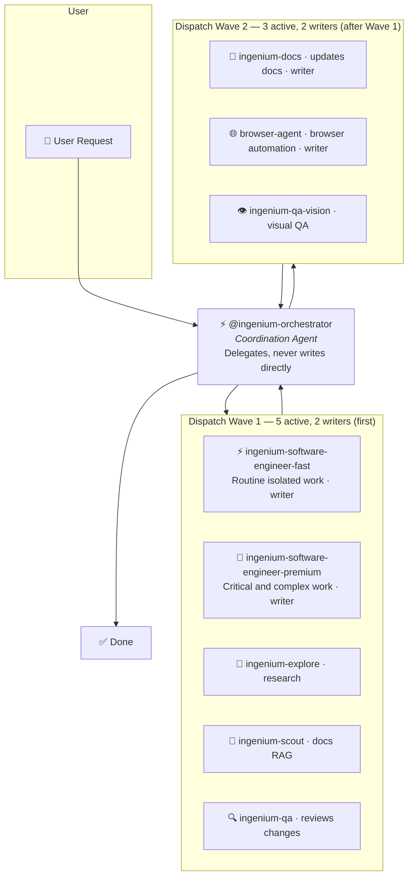
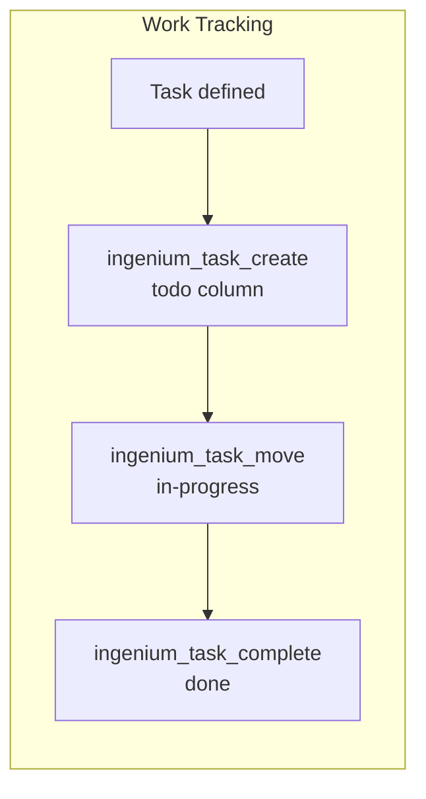

# Agent Architecture

## Overview

**12 agents total: 2 primary + 10 subagents (2 hidden).** The orchestrator (`@ingenium-orchestrator`) is the primary coordination agent — it reads plans from conversation context, decomposes work into parallel subagent tasks, verifies output, and encodes patterns into skills. It never writes code directly. A dedicated **chat agent** (`ingenium-chat`, hidden) handles conversational interactions with read-only access. Ten subagents handle exploration, QA, documentation, engineering, security, web automation, and the system-internal LLM broker. The hidden `ingenium-llm-broker` is reserved for system use (never invoked directly).

### Orchestrator Agent Model

The primary agents (`ingenium-orchestrator`, `ingenium-chat`) and all subagents have model mappings defined centrally in `opencode.json` under the `"agent"` key:

- **Model** — Defined in `opencode.json` (not the Markdown profile). The orchestrator routes writer tasks to Fast and Premium tiers based on task complexity and risk, with Premium handling critical/high-risk work.
- **`hidden: true`** — Prevents agents from appearing in non-Chat selectors where appropriate.
- **Provider from Settings** — Providers and models come from Settings → Providers (via `GET /api/v1/opencode/chat-config`), not from the full OpenCode provider catalog.

The diagram below is **serialized**: Wave 2 starts only after Wave 1 has
returned and its verification has completed. The waves are not simultaneous;
each wave is independently bounded by the 6-active/3-writer policy.

```mermaid
flowchart TB
    subgraph User
        REQ["💬 User Request"]
    end

    REQ --> ORCH["⚡ @ingenium-orchestrator<br/><i>Coordination Agent</i><br/>Delegates, never writes directly"]

    subgraph Wave1["Dispatch Wave 1 — 5 active, 2 writers (first)"]
        FAST["⚡ ingenium-software-engineer-fast<br/>Routine isolated work · writer"]
        PREM["💎 ingenium-software-engineer-premium<br/>Critical and complex work · writer"]
        EXPLORE["🔬 ingenium-explore · research"]
        SCOUT["🔎 ingenium-scout · docs RAG"]
        QA["🔍 ingenium-qa · reviews changes"]
    end

    subgraph Wave2["Dispatch Wave 2 — 3 active, 2 writers (after Wave 1)"]
        DOCS["📝 ingenium-docs · updates docs · writer"]
        BROWSER["🌐 browser-agent · browser automation · writer"]
        VISION["👁️ ingenium-qa-vision · visual QA"]
    end

    ORCH --> Wave1
    Wave1 --> ORCH
    ORCH --> Wave2
    Wave2 --> ORCH
    ORCH --> DONE["✅ Done"]
```

## Agent Table

| Agent | Type | Mode | Skills Allowed |
|-------|------|------|----------------|
| **ingenium-orchestrator** | Primary | Coordination — delegates to subagents, never writes code directly | `development-conventions`, `devops-conventions`, `engineering-workflow`, `local-models`, `skill-maintenance`, `mcp-tooling`, `documentation`, `security-audit`, `self-learning`, `database-conventions` |
| **ingenium-chat** | Primary | Chat (read-only, `hidden: true`) | — |
| **ingenium-explore** | Subagent | Research and exploration | `local-models` |
| **ingenium-scout** | Subagent | Research + Docs RAG | `local-models` |
| **ingenium-qa-vision** | Subagent | Visual QA (Playwright screenshots at 1440x900, 390x844); no Bash, no writes | `development-conventions`, `devops-conventions`, `engineering-workflow`, `mcp-tooling` |
| **ingenium-software-engineer-fast** | Subagent | Writer tier — routine isolated work, single-package scope | `development-conventions`, `devops-conventions`, `engineering-workflow`, `mcp-tooling`, `local-models`, `skill-maintenance`, `database-conventions` |
| **ingenium-software-engineer-premium** | Subagent | Writer tier — critical and complex cross-cutting work (auth, migrations, Docker, multi-service, high-risk) | `development-conventions`, `devops-conventions`, `engineering-workflow`, `mcp-tooling`, `local-models`, `skill-maintenance`, `database-conventions` |
| **ingenium-qa** | Subagent | Quality assurance — reviews changes, runs tests, verifies quality | `development-conventions`, `devops-conventions`, `engineering-workflow`, `local-models`, `mcp-tooling`, `documentation`, `security-audit`, `database-conventions` |
| **ingenium-docs** | Subagent | **Writer** — documentation updates (AGENTS.md, SKILL-INDEX.md, docs workspace) | `development-conventions`, `engineering-workflow`, `local-models`, `mcp-tooling`, `skill-maintenance`, `documentation` |
| **ingenium-security-auditor** | Subagent | Security audit — git history leak scanning, dependency review | `development-conventions`, `devops-conventions`, `engineering-workflow`, `mcp-tooling`, `security-audit`, `local-models`, `database-conventions` |
| **browser-agent** | Subagent | **Writer** — web automation and self-healing site interaction | `mcp-tooling`, `engineering-workflow` |
| **ingenium-llm-broker** | Subagent | System-internal LLM broker (`hidden: true`) | — |

> **Model configuration**: Agent model mappings are defined centrally in `opencode.json` under the `"agent"` key. Markdown profiles intentionally omit the `model:` field — the root config is the sole source of runtime model assignment.
>
> > **Note on `ingenium-chat`**: A legacy root-level duplicate at `.opencode/agents/ingenium-chat.md` exists alongside the canonical `.opencode/agents/chat/ingenium-chat.md`. This is a **compatibility mirror** — both files represent the same logical agent. The root duplicate is preserved for backward compatibility and does **not** count as a separate agent in the 12-agent total.

---

## Email MCP Tools

The 13 email MCP tools (`ingenium_email_list` through `ingenium_email_watch_status`) provide full email client capabilities including inbox triage, AI-powered response suggestions, and IMAP IDLE monitoring.

---

## Lifecycle: What Triggers What

Orchestrator phases follow a **behavioral** concurrency policy — 6 active
subagents max, 3 concurrent writers max per wave. Any wave examples in this
document are serialized unless explicitly stated otherwise: Wave N must finish
and be verified before Wave N+1 starts. Never read the examples as one combined
simultaneous dispatch exceeding either limit.

Writer classification follows the actual permission blocks: `ingenium-software-engineer-fast`, `ingenium-software-engineer-premium`, `ingenium-docs`, and `browser-agent` have `edit: allow` or `write: allow`. `ingenium-explore`, `ingenium-scout`, `ingenium-qa`, `ingenium-qa-vision`, and `ingenium-security-auditor` are non-writers. Writers still count toward the six-active limit, and no wave may contain more than three writers.

This classification is permission-derived rather than based on task type: Docs and Browser count as writers even when handling documentation or browser automation. `browser-agent` is dispatchable by `@ingenium-orchestrator` and must be included in the writer count whenever it is active.

| # | Phase | Agent | Action |
|---|-------|-------|--------|
| 1 | **Plan** | User / Plan mode | Define the task or generate plan |
| 2 | **Route** | `@ingenium-orchestrator` | Decompose task, select writer tier, declare phase (counts, territories, dependencies, verification owners) |
| 3 | **Fast** | `ingenium-software-engineer-fast` | Routine isolated work — single-package scope |
| 4 | **Premium** | `ingenium-software-engineer-premium` | 🔴 Critical and complex work — auth, migrations, Docker, multi-service, cross-package, high-risk |
| 5 | **Verify** | `@ingenium-qa` | Review changes, run tests, verify quality |
| 6 | **Visual QA** | `@ingenium-qa-vision` | Playwright screenshots at 1440x900 and 390x844 |
| 7 | **Document** | `@ingenium-docs` | Update AGENTS.md, SKILL-INDEX.md, docs workspace |
| 8 | **Browser** | `@browser-agent` | Browser automation and self-healing site interaction; counts as a writer |
| 9 | **Audit** | `@ingenium-security-auditor` | Git history leak scanning, dependency review |
| 10 | **Encode** | `@ingenium-orchestrator` | Detect + encode patterns into skills |
| 11 | **Observations** | Extraction engine (automatic) | Observations captured automatically from OpenCode messages |

---

## Task Board Integration

The task board (via `ingenium_task_*` MCP tools) can be used to track work items. Tasks flow through a standard todo → in_progress → review → done lifecycle.

```mermaid
flowchart LR
    subgraph Workflow["Work Tracking"]
        REQ["Task defined"] --> CREATE["ingenium_task_create<br/>todo column"]
        CREATE --> INPROG["ingenium_task_move<br/>in-progress"]
        INPROG --> DONE["ingenium_task_complete<br/>done"]
    end
```

---

## 🔴 Orchestration Policy

The orchestrator follows a **behavioral** concurrency policy — 6 active
subagents max, 3 concurrent writers max per phase. Writer tiers below describe
roles, not an instruction to dispatch every tier together. Each declared phase
is bounded independently, and any subsequent phase starts only after the prior
phase has completed and been verified. Writer tiers:

| Tier | Agent | When to route |
|------|-------|---------------|
| **Fast** | `ingenium-software-engineer-fast` | Routine isolated work, single-package scope |
| **Premium** | `ingenium-software-engineer-premium` | 🔴 Critical and complex work: auth, migrations, Docker, multi-service, high-risk, cross-package |
| **Docs** | `ingenium-docs` | Documentation and skill-system work |
| **Browser** | `browser-agent` | Browser automation and self-healing site interaction |

Example phase: **6 active, 3 writers** — Fast owns `dashboard/`, Docs owns `docs/`, Browser owns browser recipes; QA, Explore, and QA Vision are the three non-writers. This is valid because writer status follows `edit: allow`/`write: allow`, and no more than three such agents run concurrently.

### Phase Declaration

Every orchestration phase MUST declare: active count (max 6), writer count (max 3), exclusive territories (zero overlap), dependencies (serialization order), and verification owners.

### Restart Required for New Agent Profiles

Adding a new agent profile (`.opencode/agents/*.md`) requires restarting OpenCode before the auto-discovered agent becomes invocable by `@` mention.

> See the [orchestrator agent profile](../../.opencode/agents/primary/ingenium-orchestrator.md) for the full policy specification.

---

## Per-Agent Profiles

Full details for each agent are available in the agent definition files at `.opencode/agents/`.

### Compute Split

| Resource | Agents | Count | Cost |
|----------|--------|-------|------|
| Model-dependent (configurable) | All agents | 12 | Configurable via `opencode.json` agent mappings |

**Model configuration**: Agent model mappings live in `opencode.json` under the `"agent"` key. The Markdown profiles intentionally omit `model:` — the root config is the sole source of runtime model assignment. When agents are created or updated via MCP tools, the model field is persisted to `opencode.json`, not the `.md` file.

---

### Agent Invocation

| Agent | `@` mention | Access | Mode |
|-------|-------------|--------|------|
| ingenium-orchestrator | `@ingenium-orchestrator` | Read; restricted Bash (tests/git only); no write | Primary — coordination, delegates to subagents |
| ingenium-chat | `@ingenium-chat` | Read-only | Primary — invoked from Chat page |
| ingenium-explore | `@ingenium-explore` | Read-only | Subagent — research and exploration |
| ingenium-scout | `@ingenium-scout` | Read-only | Subagent — research + Docs RAG |
| ingenium-qa-vision | `@ingenium-qa-vision` | Read/glob/grep + Playwright; no Bash, no writes | Subagent — passive visual QA |
| ingenium-software-engineer-fast | `@ingenium-software-engineer-fast` | Full R/W/Bash | Subagent — writer tier Fast |
| ingenium-software-engineer-premium | `@ingenium-software-engineer-premium` | Full R/W/Bash | Subagent — writer tier Premium |
| ingenium-qa | `@ingenium-qa` | Bash + read-only | Subagent — quality assurance |
| ingenium-docs | `@ingenium-docs` | Full R/W/Bash | Subagent — writer for documentation |
| ingenium-security-auditor | `@ingenium-security-auditor` | Bash + read-only | Subagent — security audit |
| browser-agent | `@browser-agent` | Full R/W/Bash | Subagent — writer for web automation and self-healing site interaction |
| ingenium-llm-broker | `@ingenium-llm-broker` | All denied | Subagent — system-internal (`hidden: true`, never invoke directly) |
