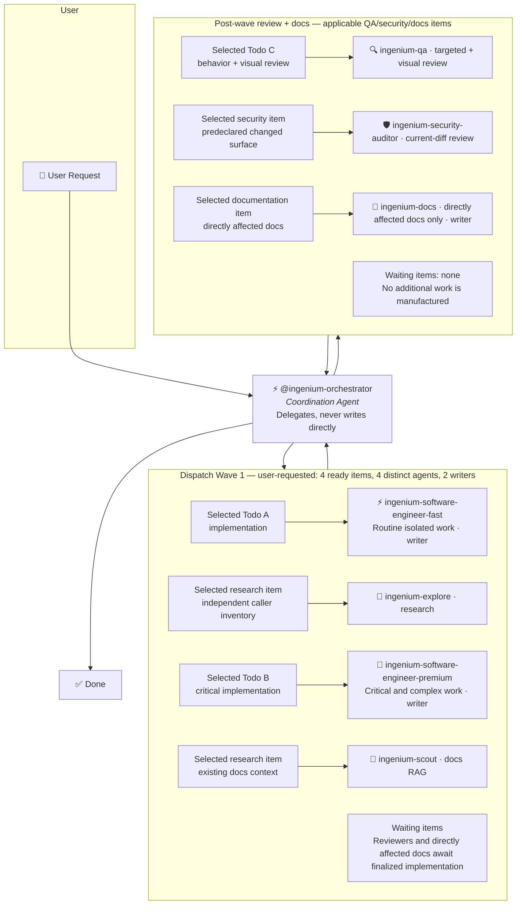
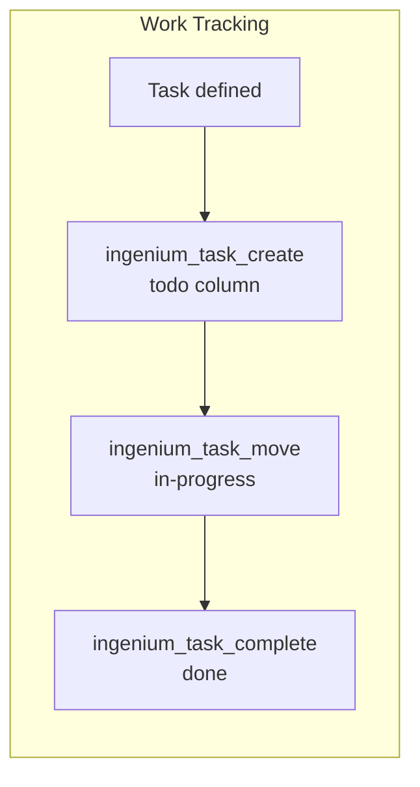

# Agent Architecture

## Overview

**The root `opencode.json` `agent` map contains 11 mapped entries: built-in Plan plus 10 named Ingenium agents.** The orchestrator (`@ingenium-orchestrator`) is the primary coordination agent — it declares finite task contracts, delegates bounded work, and returns terminal outcomes. It never writes code directly. A dedicated **Chat primary** (`ingenium-chat`) handles user-facing conversational interactions and may be hidden from general selectors. The mapped agents cover exploration, QA, documentation, engineering, recovery, and security. Managed Playwright/browser automation is a generic capability, and passive visual QA is owned by mapped `@ingenium-qa`. The separate hidden `ingenium-llm-broker` is reserved for system use, never directly invocable, and excluded from the repository skill/reference loading surface. Every user-facing active agent, including built-in Plan, explicitly loads `@ponytail` and the task-matching allowed skills before acting; this skill/reference surface is separate from tool grants.

The root mapping is authoritative for the 11 entries. The repository currently
contains 10 non-broker Markdown profiles plus the hidden broker; `plan` is the
built-in Plan mapping. Four writer-capable
identities remain: Fast, Premium, Recovery, and Docs.

Orchestration executes declared scoped tests, standard verification, in-scope source fixes, and any declared deployment autonomously. It never asks the user for permission to test, diagnose, fix, retry, package, scan, configure, run, or deploy work that is already within the declared user scope. A compile, test, package, scanner, configuration, or runtime defect with a concrete reproducible root cause is remediated and reverified automatically; a failed check alone never escalates. OpenCode interactive `question` access is denied globally and in every custom agent permission profile. The built-in Plan mode is the deliberate analysis exception: its root `opencode.json` permission block is the sole root-mapping permission exception. It grants `read`, `glob`, `grep`, `question`, and the read-only `ingenium_coordination_status` tool; its `task` map allows only `ingenium-explore` and denies every other agent. `edit`, `write`, `bash`, and `todowrite` are explicitly denied, coordination mutation tools remain denied, and `skill` allows all repository skills. Plan cannot invoke `ingenium-docs`, `ingenium-qa`, or any other subagent. Custom agents may not use interactive questions. Orchestration never invokes the `question` tool. These profile/configuration changes affect current sessions only after they restart; this documentation does not imply that already-running sessions are fixed. It returns `ESCALATE_USER` in its normal response only for unavailable required external credential/access after the configured path was attempted, unauthorized destructive/irreversible work, a mutually exclusive product decision, a genuinely ambiguous user requirement, or no reproducible root cause after bounded diagnosis.

### Verification scope

Ordinary writer work uses only the affected workspace typecheck/lint when
relevant and directly affected test file(s), optionally narrowed by test name.
Focused Playwright work targets the affected file and may use `--grep`; a
fixture-backed run is followed by `npx tsx tests/suite-containment-audit.ts --strict`.
Root `npm test`, entire Playwright configs, and Docker/provider/mail/
route-parity/manual suites require an explicitly declared `FULL_ACCEPTANCE`,
release, or cross-cutting acceptance gate. `FULL_ACCEPTANCE` means the declared
acceptance checks, not automatically every repository test.

### Autonomous TUI recovery safeguards

Recovery of a terminal user interface (TUI) parent or session whose task or
tool transport ended before its outcome was known starts with a read-only
recovery preflight. Before dispatching a restart task, inspect the exact
project, workspace, storage mapping, canonical worktree, session/incarnation,
epoch/fence/claim, nonce/enrollment, newest durable handoff, exact changed
paths, and task/`TodoWrite`/status/`nextWork` state. The preflight cannot signal,
stop, restart, mutate, claim, release, or clear state.

Restart is forbidden until retained proof covers fresh nonce/enrollment, durable
typed handoff, external supervisor ownership, replacement health on the current
merged source, reconnect/resume, rollback or authorized adoption, and
split-brain fencing. Legacy unenrolled parents use automatic bootstrap: the
external supervisor enrolls and health-checks the replacement first and never
signals the legacy parent first.

Task/tool transport aborts are nonterminal and trigger immediate state recovery;
an aborted restart task never ends the turn. `PASS` requires actual live
TUI/session and `TodoWrite` replay evidence. Source tests and deployed canaries
remain separate evidence classes and cannot prove runtime recovery or actual
model/session behavior.

### Git and GitHub workflow

Manual and user-created commits are valid and never block continued agent work.
Before committing, inspect `git status`, `git diff`, and recent `git log`, then
stage only the intended paths. Use ordinary non-interactive Git for local commits
and `gh` for GitHub pushes, pull requests, and checks. Never commit unrelated
changes, rewrite published history, or force-push without explicit authorization.

Before source edits, both software-engineer writers read
`.opencode/skills/development-conventions/references/useful-comments/guidelines.md`.
They keep code self-explanatory and add comments only for non-obvious
why/constraints, not to narrate what, record history, decorate sections, or
preserve commented-out code. QA inspects changed comments only within its
already-declared changed-file review; it does not add a broad comment pass.

### Documentation authority

Repository Markdown under `docs/**/*.md` is the normal documentation authority, and
repository sync projects it into the Docs Workspace. Agents update repository docs
for normal documentation work. Direct Docs Workspace mutation is allowed only when
the user explicitly requests a Workspace mutation or the documented repository-sync
process. Automatic page writes, post-change context saves, and session exports are
not agent requirements.

### Orchestrator Agent Model

The primary agents (`ingenium-orchestrator`, `ingenium-chat`) and all subagents have model mappings defined centrally in `opencode.json` under the `"agent"` key. Every root `agent.<name>` entry is model/variant-only except for the built-in Plan entry, which is the sole root-mapping permission exception; root owns `model` and `variant`, while native Markdown profiles own prompt content, permissions, lifecycle metadata, and named skills:

- **Model** — Defined in `opencode.json` (not the Markdown profile). The orchestrator routes writer tasks to Fast, Premium, and Recovery tiers based on task complexity and risk, with Premium handling critical/high-risk implementation and Recovery handling only the deployment-only recovery boundary.
- **`hidden: true`** — Prevents agents from appearing in non-Chat selectors where appropriate.
- **Provider from Settings** — Providers and models come from Settings → Providers (via `GET /api/v1/opencode/chat-config`), not from the full OpenCode provider catalog.

Agent frontmatter metadata is persisted with the agent record. A root
`prompt: "{file:.opencode/agents/...}"` reference can load a Markdown prompt body,
but it is not the ordinary agent-discovery mechanism; its YAML frontmatter is not
imported as a second `agent.<name>` mapping and cannot override the root model or
variant. The internal
`ingenium-llm-broker` is an API-owned, reserved profile: disk-only copies are
never imported, and sync accepts an API row only when it matches the complete
static canonical template before rewriting the one canonical disk profile.
Migration 058 backfills historical records and installs non-recursive `BEFORE
INSERT`/`BEFORE UPDATE` guards, so raw `INSERT OR REPLACE` and `UPDATE OR
REPLACE` cannot replace or mutate a broker even with `PRAGMA
recursive_triggers=0`. Only the dedicated internal core bootstrap can create
the canonical row; public core/API lifecycle functions reject broker create,
enable, disable, update, and delete operations. The normal project lifecycle
remains child-safe: it refuses projects with child rows, and broker protection
neither introduces nor bypasses FK cascade semantics.

### Exact runtime mappings

Root `opencode.json` sets `default_agent` to `ingenium-orchestrator` and
`subagent_depth` to `1`. It is authoritative for these case-sensitive model and variant
mappings. Every root entry is model/variant-only except for the built-in `plan`
entry, whose explicit permission block is the sole root-mapping permission
exception; canonical Markdown profiles own the prompt, permissions, lifecycle
metadata, and skills. The canonical-profile column is a repository
cross-reference, not a third root mapping field. The built-in `plan` entry is
the native OpenCode Plan mapping (`openai/gpt-6-astra`, `max`); its sole
root-level task allowance is `ingenium-explore`, while every other task target
is denied. `ingenium-explore` is a separate mapped agent.
The protected `ingenium-llm-broker` intentionally has no root mapping.

| Agent | Model | Variant | Canonical profile |
|---|---|---|---|
| `plan` (built-in) | `openai/gpt-6-astra` | `max` | Built-in Plan mode (root mapping) |
| `ingenium-explore` | `openai/gpt-5.6-sol` | `medium` | `.opencode/agents/research/ingenium-explore.md` |
| `ingenium-docs` | `openai/gpt-5.6-luna` | `max` | `.opencode/agents/execution/ingenium-docs.md` |
| `ingenium-qa` | `openai/gpt-5.6-luna` | `max` | `.opencode/agents/execution/ingenium-qa.md` |
| `ingenium-software-engineer-fast` | `openai/gpt-5.6-sol` | `medium` | `.opencode/agents/execution/ingenium-software-engineer-fast.md` |
| `ingenium-software-engineer-premium` | `openai/gpt-6-astra` | `medium` | `.opencode/agents/execution/ingenium-software-engineer-premium.md` |
| `ingenium-recovery-engineer` | `openai/gpt-5.6-sol` | `high` | `.opencode/agents/execution/ingenium-recovery-engineer.md` |
| `ingenium-orchestrator` | `deepseek/deepseek-v4-flash` | `max` | `.opencode/agents/primary/ingenium-orchestrator.md` |
| `ingenium-scout` | `openai/gpt-5.6-luna` | `max` | `.opencode/agents/research/ingenium-scout.md` |
| `ingenium-chat` | `openai/gpt-5.6-luna` | `max` | `.opencode/agents/chat/ingenium-chat.md` |
| `ingenium-security-auditor` | `openai/gpt-6-astra` | `high` | `.opencode/agents/security/ingenium-security-auditor.md` |

The diagram below is **serialized by dependency**: Wave 2 starts only after
Wave 1 has returned and its declared verification has completed. Independent
eligible items do not wait for unrelated work.

Current delegation policy follows the explicit user request and the active
orchestrator profile: dispatch one distinct subagent instance per
dependency-ready open TodoWrite/roadmap item, with exclusive non-overlapping
writer territories. There is no fixed active-agent or writer ceiling; record
actual counts for the selected items. Linked TodoWrite/roadmap entries count
once rather than as duplicate work, and historical scheduler notes do not
override this current policy. Multiple instances may use the same authorized
profile; never manufacture roles.

Every dispatch requires a complete task contract. Writers retain exclusive
non-overlapping territories, dependent items wait on prerequisites, and
QA/security/visual review runs once per applicable finalized boundary, never
prematurely. Subagents never delegate or spawn other subagents. Only
`.opencode/agents/primary/ingenium-orchestrator.md` contains subagent-
orchestration instructions; worker profiles carry no delegation procedure. The
Fast and Premium profiles explicitly state: “Never delegate, spawn, reassign,
or request another subagent; return research or documentation needs to the
orchestrator.” Deny-default permissions and broker protection remain unchanged.


```mermaid
flowchart TB
    subgraph User
        REQ["💬 User Request"]
    end

    REQ --> ORCH["⚡ @ingenium-orchestrator<br/><i>Coordination Agent</i><br/>Delegates, never writes directly"]

    subgraph Wave1["Dispatch Wave 1 — user-requested: 4 ready items, 4 distinct agents, 2 writers"]
        T1["Selected Todo A<br/>implementation"]
        FAST["⚡ ingenium-software-engineer-fast<br/>Routine isolated work · writer"]
        EXPLORE["🔬 ingenium-explore · research"]
        T2["Selected Todo B<br/>critical implementation"]
        PREM["💎 ingenium-software-engineer-premium<br/>Critical and complex work · writer"]
        SCOUT["🔎 ingenium-scout · docs RAG"]
        T1 --> FAST
        R1["Selected research item<br/>independent caller inventory"] --> EXPLORE
        T2 --> PREM
        R2["Selected research item<br/>existing docs context"] --> SCOUT
        W1WAIT["Waiting items<br/>Reviewers and directly affected docs await finalized implementation"]
    end

    subgraph Wave2["Post-wave review + docs — applicable QA/security/docs items"]
        T3["Selected Todo C<br/>behavior + visual review"]
        QA["🔍 ingenium-qa · targeted + visual review"]
        SECURITY["🛡️ ingenium-security-auditor · current-diff review"]
        DOCS["📝 ingenium-docs · directly affected docs only · writer"]
        T3 --> QA
        S1["Selected security item<br/>predeclared changed surface"] --> SECURITY
        D1["Selected documentation item<br/>directly affected docs"] --> DOCS
        W2WAIT["Waiting items: none<br/>No additional work is manufactured"]
    end

    ORCH --> Wave1
    Wave1 --> ORCH
    ORCH --> Wave2
    Wave2 --> ORCH
    ORCH --> DONE["✅ Done"]
```

### User-facing orchestration communication

The orchestrator communicates in four stages:

1. **Plain-language introduction** — explain the goal, why it matters, and the immediate approach in one to three sentences.
2. **Structured contract** — show `IN_SCOPE`, `OUT_OF_SCOPE`, acceptance criteria, `STOP_CONDITION`, verification and escalation rules, the user concurrency request, item-to-agent assignments, active/writer counts, territories, dependencies, and waiting-item reasons.
3. **Interpreted phase result** — explain what completed, what changed, which checks ran and their outcomes, the finding classification, and the next dependency. If work remains open, immediately continue to the next eligible phase rather than asking for a reprompt or returning raw agent/tool output.
4. **Human-readable terminal summary** — report status, changed files, verification execution count, findings or remaining work, and Markdown links or repository paths to retained proof. Distinguish source-test, deployed-runtime, and model/session evidence.

The Wave 2 example combines behavior and visual review under `@ingenium-qa` and
assumes directly affected documentation plus applicable security review. If a
review is blocked or not applicable, record that item's concrete dependency or
applicability reason; do not delay safe independent reviewers or manufacture
work.

## Agent Table

The table below covers the 10 named mapped agents and the hidden broker; the
built-in Plan entry is represented by the root `plan` mapping above.

| Agent | Type | Mode | Skills Allowed |
|-------|------|------|----------------|
| **ingenium-orchestrator** | Primary | Coordination — delegates to subagents, never writes code directly | All repository skills/references |
| **ingenium-chat** | Primary | Chat (read-only except explicit user-directed saved memory, `hidden: true`) | All repository skills/references |
| **ingenium-explore** | Subagent | Research and exploration | All repository skills/references |
| **ingenium-scout** | Subagent | Research + Docs RAG only; no generic source review | All repository skills/references |
| **ingenium-software-engineer-fast** | Subagent | Writer tier — routine isolated work, single-package scope | All repository skills/references |
| **ingenium-software-engineer-premium** | Subagent | Writer tier — critical and complex cross-cutting work (auth, migrations, Docker, multi-service, high-risk) | All repository skills/references |
| **ingenium-recovery-engineer** | Subagent | **Permission-derived writer (deployment-only)** — only the fixed production-restart command plus scoped Git diff/add/commit checkpoint operations and read-only object/tree inspection; source/package/config executable paths denied; writes limited to declared recovery evidence/roadmap; no questions, delegation, or implementation | All repository skills/references |
| **ingenium-qa** | Subagent | Targeted, read-only QA — one declared verification pass with scope-classified findings | All repository skills/references |
| **ingenium-docs** | Subagent | **Writer** — repository documentation and explicitly requested Docs Workspace updates | All repository skills/references |
| **ingenium-security-auditor** | Subagent | Bounded current-diff/dependency review; one history scan only for a confirmed secret or critical explicit trigger | All repository skills/references |
| **ingenium-llm-broker** | Subagent | Hidden system-internal LLM broker (`hidden: true`), wildcard-denied with no tool allowances | — (excluded) |

> **Model configuration**: Agent model mappings are defined centrally in `opencode.json` under the `"agent"` key. Markdown profiles intentionally omit the `model:` field — the root config is the sole source of runtime model assignment.
>
> > **Note on `ingenium-chat`**: The canonical repository profile is
> > `.opencode/agents/chat/ingenium-chat.md`. Runtime bootstrap may project
> > ordinary profiles into OpenCode's native global/workspace agent directories;
> > those generated flat copies are not additional repository profiles or agents.

### Skill permission policy

Native Markdown profiles grant the repository skill/reference surface explicitly;
the root `opencode.json` stores the runtime model/variant mappings and does not
serve as the profile permission authority for mapped custom agents; built-in
Plan's root block is the sole root-mapping permission exception. User-facing profiles include the
canonical skill names, including `ponytail`, and their preflight requires loading
`@ponytail` before any action:

```yaml
permission:
  "*": deny
  skill:
    development-conventions: allow
    ponytail: allow
```

The same all-skill loading surface is available to built-in Plan. It is a
repository skill/reference capability, not a tool grant. The built-in Plan root
block is the sole root-mapping permission exception: `skill: "*"` allows all
repository skills; `read`, `glob`, `grep`, `question`, and the read-only
`ingenium_coordination_status` tool are allowed; and `task` denies `*` while
allowing only `ingenium-explore`. `edit`, `write`, `bash`, and `todowrite` are
explicitly denied, and coordination mutation tools remain denied. Plan cannot
invoke `ingenium-docs`, `ingenium-qa`, or any other subagent. Root mappings and
mapped profiles must remain semantically aligned, but profile frontmatter is
not a second runtime configuration source.

`@skill-name` is mention syntax for Required Skills sections and inline prose;
it is not a `permission.skill` key. If a narrow policy is documented, use the
actual canonical directory names without `@`, and put the wildcard first so
specific rules follow it. The hidden `ingenium-llm-broker` is the exception:
its skill permission is `{"*": "deny"}` and it has no tool allowances. See
[the skill taxonomy](../reference/skill-taxonomy.md) for the canonical names
and legacy mapping.

### Dedicated recovery-engineer boundary

`@ingenium-recovery-engineer` has the universal skill/reference loading surface
but is a **deployment-only permission-derived writer**. Source, package, and
configuration executable paths are denied; its writes are limited to declared
recovery evidence and roadmap state. It may execute only the fixed
production-restart command plus scoped Git diff/add/commit checkpoint
operations and read-only object/tree inspection. It cannot implement source,
package, or configuration changes, execute arbitrary shell, use `question`, or
delegate work. Premium remains the implementation owner. This security
remediation does not bypass any recovery or acceptance gate; activation and
runtime proof remain pending.

The root mapping and mapped profile load only after a **full parent OpenCode
replacement/restart**; restarting only the child MCP process is insufficient.
A parent restart acknowledgement is not proof that the new surface loaded.
After replacement, an independently read-capable verifier must check the exact
model, variant, profile path, and effective grants from the new parent.

The orchestrator and Premium writer profiles explicitly grant the top-level MCP
tools `ingenium_coordination_update`, `ingenium_coordination_claim`, and
`ingenium_coordination_release`; these are not Bash permissions. The read-only
Scout profile additionally grants `ingenium_docs_search_semantic` for semantic
Docs RAG retrieval. `ingenium_coordination_handoff` is a mixed publish/read/
acknowledge/consume tool and is write-classified as a whole. The broader
recovery protocol therefore performs handoff or typed-memory reads with
`read` or `memory_read` from an authorized coordination-capable session; that
tool is not part of Plan's grant. A stale API/root-level `allow` expectation
must not widen Plan's surface. Epoch `recovery_state`, `reconcile_epoch`, and
`recover_epoch` remain operations on `ingenium_coordination_update`; they are not
Plan permissions. All other tool and MCP profile permissions remain
deny-by-default.

### Effective role matrix

The built-in Plan root block and mapped Markdown profiles use deny defaults. Plan
is the sole root-mapping permission exception. The effective core permission
matrix is explicitly:

| Profile | `read` | `glob` | `grep` | `question` | `edit`/`write` | `bash` | Effective role |
|---|---|---|---|---|---|---|---|
| Plan | allow | allow | allow | allow | deny | deny | Planning only; sole root-mapping permission exception; all repository skills/references plus generic inspection tools and read-only `ingenium_coordination_status`; task only `ingenium-explore`; no other subagents or handoff tool |
| `ingenium-docs` | allow | allow | allow | deny | allow | allow | Intentional writer |
| `ingenium-software-engineer-fast` | allow | allow | allow | deny | allow | allow | Intentional writer |
| `ingenium-software-engineer-premium` | allow | allow | allow | deny | allow | allow | Intentional writer; deployment remains profile-governed below |
| `ingenium-recovery-engineer` | allow | allow | allow | deny | declared evidence/roadmap only | fixed production-restart plus scoped Git checkpoint and read-only object/tree inspection only | Permission-derived writer for deployment only; source/package/config executable paths denied; Premium owns implementation |
| `ingenium-orchestrator` | allow | deny | deny | deny | deny | restricted allow | Coordination and verification only; restricted Bash includes curated Git inspection/checkpoint; no file-mutation rights |
| `ingenium-chat` | allow | allow | allow | deny | deny | deny | Read-only except explicit user-directed saved-memory operations |
| `ingenium-explore` | allow | allow | allow | deny | deny | deny | Read-only |
| `ingenium-scout` | allow | deny | deny | deny | deny | deny | Read-only; bounded Docs RAG MCP access |
| `ingenium-qa` | allow | allow | allow | deny | deny | allow | Read-only; Bash is governed by this profile's permissions; no coordinator command boundary |
| `ingenium-security-auditor` | allow | allow | allow | deny | deny | allow | Read-only; Bash is governed by this profile's permissions; no coordinator command boundary |
| `ingenium-llm-broker` | deny | deny | deny | deny | deny | deny | Hidden system profile; wildcard-denied with no tool allowances |

**Git access by agent:** `ingenium-docs`, `ingenium-software-engineer-fast`,
`ingenium-software-engineer-premium`, `ingenium-qa`, and
`ingenium-security-auditor` have full Bash grants and can run all non-destructive
Git commands. `ingenium-orchestrator` has restricted Bash with curated read-only
Git inspection: `git show`, `git blame`, `git ls-files`, `git ls-tree`,
`git rev-parse`, `git branch --list`, `git tag --list`, and `git remote -v`;
its existing status/diff/log, stage/add/commit, and `gh` grants remain, while
`git commit --amend`, `git commit-tree`, `git update-ref`, `git push`,
`git reset`, `git config`, `git hook`, and `git update-index` remain denied.
`ingenium-recovery-engineer` additionally has read-only object/tree inspection
via `git show`, `git blame`, `git ls-files`, `git ls-tree`, and `git rev-parse`;
its scoped diff/add/commit and fixed restart remain, while `git push`,
`git reset`, `git checkout`, `git clean`, `git config`, and network access remain
denied. Plan, `ingenium-explore`, `ingenium-scout`, and `ingenium-chat` remain
Bash-denied by design.

`edit`/`write` are the file-mutation permissions. The intentional writer
profiles retain those permissions; every read-only profile above does not. A
read-only profile with bounded Bash or MCP access does not thereby gain generic
shell, file-mutation, or deployment authority.

### Permission and deployment boundary

The built-in Plan permission block in `opencode.json` is the sole root-mapping
permission exception. Every other root agent entry contains only `model` and
`variant`; native Markdown profiles own effective permissions. The root config
remains authoritative for the Premium model and variant; the Markdown profile
is not a second model source. Custom profiles keep `question` denied; Plan is
the deliberate root-level question exception.

Tool governance for mapped custom agents is profile-only. Permissions in
`.opencode/agents/**` are the sole tool gate for custom-agent execution; the
built-in Plan root block is the only exception. The session coordinator does not
register `tool.execute.before` or `tool.execute.after` hooks and never denies,
preclaims, or admission-checks tool execution. The former managed-command
denial layer was removed by owner decision. `ingenium-build` and
`ingenium-repository` remain neutral optional utilities, not enforcement layers.

**Owner decision (2026-09-09):** No wrapper denies tools; custom-agent profiles
govern execution, with built-in Plan's root permission block as the sole
root-mapping exception. Verification runs directly under the active agent
profile permissions.

The dedicated `ingenium-recovery-engineer` is the separate deployment owner for
the recovery lane and a permission-derived writer for deployment only. Its
profile-governed deployment scope is limited to the declared production-restart
utility plus scoped Git diff/add/commit checkpoint operations and read-only
object/tree inspection; source/package/config executable paths are denied,
writes are limited to declared recovery evidence/roadmap, and arbitrary shell,
`question`, task/delegation, and implementation access remain denied.
Premium owns implementation. Activation and runtime proof remain pending, and
its parent-loaded root mapping and profile still require a full parent OpenCode
replacement/restart before use.
Changing an agent profile, its prompt-file frontmatter, plugin, MCP entry, OpenCode
config, or parent binding requires a full parent OpenCode restart; restarting only
the child MCP process is insufficient because existing sessions retain their
previous prompt, profile, skill surface, and permissions. A restart
acknowledgement alone is not loaded-surface proof. After restart, an
independently read-capable verifier must check the exact root mapping, mapped
profile, and effective grants rather than inferring parity from the Markdown
file alone.

---

## Email MCP Tools

The 27 email MCP tools (`ingenium_email_list` through `ingenium_email_attachment_get`) provide full email client capabilities including inbox triage, AI-powered response suggestions, and IMAP IDLE monitoring.

---

## Lifecycle: What Triggers What

Current delegation policy follows the explicit user request and the active
orchestrator profile: dispatch one distinct subagent instance per
dependency-ready open TodoWrite/roadmap item, with no fixed active-agent or
writer ceiling. The phases below describe dependencies and role ownership;
waiting items must name their concrete dependency, territory, or applicability
reason.

Writer classification follows the actual permission blocks: `ingenium-software-engineer-fast`, `ingenium-software-engineer-premium`, `ingenium-recovery-engineer`, and `ingenium-docs` have `edit: allow` or `write: allow`. `ingenium-explore`, `ingenium-scout`, `ingenium-qa`, and `ingenium-security-auditor` are non-writers. Record actual active/writer counts and each waiting item's concrete dependency, territory, authorized-role availability, review, or applicability reason; never manufacture roles or work to fill capacity.

After an implementation wave and its declared verification are complete,
independent applicable QA, security, and visual review share one post-wave phase
when safe. QA and security retain their implementation boundary, and visual QA
retains its final-UI boundary. A blocked or non-applicable review is omitted and
its item and concrete reason are declared rather than splitting safe
reviewers or starting substitute work.

This classification is permission-derived rather than based on task type: Docs
and Recovery count as writers even when handling documentation or deployment-only
recovery execution. Recovery is not an implementation writer, and its boundary
still denies source/package/config executable paths, arbitrary shell, and
task/delegation access.

| # | Phase | Agent | Action |
|---|-------|-------|--------|
| 1 | **Plan** | User / Plan mode | Define the task or generate plan |
| 2 | **Route** | `@ingenium-orchestrator` | Declare IN_SCOPE, OUT_OF_SCOPE, acceptance criteria, STOP_CONDITION, verification plan, escalation rule, user concurrency request, item-to-agent assignments, counts, exclusive territories, dependencies, targeted verification owner, and waiting-item reasons before dispatch |
| 3 | **Fast** | `ingenium-software-engineer-fast` | Routine isolated work — single-package scope |
| 4 | **Premium** | `ingenium-software-engineer-premium` | 🔴 Critical and complex work — auth, migrations, Docker, multi-service, cross-package, high-risk |
| 5 | **Verify + visual QA** | `@ingenium-qa` | One targeted QA pass in the shared post-wave review phase, including applicable visual review after the final UI change; sole owner of a declared full E2E/container suite |
| 6 | **Document** | `@ingenium-docs` | Directly affected canonical documentation or explicit user request only |
| 7 | **Audit** | `@ingenium-security-auditor` | Current diff/relevant dependency review in the shared post-wave phase; one history scan only for confirmed secret or critical explicit trigger |
| 8 | **Result** | `@ingenium-orchestrator` | Report bounded outcome and classifications; no recursive dispatch |
| 9 | **Observations** | Extraction engine (automatic) | Observations captured automatically from OpenCode messages |

---

## Task Board Integration

The task board (via `ingenium_task_*` MCP tools) can be used to track work items. Tasks flow through a standard todo → in_progress → review → done lifecycle.

TodoWrite is a separate live execution checklist and is allowed only for
`ingenium-orchestrator`, `ingenium-software-engineer-fast`,
`ingenium-software-engineer-premium`, and `ingenium-recovery-engineer`. Recovery
may own TodoWrite only for declared deployment/recovery/checkpoint evidence and
roadmap reconciliation; Premium owns recovery implementation TodoWrite items.
Each owner must initialize a nonempty list
before any dispatch, edit, or command on a nonterminal task, update it after each
implementation or evidence transition, reconcile it before a terminal response,
and explicitly report tool failure or unavailability. Roadmap markers remain an
append-only audit trail and do not replace TodoWrite.


```mermaid
flowchart LR
    subgraph Workflow["Work Tracking"]
        REQ["Task defined"] --> CREATE["ingenium_task_create<br/>todo column"]
        CREATE --> INPROG["ingenium_task_move<br/>in-progress"]
        INPROG --> DONE["ingenium_task_complete<br/>done"]
    end
```

---

## 🔴 Orchestration Policy

Current delegation policy follows the explicit user request and the active
orchestrator profile: dispatch one distinct subagent instance per
dependency-ready open TodoWrite/roadmap item, with exclusive non-overlapping
writer territories and no fixed active-agent or writer ceiling. Dependent items
wait until their prerequisites finish and are verified. Writer tiers:

| Tier | Agent | When to route |
|------|-------|---------------|
| **Fast** | `ingenium-software-engineer-fast` | Routine isolated work, single-package scope |
| **Premium** | `ingenium-software-engineer-premium` | 🔴 Critical and complex work: auth, migrations, Docker, multi-service, high-risk, cross-package |
| **Recovery** | `ingenium-recovery-engineer` | Deployment-only permission-derived writer: fixed production-restart plus scoped Git diff/add/commit checkpoint operations and read-only object/tree inspection; declared recovery evidence/roadmap writes; Premium owns implementation |
| **Docs** | `ingenium-docs` | Documentation and skill-system work |

Concurrency follows the current board and user instruction: when requested,
dispatch one distinct agent per dependency-ready open item. There is no fixed
active-agent or writer ceiling; actual counts, exclusive territories, and
waiting reasons are declared for each phase. Waiting review items name
finalized implementation and verification as prerequisites. QA, security, and
visual review then share the post-wave phase when their checks are applicable
and safe.

### Finite Task and Phase Declaration

Before dispatch, every task declares **IN_SCOPE**, **OUT_OF_SCOPE**, acceptance criteria, **STOP_CONDITION**, verification plan, and escalation rule. The verification plan names targeted checks, deployment/acceptance steps, the bounded diagnosis limit for an unreproduced failure, and the root-cause/proving-regression link for every remediation. A check failure or retry count alone never returns **ESCALATE_USER**: reproducible in-scope defects are fixed and reverified automatically.

Every orchestration phase also declares the explicit user concurrency request,
one distinct subagent per selected item, actual active/writer counts, exclusive
territories (zero overlap), dependencies (serialization order), targeted
verification owner/checks, and concrete waiting-item reasons. Findings are
**BLOCKING**, **FOLLOW_UP**, or **INFORMATIONAL**; a finding
is BLOCKING only when it fails acceptance criteria in user scope or is
immediately exploitable changed code. Only in-scope BLOCKING findings reopen
work. FOLLOW_UP findings are reported separately and never auto-dispatched.
Each remediation must name and address the currently failing root cause.

QA, security, and applicable visual QA share one post-wave phase when their
independent checks are safe to run together. Each runs once per implementation
wave, Docs runs only for directly affected canonical docs or explicit user
request, and no reviewer recursively triggers QA/Docs work. If a reviewer is
blocked or not applicable, declare its item and concrete waiting or omission
reason. After a writer fixes a reviewer-reported in-scope BLOCKING
root cause, run only the named minimum targeted regression; never rerun QA,
security, or any other reviewer. Proceed directly to the declared deploy and
acceptance steps. UI gets one
changed-route gate after final UI change and one sweep per user-requested UI
batch; reproducible visual failures receive causal remediation and their
smallest proving recheck. Docs/non-UI work never opens visual gates. Security
defaults to current-diff/dependency review; history scans are once-only for a
confirmed secret or critical explicit trigger. Continue declared source fix →
targeted test → deploy → acceptance steps automatically. STOP/CANCELLED is
terminal only when explicitly requested: preserve evidence and skipped work
without spawning new agents or gates; never reinterpret a remediation request
as terminal.

### 🔴 Autonomous Roadmap Completion Contract

Roadmap execution continues autonomously until every scoped roadmap task has evidence-backed completion or one of the five narrow escalation conditions is proven. Never report completion from source tests alone. Runtime-impacting changes require a deployment owner and deployment wave; the owner must rebuild and restart the current merged source, then health-check actual routes. Visual/UI gates and full acceptance are mandatory before terminal success. Before the final response, reconcile roadmap markers and `TodoWrite`.

QA and security may report scope-classified BLOCKING/FOLLOW_UP findings once per their declared bounded phase. They have no task-delegation authority, cannot spawn the other, and cannot reopen a closed task. After a reviewer-reported BLOCKING remediation, the orchestrator runs only the named minimum targeted regression, never reruns QA, security, or any other reviewer, and proceeds directly to deploy and acceptance.

### Restart Required for Agent Profile and Configuration Changes

Adding or changing an agent profile (`.opencode/agents/*.md`), repository
skill/reference loading, root agent mapping, plugin, MCP entry, or OpenCode
configuration requires a **full parent OpenCode restart** before the change is
loaded. Restarting only the child MCP process is insufficient: existing parent
sessions retain their previously loaded profile, mapping, skill surface, and
permissions. After the parent restarts, verify the exact mapped profile and
root-effective grants before resuming recovery.

### Profile file safety

Agent profiles are public Markdown metadata, not credential files. Core and extension writers set regular profile files to mode `0644`; repository initialization ignores mode-restricted profiles rather than failing the complete scan. Docker startup repairs only regular, non-symlinked `.opencode/agents/**/*.md` files to `0644` before `appuser` runs `ingenium-init-project`, preserving their ownership and content. It does not change configuration or token-file permissions; token files remain mode `0600`.

> See the [orchestrator agent profile](../../.opencode/agents/primary/ingenium-orchestrator.md) for the full policy specification.

---

## Per-Agent Profiles

Repository-managed agent details are available in `.opencode/agents/`; the
built-in Plan entry is managed by the root mapping, while named custom-agent
profiles are managed by the repository and agent lifecycle.

### Compute Split

| Resource | Agents | Count | Cost |
|----------|--------|-------|------|
| Model-dependent (configurable) | All agents | 11 | Configurable via `opencode.json` agent mappings |

**Model configuration**: Agent model mappings live in `opencode.json` under the `"agent"` key. The Markdown profiles intentionally omit `model:` — the root config is the sole source of runtime model assignment. Built-in Plan's explicit permission block is the sole root-mapping permission exception; a `{file:...}` prompt reference loads the profile body, and its frontmatter does not become a second root mapping. When agents are created or updated via MCP tools, the model field is persisted to `opencode.json`, not the `.md` file.

---

### Agent Invocation

| Agent | `@` mention | Access | Mode |
|-------|-------------|--------|------|
| ingenium-orchestrator | `@ingenium-orchestrator` | Read; restricted Bash (verification plus curated Git inspection/checkpoint); no write | Primary — coordination, delegates to subagents |
| ingenium-chat | `@ingenium-chat` | Read-only except explicit user-directed saved-memory operations | Primary — invoked from Chat page |
| ingenium-explore | `@ingenium-explore` | Read-only | Subagent — research and exploration |
| ingenium-scout | `@ingenium-scout` | Read-only | Subagent — research + Docs RAG only; no generic source review |
| ingenium-software-engineer-fast | `@ingenium-software-engineer-fast` | Full R/W/Bash | Subagent — writer tier Fast |
| ingenium-software-engineer-premium | `@ingenium-software-engineer-premium` | Full R/W/Bash | Subagent — writer tier Premium |
| ingenium-recovery-engineer | `@ingenium-recovery-engineer` | Read + declared recovery evidence/roadmap writes + fixed production-restart, scoped Git checkpoint, and read-only object/tree inspection only | Subagent — deployment-only permission-derived writer; source/package/config executable paths denied; Premium owns implementation |
| ingenium-qa | `@ingenium-qa` | Bash + read-only | Subagent — quality and visual QA |
| ingenium-docs | `@ingenium-docs` | Full R/W/Bash | Subagent — writer for documentation |
| ingenium-security-auditor | `@ingenium-security-auditor` | Bash + read-only | Subagent — security audit |
| ingenium-llm-broker | `@ingenium-llm-broker` | Wildcard deny; no tool allowances | Subagent — system-internal (`hidden: true`, never invoke directly) |
