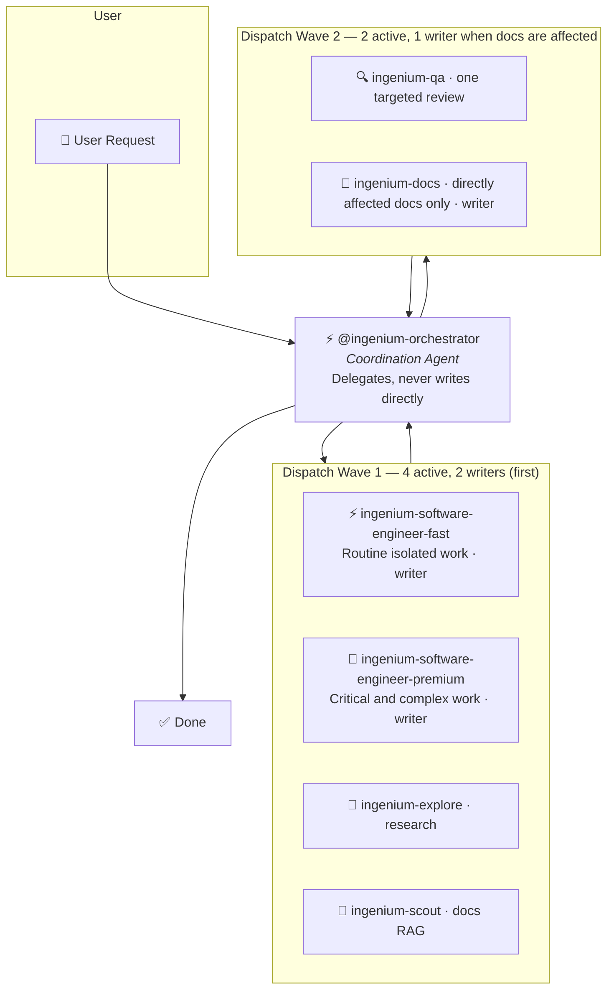
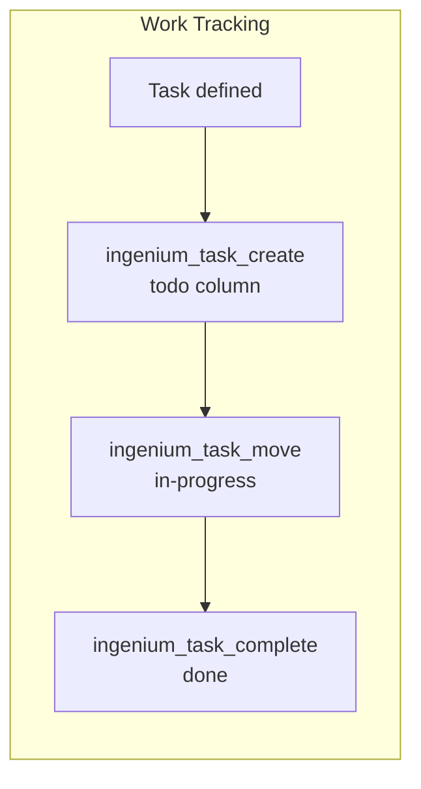

# Agent Architecture

## Overview

**12 agents total: 2 primary + 10 subagents (2 hidden).** The orchestrator (`@ingenium-orchestrator`) is the primary coordination agent — it declares finite task contracts, delegates bounded work, and returns terminal outcomes. It never writes code directly. A dedicated **chat agent** (`ingenium-chat`, hidden) handles conversational interactions with read-only access. Ten subagents handle exploration, QA, documentation, engineering, security, web automation, and the system-internal LLM broker. The hidden `ingenium-llm-broker` is reserved for system use (never invoked directly).

Orchestration executes declared scoped tests, standard verification, in-scope source fixes, and any declared deployment autonomously. It never asks the user for permission to test, diagnose, fix, retry, package, scan, configure, run, or deploy work that is already within the declared user scope. A compile, test, package, scanner, configuration, or runtime defect with a concrete reproducible root cause is remediated and reverified automatically; a failed check alone never escalates. Only Plan mode may use interactive decision questions. Orchestration never invokes the `question` tool. It returns `ESCALATE_USER` in its normal response only for unavailable required external credential/access after the configured path was attempted, unauthorized destructive/irreversible work, a mutually exclusive product decision, a genuinely ambiguous user requirement, or no reproducible root cause after bounded diagnosis.

### Documentation authority

Repository Markdown under `docs/**/*.md` is the normal documentation authority, and
repository sync projects it into the Docs Workspace. Agents update repository docs
for normal documentation work. Direct Docs Workspace mutation is allowed only when
the user explicitly requests a Workspace mutation or the documented repository-sync
process. Automatic page writes, post-change context saves, and session exports are
not agent requirements.

### Orchestrator Agent Model

The primary agents (`ingenium-orchestrator`, `ingenium-chat`) and all subagents have model mappings defined centrally in `opencode.json` under the `"agent"` key:

- **Model** — Defined in `opencode.json` (not the Markdown profile). The orchestrator routes writer tasks to Fast and Premium tiers based on task complexity and risk, with Premium handling critical/high-risk work.
- **`hidden: true`** — Prevents agents from appearing in non-Chat selectors where appropriate.
- **Provider from Settings** — Providers and models come from Settings → Providers (via `GET /api/v1/opencode/chat-config`), not from the full OpenCode provider catalog.

Agent frontmatter metadata is persisted with the agent record. The internal
`ingenium-llm-broker` is an API-owned, reserved profile: disk-only copies are
never imported, and sync accepts an API row only when it matches the complete
static canonical template before rewriting the one canonical disk profile.
Migration 058 backfills historical records and installs non-recursive `BEFORE
INSERT`/`BEFORE UPDATE` guards, so raw `INSERT OR REPLACE` and `UPDATE OR
REPLACE` cannot replace or mutate a broker even with `PRAGMA
recursive_triggers=0`. Only the dedicated internal core bootstrap can create
the canonical row; public core/API lifecycle functions reject broker create,
enable, disable, update, and delete operations. The normal project lifecycle
remains child-safe: it refuses projects with child rows, and broker protection
neither introduces nor bypasses FK cascade semantics.

The diagram below is **serialized**: Wave 2 starts only after Wave 1 has
returned and its verification has completed. The waves are not simultaneous;
each wave is independently bounded by the 6-active/3-writer policy.

```mermaid
flowchart TB
    subgraph User
        REQ["💬 User Request"]
    end

    REQ --> ORCH["⚡ @ingenium-orchestrator<br/><i>Coordination Agent</i><br/>Delegates, never writes directly"]

    subgraph Wave1["Dispatch Wave 1 — 4 active, 2 writers (first)"]
        FAST["⚡ ingenium-software-engineer-fast<br/>Routine isolated work · writer"]
        PREM["💎 ingenium-software-engineer-premium<br/>Critical and complex work · writer"]
        EXPLORE["🔬 ingenium-explore · research"]
        SCOUT["🔎 ingenium-scout · docs RAG"]
    end

    subgraph Wave2["Dispatch Wave 2 — 2 active, 1 writer when docs are affected"]
        QA["🔍 ingenium-qa · one targeted review"]
        DOCS["📝 ingenium-docs · directly affected docs only · writer"]
    end

    ORCH --> Wave1
    Wave1 --> ORCH
    ORCH --> Wave2
    Wave2 --> ORCH
    ORCH --> DONE["✅ Done"]
```

## Agent Table

| Agent | Type | Mode | Skills Allowed |
|-------|------|------|----------------|
| **ingenium-orchestrator** | Primary | Coordination — delegates to subagents, never writes code directly | `development-conventions`, `devops-conventions`, `engineering-workflow`, `local-models`, `skill-maintenance`, `mcp-tooling`, `documentation`, `security-audit`, `self-learning`, `database-conventions` |
| **ingenium-chat** | Primary | Chat (read-only, `hidden: true`) | — |
| **ingenium-explore** | Subagent | Research and exploration | `local-models` |
| **ingenium-scout** | Subagent | Research + Docs RAG | `local-models` |
| **ingenium-qa-vision** | Subagent | Visual QA (Playwright screenshots at 1440x900, 390x844); no Bash, no writes | `development-conventions`, `devops-conventions`, `engineering-workflow`, `mcp-tooling` |
| **ingenium-software-engineer-fast** | Subagent | Writer tier — routine isolated work, single-package scope | `development-conventions`, `devops-conventions`, `engineering-workflow`, `mcp-tooling`, `local-models`, `skill-maintenance`, `database-conventions` |
| **ingenium-software-engineer-premium** | Subagent | Writer tier — critical and complex cross-cutting work (auth, migrations, Docker, multi-service, high-risk) | `development-conventions`, `devops-conventions`, `engineering-workflow`, `mcp-tooling`, `local-models`, `skill-maintenance`, `database-conventions` |
| **ingenium-qa** | Subagent | Targeted, read-only QA — one declared verification pass with scope-classified findings | `development-conventions`, `devops-conventions`, `engineering-workflow`, `local-models`, `mcp-tooling`, `documentation`, `security-audit`, `database-conventions` |
| **ingenium-docs** | Subagent | **Writer** — repository documentation and explicitly requested Docs Workspace updates | `development-conventions`, `engineering-workflow`, `local-models`, `mcp-tooling`, `skill-maintenance`, `documentation` |
| **ingenium-security-auditor** | Subagent | Bounded current-diff/dependency review; one history scan only for a confirmed secret or critical explicit trigger | `development-conventions`, `devops-conventions`, `engineering-workflow`, `mcp-tooling`, `security-audit`, `local-models`, `database-conventions` |
| **browser-agent** | Subagent | **Writer** — web automation and self-healing site interaction | `mcp-tooling`, `engineering-workflow` |
| **ingenium-llm-broker** | Subagent | System-internal LLM broker (`hidden: true`), wildcard-denied with no tool allowances | — |

> **Model configuration**: Agent model mappings are defined centrally in `opencode.json` under the `"agent"` key. Markdown profiles intentionally omit the `model:` field — the root config is the sole source of runtime model assignment.
>
> > **Note on `ingenium-chat`**: A legacy root-level duplicate at `.opencode/agents/ingenium-chat.md` exists alongside the canonical `.opencode/agents/chat/ingenium-chat.md`. This is a **compatibility mirror** — both files represent the same logical agent. The root duplicate is preserved for backward compatibility and does **not** count as a separate agent in the 12-agent total.

---

## Email MCP Tools

The 13 email MCP tools (`ingenium_email_list` through `ingenium_email_watch_status`) provide full email client capabilities including inbox triage, AI-powered response suggestions, and IMAP IDLE monitoring.

---

## Lifecycle: What Triggers What

Orchestrator phases follow a **behavioral** concurrency policy — 6 active
subagents max, 3 concurrent writers max per wave. Any wave examples in this
document are serialized unless explicitly stated otherwise: Wave N must finish
and be verified before Wave N+1 starts. Never read the examples as one combined
simultaneous dispatch exceeding either limit.

Writer classification follows the actual permission blocks: `ingenium-software-engineer-fast`, `ingenium-software-engineer-premium`, `ingenium-docs`, and `browser-agent` have `edit: allow` or `write: allow`. `ingenium-explore`, `ingenium-scout`, `ingenium-qa`, `ingenium-qa-vision`, and `ingenium-security-auditor` are non-writers. Writers still count toward the six-active limit, and no wave may contain more than three writers.

This classification is permission-derived rather than based on task type: Docs and Browser count as writers even when handling documentation or browser automation. `browser-agent` is dispatchable by `@ingenium-orchestrator` and must be included in the writer count whenever it is active.

| # | Phase | Agent | Action |
|---|-------|-------|--------|
| 1 | **Plan** | User / Plan mode | Define the task or generate plan |
| 2 | **Route** | `@ingenium-orchestrator` | Declare IN_SCOPE, OUT_OF_SCOPE, acceptance criteria, STOP_CONDITION, verification plan, escalation rule, counts, territories, dependencies, and targeted verification owner |
| 3 | **Fast** | `ingenium-software-engineer-fast` | Routine isolated work — single-package scope |
| 4 | **Premium** | `ingenium-software-engineer-premium` | 🔴 Critical and complex work — auth, migrations, Docker, multi-service, cross-package, high-risk |
| 5 | **Verify** | `@ingenium-qa` | One targeted QA pass after an implementation wave; sole owner of a declared full E2E/container suite |
| 6 | **Visual QA** | `@ingenium-qa-vision` | One changed-route gate after final UI change and one sweep per user-requested UI batch |
| 7 | **Document** | `@ingenium-docs` | Directly affected canonical documentation or explicit user request only |
| 8 | **Browser** | `@browser-agent` | Browser automation and self-healing site interaction; counts as a writer |
| 9 | **Audit** | `@ingenium-security-auditor` | Current diff/relevant dependency review; one history scan only for confirmed secret or critical explicit trigger |
| 10 | **Result** | `@ingenium-orchestrator` | Report bounded outcome and classifications; no recursive dispatch |
| 11 | **Observations** | Extraction engine (automatic) | Observations captured automatically from OpenCode messages |

---

## Task Board Integration

The task board (via `ingenium_task_*` MCP tools) can be used to track work items. Tasks flow through a standard todo → in_progress → review → done lifecycle.

```mermaid
flowchart LR
    subgraph Workflow["Work Tracking"]
        REQ["Task defined"] --> CREATE["ingenium_task_create<br/>todo column"]
        CREATE --> INPROG["ingenium_task_move<br/>in-progress"]
        INPROG --> DONE["ingenium_task_complete<br/>done"]
    end
```

---

## 🔴 Orchestration Policy

The orchestrator follows a **behavioral** concurrency policy — 6 active
subagents max, 3 concurrent writers max per phase. Writer tiers below describe
roles, not an instruction to dispatch every tier together. Each declared phase
is bounded independently, and any subsequent phase starts only after the prior
phase has completed and been verified. Writer tiers:

| Tier | Agent | When to route |
|------|-------|---------------|
| **Fast** | `ingenium-software-engineer-fast` | Routine isolated work, single-package scope |
| **Premium** | `ingenium-software-engineer-premium` | 🔴 Critical and complex work: auth, migrations, Docker, multi-service, high-risk, cross-package |
| **Docs** | `ingenium-docs` | Documentation and skill-system work |
| **Browser** | `browser-agent` | Browser automation and self-healing site interaction |

Example implementation phase: **5 active, 3 writers** — Fast owns `dashboard/`, Docs owns directly affected `docs/`, Browser owns browser recipes, and Explore/Scout handle scoped research. QA and visual gates are later verification phases. This is valid because writer status follows `edit: allow`/`write: allow`, and no more than three such agents run concurrently.

### Finite Task and Phase Declaration

Before dispatch, every task declares **IN_SCOPE**, **OUT_OF_SCOPE**, acceptance criteria, **STOP_CONDITION**, verification plan, and escalation rule. The verification plan names targeted checks, deployment/acceptance steps, the bounded diagnosis limit for an unreproduced failure, and the root-cause/proving-regression link for every remediation. A check failure or retry count alone never returns **ESCALATE_USER**: reproducible in-scope defects are fixed and reverified automatically.

Every orchestration phase also declares active count (max 6), writer count (max 3), exclusive territories (zero overlap), dependencies (serialization order), and the targeted verification owner/checks. Findings are **BLOCKING**, **FOLLOW_UP**, or **INFORMATIONAL**; a finding is BLOCKING only when it fails acceptance criteria in user scope or is immediately exploitable changed code. Only in-scope BLOCKING findings reopen work. FOLLOW_UP findings are reported separately and never auto-dispatched. Each remediation must name and address the currently failing root cause.

QA and security each run once after an implementation wave, Docs runs only for directly affected canonical docs or explicit user request, and no reviewer recursively triggers QA/Docs work. After a writer fixes a reviewer-reported in-scope blocker, run the minimum targeted regression; rerun the original reviewer check only when the source change affects that reviewer’s declared boundary. UI gets one changed-route gate after final UI change and one sweep per user-requested UI batch; reproducible visual failures receive causal remediation and their smallest proving recheck. Docs/non-UI work never opens visual gates. Security defaults to current-diff/dependency review; history scans are once-only for a confirmed secret or critical explicit trigger. Continue declared source fix → targeted test → deploy → acceptance steps automatically. STOP/CANCELLED is terminal only when explicitly requested: preserve resumable state, evidence, and skipped work without spawning new agents or gates; never reinterpret a remediation request as terminal.

### 🔴 Autonomous Roadmap Completion Contract

Roadmap execution continues autonomously until every scoped roadmap task has evidence-backed completion or one of the five narrow escalation conditions is proven. Never report completion from source tests alone. Runtime-impacting changes require a deployment owner and deployment wave; the owner must rebuild and restart the current merged source, then health-check actual routes. Visual/UI gates and full acceptance are mandatory before terminal success. Before the final response, reconcile roadmap markers and `TodoWrite` with evidence-backed state.

QA and security may report scope-classified BLOCKING/FOLLOW_UP findings once per their declared bounded phase. They have no task-delegation authority, cannot spawn the other, and cannot reopen a closed task. The orchestrator remediates a reproducible in-scope blocker and runs its minimum targeted regression; it does not create another reviewer chain unless the changed review boundary requires the original declared check.

### Restart Required for New Agent Profiles

Adding a new agent profile (`.opencode/agents/*.md`) requires restarting OpenCode before the auto-discovered agent becomes invocable by `@` mention.

> See the [orchestrator agent profile](../../.opencode/agents/primary/ingenium-orchestrator.md) for the full policy specification.

---

## Per-Agent Profiles

Full details for each agent are available in the agent definition files at `.opencode/agents/`.

### Compute Split

| Resource | Agents | Count | Cost |
|----------|--------|-------|------|
| Model-dependent (configurable) | All agents | 12 | Configurable via `opencode.json` agent mappings |

**Model configuration**: Agent model mappings live in `opencode.json` under the `"agent"` key. The Markdown profiles intentionally omit `model:` — the root config is the sole source of runtime model assignment. When agents are created or updated via MCP tools, the model field is persisted to `opencode.json`, not the `.md` file.

---

### Agent Invocation

| Agent | `@` mention | Access | Mode |
|-------|-------------|--------|------|
| ingenium-orchestrator | `@ingenium-orchestrator` | Read; restricted Bash (tests/git only); no write | Primary — coordination, delegates to subagents |
| ingenium-chat | `@ingenium-chat` | Read-only | Primary — invoked from Chat page |
| ingenium-explore | `@ingenium-explore` | Read-only | Subagent — research and exploration |
| ingenium-scout | `@ingenium-scout` | Read-only | Subagent — research + Docs RAG |
| ingenium-qa-vision | `@ingenium-qa-vision` | Read/glob/grep + Playwright; no Bash, no writes | Subagent — passive visual QA |
| ingenium-software-engineer-fast | `@ingenium-software-engineer-fast` | Full R/W/Bash | Subagent — writer tier Fast |
| ingenium-software-engineer-premium | `@ingenium-software-engineer-premium` | Full R/W/Bash | Subagent — writer tier Premium |
| ingenium-qa | `@ingenium-qa` | Bash + read-only | Subagent — quality assurance |
| ingenium-docs | `@ingenium-docs` | Full R/W/Bash | Subagent — writer for documentation |
| ingenium-security-auditor | `@ingenium-security-auditor` | Bash + read-only | Subagent — security audit |
| browser-agent | `@browser-agent` | Full R/W/Bash | Subagent — writer for web automation and self-healing site interaction |
| ingenium-llm-broker | `@ingenium-llm-broker` | Wildcard deny; no tool allowances | Subagent — system-internal (`hidden: true`, never invoke directly) |
