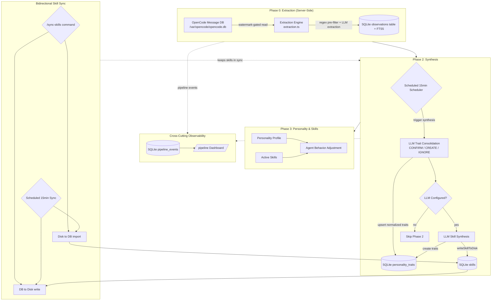

# Self-Learning Pipeline Reference

A comprehensive guide to the Ingenium self-learning pipeline that replaced the old agent self-reporting system.

---

## 1. Overview

The **self-learning pipeline** is a three-phase architecture that enables agents to learn from user interactions and adapt their behavior over time. It replaced the deprecated `ingenium_learning_log` system with a more sophisticated observation-based approach.

### Why It Exists

- **Problem**: The old agent self-reporting system was inconsistent, lacked confidence tracking, and didn't distinguish between different types of user feedback
- **Solution**: A structured pipeline that captures observations via LLM-based extraction from OpenCode messages, consolidates them into personality traits, and maintains confidence scores over time



### Three-Phase Architecture

```
┌─────────────────────────────────────────────────────────────┐
│  PHASE 0: EXTRACTION (Server-Side)                          │
│  - Extraction engine reads OpenCode messages via API        │
│  - Watermark-gated, full-text content-hash dedup            │
│  - Regex pre-filter selects candidates, LLM extracts rules  │
│  - No-LLM = no observations (zero regex fallback garbage)   │
└─────────────────────────────────────────────────────────────┘
                           ↓
┌─────────────────────────────────────────────────────────────┐
│  PHASE 1: CONSOLIDATION                                     │
│  - LLM consolidation: CONFIRM / CREATE / IGNORE             │
│  - Traits become NORMALIZED statements (not raw snippets)   │
│  - Semantic merge prevents near-duplicate traits            │
│  - If LLM unavailable, observations stay PENDING            │
└─────────────────────────────────────────────────────────────┘
                           ↓
┌─────────────────────────────────────────────────────────────┐
│  PHASE 2: SKILL SYNTHESIS + PERSONALITY                     │
│  - Groups 3+ related observations → LLM creates skills     │
│  - Skills written to disk via writeSkillToDisk()            │
│  - LLM-suggested personality_traits actually created        │
│  - Confidence: 0.10–0.15 start, +0.15/confirmation,        │
│    cap 0.95, display gate ≥0.30, 7-day decay -0.05         │
│  - Cross-project: skills in 2+ projects promoted to global  │
└─────────────────────────────────────────────────────────────┘
```

---

## 2. Architecture Diagram

```
User interacts with OpenCode (:4098)
  │
  ├─ Agent uses ingenium_observe() during workflow (manual, for exceptional cases)
  │   → POST /api/v1/observations → stored in DB (status: pending)
  │
  ├─ Server-Side Extraction Engine (extraction.ts, runs in API scheduler)
  │   → reads OpenCode DB at /var/opencode/opencode.db via GET /api/v1/opencode/messages
  │   → watermark-gated read + full-text content-hash dedup prevents re-processing
  │     (hashes the entire message, not a 200-char slice)
  │   → cheap regex pre-filter selects candidate messages (NOT final extraction)
  │   → batches of 15 sent to synthesis LLM for durable behavior rule extraction
  │   → only LLM output becomes observations — raw snippets NEVER enter DB
  │   → max_tokens: 4096 (increased for reasoning models like Qwen — reasoning
  │     consumes half the token budget)
  │   → reasoning_content fallback: reads from msg.reasoning_content when
  │     msg.content is empty (common with reasoning model responses)
  │   → 🔴 Failure-aware watermark: watermark does NOT advance if ANY batch
  │     fails LLM extraction, preventing gaps from transient errors
  │   → pipeline event: extraction_completed
  │
  ├─ Auto-Observer Plugin (auto-observer.ts, thin trigger only)
  │   → on session.idle, POSTs /api/v1/extraction/run (no detection logic)
  │   → if plugin fails to load, scheduler covers extraction anyway
  │   → auto_observe_now tool for manual trigger
  │
  ├─ Observer Plugin (observer.ts, session.created / session.idle)
  │   → imports local file fallbacks if API was down
  │   → triggers POST /api/v1/synthesis/run
  │   → fires pipeline events for dashboard observability
  │
  ├─ Skill Sync Plugin (skill-sync.ts, session.created / session.idle)
  │   → fetches skills from API
  │   → writes missing skills to .opencode/skills/<name>/ (SKILL.md + metadata.json + references/)
  │
  ├─ Scheduled Scheduler (every 15 min in API server)
  │   → runs extraction BEFORE synthesis for ALL active projects
  │   → then synthesis (consolidation → skill synthesis)
  │   → then POST /api/v1/skills/sync-all (bidirectional disk↔DB)
  │
  └─ Synthesis Pipeline (consolidateTraits + runSynthesis)
      Phase 1: LLM Trait Consolidation
      → sends each pending observation to LLM
      → LLM decides: CONFIRM existing trait / CREATE new normalized trait / IGNORE noise
      → semantic merge prevents near-duplicate traits
      → if LLM unavailable, observations stay PENDING (no garbage heuristic)
      
      Phase 2 (if LLM configured): LLM Skill Synthesis
      → groups 3+ related observations from batch
      → sends to LLM with existing skills + traits as context
      → creates/updates skills with writeSkillToDisk() + llm-synthesized prefix
      → LLM-suggested personality_traits actually created (previously dropped)
      → logs errors but doesn't block Phase 1 results

      Cross-Project (manual/scheduled): Cross-Project Synthesis
      → evaluates skills across all non-global, non-archived projects
      → promotes skills present in 2+ projects to global-default
      → logs cross-project skill events to pipeline timeline
```

### Key Components

| Component | Responsibility |
|-----------|----------------|
| **Agent** | Calls `ingenium_observe()` during workflow to record user interactions (manual, for exceptional cases — extraction engine handles most detection) |
| **Extraction Engine** (extraction.ts) | **Server-side**: Reads OpenCode messages via API, watermark-gated + content-hash dedup, regex pre-filter selects candidates, LLM batch extraction creates durable behavior rule observations. Runs in the scheduler. |
| **Observer Plugin** (observer.ts) | Monitors session events, imports file fallbacks, triggers synthesis |
| **Auto-Observer Plugin** (auto-observer.ts) | **Thin trigger only**: On session.idle, POSTs `/api/v1/extraction/run`. Zero detection logic — all extraction is server-side. If plugin fails to load, scheduler covers extraction. |
| **Skill Sync Plugin** (skill-sync.ts) | Fetches skills from API on session events, writes missing skills to `.opencode/skills/<name>/` |
| **Synthesis Pipeline** | Processes observations via LLM consolidation (CONFIRM/CREATE/IGNORE), generates normalized personality traits (Phase 1), optionally runs LLM skill synthesis (Phase 2 with backup provider fallback), and cross-project skill promotion |
| **API Layer** | REST endpoints for all operations (sole DB authority). New: `POST /api/v1/extraction/run`, DELETE observations/personality endpoints |
| **MCP Server** | Tool handlers that forward to API layer |
| **Dashboard** | UI for viewing and managing observations/personality/pipeline events |
| **Database** | SQLite with three core tables (`observations` with FTS5, `personality_traits` with confidence tracking, `pipeline_events` with parent-child nesting) plus `personality_profile` aggregated view |
| **LLM Provider** | (Optional) OpenAI-compatible API for extraction (Phase 0), trait consolidation (Phase 1), and skill synthesis (Phase 2), configured via Settings → Synthesis LLM with model dropdown, API key, endpoint URL, and backup provider |

---

## 2.5 Extraction Engine (Server-Side)

Observation detection runs **server-side in the API** — the client-side auto-observer plugin is now only a thin trigger. The extraction engine (`packages/ingenium-core/lib/tools/extraction.ts`, `runExtraction(projectId, projectName)`) reads OpenCode messages via the existing `GET /api/v1/opencode/messages` endpoint.

### Architecture

```
Extraction Engine (extraction.ts)
  │
  ├─ Scheduler: runs before synthesis every 15 min (or triggered manually)
  │   → reads OpenCode DB mounted at /var/opencode/opencode.db
  │
  ├─ Watermark + Dedup gate
  │   → Per-project setting: extraction_watermark (last-processed message ID)
  │   → Per-project setting: extraction_seen_hashes (full-text content-hash set for dedup — hashes the entire message, not a 200-char slice, preventing hash collisions and missed dedup)
  │   → Only new messages since last run are considered
  │   → 🔴 Failure-aware: watermark does NOT advance if ANY LLM batch failed.
  │     This prevents gaps caused by transient API errors.
  │
  ├─ Regex Pre-Filter (candidate selection only — NOT final extraction)
  │   → Identifies messages that MAY contain user behavior
  │   → Cheap, fast filtering — no observations created at this stage
  │
  ├─ LLM Batch Extraction
  │   → Candidate messages batched (up to 15 per batch)
  │   → Each batch sent to synthesis LLM with structured prompt
  │   → LLM extracts DURABLE USER BEHAVIOR RULES as JSON
  │   → Only LLM output becomes observations — raw snippets NEVER enter DB
  │   → max_tokens: 4096 (increased for reasoning models like Qwen)
  │   → reasoning_content fallback: if the LLM returns empty content but
  │     populated reasoning_content (common with reasoning models), it is
  │     used as the extraction source instead
  │
  └─ No-LLM = No Observations
      → If no synthesis LLM configured, extraction creates 0 observations
      → Zero regex fallback to garbage
      → Pipeline event: extraction_failed (or extraction_completed with 0 observations)
```

### When It Runs

| Trigger | Mechanism |
|---------|-----------|
| **Scheduler** (every 15 min) | `services/ingenium-api/lib/scheduler.ts` runs extraction before synthesis for all active projects |
| **Auto-Observer Plugin** | On `session.idle`, POSTs `POST /api/v1/extraction/run` (thin trigger) |
| **MCP Tool** | `ingenium_extraction_run` — manual trigger |
| **API Endpoint** | `POST /api/v1/extraction/run` — direct API call |

### How the Auto-Observer Plugin Works Now

The **Auto-Observer** (`packages/ingenium-extension/auto-observer.ts`) is now a ~62-line thin trigger:

```
Auto-Observer Plugin (auto-observer.ts)
  │
  ├─ Hook: session.idle
  │   → POSTs /api/v1/extraction/run
  │   → No detection logic — all extraction runs server-side
  │
  └─ MCP Tool: auto_observe_now
      → Manual trigger for immediate server-side extraction
      → Returns JSON with { detected, created, observations }
```

If the plugin fails to load in OpenCode, the scheduler covers extraction anyway — plugin loading is no longer a dependency. The plugin requires no `better-sqlite3` dependency since it only makes HTTP calls.

---

## 3. Database Tables

### `observations` Table

Stores individual user interactions and feedback.

```sql
CREATE TABLE observations (
    id INTEGER PRIMARY KEY AUTOINCREMENT,
    project_id TEXT NOT NULL,
    observation_type TEXT NOT NULL,  -- One of 10 types
    content TEXT NOT NULL,            -- Human-readable description
    importance INTEGER DEFAULT 5,     -- 1-10 scale
    source TEXT DEFAULT 'agent',      -- Where observation came from
    embedding BLOB,                   -- Placeholder for future vector search
    context JSON,                     -- Additional metadata as JSON
    status TEXT DEFAULT 'pending',    -- pending/processed/skipped/failed
    created_at DATETIME DEFAULT CURRENT_TIMESTAMP,
    updated_at DATETIME DEFAULT CURRENT_TIMESTAMP,
    
    FOREIGN KEY (project_id) REFERENCES projects(id),
    UNIQUE(project_id, id)
);

CREATE INDEX idx_observations_project_status ON observations(project_id, status);
CREATE INDEX idx_observations_type ON observations(observation_type);
CREATE INDEX idx_observations_importance ON observations(importance DESC);
```

**FTS5 Virtual Table:**
```sql
CREATE VIRTUAL TABLE observations_fts USING fts5(
    content,
    observation_type,
    source,
    context_json,
    content='observations',
    rowid
);

CREATE TRIGGER observations_ai AFTER INSERT ON observations BEGIN
    INSERT INTO observations_fts(rowid, content, observation_type, source, context_json)
    VALUES (new.rowid, new.content, new.observation_type, new.source, json_extract(new.context, '$.json'));
END;

CREATE TRIGGER observations_ad AFTER DELETE ON observations BEGIN
    INSERT INTO observations_fts(observations_fts, rowid) VALUES('delete', old.rowid);
END;

CREATE TRIGGER updates_ai AFTER UPDATE ON observations BEGIN
    INSERT INTO observations_fts(rowid, content, observation_type, source, context_json)
    VALUES (new.rowid, new.content, new.observation_type, new.source, json_extract(new.context, '$.json'));
END;
```

### `personality_traits` Table

Stores synthesized personality traits with confidence scores.

```sql
CREATE TABLE personality_traits (
    id INTEGER PRIMARY KEY AUTOINCREMENT,
    project_id TEXT NOT NULL,
    trait_type TEXT NOT NULL,         -- One of 10 types
    trait_value TEXT NOT NULL,        -- The actual trait value
    display_label TEXT,               -- Human-readable label
    confidence REAL DEFAULT 0.0,      -- 0.0-1.0 confidence score
    exemplar_observation_id INTEGER,  -- ID of observation that created this trait
    exemplar_text TEXT,               -- Text from exemplar observation
    is_active INTEGER DEFAULT 1,       -- 1 = active, 0 = disabled
    metadata JSON,                    -- Additional metadata as JSON
    created_at DATETIME DEFAULT CURRENT_TIMESTAMP,
    updated_at DATETIME DEFAULT CURRENT_TIMESTAMP,
    
    FOREIGN KEY (project_id) REFERENCES projects(id),
    FOREIGN KEY (exemplar_observation_id) REFERENCES observations(id),
    UNIQUE(project_id, trait_type, is_active)
);

CREATE INDEX idx_personality_traits_project ON personality_traits(project_id);
CREATE INDEX idx_personality_traits_trait ON personality_traits(trait_type);
CREATE INDEX idx_personality_traits_confidence ON personality_traits(confidence DESC);
```

### `personality_profile` View

Aggregated view showing one trait per type with highest confidence.

```sql
CREATE VIEW personality_profile AS
SELECT 
    project_id,
    trait_type,
    trait_value,
    display_label,
    MAX(confidence) as max_confidence,
    AVG(confidence) as avg_confidence,
    COUNT(*) as observation_count,
    MIN(created_at) as first_seen,
    MAX(updated_at) as last_updated,
    GROUP_CONCAT(exemplar_text, '; ') as exemplars
FROM personality_traits
WHERE is_active = 1
GROUP BY project_id, trait_type;
```

---

## 4. Observation Types (Full Reference)

| Type | When to Use | Example Content | Importance Range |
|------|-------------|-----------------|------------------|
| `correction` | User corrects agent behavior or output | "User prefers snake_case over camelCase for variable names" | 7-10 |
| `preference` | User expresses a preference about code style, format, or approach | "User wants 2-space indentation instead of 4" | 5-8 |
| `pattern` | Recurring implementation pattern observed in code changes. **Does NOT create personality traits** — used only for LLM skill synthesis context | "Docker health checks use --retries consistently across all services" | 6-9 |
| `insight` | Novel discovery about the system or environment. **Does NOT create personality traits** — provides context for LLM skill synthesis | "Container PTY works with glibc, enabling better terminal emulation" | 8-10 |
| `feedback` | Implicit accept/reject of agent output | "User accepted the refactored code without changes" | 4-7 |
| `behavior` | User behavior signal that indicates intent or habit | "User runs tests before committing to git" | 5-8 |
| `terminology` | Preferred language or naming convention | "User calls it 'deploy' not 'release'" | 6-9 |
| `workflow` | Workflow sequence or multi-step process | "User runs lint before commit, then tests, then commit" | 7-10 |
| `error` | User encountered an error and how they responded | "User hit TypeScript strict mode error, added type annotations" | 8-10 |
| `goal` | Stated or implied goal the user is working toward | "User wants to improve test coverage from 40% to 80%" | 7-10 |

### Usage Guidelines

**High Importance (8-10):** Critical corrections, errors, goals, insights
- Use when the observation significantly impacts agent behavior
- Examples: User corrects a fundamental misunderstanding, user encounters a blocking error

**Medium Importance (5-7):** Preferences, patterns, feedback
- Use for recurring behaviors and style preferences
- Examples: Code formatting preferences, workflow habits

**Lower Importance (1-4):** Minor observations, implicit signals
- Use sparingly, only when necessary
- Examples: Single instances of user acceptance/rejection

---

## 4.5 Personality Trait System

### Six Trait Dimensions

The personality system tracks 6 developer-specific dimensions:

| Dimension | Source Observations | What It Captures |
|-----------|-------------------|------------------|
| `communication_style` | correction, preference | Whether the user prefers direct, detailed, or concise communication |
| `code_preference` | preference, correction | Code style, formatting, language, and tooling preferences |
| `workflow_pattern` | pattern, workflow | Recurring multi-step processes and sequencing habits |
| `feedback_style` | correction, feedback | Whether corrections are detailed or terse, confirmatory or directive |
| `interaction_pattern` | behavior | How the user interacts with agents (frequent pings, batch commands, etc.) |
| `priority_signal` | error, goal | What the user prioritizes: correctness, performance, speed, completeness |

### Confidence Model

| Parameter | Value | Description |
|-----------|-------|-------------|
| **Starting confidence** | 0.05–0.15 | First observation starts very low |
| **Requirement** | 2+ confirming observations | Must see multiple signals to build confidence |
| **Display threshold** | 0.30 | Traits ≥ 0.30 appear on the dashboard by default |
| **Confidence cap** | 0.95 | Maximum achievable confidence |
| **Decay rate** | -0.05 after 7+ days | Traits unused for a week lose confidence |
| **Dismiss** | Button (×) | User can dismiss any trait from the dashboard |

Traits start at very low confidence and need multiple confirming observations to become display-worthy. Once a trait reaches ≥ 0.30 confidence, it appears on the `/personality` page. Confidence is capped at 0.95 to prevent overcommitment to any single pattern.

### Display & Dismiss Flow

- Traits with confidence ≥ 0.30 appear by default on the personality profile
- Traits below 0.30 are hidden behind a **"N hidden"** toggle link
- Click the **×** button on any trait card to dismiss it (marks `is_active = 0`)
- Dismissed traits can be re-enabled via the API (`/api/v1/personality/:id/enable`)
- Dismissal does not delete the trait — it hides it from the default view

### Observation Quality Rules

Observations must describe **user behavior**, not implementation activity:

**✅ Behavior observations (correct):**
- "User prefers 2-space indentation over 4-space"
- "User corrected the agent's error handling approach"
- "User always runs lint before committing"

**❌ Implementation observations (wrong):**
- "Added sort filters to the dashboard"
- "Implemented global config path resolution"
- "Fixed plugins table UNIQUE constraint"

Implementation activity belongs in pipeline events, git commits, and the `/pipeline` timeline — not in observations. The synthesis pipeline only processes behavior-focused observations into personality traits.

> 🔴 **The extraction engine handles observation automatically** by reading OpenCode message history via the API and using the synthesis LLM to extract durable user behavior rules. Manual `ingenium_observe()` calls in agent code are only needed for exceptional cases. All 10 agent files had their "🔴 Observation — Log User Interactions" sections removed.

---

## 5. Personality Trait Types (Full Reference)

| Trait Type | Generated From | Confidence Behavior | Display Label Example |
|------------|----------------|---------------------|----------------------|
| `communication_style` | correction, preference | Boosted by repeated observations, decays over time | "Direct and concise" |
| `code_preference` | preference, correction | +0.15 on re-observation, cap 0.95 | "Prefers TypeScript strict mode" |
| `workflow_pattern` | pattern, workflow | Starts at 0.4, +0.1 per repeat | "Tests before commit" |
| `terminology` | terminology observations | Starts at 0.5, +0.1 per confirmation | "Uses 'deploy' not 'release'" |
| `priority_signal` | behavior, goal, error | Lower base (0.3), contextual | "High priority: improve test coverage" |
| `feedback_style` | correction, feedback | Starts at 0.5, adjusts with delta | "Provides detailed corrections" |
| `interaction_pattern` | behavior observations | Starts at 0.4 | "Runs tests frequently" |
| `domain_knowledge` | insight observations | Starts at 0.5 | "Understands container networking" |
| `learned_skill` | pattern, workflow | Starts at 0.4, +0.1 per success | "Knows how to debug Docker issues" |
| `personality_trait` | All types | General trait, adjusts slowly | "Patient and thorough" |

### Confidence Calculation Rules (LLM Consolidation Model)

**Confidence model:**
- Traits start at 0.10–0.15 confidence from LLM-extracted observations
- +0.15 per LLM consolidation confirmation (CONFIRM decision)
- Cap: **0.95** (never reaches 1.0)
- Display threshold: **≥0.30** in `getProfile()`
- Freshly-extracted traits (0.10–0.15) stay below display threshold → hidden behind "N hidden" toggle
- 7-day inactivity decay: -0.05

**Confidence Boosting:**
- LLM CONFIRM of existing trait: +0.15
- Semantic match (LLM finds observation matches existing trait meaning, not just keywords): +0.15
- Manual override: User can disable traits via dashboard

---

## 6. MCP Tools Reference

### Core Observation Tools

| Tool | Action | Input Parameters | Returns |
|------|--------|------------------|---------|
| `ingenium_observe` | Store observation | `observation_type`, `content`, `importance?`, `source?`, `context?` | `{ id, project_id, status }` |
| `ingenium_observation_search` | FTS5 search | `query` (string) | Array of matching observations |
| `ingenium_observation_list` | List with filters | `status?`, `type?`, `project_id?` | Array of observations |
| `ingenium_observation_stats` | Pipeline stats | — | `{ total, pending, processed, by_type }` |
| `ingenium_extraction_run` | Trigger server-side extraction | — | `{ detected, created, observations }` |

### Email Tools (13 tools)

| Tool | Action | Input Parameters | Returns |
|------|--------|------------------|---------|
| \`ingenium_email_*\` | List, search, read, send, draft, triage, suggest response, auto-draft, IMAP watcher | See individual tool docs | Email-related results and actions |

### Personality Tools

| Tool | Action | Input Parameters | Returns |
|------|--------|------------------|---------|
| `ingenium_personality` | Get profile | — | Aggregated personality profile |
| `ingenium_personality_traits` | List traits | `trait_type?`, `project_id?` | Array of traits |
| `ingenium_personality_trait_disable` | Disable trait | `id` | `{ success: boolean }` |
| `ingenium_personality_trait_enable` | Enable trait | `id` | `{ success: boolean }` |

### Synthesis Pipeline Tools

| Tool | Action | Input Parameters | Returns |
|------|--------|------------------|---------|
| `ingenium_synthesis_run` | Trigger pipeline | — | `{ status, estimated_time }` |
| `ingenium_synthesis_status` | Check status | — | `{ running, completed, failed, progress }` |
| `ingenium_synthesis_cancel` | Cancel running pipeline | — | `{ success: boolean }` |

### Deprecated Tools

All deprecated learning log tools (`ingenium_learning_log`, etc.) have been **removed**. Use `ingenium_observe` instead.

---

## 7. API Endpoints Reference

### Observations Endpoints

| Endpoint | Method | Purpose | Query Parameters |
|----------|--------|---------|------------------|
| `/api/v1/observations` | GET | List observations | `status`, `type`, `project_id`, `limit`, `offset` |
| `/api/v1/observations` | POST | Store observation | Body: `{ observation_type, content, importance?, source?, context? }` |
| `/api/v1/observations/search` | GET | FTS5 search | `q` (query string) |
| `/api/v1/observations/stats` | GET | Pipeline statistics | — |
| `/api/v1/observations/:id` | DELETE | Delete observation | — |
| `/api/v1/observations` | DELETE | Delete all observations from a source | `source` (required — refuses unscoped mass delete) |
| `/api/v1/extraction/run` | POST | Trigger server-side extraction | — |

### Personality Endpoints

| Endpoint | Method | Purpose | Query Parameters |
|----------|--------|---------|------------------|
| `/api/v1/personality` | GET | List traits | `trait_type`, `project_id` |
| `/api/v1/personality` | DELETE | Delete all traits (project-scoped) | — |
| `/api/v1/personality/profile` | GET | Get aggregated profile | — |
| `/api/v1/personality/:id` | DELETE | Delete a single trait | — |
| `/api/v1/personality/:id/disable` | POST | Disable trait | — |
| `/api/v1/personality/:id/enable` | POST | Enable trait | — |

### Synthesis Endpoints

| Endpoint | Method | Purpose | Query Parameters |
|----------|--------|---------|------------------|
| `/api/v1/synthesis/run` | POST | Trigger pipeline | — |
| `/api/v1/synthesis/status` | GET | Check pipeline status | — |
| `/api/v1/synthesis/cancel` | POST | Cancel running pipeline | — |

### Example Requests

**Create Observation:**
```bash
curl -X POST http://localhost:4097/api/v1/observations \
  -H "Content-Type: application/json" \
  -d '{
    "observation_type": "preference",
    "content": "User prefers 2-space indentation",
    "importance": 6,
    "source": "agent"
  }'
```

**Search Observations:**
```bash
curl "http://localhost:4097/api/v1/observations/search?q=indentation"
```

**Get Personality Profile:**
```bash
curl http://localhost:4097/api/v1/personality/profile
```

---

## 8. Pipeline Observability

Every step of the self-learning pipeline is tracked as `pipeline_events` and displayed in a **visual Git-workflow-style timeline** at **`/pipeline`** in the dashboard. This replaces `console.log()` debugging with a structured, filterable, live-updating view.

### Event Types (14)

| Event | Source | Meaning |
|-------|--------|---------|
| `session_created` | plugin | OpenCode session started; "Scheduled" for timer triggers, session ID for manual |
| `session_idle` | plugin | Session went idle |
| `extraction_completed` | synthesis | Extraction engine finished scanning OpenCode messages; includes candidate count, observation count, model info |
| `extraction_failed` | synthesis | Extraction engine errored out |
| `observation_created` | agent | Agent called `ingenium_observe` (manual) or extraction engine created from LLM output |
| `observation_imported` | plugin | File fallback imported into DB |
| `synthesis_triggered` | plugin | Observer triggered synthesis |
| `synthesis_started` | synthesis | Pipeline began processing; includes batch size, observation IDs, model info |
| `synthesis_completed` | synthesis | Pipeline finished successfully; enriched with `model`, `endpoint`, `provider`, `insights`, observation counts, and trait statistics |
| `synthesis_failed` | synthesis | Pipeline errored out |
| `trait_created` | synthesis | New personality trait generated; includes `trait_type`, `trait_value`, `confidence`, `observation_ids`, `skill_links`, and `model` info |
| `trait_updated` | synthesis | Existing trait confidence adjusted |
| `skill_created` | synthesis | New skill synthesized by LLM Phase 2 |
| `skill_updated` | synthesis | Existing skill updated by LLM Phase 2 |
| `plugin_initialized` | plugin | Observer/skill-sync/auto-observer plugin loaded |
| `plugin_error` | plugin | Plugin encountered an error |

**Enriched event data**: `synthesis_completed` events carry full pipeline metadata (model name, endpoint URL, provider ID, LLM-generated insights). `trait_created` events link back to parent observations (`observation_ids`) and include model attribution and skill references. Pipeline stats now include a skills count alongside observation and trait counts.

### Timeline Visual

The `/pipeline` dashboard page displays events as a connected vertical timeline:

- 🟠 **Orange dots** = agent events (`observation_created`)
- 🔵 **Blue dots** = plugin events (`session_created`, `observation_imported`, `synthesis_triggered`)
- 🟢 **Green diamonds** = synthesis events (`synthesis_started`, `synthesis_completed`, `synthesis_failed`)
- 🟣 **Purple chevrons** = trait events (`trait_created`, `trait_updated`)
- Connected with vertical lines showing event flow
- Observations in the same 60-second window are collapsed into **+N groups**
- Polls every **3 seconds** for live updates (pause/resume button)
- Filter pills: All, Agent, Plugin, Synthesis, Trait
- Click any event card for a **detail overlay** with raw JSON data

### DB Table: `pipeline_events`

| Column | Type | Description |
|--------|------|-------------|
| `id` | INTEGER | Primary key |
| `project_id` | TEXT | FK to projects |
| `event_type` | TEXT | 16 event types (see above) |
| `event_source` | TEXT | agent/plugin/synthesis/system |
| `title` | TEXT | Short human-readable title |
| `description` | TEXT | Optional longer description |
| `data` | TEXT | JSON payload with event-specific data |
| `parent_event_id` | INTEGER | Link to parent event (e.g., trait → synthesis run) |
| `session_id` | TEXT | OpenCode session where event happened |
| `importance` | INTEGER | 1–10 |
| `created_at` | TEXT | ISO 8601 timestamp |

### API Endpoints

| Endpoint | Method | Purpose |
|----------|--------|---------|
| `/api/v1/pipeline/events` | GET | List events (filters: `source`, `type`, `since`, `limit`) |
| `/api/v1/pipeline/events` | POST | Log a new event (used by plugin + core) |
| `/api/v1/pipeline/timeline` | GET | Get timeline with children nested under parents |

### Who Fires What

| Where | Event(s) emitted |
|-------|-----------------|
| `observations.ts` — `storeObservation()` | `observation_created` |
| `extraction.ts` — `runExtraction()` | `extraction_completed`, `extraction_failed` |
| `synthesis.ts` — `consolidateTraits()` + `runSynthesis()` | `synthesis_started`, `trait_created`, `trait_updated`, `synthesis_completed`, `synthesis_failed` (enriched with model/endpoint/insights) |
| `synthesis.ts` — LLM skill creation/update | `skill_created`, `skill_updated` |
| `observer.ts` — `session.created` handler | `session_created` (includes "Scheduled" or session ID) |
| `observer-core.ts` — `importObservationsFromFile()` | `observation_imported` |
| `observer-core.ts` — `triggerSynthesis()` | `synthesis_triggered` |
| `auto-observer.ts` — thin trigger | POSTs `/api/v1/extraction/run` (no pipeline events — extraction engine logs its own events) |
| `skill-sync.ts` — `syncSkillsFromApi()` | `plugin_initialized` (skill sync completed) |
| **API Server** (scheduled) | Auto-runs extraction → synthesis → skill sync every 15 minutes for ALL active projects |

### Scheduled Synthesis

The API server automatically runs the full pipeline every **15 minutes** (configurable via `SYNTHESIS_INTERVAL_MS` environment variable, default: 900000ms). The cycle runs extraction → synthesis → skill sync in sequence for all active projects. Extraction runs BEFORE synthesis so freshly extracted observations are consolidated in the same cycle.

**Configuration:**
```typescript
// services/ingenium-api/scripts/api-server.ts
const SYNTHESIS_INTERVAL_MS = parseInt(process.env.SYNTHESIS_INTERVAL_MS ?? "900000", 10);
```

**Manual override:** Set `SYNTHESIS_INTERVAL_MS=0` to disable auto-synthesis.

### Skill Sync (`/sync-skills`)

The `/sync-skills` command triggers bidirectional skill synchronization between disk and DB:

**Disk → DB**: Any skill files created or edited manually in `.opencode/skills/` are imported into the DB. This is useful when agents create skill files directly on disk.

**DB → Disk**: All DB skills are written to `.opencode/skills/` so OpenCode can load them. This is how LLM-synthesized skills become available to agents.

**Scheduled sync**: The API server automatically runs `/api/v1/skills/sync-all` every 15 minutes (as part of the scheduled synthesis cycle) for ALL active projects.

**Manual trigger**: Use `/sync-skills` in OpenCode to sync immediately.

**Related files:**
| File | Purpose |
|------|---------|
| `.opencode/commands/sync-skills.md` | Command definition |
| `services/ingenium-api/lib/routes/skills.ts` | `POST /sync-all` endpoint with two-phase sync |

### Dashboard Page

- **URL**: `/pipeline` in the Ingenium Dashboard
- **Nav link**: "Pipeline" in the top navigation bar
- **Live updates**: Auto-polls every 3 seconds with pause/resume
- **Filtering**: Source pills (All/Agent/Plugin/Synthesis/Trait)
- **Collapsing**: Rapid observations grouped into +N cards (same 60s window)
- **Detail**: Click any event to see full metadata + raw JSON

### Files Reference

| File | Purpose |
|------|---------|
| `packages/ingenium-core/data/migrations/009_pipeline_events.sql` | DB migration |
| `packages/ingenium-core/lib/tools/pipeline-events.ts` | Core tools (`logEvent`, `getEvents`, `getTimeline`) |
| `packages/ingenium-core/lib/schema.ts` | `PipelineEventSchema` Zod type |
| `services/ingenium-api/lib/routes/pipeline.ts` | API routes |
| `.opencode/plugins/observer-core.ts` | Plugin fires session/import/trigger events |
| `.opencode/plugins/observer.ts` | Plugin fires `session_created` on start + registers `synthesize_observations` tool |
| `services/ingenium-dashboard/src/app/pipeline/page.tsx` | Timeline dashboard page (3s poll, filters, +N collapse) |
| `services/ingenium-dashboard/src/lib/api.ts` | `api.pipeline.events()` and `.timeline()` |

---

## 9. How to Use

### For Agents (Automatic, During Workflow)

Agents should call `ingenium_observe()` whenever they detect meaningful user interactions:

```typescript
// Example: Agent detects user preference during workflow
await ingenium_observe({
  observation_type: "preference",
  content: "User prefers concise error messages with action items",
  importance: 7,
  source: "agent"
});

// Example: User corrects agent behavior
await ingenium_observe({
  observation_type: "correction",
  content: "User corrected the file path format from absolute to relative",
  importance: 9,
  source: "user_feedback"
});

// Example: User encounters error
await ingenium_observe({
  observation_type: "error",
  content: "User hit TypeScript strict mode error on undefined variable",
  importance: 8,
  source: "agent"
});
```

### For Orchestrators (Manual Triggers)

**Trigger Synthesis Pipeline:**
1. Run `/synthesize` command in OpenCode
2. Check status: `ingenium_synthesis_status`
3. View results: `ingenium_personality`

**Example Workflow:**
```bash
# After a long session of user interactions
/observe  # Trigger immediate synthesis
/synthesis-status  # Check if pipeline is running
/personality  # View updated traits
```

### For Dashboard Users

**View Observations:**
- Go to `/observations` page
- Filter by type, status, importance
- Search using FTS5 query box
- Edit observation status (pending → processed)

**View Personality:**
- Go to `/personality` page
- See all active traits with confidence bars
- Disable/enable individual traits
- View exemplar observations for each trait

**Legacy Pages:**
- Old `/learnings` page has been removed — use `/observations` instead

---

## LLM-Driven Skill Synthesis

The synthesis pipeline can optionally use an LLM to analyze observations and auto-create or update skill files. This transforms the pipeline from trait-only to full skill generation.

### How to Configure

1. Go to **Settings → Synthesis LLM** in the dashboard
2. Select a model from the dropdown (populated from OpenCode's configured providers)
3. Enter the API key for the provider
4. Click "Test Connection" to verify
5. Click "Save"

### How It Works

When configured, the 15-minute synthesis pipeline runs two phases:

**Phase 1: Trait Consolidation** (always runs, LLM-powered)
- Sends each observation to the LLM for CONFIRM/CREATE/IGNORE decisions
- Creates normalized trait statements from observations
- Semantic merge prevents near-duplicate traits
- (If LLM not configured, observations stay PENDING — no heuristic fallback)

**Phase 2: LLM Skill Synthesis** (only if model configured)
- Groups processed observations from the current batch
- Sends them along with existing skills and traits to the LLM
- LLM analyzes patterns and returns structured JSON
- Pipeline executes skill create/update operations
- Results appear on the `/pipeline` timeline

### Implementation Details

#### SynthesisLLMResult Interface

The LLM must return JSON matching this shape:

```typescript
interface SynthesisLLMResult {
  skills_to_create: Array<{
    name: string;        // kebab-case, max 64 chars
    description: string; // one-line, max 200 chars
    content: string;     // full SKILL.md markdown
  }>;
  skills_to_update: Array<{
    name: string;
    patch: string;       // markdown to append
    patch_type: "add-rule" | "update-section" | "add-pattern";
  }>;
  personality_traits?: Array<{
    trait_type: string;
    trait_value: string;
    confidence: number;  // 0.0–1.0
  }>;
  insights: string[];    // max 5 insights
  summary: string;       // max 200 chars
}
```

#### LLM Prompt Structure

The prompt sent to the LLM includes four sections:

1. **Existing Skills** — All current skills (name + description) to prevent duplicate creation
2. **Existing Personality Traits** — Current traits with confidence percentages for context
3. **Recent Pending Observations** — Each observation with type, importance, and content (truncated to 200 chars)
4. **Task Instructions** — Guidelines to:
   - Create new skills for uncovered patterns
   - Extend existing skills for reinforced patterns
   - Suggest personality traits for new observations
   - Output ONLY valid JSON (no markdown, no code blocks)

The LLM uses `temperature: 0.3` and `max_tokens: 4096` for consistent structured output.

#### API Call Strategy (Retry/Fallback)

The LLM client uses a two-attempt strategy:

1. **Primary attempt**: Calls with `response_format: { type: "json_object" }` (supported by OpenAI-compatible APIs)
2. **Fallback attempt**: If the primary returns an error (e.g., the provider doesn't support structured output), retries **without** `response_format`, sending the same prompt with an explicit "Respond ONLY with valid JSON" system message
3. If both attempts fail, returns an empty result with the error summary — Phase 1 trait results are still saved

#### Multi-Strategy JSON Parsing

The `tryParseJSON()` function uses three strategies in order:

1. **Direct parse**: Attempts `JSON.parse()` on raw response text
2. **Strip markdown**: Removes ```json and ``` fences, then parses
3. **Regex extraction**: Uses `/\{[\s\S]*\}/` to find the first JSON object in the text, then parses it

This ensures the LLM's output is parsed correctly even if it wraps JSON in markdown code blocks.

#### Response Validation (`validateResponse`)

The response is strictly validated before any operations are performed:

| Field | Cap | Sanitization |
|-------|-----|-------------|
| `skills_to_create` | Max 5 | Name: kebab-case, ≤64 chars. Description: ≤200 chars. Filter: requires both name AND content |
| `skills_to_update` | Max 5 | Name: required. Patch: required. patch_type defaults to "add-rule" |
| `personality_traits` | Max 3 | Confidence clamped to [0, 1], default 0.3 |
| `insights` | Max 5 | Strings only, no length limit |

#### Skill Execution

After validation, the synthesis orchestrator executes the LLM's recommendations:

- **Skill Creation**: Calls `skills.createSkill()` with category "learning", tags "llm-synthesized,auto-generated", always_apply=1
- **Skill Updates**: Appends the patch content to the existing skill's content and calls `skills.updateSkill()`
- **Logging**: Each create/update fires a pipeline event (`trait_created` / `trait_updated`) with `via_llm: true` metadata, linked to the parent synthesis event
- **Error handling**: Failed operations are collected in `result.errors` but don't block the rest

#### Configuration Check

Two utility functions control Phase 2 execution:

| Function | Purpose |
|----------|---------|
| `isLLMSynthesisConfigured(projectId)` | Returns `true` if `synthesis_model` setting exists |
| `getLLMSynthesisConfig(projectId)` | Returns `{ model, apiKey }` or `null` if not configured |

### Fallback Behavior

| Scenario | Behavior |
|----------|----------|
| LLM not configured (no model set) | Pipeline skips Phase 2 entirely |
| LLM API error (network, timeout, bad key) | Error logged in `result.errors`, Phase 1 trait results still saved |
| LLM returns invalid/empty JSON | Returns empty result, no skills created/updated |
| LLM synthesis cancelled (AbortSignal) | Returns cancelled summary, no side effects |

### Settings Reference

| Setting Key | Description | Values |
|------------|-------------|--------|
| `synthesis_model` | LLM model ID | e.g. `xai/grok-4`, `deepseek/deepseek-v4-flash` |
| `synthesis_api_key` | API key for the provider | sk-... |
| `synthesis_endpoint` | OpenAI-compatible API URL | https://api.deepseek.com/v1 |

### Files Reference

| File | Purpose |
|------|---------|
| `packages/ingenium-core/lib/tools/synthesis-llm.ts` | LLM client: `SynthesisLLMResult` interface, `buildPrompt()`, `callSynthesisLLM()`, `validateResponse()`, `tryParseJSON()`, `isLLMSynthesisConfigured()`, `getLLMSynthesisConfig()` |
| `packages/ingenium-core/lib/tools/synthesis.ts` | Synthesis orchestrator: `consolidateTraits()` (Phase 1: LLM consolidation), `runSynthesis()` (Phase 2: LLM skills), `getSynthesisStatus()` |
| `services/ingenium-dashboard/src/app/settings/page.tsx` | Settings UI: provider-based model dropdown, API key input, Test Connection, Save |

---

## 10. Synthesis Pipeline Details

### Processing Flow

```
1. Trigger: Observer plugin fires on session.created or scheduler timer
2. Import Fallbacks: Read .opencode/skills/learnings.md if API was down
3. Fetch Pending: SELECT * FROM observations WHERE status = 'pending'
4. Phase 1 — LLM Trait Consolidation (consolidateTraits):
     a. Send each pending observation to the synthesis LLM
     b. LLM decides for each observation:
        - CONFIRM → link to an existing matching trait, boost confidence
        - CREATE → generate a new NORMALIZED trait statement (not raw snippet)
        - IGNORE → observation is noise, skip it
     c. Semantic merge prevents near-duplicate traits
     d. Confidence: 0.10–0.15 start, +0.15 per confirmation, cap 0.95
     e. If LLM unavailable, observations stay PENDING (no garbage heuristic)
5. Mark Processed: UPDATE observations SET status = 'processed' WHERE id IN (...)
6. Update Profile: Refresh personality_profile view
7. Phase 2 (optional): Send processed batch to LLM for skill synthesis
     a. Groups 3+ related observations from the current batch
     b. LLM returns structured JSON with skills to create/update
     c. Skills written to disk via writeSkillToDisk() (split-skill format, llm-synthesized prefix)
     d. LLM-suggested personality_traits actually created (previously dropped)
     e. Try primary provider → if fails, try backup provider
     f. Validate response, log pipeline events (skill_created, skill_updated)
```


### Trait Consolidation Model

The synthesis pipeline uses **LLM consolidation** instead of heuristic classification rules. For each pending observation, the LLM receives the observation content along with existing traits and decides:

| LLM Decision | Meaning | Effect |
|-------------|---------|--------|
| **CONFIRM** | Observation matches an existing trait | Boost trait confidence, link observation as exemplar |
| **CREATE** | New pattern — create a NORMALIZED trait statement | Trait starts at 0.10–0.15 confidence, hidden below 0.30 threshold |
| **IGNORE** | Observation is noise / not user behavior | Observation marked processed, no trait created |

**Why LLM consolidation is superior**:
- Traits are **normalized statements** like "User prefers to rebuild and test after every change." — not raw snippets copied verbatim
- **Semantic merge** prevents near-duplicate traits (e.g., "User prefers TypeScript" and "User likes TS" merge into one trait)
- If the LLM is unavailable, observations stay PENDING — no garbage heuristic fallback to copy raw text into traits

### Confidence Calculation

```typescript
function calculateConfidence(trait: Trait, confirmations: number): number {
  let confidence = 0.10 + (confirmations * 0.15); // Start 0.10-0.25, +0.15 per confirmation
  return Math.min(0.95, Math.max(0.05, confidence)); // Cap at 0.95
}
```

Traits need 2+ confirming observations to reach the display threshold of ≥0.30. Freshly-extracted traits at 0.10–0.15 are hidden behind the dashboard "N hidden" toggle until confirmed.

### Confidence Calculation Formula (Consolidated)

```typescript
function calculateConfidence(trait: Trait, confirmations: number): number {
  let confidence = 0.10 + (confirmations * 0.15);
  
  // Cap at 0.95
  return Math.min(0.95, Math.max(0.05, confidence));
}
```

### Time Decay Implementation

```typescript
function applyTimeDecay(trait: Trait): number {
  const daysSinceUpdate = (Date.now() - new Date(trait.updated_at).getTime()) / (1000 * 60 * 60 * 24);
  
  // Inactivity decay (after 7 days)
  if (daysSinceUpdate > 7) {
    return Math.max(0.0, trait.confidence - 0.05);
  }
  
  return trait.confidence;
}
```

---

## 11. Files Reference

### Core Library Files

| File | Purpose | Location |
|------|---------|----------|
| `lib/tools/observations.ts` | Core observation DB operations (CRUD, FTS5) | `packages/ingenium-core/lib/tools/` |
| `lib/tools/personality.ts` | Core personality trait operations (upsert, profile) | `packages/ingenium-core/lib/tools/` |
| `lib/tools/synthesis.ts` | Synthesis pipeline orchestrator (`consolidateTraits`, `runSynthesis`, `getSynthesisStatus`) | `packages/ingenium-core/lib/tools/` |
| `lib/tools/extraction.ts` | Server-side extraction engine (`runExtraction`) — reads OpenCode messages, watermark-gated, LLM batch extraction | `packages/ingenium-core/lib/tools/` |
| `lib/tools/synthesis-llm.ts` | LLM synthesis client (`callSynthesisLLM`, prompt builder, validator, `tryParseJSON`, config checks) | `packages/ingenium-core/lib/tools/` |
| `lib/tools/pipeline-events.ts` | Pipeline event logging (`logEvent`, `getEvents`, `getTimeline`) | `packages/ingenium-core/lib/tools/` |
| `lib/schema.ts` | Zod schemas: `ObservationSchema`, `PersonalityTraitSchema`, `PipelineEventSchema` | `packages/ingenium-core/lib/` |

### API Layer Files

| File | Purpose | Location |
|------|---------|----------|
| `lib/routes/observations.ts` | REST endpoints for observations | `services/ingenium-api/lib/routes/` |
| `lib/routes/personality.ts` | REST endpoints for personality | `services/ingenium-api/lib/routes/` |
| `lib/routes/synthesis.ts` | REST endpoints for synthesis pipeline | `services/ingenium-api/lib/routes/` |
| `lib/routes/pipeline.ts` | REST endpoints for pipeline events (timeline, filtering) | `services/ingenium-api/lib/routes/` |
| `lib/middleware/auth.ts` | Authentication middleware for protected routes | `services/ingenium-api/lib/middleware/` |
| `scripts/api-server.ts` | API server with scheduled synthesis + skill sync every 15 min | `services/ingenium-api/scripts/` |

### MCP Server Files

| File | Purpose | Location |
|------|---------|----------|
| `lib/tools/observations.ts` | MCP tool handlers for observations | `services/ingenium-server/lib/tools/` |
| `lib/tools/personality.ts` | MCP tool handlers for personality | `services/ingenium-server/lib/tools/` |
| `lib/tools/synthesis.ts` | MCP tool handlers for synthesis pipeline | `services/ingenium-server/lib/tools/` |
| `lib/handlers/observationHandlers.ts` | Request handlers for observation endpoints | `services/ingenium-server/lib/handlers/` |
| `scripts/mcp-server.ts` | MCP tool registration (registers all 10+ tools) | `services/ingenium-server/scripts/` |

### Plugin Files

| File | Purpose | Location |
|------|---------|----------|
| `observer.ts` | OpenCode observer plugin: session events, `synthesize_observations` tool registration | `packages/ingenium-extension/` |
| `observer-core.ts` | Plugin core: `importObservationsFromFile()`, `triggerSynthesis()`, `logPipelineEvent()` | `packages/ingenium-extension/` |
| `skill-sync.ts` | Plugin: fetches skills from API, writes missing skills to `.opencode/skills/<name>/` on session events | `packages/ingenium-extension/` |
| `auto-observer.ts` | Plugin: thin trigger — POSTs `/api/v1/extraction/run` on session.idle. Zero detection logic | `packages/ingenium-extension/` |
| `index.ts` | Package exports: `ObserverPlugin`, `SkillSyncPlugin`, `AutoObserverPlugin` | `packages/ingenium-extension/` |
| `package.json` | `@ingenium/extension` npm package with `bin` field for `npx -y` installation | `packages/ingenium-extension/` |
| `ARCHITECTURE.md` | Definitive client/server split, data flow, process ownership reference | `packages/ingenium-extension/` |

### Command Files

| File | Purpose | Location |
|------|---------|----------|
| `.opencode/commands/synthesize.md` | `/synthesize` command — trigger synthesis pipeline manually | `.opencode/commands/` |
| `.opencode/commands/sync-skills.md` | `/sync-skills` command — bidirectional disk↔DB skill sync | `.opencode/commands/` |

### Skill Files

| File | Purpose | Location |
|------|---------|----------|
| `.opencode/skills/self-learning/SKILL.md` | Self-learning pipeline skill (alwaysApply) | `.opencode/skills/self-learning/` |

### Dashboard Files

| File | Purpose | Location |
|------|---------|----------|
| `src/app/observations/page.tsx` | Observations listing page with type/status filters | `services/ingenium-dashboard/src/app/` |
| `src/app/personality/page.tsx` | Personality traits display with confidence bars | `services/ingenium-dashboard/src/app/` |
| `src/app/pipeline/page.tsx` | Git-workflow-style timeline (3s poll, filters, +N collapse) | `services/ingenium-dashboard/src/app/` |
| `src/app/settings/page.tsx` | Settings page with Synthesis LLM provider dropdown | `services/ingenium-dashboard/src/app/` |
| `src/components/ObservationList.tsx` | Reusable observation list component | `services/ingenium-dashboard/src/components/` |
| `src/components/PersonalityProfile.tsx` | Personality profile visualization | `services/ingenium-dashboard/src/components/` |
| `src/lib/api.ts` | API client with `api.observations`, `api.personality`, `api.synthesis`, `api.pipeline` | `services/ingenium-dashboard/src/lib/` |

### Database Migrations

| File | Purpose | Location |
|------|---------|----------|
| `data/migrations/007_observations.sql` | Create observations table with FTS5 | `packages/ingenium-core/data/migrations/` |
| `data/migrations/008_personality_traits.sql` | Create personality traits table and profile view | `packages/ingenium-core/data/migrations/` |
| `data/migrations/009_pipeline_events.sql` | Create pipeline events table | `packages/ingenium-core/data/migrations/` |
| `data/migrations/018_extraction_events.sql` | Add `extraction_completed` and `extraction_failed` to pipeline_events CHECK constraint | `packages/ingenium-core/data/migrations/` |
| `data/migrations/019_trait_fk_set_null.sql` | Change personality_traits FK to ON DELETE SET NULL for safe observation deletion | `packages/ingenium-core/data/migrations/` |

### Test Files

| File | Purpose | Location |
|------|---------|----------|
| `tests/observations.test.ts` | Tests for observation CRUD and FTS5 search | `packages/ingenium-core/tests/` |
| `tests/personality.test.ts` | Tests for personality trait upsert and profile | `packages/ingenium-core/tests/` |
| `tests/synthesis.test.ts` | Tests for synthesis pipeline (LLM consolidation + skill synthesis) | `packages/ingenium-core/tests/` |
| `tests/synthesis-llm.test.ts` | Tests for LLM synthesis client (prompt, validation, retry) | `packages/ingenium-core/tests/` |
| `tests/extraction.test.ts` | Tests for server-side extraction engine (watermark, pre-filter, batch extraction) | `packages/ingenium-core/tests/` |
| `tests/pipeline-events.test.ts` | Tests for pipeline event logging and timeline | `packages/ingenium-core/tests/` |
| `tests/ingenium-dashboard/pipeline.spec.ts` | Playwright E2E test for pipeline timeline page | `tests/ingenium-dashboard/` |

### Documentation Files

| File | Purpose | Location |
|------|---------|----------|
| `self-learning-pipeline.md` | Comprehensive reference (this document) | `docs/` |
| `.opencode/skills/self-learning/SKILL.md` | Always-applied skill with quick-reference tables | `.opencode/skills/self-learning/` |
| `docs/HOW-TO/self-learning.md` | HOW-TO guide for using the pipeline | `docs/HOW-TO/` |

---

## 12. Deprecation Notes

### Removed Tools

**`ingenium_learning_log`**
- **Status**: Removed
- **Migration Path**: Use `ingenium_observe` instead

### Removed Pages

**`/learnings` Dashboard Page**
- **Status**: Removed — redirects to `/observations`
- **Migration**: Update bookmarks to use `/observations`

### Deprecated Commands

**`process-learnings`**
- **Status**: Removed
- **Migration Path**: Use `/synthesize` command instead

### Replaced Components

The old `learnings` plugin and `detectSkillGap.ts` have been fully replaced by the `observer` plugin.
The observer plugin provides better session event handling, fallback imports from both `learnings.md` and `observations.md`, and direct synthesis pipeline integration.

Both old components have been **removed** — no migration needed.

### File Migration

**`.opencode/skills/learnings.md` & `.opencode/skills/observations.md`**
- **Status**: Both files are read for fallback imports
- **Behavior**: The observer plugin reads both files if API was down: `observations.md` for direct observation data, `learnings.md` for legacy data
- **Future**: `learnings.md` will be deprecated when all agents migrate to `ingenium_observe`

---

## Quick Reference

### Common Observation Types

```typescript
// User corrects agent behavior
await ingenium_observe({
  observation_type: "correction",
  content: "User prefers snake_case over camelCase",
  importance: 8
});

// User expresses preference
await ingenium_observe({
  observation_type: "preference",
  content: "User wants 2-space indentation",
  importance: 6
});

// User encounters error
await ingenium_observe({
  observation_type: "error",
  content: "User hit TypeScript strict mode error",
  importance: 9
});

// User has a goal
await ingenium_observe({
  observation_type: "goal",
  content: "User wants to improve test coverage from 40% to 80%",
  importance: 7
});
```

### Common MCP Tool Calls

```typescript
// Store observation
await ingenium_observe({
  observation_type: "preference",
  content: "User prefers concise error messages",
  importance: 7
});

// Search observations
const results = await ingenium_observation_search("indentation");

// Get personality profile
const profile = await ingenium_personality();

// Check pipeline status
const status = await ingenium_synthesis_status();
const stats = await ingenium_observation_stats();
```

### Pipeline Dashboard

- **URL**: `/pipeline` in the Ingenium Dashboard
- **What it shows**: Live Git-workflow-style timeline of all pipeline events
- **Filters**: All / Agent / Plugin / Synthesis / Trait
- **Refresh**: Auto-polls every 3 seconds (pause/resume button)
- **Collapsing**: Rapid observations grouped into +N cards
- **Detail**: Click any event for full metadata + raw JSON

### Commands

| Command | Purpose |
|---------|---------|
| `/synthesize` | Trigger synthesis pipeline manually |
| `/sync-skills` | Bidirectional disk↔DB skill sync |

### Orchestrator Quick Reference

```typescript
// Trigger synthesis
await ingenium_synthesis_run();

// Check synthesis status
const status = await ingenium_synthesis_status();

// Get pipeline stats
const stats = await ingenium_observation_stats();
```

### API Quick Calls

```bash
# Create observation
curl -X POST http://localhost:4097/api/v1/observations \
  -H "Content-Type: application/json" \
  -d '{"observation_type":"preference","content":"User prefers 2-space indent"}'

# Search observations
curl "http://localhost:4097/api/v1/observations/search?q=indentation"

# Get personality profile
curl http://localhost:4097/api/v1/personality/profile

# Trigger synthesis
curl -X POST http://localhost:4097/api/v1/synthesis/run

# Get synthesis status
curl http://localhost:4097/api/v1/synthesis/status

# Get pipeline timeline
curl http://localhost:4097/api/v1/pipeline/timeline

# List pipeline events (filtered)
curl "http://localhost:4097/api/v1/pipeline/events?source=synthesis&limit=20"

# Bidirectional skill sync
curl -X POST http://localhost:4097/api/v1/skills/sync-all?project=gh-llm-bootstrap
```

---

## Troubleshooting

### Observations Not Being Processed

**Symptom**: Observations stuck in `pending` status indefinitely

**Causes:**
- Observer plugin not running
- API endpoint unreachable
- Session events not firing

**Solutions:**
1. Check observer plugin is enabled: `docker compose logs ingenium | grep observer`
2. Manually trigger synthesis: `/synthesize` command
3. Check API health: `curl http://localhost:4097/api/v1/health`
4. Verify session events in OpenCode logs

### Confidence Scores Too Low

**Symptom**: Personality traits have very low confidence (< 0.3)

**Causes:**
- Single observations without repetition
- Time decay has reduced scores
- Low importance observations

**Solutions:**
1. Provide more observations of the same type
2. Increase importance scores for critical observations
3. Manually boost confidence via dashboard (if available)
4. Wait for time decay to stabilize

### FTS5 Search Not Working

**Symptom**: `ingenium_observation_search` returns empty results

**Causes:**
- FTS5 virtual table not created
- Trigger functions not firing
- Content field too short

**Solutions:**
1. Run database migration: `npm run migrate`
2. Check FTS5 table exists: `.opencode/skills/observations.md` should have content
3. Verify triggers are active in SQLite
4. Increase observation content length

### Synthesis Pipeline Hanging

**Symptom**: `/synthesize` command appears to hang indefinitely

**Causes:**
- Large number of pending observations
- API timeout
- Database lock contention

**Solutions:**
1. Check pending count: `ingenium_observation_stats`
2. Increase API timeout: `INGENIUM_API_TIMEOUT=30000`
3. Process in batches if > 1000 observations
4. Cancel and retry: `/synthesis-cancel` then `/synthesize`

### LLM Synthesis Not Running

**Symptom**: Phase 2 (LLM skill synthesis) never runs; no skills created

**Causes:**
- No LLM provider configured in Settings
- API key is invalid or expired
- Provider endpoint not set correctly
- LLM API returned errors

**Solutions:**
1. Go to **Settings → Synthesis LLM** and verify the model is selected
2. Click "Test Connection" to verify the provider works
3. Check `/pipeline` timeline for `synthesis_completed` events with error details
4. Check API server logs: `docker compose logs ingenium | grep "LLM"`
5. Verify the provider supports `response_format: json_object` (some providers need the fallback)
6. Manually trigger with `/synthesize` and watch the pipeline timeline

---

## Version History

| Version | Date | Changes |
|---------|------|---------|
| 1.0.0 | 2026-01-15 | Initial release, replaced learning system |
| 1.1.0 | 2026-02-20 | Added FTS5 search, time decay |
| 1.2.0 | 2026-03-10 | Added personality profile view |
| 1.3.0 | 2026-04-05 | Added observer plugin fallback imports |
| 2.0.0 | 2026-07-10 | Added pipeline observability: `pipeline_events` table, `/pipeline` timeline dashboard, event logging from all pipeline stages |
| 2.1.0 | 2026-07-10 | Added LLM-driven skill synthesis configurable in Settings |
| 2.2.0 | 2026-07-10 | Added `/sync-skills` command, `self-learning` skill, `docs/HOW-TO/self-learning.md`, expanded LLM synthesis docs (`SynthesisLLMResult`, retry logic, `tryParseJSON`, validation), scheduled skill sync in API server, comprehensive Files Reference |
| 2.3.0 | 2026-07-10 | Removed deprecated `/learnings` page and `ingenium_learning_log` tools. Added local-persistence skill for DB→disk sync. `docs/self-learning-pipeline.md` moved from root. |
| 3.0.0 | 2026-07-11 | **Auto-Observer**: New `auto-observer.ts` plugin reads OpenCode DB, detects behavior patterns via regex (4 categories), auto-creates observations. **Pattern/insight skip**: `pattern` and `insight` observation types no longer create personality traits. **Confidence overhaul**: Starting confidence reduced to 0.05–0.15, requires 2+ confirmations to reach display threshold (0.30), capped at 0.95, decays -0.05 after 7 days. **Pipeline enrichment**: `synthesis_completed` includes model/endpoint/insights, `trait_created` includes observation_ids/skill_links/model. **Cross-project synthesis (Phase 3)**: Skills used in 2+ projects promoted to global-default. **Backup LLM provider**: Automatic fallback if primary provider fails. **@ingenium/extension package**: New npm package bundling MCP server + 3 plugins. **Global config path resolution**: Global projects write to `~/.config/opencode/` via shared `paths.ts` module. **Projects page overhaul**: Rich cards with detail panel, expandable views, delete confirmation. **Config tracking**: DB-backed `configs` table with `/config` dashboard page. |
| 4.0.0 | 2026-07-11 | **Server-Side Extraction**: Rewrote observation detection from regex-based plugin to LLM-first server-side architecture. The `auto-observer.ts` plugin is now a ~62-line thin trigger; all extraction runs in the API scheduler via `extraction.ts`. **LLM consolidation**: Phase 1 synthesis now uses LLM consolidation (CONFIRM/CREATE/IGNORE) instead of heuristic mapping — traits are normalized statements, not raw snippets. **Confidence model fixed**: Traits start at 0.10–0.15, +0.15 per confirmation, cap 0.95, display gate ≥0.30 with "N hidden" toggle. **Phase 2 fixes**: LLM-synthesized skills written to disk via `writeSkillToDisk()`, 3+ observation minimum for skill creation, LLM personality_traits now actually created. **DELETE endpoints**: New `/observations/:id`, `/observations?source=X`, `/personality/:id`, `/personality` DELETE capabilities. **Migrations 018/019**: Extraction events + FK SET NULL for safe observation deletion. **Pipeline events**: Added `extraction_completed`, `extraction_failed`, `skill_created`, `skill_updated`. Scheduler now runs extraction → synthesis → skill-sync in sequence. |
| 4.1.0 | 2026-07-13 | **Extraction hardening**: Full-text content hash (not 200-char slice) for dedup, failure-aware watermark (doesn't advance on LLM errors), `reasoning_content` fallback for reasoning model responses, `max_tokens` increased to 4096. **Email fixes**: `clearFolderCache()` for per-folder UIDVALIDITY (not entire account), `skipFresh` option on `syncAccountFolders()` with DB-based staleness check, folder-list caching via `email_folders_<accountId>` settings key, removed ephemeral `prefetchedAccounts` in-memory guard. |

---

*Last updated: July 13, 2026 (v4.1.0 — extraction hardening, per-folder cache invalidation, skipFresh option)*
